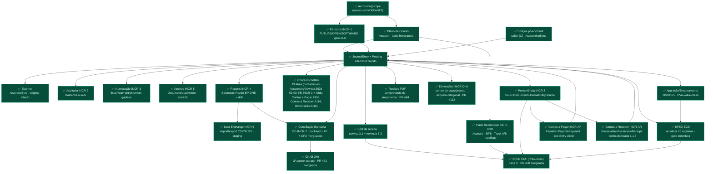
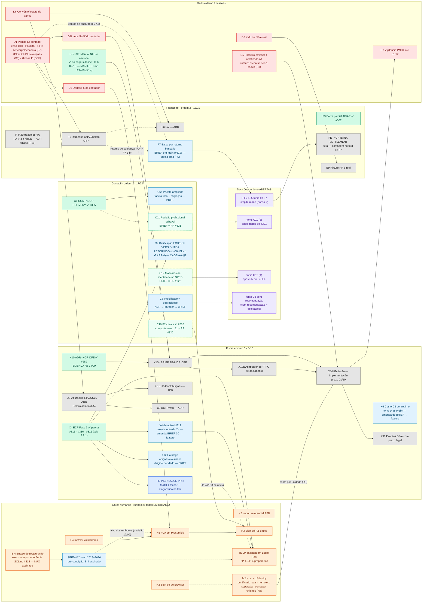

# SDD — Luminaris completo: o ERP + CRM setorial para PME brasileira

> ⏩ **ESTADO VIVO NO VAULT** desde 2026-09-23: [`docs/plano/`](plano/README.md) — um nó por nota, índice gerado ([`_INDEX.md`](plano/_INDEX.md)).
> Este arquivo é o **snapshot consolidado** da mesma data (leitura corrida, registro de folds). **Não é mais atualizado**;
> não o leia inteiro para implementar — use [`plano/_ANCORAS.md`](plano/_ANCORAS.md) para ir à seção.

> **PLANO ÚNICO DO PROJETO desde 2026-09-23** (decisão do dono: "Atualiza e unifica todos os planos do projeto pra
> esse aqui"; forks da unificação respondidos no mesmo dia — o SDD **absorve** o master map; planos antigos ganham
> banner **SUPERSEDIDO** e ficam como histórico no mesmo caminho).
>
> **Como este documento se organiza e quem manda em quê:**
>
> | Parte | Conteúdo | Origem | Autoridade |
> |---|---|---|---|
> | **I — Destino** | visão, catálogo de ~140 capacidades, arquitetura, IA, Brasil fiscal, invariantes, grafo de ondas | SDD v2 estendida (dono, 23/09) **com as correções do revisor independente** marcadas `⟨corr⟩` | descreve o alvo; **não autoriza nada** (ORCH-006) |
> | **II — Estado e decisões ratificadas** | trilhos travados, rejeitadas, diferidos, **fila ratificada §M5.1 (Blocos A/B)**, régua §M7.1 | ex-`docs/accounting/ACCOUNTING-MASTER-MAP.md` §1–§8, migrado **verbatim** | **fonte de verdade do estado e da fila** — vence a Parte I quando divergem |
> | **III — Fila executável** | ordem de execução por passo, grafo nó a nó, CADEIA-A (C8) | ex-`PROXIMOS-PASSOS-2026-09-17.md`, `GRAFO-DEPENDENCIAS-2026-09-14.md`, `CADEIA-A.md`, `ORQUESTRADOR-PASSOS-9-13.md` | a sequência de hoje; cada passo ainda exige autorização citável |
> | **IV — Horizonte** | fases P1–P5 e P-i18n, degraus 0–2, gap do CRM vs Salesforce | ex-`ROADMAP-PLATAFORMA.md`, `PLANO-MODULO-COMPLETO-REPLICAVEL.md`, `crm/CRM_REMEDIATION_AND_ROADMAP.md` | definição de pronto e gatilhos; não é fila |
> | **Apêndice** | mapa dos documentos supersedidos → onde o conteúdo vivo foi parar | esta unificação | — |
>
> **Âncoras estáveis.** A Parte II preserva a numeração do antigo master map com prefixo `M`: **`§M5.1` = antigo
> "master map §5.1"**, `§M1` = §1 travadas, `§M4` = §4 rejeitadas, `§M7.1` = régua por módulo. As ~150 citações
> "master map §N" e as 136 "Bloco A" espalhadas em ADRs, briefs e skills continuam válidas lidas assim. O arquivo
> `ACCOUNTING-MASTER-MAP.md` fica **congelado** como histórico (inclusive as citações por número de linha).
>
> **Como manter (fold):** a cada incremento fechado, atualize **este arquivo** — Parte II (§M5.1 estado do nó,
> §M7.1 régua, banner de estado) e Parte III (coluna Estado). Não se atualiza mais o master map nem um
> `PROXIMOS-PASSOS-*` novo. Proposta nova: cheque §M1 (travadas) e §M4 (rejeitadas) primeiro — se colidir, é ADR.
>
> **Selos:** **DECIDIDO** existe em `main` ou foi ratificado (Parte II, ADRs, cédulas) · **DECIDIDO (em fila)**
> ratificado, sem código ainda · **GATILHO** previsto, entra por demanda nomeada (P3/P4/P-i18n/P5) · **PROPOSTO**
> extensão deste SDD para chegar ao nível de mercado — **não é decisão**; precisa de PRE-ADR → ratificação antes de
> virar nó na §M5.1.
>
> **Verificação (23/09):** revisor independente conferiu os selos de estado e as arestas do §18 contra `origin/main`
> `634adab8`: **29 confirmados, 15 divergentes, 7 sem evidência**. Os divergentes foram corrigidos no texto
> (`⟨corr⟩` + fonte); os que mudam decisão do dono estão em **§18.4 Divergências abertas** — não foram decididos aqui.

**Estado hoje (fold 2026-09-22):** régua **46/57** — contábil 20/22 · financeiro 17/19 · fiscal 9/16 (leitura
alternativa declarada 47/57, §M7.1). 16 domínios de módulo no estado completo · ~140 capacidades catalogadas ·
referências de mercado: Salesforce SMB · TOTVS Protheus.

---

# PARTE I — DESTINO

## 1. Visão e posicionamento

Uma frase: o dono de uma PME brasileira responde uma entrevista de 15 minutos e sai com o sistema do seu setor —
atendimento, vendas, agenda, estoque, financeiro, fiscal, contábil e folha — que ele mesmo opera, que emite a nota,
concilia o banco, paga imposto certo e entrega a escrituração pronta para o contador assinar.

| Eixo | Salesforce SMB | TOTVS Protheus | Luminaris completo |
|---|---|---|---|
| Centro de gravidade | Cliente e pipeline (front-office) | Backoffice fiscal/contábil (back-office) | Os dois, com o razão como espinha e o setor como molde |
| Implantação | Self-service no Starter; consultor a partir do Pro | Projeto com parceiro, semanas a meses | Gerada por IA na entrevista; *time-to-first-ECD* como métrica |
| Customização | Objetos/campos + Flow Builder | Parâmetros + ADVPL/TL++ (código) | Presets + campos no motor DynamicTable; lógica financeira só por binding validado |
| Brasil fiscal | Ausente (via AppExchange) | Nativo e profundo | Nativo, incluindo IBS/CBS desde o adaptador |
| Quem opera | Equipe comercial | Departamentos com analistas | O dono e poucos funcionários; o contador recebe |

**Diferencial que só este desenho tem:** o módulo contábil é setor-invariante e imutável, e todo evento operacional
de qualquer vertical vira lançamento por binding compilado — sem mapper escrito à mão, sem rule engine em runtime.

**Tese de produto (fixada pelo dono 2026-07-13, ver Parte IV):** módulos canônicos + onboarding com IA **geram
sistemas de setores diferentes**; o salão é o molde, a contabilidade é a espinha.

## 2. Referências de mercado (pesquisa 23/09/2026)

**Salesforce para PME.** Suites Free (até 2 usuários), Starter (US$25/usuário/mês) e Pro (US$100, com Flow Builder).
Agentforce embutido nas três: resumo de registro, rascunho de e-mail, Employee Agent. Spring '26 trouxe Agentic
Workflows: detecta negócio parado, pesquisa o lead e redige a sequência para aprovação. *Lição:* IA agêntica virou
padrão no nível de entrada — sempre com humano aprovando.

**TOTVS Protheus.** Maior ERP do Brasil, forte em média empresa. Módulos centrais: Compras, Contabilidade,
Financeiro, Fiscal, Estoque e Custos, Faturamento, RH/Folha, PCP/Manufatura, Qualidade, Logística. *Lição:* o
backoffice brasileiro é definido pelo fisco — quem não resolve NF-e, SPED, apuração e folha não é ERP no Brasil.

**Reforma Tributária — o calendário que dita o alvo.** 2026 é ano-teste (CBS 0,9%, IBS 0,1%, sem cobrança para quem
cumpre obrigação acessória); rejeição em produção de NF-e sem os campos novos para regime normal a partir de
03/08/2026; CBS plena em 2027 substituindo PIS/Cofins; split payment com início previsto a partir de 2027
(liquidante retém IBS/CBS no Pix/cartão/boleto); transição até 2033. *Lição:* um ERP brasileiro de 2027+ é, antes de
tudo, um ERP que calcula, emite e concilia IBS/CBS e split payment.
⟨corr⟩ Datas internas que o SDD não trazia e seguem valendo (§M5): **NF-e obrigatória para não contribuinte de ICMS
em 01/12/2026**; **vigilância do PNCT até 31/12** (D7).

## 3. Edições e empacotamento — PROPOSTO

Três edições espelhando a escada de valor de mercado, todas sobre o mesmo núcleo (a contabilidade nunca é opcional).

| Edição | Para quem | O que inclui |
|---|---|---|
| Essencial | MEI, Simples, 1–3 pessoas | Cadastros, vendas/PDV, agenda, caixa e contas a pagar/receber, emissão NFS-e/NF-e, conciliação bancária, relatórios de gestão, contabilidade automática + pacote ao contador, 1 agente de IA (assistente) |
| Gestão | Simples/Presumido, 4–30 pessoas | + CRM completo (funil, propostas, contas/contatos, oportunidades), estoque multi-unidade, compras, comissões, metas, marketing básico, atendimento/tickets, folha simples, ECD/ECF, aprovações, dimensões, agentes de vendas e cobrança |
| Avançado | Lucro Real, 30–200 pessoas, multi-unidade | + Lucro Real completo (LALUR/LACS, EFD-Contribuições, apuração), imobilizado, custos, orçamento, produção leve, multi-operador com SoD, API pública/webhooks, BI avançado, agentes autônomos com trilha |

⟨corr⟩ Tensão a resolver por ADR antes de vender a edição Essencial: o **regime-alvo ratificado é Lucro Real**
(02/09, §M5) e ele "não engloba o Simples"; Simples/MEI hoje é PROPOSTO (§6.10).

## 4. Personas e papéis

| Persona | Faz no sistema | Estado |
|---|---|---|
| Dono | Tudo: gera o sistema, opera, fecha o mês, cumpre o fisco, decide | DECIDIDO — única hoje |
| Operador (atendente, vendedor, profissional) | Agenda, venda, atendimento, lead; sem acesso ao razão | GATILHO P3 multi-operador (`actorUserId` já reservado) |
| Gestor financeiro | Baixas, conciliação, aprovações, cobrança | GATILHO P3 + torre de aprovação |
| Contador | Recebe pacote, revisa, lança acerto, assina ECD/ECF | DECIDIDO como destinatário. ⟨corr⟩ **Login do contador = pergunta ainda aberta ao contador** (`BE-INCR-REVIEW-LAYER-brief.md:232`), não "decidido que não" |
| Contador com acesso (portal) | Entra em N clientes, revisa, exporta | PROPOSTO — reabre "contador não é persona"; só por ADR |
| Cliente final | Agenda online, paga, recebe nota, vê pacote/saldo | PROPOSTO — portal do cliente |

## 5. Arquitetura de referência

```
Canais          web · PWA/mobile · WhatsApp · e-mail · portal do cliente · API pública/webhooks
Agentes de IA   entrevista/gerador · assistente · vendas · cobrança · fiscal · conciliação · atendimento
                (propõem, humano confirma)
Operacional     motor DynamicTable + presets: CRM · vendas/PDV · agenda · serviços/pacotes · estoque op. ·
                compras op. · comissões · metas · marketing · atendimento · projetos · produção leve · frota ·
                qualidade · tabelas custom — governança declarativa + plugins; schema do setor
Núcleo          Prisma first-class: razão · períodos · auditoria hash-chain · subrazões AR/AP · estoque/custos ·
invariante      imobilizado · tesouraria · orçamento · folha · documentos fiscais · apuração · identidade/tenancy
                — constraint de banco, gate in-tx, atomicUntil
Ponte           binding compilado + intérprete fixo (bridge pós-commit)
Compliance BR   NF-e/NFC-e/NFS-e/CT-e · SPED ECD/ECF/EFD ICMS-IPI/Contribuições · eSocial/EFD-Reinf/DCTFWeb ·
                IBS/CBS/split payment
Integrações     bancos (Open Finance, CNAB, Pix, boleto) · adquirentes · emissor DF-e · e-commerce/marketplace ·
                WhatsApp · agenda
```

**Lei:** setas só para dentro do núcleo; o núcleo nunca importa de compliance, integração, preset ou agente.

**Runtime — DECIDIDO:** Node single-process, SQLite WAL, scheduler in-process (T1/T11, §M1). **Escala — GATILHO
P3:** separar workers de job (emissão fiscal, conciliação, IA) do processo web; fila com outbox para integrações
externas; banco relacional servidor quando a carga medida exigir — sempre por ADR com dado de carga.
⟨corr⟩ "Fila com outbox" e "banco servidor" reabrem decisões **rejeitadas/travadas** (§M4: PostgreSQL; T11) — o
ADR de P3 precisa citá-las explicitamente.

## 6. Catálogo completo de módulos (16 domínios)

### 6.1 Plataforma e geração do sistema
- **DECIDIDO** Entrevista com IA → preset match → customização de campos → binding compilado + validador (P1 ✅ #211).
- ⟨corr⟩ **DECIDIDO (em fila)** Composição por categoria→módulo (**I8**) e ativação (unidade, plano de contas,
  período aberto, binding ativo — **I1/I3/I4**): forks ratificados, **código não iniciado** (§M5.1 Bloco A;
  `ModuleKey`/`CRM_MODULE_NOT_INSTALLED` = 0 ocorrências em `server/src`).
- **DECIDIDO** Motor DynamicTable com governança declarativa (required/requiredIf/compare/unique/relation/readOnly/
  immutableAfter/lifecycle/noOverlap/deleteConstraints) e plugins. ⟨corr⟩ Duas lacunas abertas no motor:
  **GAP-MAP 7** (`unique`/`compositeUnique` sem gate in-tx — teste-guarda escrito em 23/09, ainda sem PR) e
  **GAP-MAP 8** (`deleteTableData` ignora `immutableAfter`/`lifecycle`).
- **PROPOSTO** Construtor visual de automações (equivalente ao Flow Builder): gatilho em evento de tabela →
  condições → ações. Fronteira: nunca toca o razão; ação financeira = evento que o binding traduz.
- **PROPOSTO** Construtor de formulários e páginas públicas (captura de lead, agendamento, pesquisa).
- **PROPOSTO/GATILHO P5** Marketplace de presets de setor e extensões.
- **PROPOSTO** Sandbox por tenant.

### 6.2 CRM e vendas — nível Salesforce Sales Cloud SMB
- **DECIDIDO** Funil fixo CRM-0 (pipelines, etapas, leads, atividades), propostas CRM-1, contas+contatos CRM-2,
  oportunidades CRM-3; conversão de lead; avanço de etapa nunca contabiliza. (Divisão em módulos instaláveis = I8.)
- **PROPOSTO** Score de lead preditivo (hoje BANT por regra) e próxima melhor ação.
- **PROPOSTO** Cotação → pedido → faturamento com tabela de preço, desconto com alçada, validade.
- **PROPOSTO** Previsão de vendas por período, vendedor e etapa (commit/best case).
- **PROPOSTO** Territórios e distribuição de lead.
- **PROPOSTO** Cadências de contato com agente redigindo e humano aprovando.
- **PROPOSTO** Contratos e renovações recorrentes com faturamento automático.
- Gap detalhado contra o Salesforce (P0/P1/P2): **Parte IV §IV.3**.

### 6.3 Atendimento e serviço — nível Service Cloud Starter
- **PROPOSTO** Caixa unificada (WhatsApp, e-mail, chat) virando tickets com SLA, fila e prioridade.
- **PROPOSTO** Base de conhecimento + agente de atendimento que escala para humano.
- **PROPOSTO** Ordem de serviço com peças do estoque, mão de obra, garantia.
- **PROPOSTO** Pesquisa NPS/CSAT pós-atendimento.

### 6.4 Marketing
> ⚠ **Texto não recebido** no SDD colado em 23/09 (só o título). Estado do repo: ver §IV.3 (gap CRM).

### 6.5 Agenda, serviços e pacotes (molde salão/clínica)
> ⚠ **Texto não recebido.** Estado do repo: agenda com `noOverlap` (TOCTOU fechado em `93945426`), saldo de pacote
> first-class (`CustomerPackageBalance`) — ver §M2.

### 6.6 Vendas no balcão, PDV e comércio
> ⚠ **Texto não recebido.** Estado do repo: venda "recebo depois" genérica (`SalesModule` + `RegisterPaymentService`,
> §IV.1 P4) — ver §M2.

### 6.7 Estoque, compras e custos — nível TOTVS Estoque/Compras
- **DECIDIDO** Estoque por unidade (operacional) + subrazão first-class (InventoryItem/StockMovement), sincronização
  física, custo por regime (D3/X6), NF-e de compra ingerida criando título a pagar.
- **GATILHO** Compras operacional: solicitação → cotação → pedido → recebimento → título (1º vertical com estoque a prazo).
- **PROPOSTO** Custo médio/FIFO com fechamento mensal, inventário cíclico, lote e validade, ponto de reposição,
  curva ABC, transferência entre unidades com nota.

### 6.8 Financeiro e tesouraria — nível TOTVS Financeiro
- **DECIDIDO** Contas a pagar/receber como subrazão com invariante contra o GL, baixa parcial, aging, caixa
  projetado, conciliação OFX/CNAB, retorno bancário → item de baixa confirmado por humano (F7).
- **DECIDIDO (em fila)** Pix como frente própria (F6); remessa CNAB/boleto multi-leiaute (F5). ⟨corr⟩ Ambos
  dependem de **D6** (convênio/leiaute do banco); a extração por IA (**ADR P-IA**) foi **adiada até D6 pela
  decisão R10** — não está "em fila".
- **PROPOSTO** Open Finance, conciliação de adquirente, cobrança automática com régua, orçamento vs realizado, DRE
  gerencial por centro de custo, multi-conta com transferências.
- **PROPOSTO** Split payment: valor líquido recebido + tributo retido pelo liquidante, conciliado contra a nota —
  obrigatório no horizonte 2027+.

### 6.9 Contabilidade — núcleo invariante
- **DECIDIDO** Plano de contas + referencial RFB, períodos, lançamento com numeração/estorno/proveniência,
  hash-chain, dimensões, aprovação maker-checker, relatórios (balancete, razão, BP, DRE, DFC, Diário), ECD com
  J930/0930 (C12 ✅ #353), revisão profissional editável (C11), pacote ao contador (C6/C6b), imobilizado com
  depreciação e baixa (C8 PR-1..3 ✅ #354–#356).
- ⟨corr⟩ **DECIDIDO (em fila)** Retificação versionada = **C8 PR-4** (⬜, autorizado "Executa C8" 18/09).
- **PROPOSTO** Rateio de despesas indiretas, provisões automáticas (férias, 13º, contingências), fechamento
  assistido com checklist e bloqueio. ⟨corr⟩ "Consolidação de unidades" **colide com T2** (tenancy =
  `AccountingScope`, sem torre LegalEntity) e com a rejeição de multiempresa (§M4) — só por ADR que reabra ambos.

### 6.10 Fiscal e tributário — nível TOTVS Fiscal
- **DECIDIDO** ECF Lucro Real (L/M/N, e-Lalur/Lacs, Parte B), NF-e de entrada, NFS-e nacional via parceiro com
  eventos e prazos (X10b ✅), IBS/CBS no adaptador, catálogo de adições/exclusões por dado, CNPJ alfanumérico.
- **DECIDIDO (em fila)** NF-e 55 emissão, apuração de tributos (X7), EFD-Contribuições (X8), DCTFWeb (X9).
- ⟨corr⟩ **GATILHO P4** Assinatura digital + transmissão SPED (ICP-Brasil/Receitanet) — ADR próprio, não está na
  fila nem na régua (§IV.1 P4).
- **PROPOSTO** Motor de regras tributárias por NCM/NBS/CFOP/CST/cClassTrib com tabela versionada por vigência;
  Simples Nacional (PGDAS-D, Anexos, fator R) e MEI (DAS); EFD ICMS/IPI; ST e DIFAL; CT-e/MDF-e; manifestação do
  destinatário/DF-e distribuição. ⟨corr⟩ Nomear "motor de regras" colide com o **rule engine rejeitado** (§M4) —
  o PRE-ADR deve provar que é **tabela versionada (dado)**, não engine em runtime.

### 6.11 Pessoas, RH e folha — nível TOTVS RH
> ⚠ **Texto não recebido.** Estado do repo: folha é **domínio diferido** (§M5); o SDD a propõe first-class (§8).

### 6.12 Projetos, produção leve e ativos operacionais
> ⚠ **Texto não recebido.** Ativo contábil (imobilizado) = §6.9.

### 6.13 Documentos, contratos e assinatura
> ⚠ **Texto não recebido.** Estado do repo: recibos/comprovantes PDF (puppeteer) — ver §M2.

### 6.14 Analytics e BI
> ⚠ **Texto não recebido.** Canônico de analytics: `AnalyticsDashboard`/`ChartRenderer`/`DashboardKpiCard` (Contrato §0).

### 6.15 Colaboração e produtividade
> ⚠ **Texto não recebido.**

### 6.16 Administração do tenant
> ⚠ **Texto não recebido.** Tenancy = `AccountingScope` (T2, §M1).

## 7. Camada de IA agêntica

Padrão de mercado 2026: agente propõe, humano aprova. No Luminaris esse padrão já existe (`ActionProposal`) e vira
regra dura para dinheiro.

| Agente | Faz | Limite | Estado |
|---|---|---|---|
| Gerador | Entrevista, escolhe preset, propõe binding | Validador determinístico aprova antes de ativar | ⟨corr⟩ **DECIDIDO** (binding + validador, `ADR-P1-binding-press.md`); **"compõe módulos" = I8, em fila** |
| Assistente ERP | Responde sobre dados e documentos, propõe ações | Ação só com confirmação | DECIDIDO (`ActionProposalRepository`) |
| Vendas | Detecta negócio parado, pesquisa, redige sequência | Envio só aprovado; opt-in LGPD | PROPOSTO |
| Cobrança | Prioriza inadimplência, gera Pix/boleto, negocia dentro de alçada | Desconto acima da alçada vai ao dono | PROPOSTO |
| Conciliação | Casa extrato × título × adquirente, sugere lançamento | Nunca posta: propõe item pendente | PROPOSTO |
| Fiscal | Sugere classificação tributária, aponta nota inconsistente | Regra vem da tabela versionada, não do modelo | PROPOSTO |
| Atendimento | Responde com base de conhecimento, agenda | Escala para humano; não altera preço | PROPOSTO |
| Contador-assistente | Checklist de fechamento, explica variação do DRE | Não fecha período | PROPOSTO |

**Invariante:** nenhum agente escreve no razão, emite nota ou move dinheiro sem um evento confirmado por humano que o
binding traduz. IA sugere; humano contabiliza.

## 8. Modelo de dados por domínio

| Domínio | Operacional (DynamicTable) | Invariante (Prisma) |
|---|---|---|
| Parte (pessoa/empresa) | customers, suppliers, crmAccounts, crmContacts, employees | Counterparty (CPF/CNPJ alfanumérico — a ponte fiscal) |
| Comercial | leads, opportunities, proposals, sales, saleItems, contratos recorrentes | Receivable, JournalEntry via binding |
| Serviço | appointments, services, packageCatalog, tickets, ordens de serviço | CustomerPackageBalance, PackageBalanceMovement |
| Estoque | products, productUnits, stockMovements | InventoryItem, StockMovement (subrazão), custo |
| Compras | solicitações, cotações, pedidos | Payable, PayablePayment, FiscalDocument de entrada |
| Tesouraria | — | BankStatement, lines, ReconciliationMatch, BankSettlementItem, ReconcilePendingItem |
| Contábil | — | Account, AccountingPeriod, JournalEntry, Posting, dimensões, AuditEvent, ReferentialMapping |
| Fiscal | — | FiscalProfile, FiscalDocument(+Attempt/Sequence), Lalur*, apuração |
| Ativos | — | FixedAssetClass, DepreciationRate, FixedAsset |
| Pessoas | employees, jornada, ponto | Folha (PROPOSTO first-class; hoje diferido §M5) |

## 9. Integrações e ecossistema

- **Bancos e pagamentos:** OFX/CNAB DECIDIDO; Pix, boleto, Open Finance, adquirentes, split payment PROPOSTO.
- **Fisco:** emissor DF-e por porta `DfeEmissorPort` DECIDIDO; SEFAZ/Ambiente Nacional, eSocial, Receitanet PROPOSTO.
- **Comunicação:** ⟨corr⟩ **pacote ao contador DECIDIDO, envio fora do sistema** — F-CD1 → (a): o produto gera o
  pacote e o dono envia pelo próprio e-mail; não há SMTP no server (`ADR-CONTADOR-DELIVERY.md:152-156`). WhatsApp
  Business, SMS, calendário PROPOSTO.
- **Comércio:** e-commerce, marketplaces, catálogo no WhatsApp PROPOSTO.
- **Plataforma:** API REST documentada (OpenAPI estático já existe), webhooks por evento, OAuth para apps GATILHO P5.
- **Importação:** planilhas, SPED anterior, base de outro ERP como dado inicial PROPOSTO.

Toda integração é periferia do eixo ORIGEM: parser/adaptador na borda, evento normalizado para dentro, idempotência
por identidade do evento (T7).

## 10. Brasil: fiscal e Reforma Tributária

| Horizonte | O que o sistema completo faz |
|---|---|
| 2026 (teste) | Destaca CBS 0,9% e IBS 0,1% nos documentos com cClassTrib; cadastro de produto/serviço revisado; rejeição de NF-e sem campos novos evitada na origem. |
| 2027 | CBS plena substitui PIS/Cofins; créditos amplos por nota de entrada; split payment inicia — recebimento líquido conciliado contra nota e retenção. |
| 2029–2032 | Transição gradual ICMS/ISS → IBS com alíquotas por ano em tabela versionada por vigência (dado, não código). |
| 2033 | Regime novo pleno; obrigações legadas desligadas por data de vigência. |

**Regra de desenho:** alíquota, vigência, classificação e regra de crédito são tabelas versionadas por data — o
mesmo princípio "jurisdição = dado" do eixo PAÍS (§IV.1 P-i18n) aplicado ao tempo.

## 11. Verticais geradas

| Setor | Módulos que o preset liga | Estado |
|---|---|---|
| Salão/barbearia | Agenda, serviços, pacotes, comissões, PDV, estoque de revenda, CRM-0/1 | DECIDIDO — molde |
| Clínica estética | + ficha do cliente, procedimentos por sessão | ⟨corr⟩ DECIDIDO — **código em `main` (#282), prova H3 aberta** (comportamento 8 parcial) |
| Clínica/consultório | + prontuário, convênio, anamnese, termo | PROPOSTO |
| Petshop/veterinária | + paciente animal, vacina, compras a prazo | GATILHO — puxa Compras |
| Varejo pequeno | PDV/NFC-e, estoque, compras, e-commerce | PROPOSTO |
| Serviços profissionais | Projetos, horas, contratos recorrentes, NFS-e | PROPOSTO |
| Oficina/assistência | Ordem de serviço, peças, garantia | PROPOSTO |
| Academia/escola | Matrícula, mensalidade recorrente, turmas, frequência | PROPOSTO |
| Food service | Comanda, ficha técnica, estoque de insumo, NFC-e | PROPOSTO |

**Critério de sucesso de cada linha:** zero diff no motor, no razão e no intérprete — só preset, binding e, se preciso,
contas novas por papel.

## 12. Experiência e canais

- **Home por papel:** o dono abre e vê o que exige ação hoje (contas a vencer, pendências de conciliação, notas
  rejeitadas, agenda do dia, negócios parados) — resumo antes do detalhe.
- **Mobile/PWA** para operador e dono: agenda, venda, aprovação, recebimento Pix.
- **Portal do cliente:** agendar, pagar, baixar nota, ver saldo de pacote.
- **Linguagem do dono, não do contador:** "dinheiro que entra/sai", "imposto do mês"; o vocabulário técnico fica na
  aba do contador.
- Design system do app (`neutral-*`, cards `rounded-2xl`), i18n pt/en com paridade auditada, acessibilidade básica.

## 13. Segurança, LGPD e confiança

- **DECIDIDO** Auth deny-by-default, policies por feature, tenancy por linha, auditoria hash-chain, allowlist de
  eventos com PII guardada por teste.
- **GATILHO** RBAC granular e SoD; LGPD granular antes de escala comercial.
- **PROPOSTO** MFA, criptografia de campo sensível (CPF, dados de saúde da clínica), consentimento por finalidade e
  revogação, portabilidade e exclusão com retenção legal preservada (fiscal 5 anos, trilha não apagável), certificado
  digital A1 em cofre, registro de acesso do suporte.

## 14. Requisitos não funcionais do estado completo

| Requisito | Alvo |
|---|---|
| Exatidão monetária | Centavo inteiro, igualdade exata, zero epsilon; Σ subrazão = saldo GL verificado por reconcile |
| Integridade | Constraint de banco para idempotência; gate in-tx para invariante mutável; trilha verificável por hash |
| Disponibilidade | Emissão fiscal com contingência e reenvio; indisponibilidade de terceiro nunca bloqueia a venda |
| Desempenho | Relatório mensal de PME em segundos; ECD anual gerada sem timeout |
| Recuperação | Backup diário com restauração testada; exportação completa pelo dono |
| Observabilidade | Log de erro agregado (hoje NDJSON local); alerta remoto só com produção existente |
| Evolução | Migração versionada com smoke-gate sobre dado real; mudança fiscal como dado com vigência |

## 15. Operação da plataforma

Construção pela cerca de execução (executor, classificador, revisor independente, `prova-runner`); ciclo SDD por nó;
gates automáticos (tsc, snapshot de DTO, OpenAPI, allowlist de PII, i18n, skill-audit); oráculos humanos (PVA,
browser, dado externo, contador). Em produção: onboarding assistido medido por *time-to-first-ECD*, suporte com
acesso auditado, atualização fiscal publicada como dado versionado.

## 16. Jornadas ponta a ponta no estado completo

**Um dia de uma clínica estética**
1. Cliente agenda pelo WhatsApp; agente de atendimento confirma horário livre (`noOverlap`).
2. Na sessão, profissional registra procedimento; consome saldo do pacote; comissão materializa.
3. Venda de produto no balcão com Pix; NFC-e/NFS-e emitida; split payment retém IBS/CBS; recebimento líquido cai conciliado.
4. Binding gera os lançamentos (receita, custo, passivo de pacote, liquidação) sem ninguém ver o razão.
5. À noite, o dono vê: faturamento, inadimplência, agenda de amanhã, uma nota rejeitada com a correção sugerida.

**Fechamento do mês** — ⚠ texto não recebido.
**Fechamento do ano** — ⚠ texto não recebido.

## 17. Invariantes que não se negociam em nenhuma edição

1. Contabilidade é Prisma first-class; nunca linha de DynamicTable; nunca serviço Prisma dentro do motor (T3, Contrato §2.1).
2. Dinheiro em centavo inteiro, igualdade exata (T4).
3. Estorno é lançamento novo; post é imutável (T5).
4. Gate de invariante mutável dentro da transação (T6).
5. Idempotência por identidade do evento, em constraint de banco (T7).
6. Auditoria append-only com hash, sem cascade (T8).
7. Origem → razão só por bridge/binding validado; intérprete sem branch de negócio (T10, P1).
8. Núcleo nunca importa de compliance, integração, preset ou agente; jurisdição e tempo fiscal são dado.
9. Nenhum agente move dinheiro, emite nota ou escreve no razão sem confirmação humana.
10. ⟨corr⟩ Service que chama `postEntry` = 2 commits + reconcile com cabeçalho `atomicUntil`; **motor de domínio
    rejeitado** (Contrato §2.3, `ADR-DOMAIN-MOTOR-rejected.md`).

## 18. Caminho: de hoje ao completo — plano em grafo

Cada caixa é um nó; cada seta é dependência real. Colunas são ondas; nós na mesma onda sem seta entre si podem correr
em paralelo — desde que em domínios diferentes (PAR-005: mesmo domínio ⇒ serial). **O grafo ordena, não autoriza
(ORCH-006).** A ordem entre domínios da régua segue **R6: contábil → financeiro → fiscal** (§M5.1).

### 18.1 Ondas

| Onda | Nós | Selo |
|---|---|---|
| **0 · provar** | B-4 (ensaio de restauração) → SEED-MY → H1 (PVA Presumido) → H1 2ª passada (Lucro Real) · P4 (instalar validadores) · H2 (browser sign-off) · H3 (prova P2 clínica) · X2 (catálogo RFB oficial) · E9/D2 (NF-e real anonimizada) · M2 (host + 1º deploy) · Z0-a (contador aceita assinar?) · envio do pedido ao contador (D1, itens 6–13) | gate humano / dado externo — agente não fecha |
| **1 · régua 57** | C8 PR-4 (retificação versionada + J801/J932 + `GET /data-exchange/jobs`) · C8 PR-5 (NF-e modo 4) · F7 → FE-INCR-BANK-SETTLEMENT · F5 remessa · F6 Pix · X6 · X4-14 · FE-INCR-LALUR PR 2 · X7 → X8/X9 · X10b → X10a → X10i (emissão) → X11 · X12 | DECIDIDO (régua) |
| **2 · self-service** | I1 + I1b → I3 → I4 + I5 + I8 → telas FE pendentes (REVIEW, DELIVERY, FIXED-ASSETS, SPED-SIGNERS) · GAP-MAP 7/8 · PR-B `atomicUntil` | DECIDIDO (wizard/motor) |
| **3 · Essencial** | IBS/CBS 2027 (tabela com vigência) · split payment · régua de cobrança · Simples/MEI · PDV + NFC-e · WhatsApp · **ESSENCIAL GA** (1º tenant pagante) | PROPOSTO — exige PRE-ADR |
| **4 · Gestão** | P3 multi-operador → aprovação + SoD · folha + eSocial · compras op. · custo de estoque · atendimento | GATILHO/PROPOSTO |
| **5 · Avançado** | RBAC + LGPD fina · orçamento/rateio · produção leve | GATILHO/PROPOSTO |
| **6 · plataforma** | API + webhooks · marketplace · portal do contador (só se Z0-a = não) | GATILHO P5 / condicional |

### 18.2 Arestas verificadas (fonte no repo)

| Nó | Depende de | Saída verificável | Fonte |
|---|---|---|---|
| SEED-MY | B-4 **assinado** | seed 2025+2026 | cédula #318 §4 |
| H1 | P4 · D8 (dados P6 do contador); alvo = SEED-MY | PVA-SIGNOFF assinado | Parte III §III.2 |
| H1 2ª passada | X4 ✅ · X4-14 · SEED-MY | 2P-1..2P-4 assinados | RUNBOOK-H1 |
| H3 | C10 (P2 clínica) · H1 | ECD do vertical 2 PVA-limpa | `RUNBOOK-H3-P2-CLINICA.md` |
| M2 | H2 (pontilhada) | 1º deploy | Parte III §III.2 |
| C8 PR-4 | C12 ✅ #353 | retificação versionada; jobs listáveis | `CADEIA-A.md` §3 |
| C8 PR-5 | C8 PR-2/PR-3 ✅ (permutável com PR-4) | contábil +1 (C8 conta no PR-5) | `BE-INCR-FIXED-ASSETS-execution-plan.md` l.84, l.90 |
| F7 | R9 ✅ · forks F-F7-1..5 · D1 (Fase C) | baixa por retorno | BRIEF F7 |
| F5 · F6 | D6 (· P-IA para F5, **ADR adiado R10**) | remessa / Pix | GRAFO 09-14 §3 |
| X7 | D1 itens 1/1b (Serpro adiado R5) | apuração IRPJ/CSLL | cédula #319 R5 |
| X8 · X9 | X7 | EFD-Contribuições · DCTFWeb | GRAFO 09-14 §2 |
| X10i (emissão) | X10b ✅ · X10a · D1f · D5 · **M2** | nota emitida | **cadeia crítica real** |
| I1 → I3 → I4 | LAC-B (ativada) | tenant novo contabilmente operante pela tela | §M5.1 |
| P3 | edição vendável + carga real | ADR reabrindo T11 se preciso | §IV.1 P3 |
| Portal do contador | Z0-a = não | F-Z0 reaberto por ADR | §M5.1 (F-Z0) |

**Caminho crítico (repo):** emissão ← **D1f · D5 · M2** (dado do contador, parceiro emissor + A1, deploy). No lado da
prova: **B-4 → SEED-MY → H1 → H1 2ª passada**. Nenhum passo de código move esses dois caminhos — o início é humano.

### 18.3 Regras do grafo
- **Prazo externo fixo:** IBS/CBS e split payment têm data legal (CBS plena e split a partir de 2027) — puxam a
  Onda 3 mesmo que outras ondas atrasem. NF-e para não contribuinte de ICMS em 01/12/2026 (§M5).
- **P3 é o portão da Onda 4:** aprovação e SoD pressupõem mais de um operador por tenant. (Folha não está atrelada ao
  P3 — §M5.)
- **Z0-a é aresta condicional:** "não" do contador puxa o portal do contador e reabre F-Z0; "sim" elimina o nó.
- **Nós PROPOSTO entram na §M5.1 como ⏳ só após PRE-ADR ratificado.**

### 18.4 Divergências abertas — SDD colado × repo (decisão do dono, não resolvidas aqui)

O SDD de 23/09 afirmava as arestas abaixo; o repo não as sustenta. A tabela §18.2 segue o repo. Se alguma for
**intenção nova** do dono, vira decisão registrada aqui — até lá, vale o repo.

| # | O SDD dizia | O repo diz | Fonte |
|---|---|---|---|
| D-1 | C8 PR-4 ← H1 | PR-4 depende só de C12 ✅ e da transcrição do J801 | `CADEIA-A.md` §3; plano C8 l.83 |
| D-2 | C8 PR-5 ← PR-4 e E9 | PR-4/PR-5 **permutáveis**; PR-5 ← PR-2/PR-3; E9 é dado externo sem aresta ao C8 | plano C8 l.84, 90, 328 |
| D-3 | C8 PR-5 → "contábil 22/22" | PR-5 dá **+1** (21/22); 22/22 só se a retificação contar como nó próprio — contradiz "C9 não é linha própria" | §M7.1; `CEDULA-DECISAO-2026-09-03-modulos.md:79-80` |
| D-4 | Fiscal ×7 ← H1; inclui NF-e 55 | Apuração (X7) ← D1 itens 1/1b; X8/X9 ← X7; NF-e 55 é parte do X10b; não há lista "×7" | GRAFO 09-14 §2/§3 |
| D-5 | ADR P-IA na Onda 1, antes da remessa | **R10: "não abrir ADR P-IA agora"**, adiado até D6 | cédula #319 R10 |
| D-6 | Remessa → "financeiro 19/19" | Remessa sozinha = 18/19; Pix (F6) é o outro nó | `CEDULA-DECISAO-2026-09-10-entrevista.md:58` |
| D-7 | IBS/CBS → split ← Fiscal ×7 | ADR condicionado ao item 1b do contador | §M5 |
| D-8 | Caminho crítico B-4 → H1 → PR-4 → PR-5 → GA → … | Emissão ← D1f · D5 · M2; prova ← B-4 → SEED-MY → H1 | Parte III §III.1 |
| D-9 | H3 = "PVA limpo + browser" | H3 = prova do P2 clínica; browser = **H2** (omitido no SDD) | `RUNBOOK-H3-P2-CLINICA.md:1` |
| D-10 | Ondas por edição (Essencial antes de Gestão) | Ordem ratificada entre domínios da régua = R6 contábil → financeiro → fiscal | §M5.1 R6 |
| D-11 | "I3b", "Telas Fase 4 (~8 telas)" | sem ocorrência no repo | — |
| D-12 | "P4" como fase | colide com "P4 Instalar validadores" (gate humano do GRAFO) | GRAFO 09-14 l.111 |

## 19. Riscos e premissas

| Risco | Consequência / mitigação |
|---|---|
| Z0-a: contador não aceita assinar o que não conduziu | Reabre a camada zero; portal do contador vira necessidade, não extra |
| PVA revela gap campo a campo | Todo o trilho SPED volta à instrumentação; é o teste mais barato para rodar primeiro |
| Amplitude Salesforce + TOTVS para um time pequeno | O catálogo é destino, não backlog: cada módulo entra só com gatilho; motor genérico + geração por setor tornam a amplitude viável |
| Reforma Tributária muda regra durante a transição | Regra como tabela com vigência; atualização publicada como dado |
| SQLite/single-process limitam escala | P3 com dado de carga; separar workers primeiro |
| IA agêntica erra em dinheiro | Invariante 9 do §17: proposta + confirmação + validador |
| App nunca implantado | Observabilidade, LGPD e suporte decidem-se só com produção real — Onda 0 |
| ⟨corr⟩ Edição Essencial (Simples/MEI) × regime-alvo Lucro Real | ADR de regime antes de vender a Essencial |

**Referências externas (pesquisa 2026-09-23):** Salesforce — Starter vs Pro Suite, Agentforce nas suites SMB, preços
2026; TOTVS — Backoffice Linha Protheus, módulos Protheus; Reforma — prazos e split payment, transição 2026–2033.
**Este SDD não autoriza nada (ORCH-006).**


---

# PARTE II — ESTADO E DECISÕES RATIFICADAS (ex-master map)

> *Migrado **verbatim** de `docs/accounting/ACCOUNTING-MASTER-MAP.md` em 2026-09-23 (`origin/main` `634adab8`).*
> *Seções renomeadas `§N` → `§MN` (ex.: `§5.1` → `§M5.1`). **Dentro desta Parte, toda referência "§N" significa "§MN"**;*
> *"este documento"/"este doc" = esta Parte II. O bloco inicial é o registro de folds, mais recente primeiro —*
> *o banner **ESTADO VIGENTE** é a leitura atual da régua. A partir de 23/09 os folds são feitos AQUI.*

## M0 Estado vigente e registro de folds (mais recente primeiro)

> **Fonte de verdade do roadmap contábil.** Este documento é o grafo-mestre **reconciliado com as
> decisões commitadas** do projeto — não a visão aspiracional de "sistema contábil universal".
> Onde um grafo aspiracional (o de 35 seções) diverge deste, **este vence** até que um ADR mude a
> decisão. Todo nó aqui tem um **estado** (legenda §7) e, quando relevante, o ADR/memória que o fixou.
>
> **Regra de uso (arquiteto/orquestrador):** nenhuma skill de geração roteia contra um nó marcado
> 🔴/⚫ sem **ADR em disco + sinal humano**. Nós ✅ estão fechados; nós ⏳ são o incremento corrente.
>
> **⏩ ESTADO VIGENTE = FOLD 2026-09-22 (C12 + C8 PR-1..3, abaixo): régua 46/57 — contábil 20/22 · financeiro 17/19 · fiscal 9/16.** As leituras "45/57" dos banners anteriores (18/09) são HISTÓRICAS.
>
> **🔁 FOLD 2026-09-22 — C12 FECHADO + C8 PR-1/2/3 em `main` (Trecho A da CADEIA-A).** Autorizações: **"Executa C12"** e **"Executa C8"** dadas pelo dono em **18/09**, citadas nos corpos de #353/#354 (o `STOP` de `CADEIA-A.md` §4 é histórico). **C12 ✅ #353 `edb80ec8`** (máscaras de identidade J930/0930, 20/09) — é **nó** (§7.1 regra 1; "+3" do re-baseline): **contábil 19/22 → 20/22**. **C8:** PR-1 ✅ #354 `077cbdbe` (schema + seed Anexo III + taxas) · PR-2 ✅ #355 `5f9c71d7` (classes/ativos/comandos/settings) · PR-3 ✅ #356 `0548d19a` (depreciação mensal + reconcile + baixa sequencial); **PR-4** (retificação versionada ECD/ECF = Bloco G, ex-"C9", J801/J932, lista de jobs — F-FA15 a) e **PR-5** (NF-e modo 4) **não abertos** — dependência C12 → PR-4 (`SignerSchema`) satisfeita. **C8 só conta no numerador quando o PR-5 mergear** (nó fecha por ciclo completo — regra 1); **leitura alternativa declarada: 47/57** se o dono contar o C8 no PR-3 (núcleo contábil já em `main`, PR-4/5 são fiscal/NF-e). **Achado do A-00 (#352) absorvido aqui:** C9 "retificação versionada" **não é nó separado** — vive no C8 Bloco G (`CADEIA-A.md` §2, dono 18/09 "Pode seguir"); o denominador 57 não muda (C9 já era o item 12 desta fila, não linha própria da régua). Merges de harness #358/#359 (cerca de execução, prova-runner) e docs de motor (§2.3 `atomicUntil`, ADR motor rejeitado, GAP-MAP 7/8/9) ficam **fora da régua** (regra 3). **Régua: 46/57 — contábil 20/22 · financeiro 17/19 · fiscal 9/16.**
>
> **[HISTÓRICO desde 22/09]** ESTADO VIGENTE = FOLD 2026-09-18 (X10b BE-INCR-DFE, abaixo): régua 45/57 — fiscal 9/16. As leituras "44/57"/"régua inalterada" dos banners anteriores (17/09) são HISTÓRICAS.
>
> **🔁 FOLD 2026-09-18 — X10b BE-INCR-DFE FECHADO: 3 de 3 PRs integrados em `main` @ `e61c0f6d`.** Cadeia
> executor→revisor independente→integrador, um elo por vez (fora desta sessão de docs). **PR-1 #348
> `f00b304a`** (schema + Fase A: `FiscalProfile` emitente com D1f config em 6 campos, `ServiceFiscalProfile`,
> `FiscalDocument`/`FiscalDocumentAttempt`/`FiscalDocumentSequence`, `DocumentAttachment` sem FK — F-DFE-19
> b —, DV/alfanumérico no preset — F-DFE-17 a) — integrado pelo dono. **PR-2 #349 `0dcbb22b`** (Fase B+C:
> porta `DfeEmissorPort` + `Null`/`File`/`Disabled`, montagem/validação/envio da DPS, `DpsPayloadSchema`,
> preview, emitir) — PASS de primeira (4 achados menores fechados: cobertura das 8 pré-condições, ordem
> determinística por `cTribNac`, teste autorreferencial removido, ramo pacote-VENDA com teste de bloqueio).
> **PR-3 #350 `e61c0f6d`** (Fase D: transição pós-SENT, autorização, reenvio, cancelamento, polling,
> webhook — F-DFE-12) — **1ª rodada FAIL, 2ª PASS**: revisor achou `NullEmissor.consultar()` (adaptador de
> referência do próprio BRIEF) nunca devolvendo `numero`/`nNFSe`, violando o guard de completude do ADR
> (D3 iv) — sem o fix, **nenhum documento chegaria a `AUTHORIZED`** pelo caminho de exemplo do BRIEF
> (consulta manual/polling/webhook); fix = quando `numbersDps=false`, o `doc.numero` já atribuído no ciclo
> `SENT` supre o requisito, provado com teste contra o `NullEmissor` real (sem mock; revisor reverteu o fix
> pra confirmar que o teste específico pega a regressão, depois restaurou). 2 achados menores não-bloqueantes
> (comentário desatualizado de `SourceDocument.deletedAt`; teste de proveniência F-DFE-18 usa query espelhada
> em vez do repositório — padrão pré-existente no arquivo, follow-up separado).
> **Gates:** tsc limpo (server+my-app); unit 216/216 suítes (2860 testes); integração (arquivos tocados)
> 4/4 suítes (23/23); `skill-audit.mjs run --all` 0 findings; `docs:generate` sem diff, baseline 192→200
> paths.
> **Deixado de fora por desenho, gate nomeado (decisão do dono quando chegar a hora):** F-DFE-14 retenção
> de ISS por endereço do tomador (Anexo A UF→IBGE não transcrito no corpus); item 21 código fiscal do
> pacote-VENDA (BRIEF não define `cTribNac` do pacote em si); item 29 `PROCESSING` em `cancelar()`
> inalcançável com os adaptadores atuais (`Null` sempre cancela, `File` sempre rejeita) → 409 nomeado;
> **Fase E (NF-e 55 de venda)** sempre fora deste BRIEF, aguarda a transcrição do MOC 7.0 no corpus
> (F-DFE-13 a) — `FE-INCR-DFE` (tela) também fica de fora, BRIEF próprio.
> **Régua: 45/57 — fiscal 9/16 (contábil 19/22 · financeiro 17/19 inalterados).** Linha 610 do domínio
> ("Emissão de DF-e via parceiro emissor — NFS-e nacional + NF-e") fecha para a NFS-e nacional atrás da
> porta sem parceiro; os 3 itens antes listados como "+3 entra" (adaptador por TIPO de documento — resposta
> 9, F-DFE-16 b `cServ` 1-1 ⇒ N DPS por venda —; eventos de DF-e com prazo legal validado — resposta 13,
> F-DFE-12 —; catálogo de adições/exclusões dirigido por dado) **materializaram dentro do próprio nó**, não
> como denominador novo — mesmo tratamento do precedente C10/item 13 (crescimento de escopo ratificado não
> vira nó extra quando cabe no BRIEF já aberto). **Leitura alternativa declarada:** se o nó só fecha com
> NF-e 55 (Fase E) junto, a régua fica 44/57 até a Fase E mergear — decisão do dono se discordar. Nota
> operacional: a "cadeia de execução Sonnet serial" publicada 17/09 noite (112 elos) desenhou um **Trecho
> 0** de 7 elos para rebasear #348 → PR-2 → PR-3 — **esse trecho já rodou por fora e está obsoleto**;
> confirmado por `git merge-base --is-ancestor` dos 3 SHAs contra `origin/main` e `gh pr view` (os 3
> `state: MERGED`). Quem for disparar a cadeia deve começar do **Trecho A** (núcleo C12/C8/C9).
>
> **🔁 FOLD 2026-09-14 (2ª leitura, noite) — FE-INCR-LALUR PR 1 MERGEADO + cédulas de 14/09 dobradas — **PR #315 MERGEADO em `main` (squash `c1e4b7a5`, 14/09)**; #318 `93e52adb` e #319 `b002f78c` ancestrais.**
> Tela de cadastro do e-Lalur/e-Lacs na aba Compliance (`LalurPanel`/`LalurEntryModal`/`LalurParteBModal`/`CatalogCombobox`, 4 forks F-FE-1..4 → a) + o único toque no BE:
> `GET /api/lalur/catalog` (+1 path na spec commitada e no path-count guard — `openapi.json` +91 linhas, `openapi-paths.test.ts` ajustado; conflito com #316 resolvido pela regra pré-decidida — `main` venceu no snapshot de DTO, PR venceu no endpoint).
> **Régua inalterada: 41/57** — pela mesma regra dos folds de 12/09 e 14/09 (precedente C10 / item 13), a tela é **crescimento do nó X4**, não nó novo; leitura alternativa declarada: 42/57 se o dono
> quiser contar a tela. **FE-INCR-LALUR PR 2** (M410 + fechar trimestre + diagnóstico na tela, F-FE-4 → a) fica `ready` sem item de fila próprio. **Decisões dobradas** (cédula #319 prevalece onde diverge do #318):
> R5 adiar Serpro · R6 **financeiro antes de fiscal** · R7 perímetro zero-diff emendado (1 símbolo; `ADR-P2` EMENDA em `main`) · R8 instância = CNPJ raiz, `units.cnpj` fica (`ADR-INCR-DFE` EMENDA em `main`) ·
> R9 **tabela irmã** para o F7 (BRIEF `BE-INCR-BANK-SETTLEMENT` em `main`, 5 forks pendentes) · R10 ADR P-IA adiado · F-X6-1..6 = 5×(a) + **F-X6-3 → (b)** (BRIEF #309 exige emenda antes da feature).
> **Autorizados sem número de nó:** SEED-MY (pré-condição de gate: alvo dos runbooks H1/H2/H3 passa a ser o seed 2025+2026; exige **B-4 assinado**, hoje 0 checkbox marcado) e X4-14 (crescimento do X4, antes da H1 2ª passada).
> **Em voo ao fechar esta leitura:** PR #320 (P2 comportamento 11, código, CI parcial, sem review), PR #321 (BRIEF C11, 6 forks), PR #322 (BRIEF C12, 4 forks). **Grafo vigente:**
> [`GRAFO-DEPENDENCIAS-2026-09-14.md`](accounting/GRAFO-DEPENDENCIAS-2026-09-14.md) (o de 11/09 supersedido — corrige a afirmação "parser CNAB 240 retorno ✅": `lib/cnab.ts` parseia **extrato** Segmento E; retorno de
> cobrança não existe e pressupõe remessa F5). Ordem de execução e detalhamento por passo: [`PROXIMOS-PASSOS-2026-09-14.md`](accounting/PROXIMOS-PASSOS-2026-09-14.md) §Detalhamento. Índice da pasta: [`README.md`](accounting/README.md).
>
> **🔁 FOLD 2026-09-14 — ECF FASE 3C PARTE B MERGEADA: M410/M500/M510/M312/M315 + fechamento trimestral — **PR #316 MERGEADO em `main` (squash `c96e2227`, 14/09)**.**
> Nó **X4** ganha o que faltava do BRIEF 3B: **item 13 (BRIEF 3B) sai de ⚠️ PARCIAL para ✅** — `M410`/`M415`
> (movimentos sem reflexo na Parte A, PF/BC derivado do razão no fechamento, Fork F-3C-2→a), `M500`/`M510`
> (fechamento trimestral materializa o saldo e resolve a N-1: `M010.VL_SALDO_INI` do exercício seguinte =
> `SD_FIM_LAL` do T04 fechado, EMENDA 3ª C3) e `M312`/`M362`/`M315`/`M365` (lançamento da ECD / processos
> judiciais) agora saem no `ecfReal.ts`; os 4 MENOR do review do #313 (itens 16–19) corrigidos com
> teste-guarda. **Item 14 do BRIEF 3C ("aviso no diagnóstico para ajuste parcial sem M312") NÃO
> implementado — vira follow-up, autorização própria** (o §2.4 não tem o campo; "parcial" exige os 4
> agregados do `K155`/`K355` da conta no trimestre, insumo novo em postings — registrado como lacuna de
> spec no cabeçalho do PR, não escondido). EMENDA 3ª ao ADR (D-P1..D-P4 + correções C1-C4 ratificadas por
> questionário 4/4) commitada **antes** do 1º código de model, como o Fork N-1→(a) exigia; 5 models novos
> (`LalurParteBMovement`/`LalurParteBClosing`/`LalurParteBBalance`/`LalurProcess`/`LalurEntryJournalEntry`,
> migração `20260912200000`, 5 CREATE TABLE, zero ALTER). Review independente (agente isolado, 4 sondas
> adversariais) PASS com 6 MENOR corrigidos + 2 regressões pegas só pela integração completa (`resetDb`,
> `accountingContactController`). Gates: tsc×2 limpos, unit 200/200 (2.589), integração 70/70 (609) em 2
> rodadas (EBUSY no Windows invalidou 3 rodadas — CI Linux é o oráculo), `smoke:migration` 13 aplicadas/55
> tabelas S1–S5/S8 verdes (S6/S7 = falsos positivos já documentados em `RUNBOOK-H1-PVA.md` P2b,
> reproduzidos sem esta migração), OpenAPI 166→172 (path-count guard atualizado).
> **Oráculo externo preparado, não fechado:** `RUNBOOK-H1-PVA.md` ganhou **2P-4** — as 7 leituras
> INFERIDAS do §4 do BRIEF 3C (Σ `PF`/`BC` = base que o PVA computa via ECD recuperada; `M010`×`E020` pela
> âncora C3; ordem intra-período do Bloco M; `M500` de conta sem movimento; `COD_CTA_B` sempre preenchido
> no `M410`; `M312` no caso de ajuste parcial; indicador `C` para saldo zero) — **em branco, evidência e
> assinatura são do executor humano** (`RUNBOOK-FORMAT`): é a 2ª passada do H1 que transforma cada leitura
> em evidência (bate com o PVA) ou crítica literal (o PVA discorda — muda o serviço, nunca a leitura do
> agente).
> **Régua inalterada: 41/57 — contábil 17/22 · financeiro 16/19 · fiscal 8/16.** Mesma regra do fold
> anterior (precedente **C10**): fechar itens do checklist de um nó já contado como ✅ parcial é
> **crescimento do nó X4**, não nó novo — o numerador não muda. `main` segue precisando da **H1 2ª passada
> em Real** (agora com 2P-4 executável) antes de operar cliente real.
>
> **🔁 FOLD 2026-09-12 — ECF FASE 3B IMPLEMENTADA: Blocos L/M/N emitidos + e-Lalur/e-Lacs PERSISTIDO (Fork 4→b) — **PR #313 MERGEADO em `main` (squash `197cc9fc`, 12/09; árvore idêntica ao SHA `d8091bfc` que a CI validou 5/5)**.**
> Nó **X4** sai de "spec pronta" para **✅ parcial**: models `LalurEntry`/`LalurParteBAccount` (migração aditiva `20260911200000`, smoke gate PASS sobre cópia do `dev.db`),
> cadeia `/api/lalur` (6 paths, OpenAPI 160→166, policy `canManageLalur`/`canReadLalur`, soft-delete com rename-on-key D-M2), catálogo `ecf-l12-linhas.json`
> derivado do XLSX por script, serializer `ecfReal.ts` emite **L** (`L001`+`L030`×4), **M** (`M010` + `M030` ⊃ `M300/M350` + filhos `M305/M355/M310/M360`) e **N** (`N030` + linhas `E`);
> `SpedEcfRealGenerationService` **lê do model**. ADR EMENDA 2ª (D-M1..D-M5) commitada **antes** do model, como o Fork 4→(b) exigia. Review independente
> PASS-COM-RESSALVAS → I-1..I-5 corrigidos no PR; 4 MENOR **registrados, não tratados** (TOCTOU create×archive, `|` em texto livre → 500 na geração, `codNat 09`,
> conta soft-deletada após o ajuste) → viram itens do BRIEF 3C. **O que ficou fora (item 13 do BRIEF 3B):** `M410`, `M500` (nota **N-1**: `LalurParteBBalance` × recompute
> — 2ª migração, fork do dono) e `M312/M362/M415/M510` sem transcrição → BRIEF `BE-INCR-SPED-ECF-FASE3C-parte-b` (planejamento autorizado 12/09). `FE-INCR-LALUR` = incremento
> separado. `year=2026` falha explícito até o Leiaute 13 entrar em `ECF_COD_VER_BY_YEAR`. Gate humano seguinte: **H1 2ª passada em Real** (RUNBOOK-H1 §2ª passada, 2P-1..2P-3, em branco).
> **Régua: 41/57 — contábil 17/22 · financeiro 16/19 · fiscal 8/16.** Regra aplicada (§7.1, regras 1 e 2): o ciclo SDD do BRIEF 3B fechou (BRIEF → feature → review
> independente → merge); o item 13 é **crescimento** do nó X4, registrado na coluna, não nó novo — precedente **C10** (`done` #282 com comportamento 11 esperando R7).
> Leitura alternativa, declarada: se "parcial" não conta, a régua fica 40/57 até o 3C mergear — decisão do dono se discordar.
>
> **🔁 FOLD 2026-09-16 — SESSÃO 3 DA ORQUESTRAÇÃO `PROXIMOS-PASSOS-2026-09-14` FECHADA (passos 1–12 ✅).** Mergeados desde o fold 14/09:
> #320 P2 c.11 · #321 C11 BRIEF · #322 C12 BRIEF · #323 docs · #324 C6b BRIEF · #325 SEED-MY BRIEF · **#326 F7 feature** · #327 X6 emenda ·
> **#328 X6 feature** (`fb7ae649`) · **#329 X4-14** (`a6783795`, régua M312 por natureza da conta) · **#330 C8 ADR+parecer+BRIEF** (`9b4cb35a`) ·
> **#331 pedido ao contador itens 6–13** (`3f61c4b0`). **Régua: 42/57 — contábil 17/22 · financeiro 17/19 · fiscal 8/16.** R5..R10 fechados.
> **Sobra só decisão/gate humano:** ~~forks C11 (6) · C12 (4) · C6b (5) · SEED-MY (3) · C8 (F-FA10/12/13)~~ → **✅ 20/20 ratificados 2026-09-16** (`CEDULA-DECISAO-2026-09-16-forks-c11-c12-c6b-c8-seed.md`); C11/C12/C6b/C8 `ready` **sem "executa"**; envio do pedido; B-4 · H1 2ª passada · Termo de Verificação.
> Lições da sessão em memória: redação vigente/versão compilada de tabela de lei; `postEntry` abre tx raiz (subrazão = 2 commits); paráfrase de regra ratificada perde ramo.
>
> **🔁 FOLD 2026-09-17 — SESSÃO 6 (docs-only): pontas não-código fechadas em 1 PR.** Autorização: dono 17/09 (*"Pode planejar em 1 única sessão para fechar as pontas que não são implementação de código"* + *"Vai na recomendação dos 5 e abre a sessão"* — F-PS-1..5 → a, `PLANO-SESSAO-2026-09-17-pontas-nao-codigo.md`). Entregue: (1) `CEDULA-DECISAO-2026-09-14-entrevista-gates-humanos.md` entra em `main` com **§0 Reconciliação** (12 decisões: 2 superadas — G-3 virou SEED-MY, G-10 P2 já estava em `main` #282 desde 07/09; 1 cumprida — PVA 10.4.1/12.2.6 **instalados** (`i4jparams.conf`), evidência do P4 segue do dono; 9 vivas — **G-6 E9 XML real via `akretion/nfelib` só existe aqui**); (2) **`FE-INCR-BANK-SETTLEMENT-brief.md`** (tela do F7, 15 comportamentos, F-FE-BS-1..4 PENDENTES; contrato = `BankSettlementDto.ts` transcrito); (3) **`FE-INCR-REVIEW-brief.md`** (aba do C11, 15 comportamentos, F-FE-RV-1..4 PENDENTES; **achado: não existe `GET /data-exchange/jobs` lista** — a tela não tem de onde escolher jobs, mesma classe do F-FE-1 do e-Lalur); (4) **`FE-INCR-DELIVERY-brief.md`** (pacote ao contador, 13 comportamentos, F-FE-DL-1..4 PENDENTES; `files[].kind` = `ExportKind` registrado como contrato; **achado: `ImportExportPanel` não manda `periodStart/End` nem tem os 2 kinds novos** ⇒ só balancete vira extra pela tela de hoje); (5) **`BE-INCR-FIXED-ASSETS-execution-plan.md`** (C8 em 5 PRs seriais: schema+seed → ativos/baixa → depreciação/Parte B → retificação/J801/J932 → NF-e modo 4; 10 achados A1–A10, F-FA14 migração única / F-FA15 dono da lista de jobs PENDENTES; BASELINE 189→205; Anexo III `d526ac53071a` e Manual ECD L9 **não estão em disco** — `*-anexos/` é gitignored); (6) este fold. **Régua inalterada 44/57** (F-PS-5 → a: as 3 telas são crescimento de F7/C11/C6b, regra 2 do §7.1; leitura alternativa declarada: 47/60 se contassem). Nenhum "executa" dado; E9 (código) passa a ter autorização citável em `main` e espera chamada do dono. **Insumo cruzado dos 3 FE + C8: um único `GET /api/accounting/data-exchange/jobs`** (F-FE-RV-1 a / F-FA15 a — quem mergear primeiro cria).
>
> **🔁 FOLD 2026-09-17 — SESSÃO 5: "executa C6b" → C6b MERGEADO em 3 PRs seriais.** Plano granular #336 (`b7310a2c`) → **PR-1 #337 `daf76279`** (período nos 4 exports de relatório; F-C6b-6/7 → a: balancete usa o `asOf` antes aceito-e-ignorado, razão geral com abertura; review PASS + 1 MÉDIO fechado no PR) → **PR-2 #338 `15c8bf53`** (`EXPORT_BANK_RECONCILIATION` + `EXPORT_ENTRY_SAMPLE` sha256-rank por lançamento; review FAIL 2 ALTO — `'?'` alcançável no CSV, amostra por perna — + 1 MÉDIO → fix → delta PASS) → **PR-3 #340 `373d00d4`** (`AccountingDeliveryItem` + backfill idempotente, manifesto N-ário sem índice mágico, `extraJobIds` com gate DENTRO da tx, 409 por conjunto, `packageProfile` por contato, `GET/PUT /delivery/profile`, +1 path; review FAIL 1 BLOQUEANTE — `ADD COLUMN` sem guarda como 1ª instrução, SQLite não tem `IF NOT EXISTS` para coluna → movido para o fim, padrão `20260915140000` → delta PASS). CI 5/5 nos 3. **Régua: 44/57 — contábil 19/22 · financeiro 17/19 · fiscal 8/16.** S6 do smoke vacuoso declarado (`accounting_delivery_logs` = 0 no dev.db real). Residual = `FE-INCR-DELIVERY` (consome `files[].kind` = `ExportKind`, plano §5.1) e linha ao contador no pedido. Sessão: Opus orquestrando 3 implementadores + 3 revisores Sonnet independentes em worktrees; 2 dos 3 PRs reprovaram na 1ª rodada — o revisor separado pagou.
>
> **🔁 FOLD 2026-09-16 — SESSÃO 4: "executa C11" → C11 MERGEADO.** #333 cédula 20/20 forks (`f298604b`) · **#334 C11 `BE-INCR-REVIEW-LAYER` (`a2c974cb`)**: `AccountingReview`+`AccountingReviewFinding`, ponteiro DATA_EDIT, acerto extemporâneo idempotente (2 commits read-first+reconcile), staleness no sign-off, gate `SIGNED_OFF` na entrega C6; review independente FAIL (B1 estorno antes do gate, classe `efeito-irreversivel-antes-do-gate-autoritativo`) → fix `validateEntry` antes do `reverseEntry` → delta PASS; CI 10/10. **Régua: 43/57 — contábil 18/22 · financeiro 17/19 · fiscal 8/16.** Lacunas de spec fechadas pelo dono: `generation_input` = job regerado; jobs da revisão exigem EXPORTED+período. Janela residual declarada: fechamento concorrente de período entre estorno e acerto (converge por re-drive; fechar = `tx?` no `PostingService`, fork). **Destravado:** C6b (era serial após C11) — `ready`, falta "executa". C12/C8 `ready`. SEED-MY segue em B-4.
>
> **🔁 FOLD 2026-09-11 (3ª passada) — ECF FASE 3B: BRIEF `BE-INCR-SPED-ECF-FASE3B-blocos-LMN` + 5 forks RATIFICADOS + Passo A transcrito + §2 EMENDADO — **PR #311 MERGEADO em `main` (squash `acb927ba`, 11/09)**.**
> Nó **X4** do grafo saiu de "blocked" para **spec pronta**: BRIEF 3B (`sessao-planejamento` 11/09, 20 comportamentos L/M/N), forks 2→d · 3→a ·
> **4→b model persistido** (exige emenda ao ADR antes de código) · 6→b · 7→a ratificados por questionário; Passo A = transcrição campo-a-campo
> de L/M/N do Manual Leiaute 12 por script (`transcrever-ecf-lmn.mjs`, 1.364 linhas, `61a4e360`) revelou **8 lacunas de spec** que foram
> dobradas nos contratos §2 (`0a0ce186`): `TIPO_LANCAMENTO ∈ A/E/P/L`, `IND_RELACAO ∈ 1..4`, `VALOR ≥ 0` com direção pelo tipo, `accountId` obrigatório
> com relação contábil (M310 ← J050 da ECD recuperada), chave `COD_CTA_B+COD_TRIBUTO` no M010, campos 5-10 do M010, saldo final da Parte B
> transportado ao `E020` seguinte (nota N-1, forma aberta). **Régua inalterada: 40/57** — o que mergeou é spec+corpus, não código; fiscal segue 7/16. **D3b FECHADO** (corpus em `main`).
> **Achado do fold (corrigido na mesma data):** ~~o PR #311 carrega o master map desatualizado e reverte esta pilha de folds~~ — **falso**: o #311 não toca
> o master map (14 arquivos, interseção vazia com o que `main` mudou desde `66465eaa`); estava só atrás de `main`. **Rebaseado em 11/09** sobre `844c3aef`
> (`sessao-integracao`, 10/10 commits `=` no `range-diff`, 0 conflitos, tip `7edd3d09`) e **mergeado** (CI 5/5, squash `acb927ba`).
>
> **🔁 FOLD 2026-09-11 (2ª passada) — F3 `BE-INCR-PARTIAL-SETTLEMENT` MERGEADO (PR #307, squash `b45eaf62`) + C7r (PR #308, `3399016f`) + BRIEF X6 (PR #309).**
> Rodada 8 fechada pelo ciclo completo (I → V FAIL → C → V FAIL (F8) → C → V PASS → M); resíduo da rodada 3 fechado (2 `reasonCode`s novos, ciclo
> instrumentação→correção, review PASS); rodada 10 planejada (BRIEF `BE-INCR-NFE-COST-REGIME`, 6 forks F-X6-1..6 PENDENTES).
> **Régua: 40/57 — contábil 17/22 · financeiro 16/19 · fiscal 7/16.** Aberto ao dono: F-X6-1..6, perguntas 25/26/29/30, R8/R9/R10, D3b (transporte do corpus).
>
> **🔁 FOLD 2026-09-11 — C6 `BE-INCR-CONTADOR-DELIVERY` MERGEADO (PR #305, squash `7725f0ca`) + GRAFO RECONCILIADO.**
> Rodada 9 do plano SDD fechada (S→R→I→V→M→F): entrega de ECD/ECF ao contador com gate de período no job, via barata
> do signatário e máscara em todos os campos de identidade; 2 reviews independentes FAIL → ciclo → delta PASS; CI 5/5.
> **Régua: 39/57 — contábil 17/22 · financeiro 15/19 · fiscal 7/16.** `ADR-CONTADOR-DELIVERY` descondicionado (F-Z0
> fechado pelo produto, cédula 10/09 resposta 1). O grafo de 07/09 está **supersedido** por
> [GRAFO-DEPENDENCIAS-2026-09-11.md](accounting/GRAFO-DEPENDENCIAS-2026-09-11.md) (6 arestas mortas, 8 nós novos, cadeia crítica =
> emissão 01/10 com M2 no meio). **Achado do fold:** o corpus `docs/accounting/fontes-oficiais/` e a reconferência da ECF
> Fase 3 **não estão em `main`** (branch local `claude/mit-api-integration-queue-0e8847`, ~~sem PR~~ **PR #311 mergeado em 11/09, `acb927ba`**) — nó D3b do grafo, ~~aberto~~ fechado.
>
> **🔁 FOLD 2026-09-07 — WIZARD DE ONBOARDING MEDIDO, LAC-B ATIVADA, PLANO EM GRAFO + BRIEF CRM (PR #271 + este fold).**
> O "chatbot builder" (aba *Entrevista com IA*) foi medido de ponta a ponta (API, browser, cópia do `dev.db`,
> Express sem o gate do feeder): a aba **nunca funcionou pela UI** (hook sem Bearer sobre prefixo protegido desde o
> baseline → 401; corrigido no #271 com teste-guarda, GAP-MAP Nível 3), o backend da entrevista funciona com token
> mas a customização é beco, e **o tenant gerado nasce só com schema** — sem `units`, sem escopo contábil, sem
> período, sem binding, sem pipeline CRM. 56 achados → [plano em grafo](accounting/ONBOARDING-WIZARD-plano-grafo-brief.md)
> (19 nós, espinha N0→I1→I3→I4 com I5 de guarda). **Ratificações do dono na mesma data:** **LAC-B ATIVADA**
> (⚫→⏳, linha abaixo) com emenda F-I3-1 → flag `openCurrentPeriodIfMissing`; F-I1-3 → backfill via CLI do
> `unitId` legado (nó I1b); F-I8-1 → **CRM é categoria composta por módulos** — BRIEF
> [BE-INCR-CRM-MODULE-COMPOSITION](crm/BE-INCR-CRM-MODULE-COMPOSITION-brief.md), **9/9 forks ratificados**
> (CRM-0 Funil fixo; CRM-1 Propostas, CRM-2 Contas+Contatos, CRM-3 Oportunidades opcionais; leads saem do Core;
> salão = CRM-0+CRM-1). **Achado operacional:** o `dev.db` do dono tinha **zero** `AccountingBinding` em 07/09 →
> o servidor de `main` NÃO sobe nele sem provisionar (período OPEN + `activate-salon-binding.mjs`). **Residual
> humano:** sign-off de browser da aba ([RUNBOOK-H2-WIZARD-ENTREVISTA](accounting/RUNBOOK-H2-WIZARD-ENTREVISTA.md), em branco).
>
> **🔁 FOLD 2026-09-03 — BE-INCR-NFE MERGEADO em `main` (PR #267, squash `9fbe200f`).** Item 11 da §5.1
> passa a ✅ (backend); Núcleo 3 do §7 vai de 6/9 para **7/9**. Ciclo inteiro no mesmo dia: `sessao-integracao`
> (rebase da tag `nfe-fase-b-preserved` — 6 regras da cédula §E2 + 3 classificações ratificadas pelo dono) →
> review independente **FAIL** (C1/C2: o modo multi-item chegava aos gates LAC-E/F-D2, que entraram em `main`
> pelo #259 DEPOIS da tag, com `inventoryProductRef` `undefined`; invisível a tsc/2226 unit/514 integração/CI
> porque tudo mocka `productExists`) → fork (a) do dono → `sessao-instrumentacao` (2 guardas vermelhas) →
> `sessao-correcao` (+33/−15 só em `PayableService.ts`) → review-delta **PASS** → CI verde. **Lição de
> classe:** rebase textual limpo + gate verde ≠ transporte correto quando `main` ganhou gate novo no mesmo
> caminho depois do fork — grep pelo símbolo novo nos arquivos da branch (0 refs = alerta). **Dívida
> declarada:** XML sintético (`it.todo`, Bloco A E9), `vICMS` no custo D3 (E10), re-drive físico multi-item
> no reconcile limitado pelo dado (precedente 2026-08-22). **Residuais:** `FE-INCR-NFE` (cédula E3/E6), H2
> upload por clique. O parágrafo abaixo e a §3 são **históricos**.
>
> **Última reconciliação: 2026-08-12 (fold de higiene)** · HEAD de referência: **`a7868d51`**. Este fold
> **não fechou incremento nenhum** — registra o que mudou desde `69ab527` e corrige uma omissão que
> importava para o roteamento: **a NF-e (item 11) está IMPLEMENTADA e revisada fora de `main`**, não
> "diferida sem código". Delta verificado com `git log`/`git branch --contains`, não com este doc:
>
> 1. **BE-INCR-NFE — código completo na branch `claude/nfe-fase-a`** (HEAD `68df00f4`, 9 commits além de
>    `origin/main` na época): parser puro `lib/nfe.ts` (320 linhas), `NfeImportService` (compra),
>    `NfeSaleReconciliationService` (venda), wiring B (controller/rota/factory/audit/openapi) e **os dois
>    achados do review independente absorvidos** (`e49862cb` B/C/F/G/H/J + `68df00f4` decisões A/E).
>    33 arquivos, +2.968 linhas. **Migração:** 1 `ALTER TABLE payables ADD COLUMN "inventoryMultiItem"`
>    **nullable de propósito** (NOT-NULL-com-default forçaria rebuild de tabela no SQLite — a lição do
>    `expenseAccountId` RESTRICT→SET NULL está citada no próprio schema). **Merge travado por DADO EXTERNO,
>    não por decisão** — ver §3.
> 2. **FE-INCR-APPROVAL** (#170) e o fix de round-trip de dimensão no rascunho (#176 `2153b564`).
> 3. **Bancada de auditoria DESLIGADA 2026-08-09** (`b86d2620`, decisão do dono; recuperável em `b617d8f1`)
>    + **moratória permanente**: nenhum aparato de auditoria novo enquanto houver oráculo do Bloco A aberto
>    há mais de 14 dias — **hoje 4 de 4**. Isto é regra de `CLAUDE.md`, e recai direto sobre esta fila.
> 4. **GAP-MAP** (`docs/operating-manual/GAP-MAP.md`, #179) e as fases de instrumento que ele mediu:
>    smoke-migration-gate virou **script** (#180, era [PAPEL] com 13 relatórios manuais), TOCTOU do
>    `noOverlap` fechado com gate autoritativo in-tx (#184), **snapshot de shape dos 78 DTOs Zod** (#182)
>    + invariantes finas que o snapshot não alcança (#183), sink NDJSON dos 133 `logger.error` (#185),
>    `z.coerce.boolean()` em query (#186) e os dois params que driblavam a fronteira do DTO (#188).
> 5. **Resíduo estrutural do Núcleo 2 fixado com evidência** (§7): busca/filtros dos subledgers filtram
>    **só por `status`** — verificado em [ReceivableRepository.ts:49](../server/src/features/accounting/repositories/ReceivableRepository.ts:49)
>    e no `PayableDto` (o único filtro de lista é o enum de status). É o **único nó de código do módulo
>    sem gate humano à frente**. ✅ **FECHADO — ver atualização 2026-08-13 abaixo.**
>
> **Atualização 2026-08-13 — FE-INCR-SUBLEDGER-FILTERS fecha o item 5.** O backend já tinha mergeado em
> `main` nesta mesma janela (`ea91f406`+`8d5aa337`, PR #190, HEAD `aba541da`): `PayableDto`/`ReceivableDto`
> ganharam `counterpartyId`/`dueFrom`/`dueTo`/`q`/`overdue` (`queryBoolean()`, nunca `z.coerce.boolean()` —
> lição `zod-coerce-boolean-inverte-query-string`). Faltava só o FE — `AccountsPayablePanel`/
> `AccountsReceivablePanel` ainda buscavam com `listPayables({unitId, limit:200})`, sem UI de filtro nenhuma.
> Fechado na branch `feat/fe-subledger-filters`: `SubledgerFilterBar` compartilhado pelos dois
> painéis-espelho (83% idênticos — evitou o 3º clone da mesma técnica); contrato do toggle "vencidos" —
> `overdue` só entra na query quando ligado, nunca `overdue=false` — provado por teste de query string
> (`apiClient` mockado) e de wiring do painel. **Fecha o único nó de código do módulo sem gate humano à
> frente** (ver §"Leitura em 2 linhas" e a régua de progresso Núcleo 2, ambas desatualizadas até esta
> entrada). Residual: browser sign-off.
>
> **Atualização 2026-08-21 — ADR-P1 (Prensa de binding) RATIFICADO; novo nó ⏳.** O dono ratificou
> fork-a-fork o [ADR-P1](adr/ADR-P1-binding-press.md) (engine de binding em tempo de geração — Fase
> P1 do `ROADMAP-PLATAFORMA.md`) após parecer independente, **revogou a pré-condição de PVA** para a
> implementação, e ratificou **F-P2-1 → clínica estética** no [ADR-P2](adr/ADR-P2-second-vertical.md)
> (Draft). Incremento corrente ⏳ (à época) = **BE-INCR-BINDING-PRESS** (módulo irmão
> `features/accountingBinding/`: catálogo de arquétipos 2 classes + tabela `AccountingBinding` +
> validador com validate-only + intérprete fixo + golden test byte-idêntico + swap do salão
> pós-golden). Dossiês de insumo em `docs/accounting/P1-DOSSIER-*.md` / `P2-DOSSIER-prova.md`;
> pareceres em `docs/adr/PARECER-ARCHITECT-ADR-P{1,2}.md`. Este foi o primeiro nó de código novo desde
> que a fila drenou (2026-08-13) — os 4 gates humanos do Bloco A **continuam abertos e continuam
> sendo o caminho do "100% provado"** do vertical 1; a moratória de auditoria segue intacta. **Ver
> fold de 2026-08-22 abaixo: este item MERGEOU.**
>
> **Atualização 2026-08-22 — BE-INCR-BINDING-PRESS MERGEADO (PR #211); nó ⏳ fechado.** O incremento
> registrado no fold acima mergeou em `main` via **PR #211** (merge `dfaed751`), commit de feature
> `04582d8a` ("feat(accounting-binding): BE-INCR-BINDING-PRESS — prensa de binding (ADR-P1)"). Gates
> de saída do BRIEF conferidos em disco nesta passada (não só a mensagem do commit):
> - **Golden test byte-idêntico** (Fase 0 mappers-à-mão + Fase 1 intérprete-vs-binding-do-salão, **17
>   casos**, comparação por `.toBe` de string serializada — nunca `.toEqual`) — confirmado:
>   `goldenPhase0.test.ts`/`goldenPhase1.test.ts` existem em
>   `server/src/features/accountingBinding/__tests__/`, 17 casos contados no arquivo.
> - **Modo validate-only do `PostingService`** (F-P1-6b1) — confirmado: `validateEntry()` existe em
>   `PostingService.ts` e compartilha o gate de balanceamento com `postEntry` sem persistir.
> - **Swap do salão** (F-P1-3a) — confirmado: `lib/factory.ts` não instancia mais os 5 mappers à mão;
>   `buildSalonAccountingMappers()` constrói `InterpretedEventMapper` sobre a fixture `SALON_BINDING_V1`
>   e injeta o array no `AccountingSyncService`.
> - **Rotas 3-toques + audit allowlist** (F-BP-1b / item 15 do BRIEF) — confirmado:
>   `POST /accounting-binding/compile`, `POST /accounting-binding/validate`, `GET /accounting-binding`
>   registradas (`routes/accounting-binding.ts` + `index.ts` + `docs.paths.ts`);
>   `binding.compiled`/`binding.activated`/`binding.validation_failed` presentes na allowlist de
>   `auditCanonical.ts`; openapi passou de 138 para **141 paths** (contado direto em
>   `server/public/openapi.json`).
> - **Auto-ativação in-tx Draft→Active com CAS supersede** (F-BP-2b) — confirmado:
>   `BindingCompileService.compile()` roda a promoção e o supersede da versão anterior na MESMA
>   `runTransaction`, releitura pelo handle `tx`.
> - **Fronteira de import módulo-a-módulo** (item 13 do BRIEF) — confirmado:
>   `importBoundary.test.ts` existe em `server/src/features/accountingBinding/__tests__/`.
> - **tsc server+my-app limpos · jest accountingBinding 18 suites/240 testes · suite completa do
>   server 205 suites/2452 testes** — claim da mensagem do commit `04582d8a`; **não re-executado
>   nesta passada** (grau: inferido da mensagem de commit, não checagem própria desta sessão).
>
> **RESIDUAL — browser sign-off pós-swap ainda pendente.** O
> [RUNBOOK-H2-BROWSER-SIGNOFF.md](accounting/RUNBOOK-H2-BROWSER-SIGNOFF.md) foi preparado em 2026-08-17 —
> **antes** do swap (feature `04582d8a` é de 21/08) — mas ganhou, no mesmo commit deste fold
> (`eddb91b6`), os **passos 6–11**: um por evento do intérprete (`salon.sale.finalized`,
> `salon.package.sold`, `salon.sale.finalized`+`salon.sale.cogs`, `salon.sale.returned`,
> `salon.sale.settled`), com D/C esperados e conferência final linha-a-linha contra o golden
> (`goldenPhase1.test.ts`). O runbook **já cobre** o caminho do intérprete/binding compilado — falta
> só a execução humana (evidência + desfecho + assinatura). Ver §5.1 Bloco A item 4 (eventos a carimbar).
>
> **Atualização 2026-08-22 — três decisões do dono via AskUserQuestion (documentação apenas, nenhum
> código mudou).** (1) **F-P2-2 → (a) tenant-fixture interno sintético** RATIFICADO no
> [ADR-P2](adr/ADR-P2-second-vertical.md) — isola a variável sob prova (a prensa), F-P2-3 segue
> aberto por dependência do H1/PVA. (2) **NF-e — nota multi-item pulada por `!hasSingleInventorySku`
> conta como `blocked`**, registrado em
> [BE-INCR-NFE-integration-plan.md §2.4](accounting/BE-INCR-NFE-integration-plan.md); ver §5.1 item 11. (3) **Alvo
> do 1º deploy (M2) DECIDIDO** — VPS própria com encaixe CLEAN para PaaS, 1 instância por cliente, BYOK,
> migração como etapa separada do pipeline — ver §5.1 Bloco A item 5 e
> [ADR-M2-deploy-topology.md](adr/ADR-M2-deploy-topology.md).
>
> **Atualização 2026-08-22 — BE-INCR-BINDING-FEEDER: BRIEF planejado + 6 forks RATIFICADOS + ADR
> próprio (documentação apenas, nenhum código mudou).** O swap do salão (P1, fold acima) trocou os 5
> mappers escritos-à-mão por um intérprete sobre `SALON_BINDING_V1` — mas essa fixture continua sendo
> um **import estático em `factory.ts`**, nunca uma leitura de `prisma.accountingBinding`. O
> alimentador que falta para a rota `POST /accounting-binding/compile` ter efeito real em produção
> ganhou [BRIEF](accounting/BE-INCR-BINDING-FEEDER-brief.md) (sessão de planejamento) e, na mesma data, os 6
> forks foram RATIFICADOS pelo dono (`AskUserQuestion`, duas rodadas): **F-FEEDER-1→(b)** ADR próprio
> — `docs/adr/ADR-INCR-BINDING-FEEDER.md` (elaboração em curso) —, decisão CONTRA a recomendação (a)
> do BRIEF; **F-FEEDER-2→(a)** `factory.ts` dentro do perímetro zero-diff da prova de saída do P2;
> **F-FEEDER-3→(c)** opção NOVA (nem por-escopo nem global simples): chave composta
> `unitId:sourceType` no `Map` de `AccountingSyncService`, fechando por construção a colisão que a
> bridge de vendas cega-a-setor (`findTableByInternalName(userId, 'sales')`) tornaria o caminho padrão
> entre setores; **F-FEEDER-4→(a)** o boot FALHA com zero bindings `Active`; **F-FEEDER-5→(a)**
> pré-boot — primeira vez que o bootstrap do projeto aguarda uma Promise antes de `app.listen()`;
> **F-FEEDER-6→(b)** migração de dado via `BindingCompileService.compile()` real, não seed direto. O
> encadeamento F-FEEDER-4+6 vira **pré-condição dura de deploy** (chart de contas → binding compilado
> → boot), encaixada na etapa de migração já separada pelo ADR-M2 decisão 4. **Este é o item novo de
> código da fila §5.1** — implementação NÃO iniciada, segue para sessão de feature.
>
> **Atualização 2026-08-25 — BE-INCR-BINDING-FEEDER MERGEADO (PR #213) e BE-INCR-P2-VERTICAL-CLINICA
> ganha BRIEF (documentação apenas neste fold; nenhum código mudou aqui).** Dois movimentos, um fold:
>
> 1. **O alimentador do fold acima MERGEOU** — PR #213, commit de feature `cd853d2e`
>    ("feat(accounting-binding): BE-INCR-BINDING-FEEDER — o binding Active do banco passa a alimentar o
>    dispatcher"), 16 arquivos / +1.210 linhas. **O merge não tocou este mapa** (`git show --stat
>    cd853d2e` = zero arquivo em `docs/accounting/ACCOUNTING-MASTER-MAP.md`), então a linha 0 da §5.1
>    seguiu dizendo "código NÃO iniciado" por três dias — corrigida abaixo. Gates conferidos **em
>    disco nesta passada**, não pela mensagem do commit: **F-FEEDER-3** (chave composta) vive em
>    [AccountingSyncService.ts:81](../server/src/features/accounting/sync/AccountingSyncService.ts:81)
>    (`const key = scoped ? ${unitId}:${mapper.sourceType} : mapper.sourceType`) com o lookup casado em
>    :116 (composta primeiro, `??` simples depois — mantém mapper global de teste funcionando);
>    **F-FEEDER-4/5** (boot falha, pré-boot) vivem no `bootstrap()` de
>    [server.ts:38-54](../server/src/server.ts:38), que `await`-a o alimentador antes de `app.listen()`
>    e aborta com "Boot ABORTADO" + exit 1; `AccountingBindingFeederService.ts` e o CLI
>    `jobs/activateAccountingBindingCli.ts` existem com teste ao lado. **NÃO conferido neste fold:**
>    F-FEEDER-6 (migração de dado via compilador real) — registrado como não-verificado, não como feito.
> 2. **O 2º vertical ganhou BRIEF** — [BE-INCR-P2-VERTICAL-CLINICA-brief.md](accounting/BE-INCR-P2-VERTICAL-CLINICA-brief.md)
>    (PR #214, branch `claude/p2-vertical-clinica-brief`, 411 linhas): 11 comportamentos, contratos
>    esboçados, **8 forks PENDENTES** — os 2 herdados do ADR-P2 (F-P2-3/F-P2-4) mais **6 novos**
>    (F-P2-5..F-P2-10). Nenhum fork ratificado, nenhuma linha de código de aplicação. **O BRIEF nasceu
>    um passo à frente do processo e isso está no §0 dele:** o [ADR-P2](adr/ADR-P2-second-vertical.md)
>    ainda é **`Draft`** (o §6 do próprio ADR põe "promover a Accepted" *antes* do BRIEF) e a
>    **pré-condição §5.2 do roadmap — "vertical 1 validado, PVA verde + sign-offs" — segue
>    insatisfeita** (itens 3 e 4 do Bloco A). Um BRIEF não roteia nada sozinho (ORCH-006 continua
>    valendo), mas o registro fica explícito para quem ler a fila.
>
> **Atualização 2026-08-25 (mesma data, mais tarde) — OS 8 FORKS DO P2 RATIFICADOS; a fila mudou de
> forma.** O dono ratificou fork-a-fork (`AskUserQuestion`, três rodadas) os oito forks pendentes.
> Registro canônico: [ADR-P2 §3](adr/ADR-P2-second-vertical.md), que ganhou também emendas ao §2
> (perímetro e profundidade da prova), §5 (pré-condições) e §6 (próximos passos). **Quatro decisões
> contrariaram a recomendação do agente** (F-P2-3, F-P2-4, F-P2-6, F-P2-9). O que muda **na fila**, e
> não só no ADR:
>
> 1. **O P2 deixou de ser o próximo incremento.** F-P2-6→(b) põe o rename `salon.*` → `sale.*` na frente,
>    como ciclo próprio — linha **RN** do Bloco A. Ele ainda precisa de ADR/BRIEF/sinal próprios.
> 2. **O escopo do P2 cresceu duas vezes:** F-P2-4→(b) exige criar o evento de T0 (não existe hoje) e
>    F-P2-3→(b) acrescenta uma rodada de PVA sobre a ECD do vertical 2.
> 3. **F-P2-10→(c) destravou o bloqueio de execução** — `dynamicTablesController.ts` entra no perímetro
>    zero-diff, `presets/ai/` sai. O comportamento 3 passa a ter arquivo onde nascer.
> 4. **Incremento diferido novo:** plugar o `FieldCustomizationService` (F-P2-5, híbrido) — verificado
>    em disco que ele **não tem chamador nenhum** em `server/src`.
>
> **Ratificar fork ≠ autorizar execução.** O ADR-P2 segue **`Draft`**: a pré-condição §5 item 2
> ("vertical 1 validado: PVA verde + sign-offs") continua insatisfeita, e promovê-lo a Accepted é
> decisão separada do dono — com precedente conhecido de revogação (ADR-P1 §9), **não exercido aqui**.
>
> **Atualização 2026-08-26 — NF-e: a implementação viva mudou de branch (documentação apenas; nenhum
código mudou aqui).** A referência do §3 e do item 11 da §5.1 à branch `claude/nfe-fase-a` (HEAD
`68df00f4`, hoje **274 commits atrás** de `origin/main` — reexecute `git rev-list --count` para o
número atual) está **SUPERSEDED**: o BE-INCR-NFE foi **reimplementado sobre `main` atual em
2026-08-25** na branch **`claude/nfe-fase-b`** (feature `8c4a24b9` + relatório `5b6243a6`; 2 commits
sobre a base `c1b4db84` = merge do PR #216; 34 arquivos / +3.143 −42), incluindo
**smoke-migration-gate PASS não-vácuo** sobre cópia semeada do dev.db real
(`SMOKE-MIGRATION-GATE-INCR-NFE.md` na própria branch — migração
`20260825120000_nfe_multi_item_discriminator`, o mesmo `ADD COLUMN "inventoryMultiItem"` nullable).
**O gate de merge NÃO mudou:** os fixtures continuam `*.SYNTHETIC.xml` com o marcador
`SYNTHETIC-FIXTURE-NOT-REAL` (verificado via `git grep` na branch) — só o XML real anonimizado
destrava, e a `nfe-fixture-provenance.test.ts` segue segurando o CI de propósito. **⚠️ Atenção nova
ao rebase:** a fase-b nasceu **antes** do rename RN (PR #222) e carrega **7 ocorrências** em linhas adicionadas (remedidas 2026-08-28; a contagem de *11* deste fold **não reproduz** — tabela e comandos na §7 da [spec de reconstrução](accounting/BE-INCR-NFE-fase-b-spec.md)) de
literais `salon.*` na diff — ex.: `SALE_SOURCE_TYPE = 'salon.sale.finalized'` em
`NfeSaleReconciliationService.ts:27` —; pós-RN esse sourceType **não existe mais** nem no vocabulário
nem nas linhas migradas do banco, então a reconciliação de venda buscaria um lançamento que nunca
acha. ~~O rebase (hoje 23 commits) DEVE aplicar o vocabulário `sale.*` antes de qualquer merge.~~
**O rebase NÃO vai acontecer** — ver o fold de 2026-08-28 logo abaixo. Distância remedida naquela data:
**27 commits** (`git rev-list --count origin/claude/nfe-fase-b..origin/main`). `claude/nfe-fase-a` fica
como histórico.

> **⚠️ E o silêncio disso é o ponto:** medido em 2026-08-28, `git merge-tree origin/main
> origin/claude/nfe-fase-b` volta **exit 0, ZERO conflito textual** — os literais pré-RN **não colidem**,
> entram limpos e errados. A guarda `renameVocabularyGuard.test.ts` é **escopada a 3 lugares nomeados**
> (fixture do binding, 5 mappers, 5 event-builders do `AccountingSyncPort`) e **não varre a árvore**:
> um arquivo **novo** como `NfeSaleReconciliationService.ts` carregando o literal antigo **não é pego
> por gate nenhum**. Vale para qualquer branch pré-RN em voo, não só a NF-e.

> **✅ FOLD 2026-08-28 — DESTINO DA `claude/nfe-fase-b` RATIFICADO (5/5 forks, entrevista fork-a-fork).**
> BRIEF: [BE-INCR-NFE-destino-brief.md](accounting/BE-INCR-NFE-destino-brief.md).
> **F-D1→(a) apagar e refazer da spec** (a alternativa (b), rebasear+mergear, foi medida — 27 commits de
> distância, 6 arquivos em colisão, 0 conflito — e **não** escolhida). **F-D2→(a):** extrair
> `PostingService.attachSourceDocument` para `main` como **incremento próprio, ANTES do apagamento** —
> item **NFE-X** do Bloco A. **F-D3** perdeu objeto sob (a), mas deixou requisito: a migração da
> reconstrução **deve** ter timestamp posterior a `20260825120000` (as duas migrações tinham timestamp
> **idêntico**, e `nfe` ordena antes de `rename`). **F-D4→(b)** e **F-D5→(a):** dívidas declaradas, sem
> item de fila.
>
> **PRESERVAÇÃO EXECUTADA (a branch NÃO foi apagada):** tag anotada **`nfe-fase-b-preserved`** →
> `5b6243a6`, **em `origin`** (`git ls-remote --tags origin` confere). Antes dela **nenhuma** tag
> protegia o commit e o `gc` está nos defaults — apagar a branch teria tornado `8c4a24b9` inalcançável e
> podável em ~2 semanas, levando **1.018 linhas de teste** e os 2 fixtures que a spec declara não
> carregar. Recuperar com `git show nfe-fase-b-preserved:<caminho>`. Resgatado também o **runbook de
> anonimização do XML real** ([BE-INCR-NFE-fixtures-README.md](accounting/BE-INCR-NFE-fixtures-README.md)), que
> vivia só na branch — é o procedimento do único gate que destrava o item.
>
> **O gate NÃO mudou:** segue o XML real anonimizado. Nenhuma decisão deste fold o destrava.

Fold anterior (2026-07-23, HEAD `69ab527`) — mantido por rastreabilidade (inclui **PR #150** — PLAN/BRIEF
> da NF-e + emenda do ADR — e **PR #151** — fix da allowlist de auditoria + seção CMV no DRE, achados na
> primeira sessão de browser sign-off, ver §5.2). Antes disso, `2a8d18c` trouxe o **smoke-migration-gate do
> INCR-INVENTORY FECHADO / DEPLOY-CLEARED** (PR #149). O que entrou desde o fold de
> `eeb33c1` (verificado com `git log origin/main`, não com este doc): **RISK-SEC-AUTH-001 FECHADO** (#118
> `c8f0939` + deny-by-default `3db4f50` via #133 — `protectedApiPaths` **extinto**, registro de rota agora é
> **2 toques**), **INCR-COUNTERPARTY A1** (#119/#128), **INCR-DIM-COMPLETENESS B1** (#120/#124),
> **INCR-AGING** (#127 + tie-out #143), **INCR-INVENTORY** (#130 `5c04bd1`), **ADR-INCR-NFE ratificado**
> (#131), **lote de fixes do Council** (#133 `c1e408f`), **seam CRM→AR** (#137). Os três increments que o
> fold anterior listava como "merge pendente" **estão em `main`** — corrigido abaixo (§5.1 B1/B2, §7 Núcleo 2).
>
> Fold anterior (2026-07-15, HEAD `eeb33c1`) — mantido por rastreabilidade (tudo do fold de então MAIS:
> **INCR-AP Contas a Pagar + FE (#102/#106)**, **Torre de aprovação (#108)** + Emenda F3 SoD-off (#109),
> **Contas a Receber INCR-AR (#111) + FE-INCR-AR (#114)** — o par do subledger AP+AR fechado com UI —,
> **Dimensões INCR-DIM (#113)** — centro de custo/projeto, análise por dimensão do Núcleo 4 — e
> **FE-INCR-DIM (#116)** — aba Dimensões (catálogo + etiquetagem por partida leaf-only + relatórios
> balancete/DRE por dimensão) + fix de surfacing de erro de post no `JournalEntryModal` (`2e1a97f`) —
> TODOS mergeados em `main`. Com o FE de dimensões, **não resta código de nenhum incremento fechado**:
> o Bloco A da fila §5.1 é 100% gate humano/dado externo. Próximos planos priorizados: **§5.1**.

---

## M1 Decisões TRAVADAS — os trilhos que moldam todo o resto

Estas não são "preferências": são decisões commitadas. Reabrir qualquer uma é `DECISÃO ARQUITETURAL`
(ADR + sinal humano), **não** feature comum.

| # | Decisão travada | Por quê / evidência |
|---|---|---|
| T1 | **SQLite** (WAL + busy_timeout). Sem Postgres. | `stay-on-sqlite-no-postgres`. Todo "exclusion constraint" aspiracional → **gate transacional em app + `@@unique`**. |
| T2 | **Tenancy = `AccountingScope`** (`ownerUserId` + `unitId` + ledger `DEFAULT` implícito). **Sem** torre `LegalEntity/Ledger/Establishment`. | `accounting-scope-foundation-no-multicompany`; `AccountingScope.ts:12-25`. |
| T3 | **Contabilidade é Prisma first-class.** Model + Service + Repository + Policy próprios. **Nunca** DynamicTable, **nunca** serviço Prisma injetado no motor de plugins. | Contrato §2.1 (`AC-2.1-B1..B5`); `accounting-is-first-class-prisma`. |
| T4 | **Dinheiro = centavo inteiro `Int`**, teto Int32 compartilhado (`MAX_CENTS`). Igualdade exata, sem epsilon. | `money.ts:14`; `dynamictable-money-and-uniqueness-limits`. Upgrade a `BigInt` só quando um leg real passar de ~R$ 21,47M. |
| T5 | **Estorno é lançamento novo**, nunca edição/delete destrutivo do original. Post é imutável. | `JournalEntry` `reversedById`; `accounting-increment-d1-settlement`. |
| T6 | **Gate de invariante mutável re-checado DENTRO da `runTransaction`** (TOCTOU). Todo `tx` propaga a todo write do bloco. | `authoritative-gate-inside-tx`; `tx-nao-propagado-ao-repo`. |
| T7 | **Idempotência liga em identidade do evento** (`sourceType+sourceId`, sha256 do arquivo), **nunca em `userId`**. Guarda pré-tx via repo injetado. | `JournalEntry @@unique([userId,unitId,sourceType,sourceId])`; `orchestration-service-tx-repo-smell`; `idempotency-class-fix-discipline`. |
| T8 | **Auditoria append-only hash-chain, in-tx, exceção ao `onDelete:Cascade`.** | `AuditEvent` (INCR-2); `audit-log-no-fk-cascade`. |
| T9 | **BRL-only.** Sem multi-moeda — `Posting`/`JournalEntry` não têm campo de moeda. | `AccountingScope.baseCurrencyCode:'BRL'`; grep no schema. |
| T10 | **Integração origem→ledger = bridge pós-commit explícita** por origem (fora do motor). **Não** existe rule engine dirigido por template. | `accounting-increment-c-salon-bridge` (ADR-C01); AccountingSync. |
| T11 | **Deploy single-process, SQLite local.** Scheduler in-process. Sem fila/outbox/DLQ. | `accounting-sync-b1-merged`. |
| T12 | **Governança:** `PLAN → ADR → BRIEF → impl → test → review independente → PR → merge → smoke-gate → closeout → memória`. Review por **agente separado**; smoke-migration-gate antes de dados reais. **2026-07-14:** os dois gates HELD fecharam — `RISK-INCR1-DB-001` e `SMOKE-MIGRATION-GATE-001` = **PASS** sobre dev.db real + replay populado (`SMOKE-MIGRATION-GATE-INCR1-INCR2-DEPLOY.md`); deploy da `main` = no-op comprovado. `RISK-INCR3-MIGRATION-001` **FECHADO 2026-07-14**: backfill do entry-numbering tornado replay-safe sobre dados Prisma (fix `5764491`, PR #98; 3 defeitos, refutação 5/5) + smoke-gate sobre cópia do dev.db real **DEPLOY-CLEARED** (`SMOKE-MIGRATION-GATE-INCR3-POSTFIX-DEPLOY.md`, PR #99). Não há risco latente de migração aberto. | `reviewer-independence-separate-agent`; `accounting-incr1-db-risk`; `verify-write-context-before-writing`. |

---

## M2 Estado atual — a fundação que está de pé

Cadeia de dependência **real** (só nós construídos + o corrente). Cada `INCR-N` está mergeado em `main`.



**Núcleo 1 (ledger confiável) — fechado.** Núcleo de operação/relatório/evidência/troca de dados — fechado.
Ramo compliance/SPED em `main`: proveniência (INCR-8), mapeamento referencial (INCR-9/9B + FE A1a PR #89),
**ECD**, **apuração/encerramento**, **split de receita**, **ECF Fase 2** e **CNAB 240** — todos mergeados.
**INCR-AP (Contas a Pagar)** — primeira subrazão first-class — mergeado (§3; não há nó ⏳ corrente
após o merge do PR #211 em 2026-08-22 — ver fold no topo do documento).
Deploy-readiness: gates HELD de INCR-1/INCR-2 **fechados 2026-07-14** e `RISK-INCR3-MIGRATION-001`
**fechado** (PR #98/#99, DEPLOY-CLEARED). Resíduos herdados consolidados na fila **§5.1 Bloco A** —
todos gates humanos/dado externo: sign-off no browser (INCR-6 A–J, conciliação, uploads, recibos,
Contas a Pagar) e sign-off no PVA (ECD/Apuração/ECF). FE-INCR-AP fechou (PR #106).

---

## M3 Fila de integração travada em dado externo — BE-INCR-NFE **implementado fora de `main`** — ✅ **MERGEADO 2026-09-03 (#267 `9fbe200f`; ver fold no topo)**

> **🔁 EMENDA 2026-09-03 — a NF-e DEIXOU de ser "fila travada em dado externo".** Oito decisões do
> dono ([CEDULA-DECISAO-2026-09-03-integracao.md](accounting/CEDULA-DECISAO-2026-09-03-integracao.md) §B):
> **F-I2** mergear com fixture sintético e dívida declarada (o XML real vira item do Bloco A, não gate);
> **F-I7** F-D1 **reaberto** → **rebasear `nfe-fase-b-preserved`** (a premissa do "apagar e refazer" — merge
> travado pelo XML de qualquer jeito — caiu); **F-I6** começa agora, **F-I3** em paralelo aos gates humanos;
> **F-I4** UI (`FE-INCR-NFE`) no mesmo ciclo; **F-I8** a trava vira `it.todo`. Medidas de 2026-09-03:
> `main` está **74 commits** à frente da tag, **14 arquivos** em colisão, **7** literais `salon.*`.
> Regras pré-decididas do rebase na cédula §E2. O texto abaixo (fase-a/fase-b, trava de XML) é histórico.
>
> **⚠️ SUPERSEDED 2026-08-26 — a branch viva agora é `claude/nfe-fase-b`** (reimplementação sobre
> `main` atual, smoke-gate PASS; ver atualização 2026-08-26 no topo do documento, incluindo a nota de
> rebase sobre os literais `salon.*` pré-RN). O texto abaixo descreve a `claude/nfe-fase-a` e
> permanece por rastreabilidade — o **gate de merge (XML real) é o mesmo nas duas**.
>
> **Não é mais "incremento corrente ⏳"** — não há decisão nem trabalho de código pendente aqui; é
> fila de integração parada porque falta um insumo que só o humano traz (XML real de NF-e). **Ver
> fold de 2026-08-22 no topo do documento: após o merge do PR #211 (prensa de binding), este item
> volta a ser o único candidato a "próximo código" da fila §5.1 — mas continua bloqueado pelo mesmo
> gate de dado externo abaixo, sem mudança nesta janela.**
>
> **BE-INCR-NFE (item 11 da fila §5.1) — código PRONTO e REVISADO na branch `claude/nfe-fase-a`**
> (HEAD `68df00f4`; verificado com `git branch --contains`, não neste doc). Não é "diferido sem código":
> é **um incremento inteiro parado num gate de dado externo**. O que existe em disco:
>
> | Perna | Artefato | Estado |
> |---|---|---|
> | A1 | `server/src/lib/nfe.ts` — parser puro (espelha `lib/ofx`/`lib/cnab`) | ✅ 320 linhas + `nfe.test.ts` |
> | A2 | `NfeImportService` — NF-e de **compra** pré-preenche `Payable` + N `StockMovement` | ✅ 275 linhas + 352 de teste |
> | A3 | `NfeSaleReconciliationService` — NF-e de **venda** cruza a venda de salão, anexa proveniência **sem re-lançar** | ✅ 153 linhas + 217 de teste |
> | B | Wiring: `nfeController` + rota + factory + allowlist de audit + openapi (+181 linhas de spec) | ✅ |
> | F0-1b | `ALTER TABLE payables ADD COLUMN "inventoryMultiItem"` — **nullable de propósito** (NOT-NULL-com-default forçaria rebuild de tabela no SQLite; o comentário do schema cita a lição `expenseAccountId`) | ✅ 1 migração aditiva |
> | Review | Independente, absorvido em 2 commits (`e49862cb` B/C/F/G/H/J; `68df00f4` decisões A-T8 e E-vSeg) | ✅ PASS |
>
> **O que trava o merge é a `nfe-fixture-provenance.test.ts` — uma trava DELIBERADA**, não um bug: ela falha
> enquanto qualquer fixture carregar o marcador `SYNTHETIC-FIXTURE-NOT-REAL`, e como `Server – typecheck &
> test` é check obrigatório na branch protection, **o CI segura o merge sozinho**. Os XMLs de hoje foram
> construídos campo-a-campo a partir da transcrição do MOC 7.0 (F0-2) — provam a **mecânica** do parser
> (rateio, cStat, chave de 44 díg., multi-item), **não o leiaute real**. É a lição I052 /
> [[sintetico-nao-cobre-formato-de-dado-real]] aplicada preventivamente: *enquanto for sintético, todo
> resultado de teste prova o entendimento do leiaute, não o leiaute.*
>
> **Destravar (o passo é do humano, não do agente):** obter 1 NF-e 4.00 de compra + 1 de venda, anonimizar
> (CNPJ/CPF/xNome/endereço/IE trocados, `<Signature>` zerada) **preservando estrutura e números**
> (`vProd`/`vDesc`/`vFrete`/`vIPI`/`vST`/`vNF`, `qCom`, `cStat`, formato da chave), substituir os
> `*.SYNTHETIC.xml` e remover o marcador. Runbook completo em `server/src/lib/__tests__/fixtures/nfe/README.md`.
>
> **⚠️ Antes do merge — a branch está velha:** `origin/main` tem **239 commits que a branch não tem**
> (medido 2026-08-22; `git rev-list --count 68df00f4..origin/main` — reexecute para o número atual).
> Tocam superfícies que a NF-e edita: `PayableDto`
> (#186/#188 mexeram em DTO de accounting), `openapi.json`/`docs.paths.ts` (guard de path-count) e o
> snapshot de shape dos 78 DTOs (#182 — o `NfeDto` novo **vai exigir atualização do snapshot comitado**).
> Sequência obrigatória: **rebase → tsc×2 → jest accounting → re-review de conflito → merge**. Não assumir
> merge limpo (near-miss registrado na fila: duplicata #72 construída de `main` stale).
> **Mapa detalhado da sessão de integração (colisão por arquivo, ordem de passos, comando+critério
> PASSA/FALHA):** [BE-INCR-NFE-integration-plan.md](accounting/BE-INCR-NFE-integration-plan.md).

### M3.1 Fechamento estrutural anterior — INCR-INVENTORY (estoque)

> **INCR-INVENTORY** (§5.1 Bloco B item 12) **✅ MERGEADO em `main`** (PR #130, merge `5c04bd1`,
> 2026-07-22): backend implementado via `parallel-batch` (Fase 0 schema + Body 1 subrazão + Body 2/3
> CMV∥AP-estoque + Fase B registro), review independente PASS por corpo, tsc×2 + jest accounting 762/762
> verdes. Fix pós-review incluído no merge: **o guard exaustivo do tie-out ganhou `salon.sale.cogs`**
> (`5590a3f` — o sourceType de CMV entrou na lista de origens conhecidas do diagnóstico de tie-out).
> **Smoke-migration-gate FECHADO 2026-07-22** ([SMOKE-MIGRATION-GATE-INCR-INVENTORY](accounting/SMOKE-MIGRATION-GATE-INCR-INVENTORY.md)):
> rebuild de `payables` preserva linhas byte-a-byte + FK/índices/integridade sobre cópia do `dev.db` **real**
> semeada via Prisma (a base viva tem `payables`=0 ⇒ gate ali seria vacuoso) — **DEPLOY-CLEARED** para a
> migração. Achado latente aberto: FK `expenseAccountId` relaxou `RESTRICT`→`SET NULL` (inalcançável enquanto
> conta só tem soft-delete). **Residual = browser sign-off do DRE (seção CMV).**
> **Próximo incremento sequenciado = NF-e** ([ADR-INCR-NFE](adr/ADR-INCR-NFE-fiscal-ingestion.md),
> ratificado 2026-07-20): o bloqueador de ordenação **F-NFE5 caiu** com o merge da ponte de compra
> AP→estoque — a impl está desbloqueada (exige sinal humano para rotear, ORCH-006).
> O restante da fila **§5.1** segue: Bloco A = resíduos/gates humanos; Bloco B = frentes novas ⚫.

**Último fechamento (verificado no git 2026-07-15, HEAD `main` `eeb33c1`):** FE-INCR-DIM (aba Dimensões,
PR #116 `1291db1`/merge `eeb33c1`) + fix de surfacing de erro no `JournalEntryModal` (`2e1a97f`). Antes dele,
na mesma janela: INCR-DIM backend (#113), FE-INCR-AR (#114), INCR-AR (#111), torre de aprovação (#108/#109).
Snapshot do INCR-AP (padrão canônico das subrazões diretas) mantido abaixo como referência:

**Último fechamento estrutural de subrazão (verificado no git 2026-07-14, HEAD `main` `b245825`):**

**INCR-AP — Contas a Pagar ✅ MERGEADO em `main`** (Fase 0 schema PR #101 `88e411e`; Fases A+B PR #102
`4a6eddb`; hardening pós-merge: reconcile re-emite `payable.payment_registered` no finalize PR #103 e
finalize PAYING→PAID como CAS atômico exactly-once nos 2 sites PR #105 `b245825`; correção de proveniência
do ADR PR #104). Primeira subrazão first-class; posta DIRETO via `PostingService.postEntry` (F0 rota a —
padrão canônico 2-tx CAS-before-post + reconcile re-drive para subrazões que postam direto). 2 reviews
independentes PASS; 1010/1010 testes; smoke-migration-gate PASS (`SMOKE-MIGRATION-GATE-INCR-AP.md`).
**FE-INCR-AP fechado no mesmo dia** (aba Contas a Pagar, PR #106 `bdd78c0` — 14ª aba do painel contábil).
Residual: browser sign-off humano (item 4 da fila §5.1).

**Regra de roteamento:** ECF, CNAB e AP são nós ✅ fechados — o orquestrador NÃO deve re-planejá-los como
trabalho novo (detalhe de cada um nas linhas do §5). Antes de "iniciar" qualquer incremento, cheque
PR-merged + `git ls-tree origin/main` (near-miss registrado: duplicata #72 construída de main stale).

---

## M4 Decisões REJEITADAS — não reabrir sem ADR

O grafo aspiracional propõe estes; o projeto **decidiu contra** (registrado). Se algum voltar, é `DECISÃO ARQUITETURAL`.

| Proposta aspiracional | Estado | Por quê rejeitada / vencedor |
|---|---|---|
| Torre `Workspace→LegalEntity→Establishment→Ledger` (multiempresa) | 🔴 **Rejeitada** | Vencedor: `AccountingScope` de 2 níveis. `accounting-scope-foundation-no-multicompany`. |
| PostgreSQL / exclusion constraints | 🔴 **Rejeitada** | Vencedor: SQLite tunado + gate transacional + `@@unique`. `stay-on-sqlite-no-postgres`. |
| Contabilidade como preset DynamicTable | 🔴 **Rejeitada** | Vencedor: Prisma first-class. Contrato §2.1. |
| **Motor de Regras Contábeis** (`conditionsJson`/`templateJson` gera lançamento) | 🔴 **Rejeitada (recomendação de domínio)** | Vencedor: **bridge pós-commit explícita por origem**. Um engine dirigido por template no caminho do ledger reintroduz o "motor de plugins" no ponto mais crítico (quem valida que o template balanceia? versionamento?). ADR-C01 fixou o padrão de bridge. |
| **Motor de Domínio** (MutationEngine + OrchestrationEngine em DAG + PluginRegistry + AuditLog central + fila) | 🔴 **Rejeitada 2026-09-21** | Vencedor: **2 commits + reconcile declarados no cabeçalho `atomicUntil`** (Contrato §2.3, `[AC-2.3-1..3]`); primitiva `commitThenReconcile` só nasce de incidente. Irmã da linha acima: o mesmo "motor de plugins no caminho do razão", um nível acima. Das 5 falhas alegadas, 3 já tinham resposta na casa, 1 era meio verdadeira e 1 invertia a guarda de PII da allowlist de auditoria; o pseudo-código central não sustentava a promessa ACID. 4 gatilhos de reabertura em `docs/adr/ADR-DOMAIN-MOTOR-rejected.md` §3. |
| Multi-moeda (`transactionCurrencyCode`/`exchangeRate`) | 🔴 **Fora / ADR próprio** | BRL-only. Campo reservado no `AccountingScope` como slot futuro, sem implementação. |

---

## M5 Domínios DIFERIDOS — reais, mas cada um é seu próprio ADR/incremento

Ordenados por proximidade da fundação. **Nenhum** é "o próximo passo" antes do INCR-7 fechar.

| Domínio | Estado | Gate para começar |
|---|---|---|
| **SourceDocument + JournalEntrySource** (proveniência formal) | ✅ **Mergeado em `main`** (BE-INCR-8, PR #43, 2026-07-08; review independente PASS; commit de feature `a18886c`) | **ADR-INCR8** (altitude **A1 seam fino**). First-class Prisma: `SourceDocument`+`JournalEntrySource` (migração additiva, 0 ALTER), `SourceProvenanceRepository`, DTO `sourceDocument?` `.strict()`, seam na tx do `postEntry` (origem+link+audit `entry.source_recorded` átomos), import desdobra `externalReference`→`externalRef` com `sourceId` **byte-idêntico** (T7 intocada), no-cascade (sem FK User, D7). Consumidor (ECD/ECF) segue diferido. Gates: tsc×2 limpo, jest 752/752, **smoke-migration-gate PASS** (dev.db real: 15→15 entries, fingerprint de idempotência byte-idêntico, tabelas novas vazias). Brief + ADR em `docs/`. |
| **OFX** (ingestão bancária) | ✅ **Mergeado em `main`** (BE-INCR7-OFX, PR #59 `bb2f27a`, 2026-07-09; `ADR-INCR7-OFX-bank-statement.md`; review independente PASS ×2 + CI verde) | `lib/ofx.ts` normaliza `<STMTTRN>`→shape de linha; reusa `parseLines` integral; migration-free; multi-conta rejeitada; fallback de descrição para `TRNTYPE` quando falta NAME/MEMO. Supersedes ADR-INCR7 §D2 (parte OFX). Residual: sign-off humano no browser; FE aceita `.ofx` no upload (FE-OFX). |
| **Plano de Contas Referencial versionado** (mapeamento Account→código RFB + diagnóstico de cobertura) | ✅ **Mergeado em `main`** (BE-INCR-9, PR #58, 2026-07-09; review independente PASS + smoke-gate PASS) | **ADR-INCR9** (`docs/adr/ADR-INCR9-referential-chart-mapping.md`). First-class Prisma: `ReferentialMapping` (migração aditiva, tabela nova vazia), `@@unique([userId,unitId,accountId,mappingVersion])` (versões coexistem — D2), SEM `deletedAt` (hard-delete + trilha no AuditEvent — D5), `mappingVersion` string livre (D1). Write com gate in-tx (Account ativo+folha, ACC-011) + `AuditService.append` na mesma tx; read de cobertura **chart-driven** (não balance-driven — D3), espelha a shape `mappingVersion`+`unmappedAccounts` do INCR-4. `referentialCode`/`label` denormalizados, sem catálogo/FK (D6 — import do leiaute oficial diferido com o SPED). Gates: tsc×2 limpo, 441/441 accounting jest verdes (17 novos). Geração do arquivo SPED segue diferida (⚫, ADR próprio). **Track A Fase 2 — autoria em lote (✅ mergeado em `main`, PR #71, `f24177a`, 2026-07-11; review independente PASS):** `batchSet` (upsert atômico all-or-nothing de N itens numa única `runTransaction`, gate per-item + audit in-tx via helper `applySet` compartilhado com `setMapping` — D8), `copyVersion` (herança de ano `fromVersion→toVersion`, `label` re-snapshot literal — D6/D9, reusa o gate per-item; alvo existente faz upsert, nunca P2002), `authoringSkeleton` (esqueleto chart-driven = `coverage().unmappedAccounts` re-exposto p/ autoria — D5, nunca inventa código RFB — D1/D10). Rotas: `POST /referential/mappings/batch`, `POST /referential/mappings/copy`, `GET /referential/skeleton`. Allowlist de audit estendida (set/batch/copy/unset → `{accountId,referentialCode,mappingVersion}`, `label`/PII dropados). Zero migração nova. Gates: tsc limpo, suites referential+audit+openapi verdes. **Track B — catálogo oficial RFB + validação analytic-only de destino (✅ mergeado em `main`, PR #74, `3c5a33d`, 2026-07-11; review independente PASS 577/577; smoke-migration-gate PASS / deploy-cleared, doc PR #75 `110e1229`):** model `ReferentialAccount` (catálogo GLOBAL versionado por `layoutVersion`=`mappingVersion`, SEM tenancy — D4/D7, migração aditiva `CREATE TABLE` pura), import idempotente por versão (`isAnalytic` **lido da coluna, nunca inferido** — D1/I052, zero código RFB hardcoded), e o gate **D3**: destino do de-para deve **existir no catálogo E ser folha** (catálogo ausente → free-string INCR-9 preservado). **Fork 1** decidido: catálogo **único compartilhado ECD/ECF** (sem discriminador de leiaute). **Fork 2** preparado (spec B0 `BE-INCR9B-fork2-...md` + conversor `server/scripts/rfb-referential-to-catalog.mjs`; dado externo) — a validação só fica **viva** quando o contador importar o arquivo oficial "PJ em Geral" da RFB. |
| **CNAB/NF-e** (ingestão bancária/fiscal rica) | ✅ **CNAB mergeado em `main`** (BE-INCR7-CNAB, PR #61, merge `1088e32`, 2026-07-12; review independente PASS + re-review da resolução PASS) · **NF-e implementada fora de `main`, merge travado por dado externo** (branch `claude/nfe-fase-a`; não é mais "⏳ incremento corrente" desde 2026-08-22 — §3) | CNAB 240 = 3º parser de extrato: `lib/cnab.ts`→`InTable` reusando `parseLines` (espelha OFX; direct-int cents, D/C sign, slice `DDMMAAAA`); também corrigiu o bug swagger-jsdoc `: ` que dropava 17 paths do openapi. Refrescado sobre `main` pós-ECF (conflito `docs.paths.ts`/`openapi.json` resolvido por união + regen, 105 paths). Residual: sign-off humano no browser. NF-e = domínio fiscal, ADR próprio. |
| **ECD readiness** (arquivo SPED Contábil: blocos/registros) | ✅ **Mergeado em `main`** (BE-INCR-SPED-ECD, PR #62, 2026-07-10, merge `9deb928`; review independente PASS; sign-off humano no PVA = residual) | **ADR-INCR-SPED-ECD** (`docs/adr/`). Serializer puro `lib/sped.ts` (25 registros do MVP, Leiaute 9 campo-a-campo, contadores 2-passadas) + `SpedGenerationService` (coverage-gate D5 → I050/I051/I052 + 12×I150/I155 mensal com carry-forward D11 + I200/I250 via read D9 + J100/J150 via INCR-4 → job `EXPORT_SPED_ECD` + `.txt` latin1 + audit, na tx). Reuso do INCR-6 (job/artefato/download). **D1** sem migração; **D3** identidade via DTO transiente (sem `LegalEntity`). **Emenda D12/E4:** I052 movido PARA o MVP. **Residual honesto (ADR §5):** import PVA-limpo é sign-off humano. |
| **Apuração/encerramento do resultado** (I350/I355 + ECD PVA-value-clean) | ✅ **Mergeado em `main`** (BE-INCR-SPED-APURACAO, PR #63, merge `1465bae`, 2026-07-10; feature `1de120d`; 2ª review independente PASS; residual = sign-off humano no PVA) | **ADR-INCR-SPED-APURACAO** (`docs/adr/`). `ExerciseClosingService.closeExercise(year)` posta 1 encerramento real balanceado (via `PostingService.postEntry`) que zera as contas de resultado contra Lucros/Prejuízos Acumulados (`2.3.1`, nova no fixture — **zero migração**, `sourceType='closing'`). **D3** `incomeStatement` closing-aware no report compartilhado (DRE operacional); `balanceSheet` intocado (PL carrega o resultado, netResultLine auto-zera, A=P nos 2 estados). **D5** `reverseEntry` closing-aware libera a chave de idempotência (close→reopen→re-close = lançamento novo). SPED emite I350/I355 + `IND_LCTO='E'` derivado. Rota `POST /accounting/closing/exercise` (3-toques). Gates: tsc limpo, 857/857 jest verdes (18 novos), openapi 99 paths. |
| **Split de receita por natureza** (serviço × revenda — pré-requisito de dado do Bloco P da ECF-Presumido) | ✅ **Mergeado em `main`** (BE-INCR-REVENUE-SPLIT, PR #66, merge `ae8ac00`, 2026-07-10; 2 reviews independentes — 1º FAIL→corrigido `f051bc6`, 2º PASS + caça-à-classe limpa; CI verde) | **ADR-INCR-REVENUE-SPLIT** (`docs/adr/`). Rename-sibling no fixture: `3.1` "Receita de Vendas"→**"Receita de Serviços"** (code estável, guarda histórico postado — ACC-018 barra reparent) + nova `3.3 Receita de Revenda de Mercadorias`. `AccountingEvent.revenueByNature?` **aditivo** (blast radius mínimo; só o `SalonSaleFinalizedMapper` consome). Split proporcional no mapper (fronteira de dinheiro): desconto de header rateia proporcional, resíduo de arredondamento na conta de produto → `Σlinhas == totalCents`. Live bridge + reconcile emitem o mesmo breakdown de `loadSalePackageInfo` (venda re-dirigida idêntica). **Cutover, backfill zero** (assunção: 1ª ECF ≥2026). **FAIL-1 do 1º review:** `3.3` não estava no `StatementMappingFixture` → DRE a dropava silenciosamente (J150≠I355); corrigido (regra `dre.gross_rev_resale` + bump v2). Gates: tsc limpo, 472/472 accounting jest. **Follow-up:** `3.3` fica não-mapeada no diagnóstico referencial (INCR-9, chart-driven — correto) até receber código RFB antes de qualquer geração ECF. |
| **ECF readiness** (arquivo SPED Fiscal: IRPJ/CSLL) | ✅ **Mergeado em `main`** (BE-INCR-SPED-ECF Fase 2, PR #78, merge `70caa1c`, 2026-07-12; review independente PASS; residual = sign-off humano no PVA) | **ADR-INCR-SPED-ECF** + Emenda FASE 2. Regime = **Presumido**. **Passo A (transcrição do Manual Leiaute 12 + Tabelas Dinâmicas) derrubou 3 pontos INFERIDOS da FASE 1** (ratificados por humano): (1) Blocos C/E recuperados pelo PVA — não importados (sem `ecdRecibo/ecdHash`); (2) numeração do Bloco P (P200 base IRPJ/P300 calc/P400 base CSLL/P500 calc); (3) **o PVA computa a presunção+imposto** (fórmulas da tabela dinâmica) — Luminaris **só segrega receita bruta** por atividade (3.1→P200(8)/P400(4), 3.3→P200(4)/P400(2)) nas linhas `E`. `lib/ecf.ts` (serializer puro, reusa `lib/sped`) + `SpedEcfGenerationService` (read-only+job; gate de **exaustividade da receita**, não referencial — o `3.3`-sem-RFB migra p/ a ECD) + DTO `.strict` + rota 3-toques + `kind='EXPORT_SPED_ECF'` (zero migração, D7) + Bloco S vazio (S001/S990). tsc×2 limpo, jest accounting 505/505 + `ecf.test.ts` 16/16, openapi 105 paths. Residual: import PVA-clean = sign-off humano; conjunto exato de blocos vazios a confirmar no PVA. Sem `TaxRegime` persistido (D4 transiente). Detalhe: [[accounting-sped-ecf-generation]]. |
| **Torre de aprovação** (maker-checker, SoD, `submittedById`/`approvedById`/`version`/`contentHash`) | ✅ **Mergeado em `main`** (`docs/adr/ADR-INCR-APPROVAL-maker-checker.md`, PR #108 `1f4ff78`, 2026-07-14) + **Emenda F3 re-ratificada fork-a-fork** (§9 do ADR) | **ADR-INCR-APPROVAL**. Extensão do `JournalEntry` (migração aditiva: `submittedById`/`approvedById`/`version`/`contentHash` + `fiscalYear`/`entryNumber` **nullable** — nascem no approve, ACC-015). Ciclo por comandos `EntryApprovalService` (`createDraft`/`updateDraft`/`submit`/`approve`/`reject`, ACC-016) — **não** substitui `postEntry` direto (integrações intocadas). Estado = valor `PendingApproval` na string (fora de `LEDGER_STATUSES` ⇒ BP/DRE/SPED neutros). **SoD dinâmica DESLIGADA single-user** (Emenda F3, 2026-07-14): `policy.enforcesSegregationOfDuties = ownerUserId≠actorUserId` (hoje `false` ⇒ o único operador aprova o próprio rascunho = staging usável; endurece sozinho via membership futuro) + **CAS in-tx** sobre `(status, version, contentHash)` (ACC-023) + `contentHash` cobre partidas+data+descrição (ACC-022, fecha o risco #1). 5 eventos novos na allowlist do audit (T8). Forks F1/F2/F4/F5/F6 = defaults; F3 re-ratificado (§5/§9 do ADR). Gates: tsc limpo, **595/595 accounting jest** (após a emenda), openapi 121 paths. FORA: RBAC/alçada (⚫), ~~FE (`FE-INCR-APPROVAL`)~~ — **FE mergeado, PR #170** (aba Aprovações; um botão por comando, sem coluna de número antes do approve, 409 `CONFLICT` como mensagem própria). Residual: smoke-migration-gate + browser sign-off. |
| **Dimensões** (centro de custo/projeto — DimensionDefinition/Value/PostingDimension) | ✅ **Mergeado em `main`** (INCR-DIM, PR #113 `9a73392`, 2026-07-15; review independente PASS; **smoke-migration-gate DEPLOY-CLEARED**) | **ADR-INCR-DIM** ratificado fork-a-fork (F0→CONSTRUIR build completa; DIFERIR foi apresentado como recomendação de 1ª classe e recusado). Etiqueta **ORTOGONAL ao ledger** (metadado; não toca Σdébito=Σcrédito/período/numeração/idempotência/audit — invariante-mestre ACC-024). Catálogo **Prisma first-class** (F1): `DimensionDefinition`+`DimensionValue`(parentId/rollup)+`PostingDimension`(ponte, `@@unique([postingId,definitionId])`=ACC-025); migração **CREATE TABLE ×3, zero ALTER em `postings`** (só relação virtual). Etiqueta na **partida** (F2), **sempre opcional** (F5→NÃO reabre o Motor de Regras §4). Leitura: balancete + **DRE por dimensão** com rollup (F6). **FE mergeado** (aba Dimensões #116 `eeb33c1`: catálogo N-eixos + etiquetagem por partida leaf-only + relatórios; fix `2e1a97f` faz o `JournalEntryModal` surfaçar o erro específico de tag não-folha/eixo-duplicado via `resolveError`, não fallback genérico). Residual = browser sign-off. |
| **Contas a Pagar — AP operacional** (subrazão de despesa: `Payable`+`PayablePayment` first-class + pagamento + ledger) | ✅ **Mergeado em `main`** (Fase 0 PR #101 `88e411e`; Fases A+B PR #102 `4a6eddb`, 2026-07-14; hardening PR #103 reconcile-re-emit + PR #105 `b245825` CAS atômico exactly-once; ADR corrigido PR #104; `docs/adr/ADR-INCR-AP-accounts-payable.md`) — **2 reviews independentes PASS** (wiring FAIL→fix→PASS: tag jsdoc-openapi em prosa poluía o `openapi.json`); 1010/1010 testes + tsc×2 limpos; **smoke-migration-gate PASS** (`SMOKE-MIGRATION-GATE-INCR-AP.md`, cópia do dev.db real). **FE mergeado** (aba Contas a Pagar, PR #106 `bdd78c0`, 2026-07-14). Residual: sign-off humano no browser (item 4 da fila §5.1). | **ADR-INCR-AP**. First-class Prisma (2 tabelas aditivas; `@@unique([userId,unitId,supplierName,documentNumber])` com rename-on-delete `deleted:<id>`); fato gerador DUPLO por competência: `ap.payable` (D 4.x / C **`2.1.2 Fornecedores a Pagar`** — folha nova no fixture, zero migração) + `ap.payment` (D 2.1.2 / C conta-por-método), idempotência por **identidade de evento** (`sourceId=paymentId`, nunca key-freeing); gate in-tx (T6) + 4 eventos novos na allowlist do audit (T8) + SourceDocument INCR-8 (1º consumidor orgânico); ciclo por comandos (ACC-016), cancel = estorno (T5). **F0 ratificado → rota (a): `PayableService` chama `PostingService.postEntry` direto** (sem port/mapper/bridge; golden ref `ExerciseClosingService`). F1→(c) supplierRef DynamicTable; F2→(b) `PayablePayment` full-only; F3→(a) sem recorrência; F4→(b) anexo via SourceDocument; F5→NÃO semear 4.x; F6→(a) cancel=estorno auto. FORA: fornecedor first-class, recorrência, aprovação, estoque, FE (→ `FE-INCR-AP`). Antes de deploy: smoke-migration-gate sobre base populada. |
| **Subrazões restantes** (estoque, imobilizado, **folha**, **fiscal/tributos**) | ✅ **Estoque mergeado (PR #130, `5c04bd1`, 2026-07-22)**; resto ⚫ Diferido | Cada um é módulo ERP first-class próprio (AP → nó ✅; **AR → ✅ mergeado** INCR-AR PR #111, [ADR-INCR-AR](adr/ADR-INCR-AR-accounts-receivable.md); o par do subledger está fechado). **Estoque = [ADR-INCR-INVENTORY](adr/ADR-INCR-INVENTORY-stock-subledger.md) ✅ MERGEADO (PR #130, §5.1 item 12)** — inventário perpétuo + CMV + ponte de compra AP; guard exaustivo do tie-out ganhou `salon.sale.cogs` (`5590a3f`). **Merge desbloqueou o NF-e (F-NFE5)** — próximo incremento sequenciado. Imobilizado/folha/fiscal = domínios pesados isolados, cada um seu ADR (imobilizado = `ADR-INCR-FIXED-ASSETS`, próximo fiscal = `ADR-INCR-NFE`). |
| **Apuração de tributos** (o que se paga por mês/trimestre: DAS, DARF de IRPJ/CSLL, guia de ISS) | ⚫ Diferido — **registrado em 2026-08-31; até esta data não constava do mapa** | **Distinto da linha acima.** "Subrazões restantes → fiscal/tributos" cobre o *subrazão* (registrar o que se deve) e o `ADR-INCR-NFE` cobre o *documento fiscal*; **nenhum dos dois calcula**. Hoje o sistema não computa tributo algum, por decisão ratificada: a ECF só **segrega receita bruta por atividade** e o **PVA** aplica a presunção ([ADR-INCR-SPED-ECF §D1](adr/ADR-INCR-SPED-ECF-file-generation.md), [ADR-INCR-REVENUE-SPLIT §D1](adr/ADR-INCR-REVENUE-SPLIT-by-nature.md)) — e ECD/ECF são obrigações **anuais**. Falta o nó entre o razão e a guia do mês. Varredura 2026-08-31 em `server/src`: **0** ocorrências de `PIS`, `COFINS`, `ICMS`, `DARF`, `Simples Nacional`, `NFS-e`; `ISS` aparece 2× e só como *string* de categoria de despesa em script de auditoria de KPI. **Abrir exige ADR + sinal humano** (ORCH-006), e o desenho depende de uma resposta que ainda não existe: **o regime do 1º cliente real** — optante do Simples é dispensado de ECD/ECF mas paga DAS todo mês, o que inverteria a prioridade entre esta linha e o Núcleo 5. **[EMENDA 2026-09-02 — RATIFICADA pelo dono] A pergunta do regime está RESPONDIDA: **Lucro Real** como alvo do produto** (critério do dono: *"o mais completo que englobe todos os outros e produza prova de evidência que os runbooks exigem"*). Consequências medidas: **(1)** o cenário de inversão descrito acima **não se realiza** — Lucro Real não dispensa ECD/ECF, então o Núcleo 5 mantém a prioridade e esta linha segue diferida; **(2)** ⚠️ o Lucro Real **não engloba** o Simples de fato — DAS/PGDAS-D é obrigação paralela, não subconjunto, e nenhum dos dois regimes a gera (esta linha continua sendo o nó que falta); **(3)** o gerador de ECF hoje **só emite Presumido** — `FORMA_TRIB='5'` fixo em `server/src/lib/ecf.ts:145`, blocos **L/M/N vazios por desenho** (`ecf.ts:330`), `formaTrib` **nem exposto** no `SpedEcfDto` — logo o alvo Lucro Real abre a frente **ECF Fase 3** (Bloco B item 10), e o H1 roda em Presumido como oráculo do MÓDULO antes disso (emenda no `RUNBOOK-H1-PVA.md`). **[EMENDA 2026-09-03 — F-M2, dono] ENTRA no fechamento do módulo fiscal**: IRPJ/CSLL, PIS/COFINS e ISS, mais EFD-Contribuições e DCTFWeb (linhas novas abaixo). Autorizado a abrir `ADR-INCR-TAX-ASSESSMENT`; insumo obrigatório = item 1 do [pedido ao contador](accounting/PEDIDO-CONTADOR-2026-09-03.md). Cédula: [CEDULA-DECISAO-2026-09-03-modulos.md](accounting/CEDULA-DECISAO-2026-09-03-modulos.md). |
| **Seam CRM → Contas a Receber** (recebível-órfão N4a do Council v2) | ✅ **Implementado 2026-07-20** ([ADR-CRM-AR-SEAM](adr/ADR-CRM-AR-SEAM.md)) | Oportunidade `Won` deixou de postar direto `D 1.1.2 / C 3.1` (mapper aposentado) e passa a criar `Receivable` no subrazão AR via `CrmReceivableBridge` (reconhecimento `D 1.1.5 / C 3.1`; settlement = recebimento humano na aba AR — o fato de pagamento que o CRM não tem). Chave `documentNumber=CRM-<oppId>`, zero migração/rota nova; guards de idempotência: entrada legada `crm.opportunity.won` intocada + lookup tombstone-aware (cancelamento humano nunca ressuscitado). 1.1.2 volta a ser exclusiva do ciclo do salão (+ população CRM legada fechada, coberta pelo tie-out). Teto: uma natureza de receita por receivable (sempre 3.1); `dueDate`=data do ganho. |
| **Integração inbox/outbox/DLQ** | ⚫ Diferido | Só faz sentido quando sair de single-process (T11). Bridges cobrem a escala atual. |
| **IA/analytics** (sugestão de conta/conciliação, anomalias) | ⚫ Diferido | Sobre um ledger já confiável; IA sugere, humano contabiliza. |
| **LGPD/RBAC granular** | ⚫ Parcial | Autorização no servidor já vale; mascaramento/retenção/papéis finos = incremento próprio. |
| **EFD-Contribuições** (PIS/COFINS não-cumulativos, mensal) | ⚫→⏳ **autorizado a abrir ADR 2026-09-03 (F-M2)** | **Nunca constou do mapa** até esta data: 0 linhas em `server/src`, 0 docs. Obrigação acessória do Lucro Real (regime-alvo). Validador próprio (PVA EFD-Contribuições). Insumo obrigatório = item 1 do [pedido ao contador](accounting/PEDIDO-CONTADOR-2026-09-03.md). Depende do ADR de apuração de tributos. |
| **DCTF / DCTFWeb** | ⚫→⏳ **autorizado a abrir ADR 2026-09-03 (F-M2)** | Idem: 0 linhas, 0 docs. **Grau inferido:** a DCTFWeb é gerada no e-CAC a partir das escriturações; o que o sistema entrega pode ser só os valores apurados — o pedido ao contador (item 1) fecha isso antes do ADR. |
| **Baixa parcial em AP/AR** | ✅ **MERGEADO 2026-09-11 — PR #307, squash `b45eaf62`** (verificado `git merge-base --is-ancestor`): N recibos por título, sum-CAS atômico (`paidCents ≤ amountCents − novo` + increment, forma corrigida do ADR §3), `PARTIALLY_PAID`/`PARTIALLY_RECEIVED`, aging/caixa projetado/tie-out por saldo, auditoria `settlement_*`, rotas-irmãs `/settlements` (F-PS8 a · F-PS9 a · F-PS10 b, cédula 10/09 resposta 23). **Review independente: FAIL → ciclo → FAIL (F8 CRÍTICO novo) → ciclo → PASS** (F1 estorno antes do gate; F2/F3 leitura stale; F8 duplo cancel concorrente — todos com guarda vermelha→verde). **Financeiro 15/19 → 16/19.** Residuais: F10 (400 em vez de 200 numa duplicata que cavalga o commit), `tx?` em `reverseEntry` (L1, decisão do dono), corrida pré-existente `cancelPayable × registerPayment` (`updatePayable` incondicional — classe a varrer), FE de parcial (F-PS6 b). Histórico: ADR Accepted ✅ por delegação 2026-09-07 (`CEDULA-DECISAO-2026-09-07-forks-sdd.md` #287) + BRIEF ✅ #291 `f1307009` (2026-09-08, rodada 8 SDD) — 19 comportamentos + contratos Zod esboçados** | Hoje **rejeitada com 400 explícito** (`ReceivableService.ts:213`, `PayableService.ts:316`). N recibos por título, aging por saldo, CAS por saldo. **7 forks do ADR ratificados por delegação** (F-PS1→c..F-PS7→a). **3 forks NOVOS abertos pelo BRIEF, RATIFICAÇÃO PENDENTE:** F-PS8 (manter `PAYING`/`RECEIVING`, rec. a), F-PS9 (renomear eventos de auditoria, rec. a), F-PS10 (rota `/:id/pay`→`/:id/settlements`, rec. **recalculada para (b) rota-irmã** — review achou consumidores reais em produção, `accountsPayable.service.ts:185,209`/`accountsReceivable.service.ts:172,196`; renomear sem rota-irmã quebraria pagamento/recebimento integral). `ADR-INCR-PARTIAL-SETTLEMENT.md` + `BE-INCR-PARTIAL-SETTLEMENT-brief.md`. |
| **Fluxo de caixa projetado** (read-only) | ✅ **Mergeado em `main`** (FE-INCR-CASH-FORECAST, PR #298 `63ceba20`, 2026-09-08, rodada 5 SDD; review indep. PASS com 1 achado ALTO não-bloqueante — teste cross-tenant ausente, classe pré-existente na família de reports) | `CashForecastReportService.ts` first-class Prisma read-only, horizonte 90 dias fixo (F-CF1→a), saldo inicial derivado do razão via `AccountingReportService.balancesAsOf`+`isCashAccount` (F-CF2→a), granularidade diária (F-CF3→a), policy AND payable/receivable (F-CF5→a); helper `outstandingLines.ts` extraído de `AgingReportService` (bug de `tx` não repassado achado e corrigido nesta sessão); aba própria "Fluxo de Caixa Projetado" (F-CF7→a), drill por documento sempre expandido (F-CF9→a). i18n pt/en 961=961. `FE-INCR-CASH-FORECAST-brief.md`. |
| **Remessa CNAB / boleto / Pix** (integração bancária de saída) | ⚫→⏳ **autorizado a abrir ADR 2026-09-03 (F-M3)** | `lib/cnab.ts` só **lê** retorno/extrato; não existe entidade "conta bancária". **Dado externo:** convênio e leiaute do banco do 1º cliente — gate humano sem sessão de agente. |
| **Envio de ECD/ECF ao contador por e-mail** | ✅ **MERGEADO 2026-09-11 — PR #305, squash `7725f0ca`** (verificado `git merge-base --is-ancestor 7725f0ca origin/main`): `AccountingContact` + `AccountingDeliveryLog`, gate de período F-CD7-a dentro da tx (período vive no job — Fork Novo A → **(b)** pelo sinal F3 do dono, supera o (a) inicial), via barata `signerContactIds[]` (F2), máscara em todos os campos de identidade (F13); 2 reviews independentes FAIL → ciclo → delta PASS; CI 5/5. **Contábil 16/22 → 17/22.** Residual = C6b pacote ampliado (resposta 8, tabela filha + migração — nó novo do re-baseline). **[ATUALIZAÇÃO 2026-09-10] DESCONDICIONADO do F-Z0 (a resposta 1 da entrevista fechou a camada zero pelo produto) + forks novos A/B ratificados — ver [cédula 10/09](accounting/CEDULA-DECISAO-2026-09-10-entrevista.md). A condição citada abaixo é HISTÓRICA.** ADR Accepted ✅ por delegação 2026-09-07 (`CEDULA-DECISAO-2026-09-07-forks-sdd.md` #287) + BRIEF ✅ #290 `62b00302` (2026-09-08, rodada 9 SDD) — 22 comportamentos, `AccountingContact`+`AccountingDeliveryLog` (FK `onDelete: Restrict`) esboçados** | Era A6 do `ROADMAP-PLATAFORMA.md`. Outbound ⇒ confirmação explícita por envio; dado contábil saindo do processo ⇒ decisão de LGPD no mesmo ADR. **8 forks do ADR ratificados por delegação. 2 forks NOVOS abertos pelo BRIEF, RATIFICAÇÃO PENDENTE:** Fork Novo A (`year` explícito no DTO de entrada — o job não persiste ano/período), Fork Novo B (NÃO implementar F-CD8-b — sem parser SPED de leitura no repo, só serializers). **CONDICIONADO ao item 0 do pedido ao contador (F-Z0)** — `sessao-feature` não abre antes da resposta (regra já registrada linha acima, "camada zero"). `ADR-CONTADOR-DELIVERY.md` + `BE-INCR-CONTADOR-DELIVERY-brief.md`. |
| **Telas do já-existente sem consumidor FE** | ✅ **Mergeadas em `main`**, ambas rodada 4 SDD 2026-09-08 — `FE-INCR-AUDIT-PROVENANCE` (PR #293 `05a1b413`, slice A, review PASS com 1 achado cosmético não-bloqueante) + `FE-INCR-COMPLIANCE-2` (PR #295 `2a4608ab`, slice B, review PASS; Fase B paridade i18n 939=939) | `audit/verify-chain` (botão "Verificar cadeia de auditoria" no `JournalEntriesPanel`, agora consumido) + `source-documents` por lançamento (botão "Proveniência" por linha, agora consumido); `sped/ecf/real/generate` (`SpedEcfRealPanel`, agora consumido) + `referential/catalog/import` (aba Compliance, ADMIN-only, agora consumido). `FE-INCR-AUDIT-PROVENANCE-brief.md` (contábil) e `FE-INCR-COMPLIANCE-2-brief.md` (fiscal). |
| **Reforma tributária do consumo — IBS/CBS** (NT 2025.002 v1.40 na NF-e, `cClassTrib`, DeRE, Ato Conjunto RFB/CGIBS nº 4/2026) | ⚫ **registrado 2026-09-03; até esta data não constava do mapa** | Convergência de fontes secundárias nesta data — primárias não abertas ([triagem](accounting/TRIAGEM-CONTADOR-2026-09-03-SIMULACAO.md) §A.2): 2026 é ano-teste (0,1% IBS + 0,9% CBS, LC 214/2025 art. 348 §1º); NF-e autorizada ≥ **03/08/2026** traz grupos `IBSCBS`/`IS`/`vNFTot` que o parser da tag **ignora em silêncio** (dívida T3); **01/12/2026**: NF-e obrigatória para contribuinte de IBS/CBS **não contribuinte de ICMS** — a premissa "não-contribuinte ⇒ sem NF-e" do molde salão (ADR-INCR-NFE §D3, ADR-C01) ganha data de validade. Abrir ADR exige a resposta do contador real (item 1b do pedido). **[2ª rodada]** A onda do **molde salão é a NFS-e, 01/10/2026** (serviços sujeitos ao ISS) — 4 semanas, não 13; salão com revenda pega as duas. Emitir-ou-não: **F-M7 RATIFICADO → (d)**, *"chegar até a ponta da emissão para exportar e enviar a um parceiro emissor via API"* — o sistema monta o DF-e completo e um parceiro emite (certificado/autorização/contingência ficam nele). Abre `ADR-INCR-DFE-EMISSAO-PARCEIRO` (cédula de módulos X10). |
| **Emissão de DF-e via parceiro emissor (API)** — NFS-e nacional + NF-e | ✅ **NFS-e nacional MERGEADA 18/09** (X10b, BE-INCR-DFE, PR-1 #348 `f00b304a` · PR-2 #349 `0dcbb22b` · PR-3 #350 `e61c0f6d`) — NF-e ⏳ **[EMENDA 2026-09-18]** Documento de saída montado até a borda (`FiscalProfile`, `ServiceFiscalProfile`, porta `DfeEmissorPort` com `Null`/`File`/`Disabled`, DPS montada/validada/enviada, ciclo pós-SENT — transição, autorização, reenvio, cancelamento, polling, webhook) e entregue por HTTP a parceiro emissor; retorno vira proveniência (`FiscalDocument`). **Dado externo:** contratar parceiro real + certificado do cliente (a porta roda sem parceiro — `Null`/`File`). Onda do salão = NFS-e **01/10/2026**, atendida. **NF-e 55 de venda (Fase E) segue fora** — aguarda transcrição do MOC 7.0 no corpus (F-DFE-13 a); `FE-INCR-DFE` (tela) é BRIEF próprio, ainda não aberto. **PNCT 2026** (Ato Conjunto RFB/CGIBS nº 5, 12/08/2026, secundárias convergentes): enquadramento automático, correção de inconsistências até 31/12/2026, contador indicado recebe as inconsistências — não posterga 01/10; o 1º release pode autorregularizar; nasce a **vigilância de intimações** como execução humana. |
| **Imobilizado + depreciação** (`ADR-INCR-FIXED-ASSETS`, nomeado no §5 desde julho e nunca aberto) | ⚫→⏳ **autorizado a abrir ADR 2026-09-03 (F-Z0, camada zero)** | Decorre da decisão de camada zero: *Luminaris é a escrituração completa; o contador só assina* — não existe empresa no Lucro Real sem imobilizado, então "só atendemos quem não deprecia" seria lista vazia. 0 linhas no repo. **Ordem por sobrevivência: acima de EFD-Contribuições** (IRPJ/CSLL não são tocados pela reforma). Insumo do contador: tabela de taxas praticadas (pedido, item 1). Traz junto **retificação de ECD/ECF** (quem escritura, retifica). **[EMENDA 2026-09-16 — ADR ABERTO]** `ADR-INCR-FIXED-ASSETS` (Proposed) + parecer do arquiteto + `BE-INCR-FIXED-ASSETS-brief.md` em `main` (#330 `9b4cb35a`): D1–D11 (Prisma first-class; quota = `JournalEntry` idempotente por ativo×mês, fórmula cumulativa com cap do art. 121 §3; tie-out em **2 txs**; `DepreciationRate` por tenant semeada do Anexo III **pela versão compilada** com chave = ordinal da fonte; Parte B pelo fechamento trimestral; retificação = job `supersedesJobId` + **J801/J932 no arquivo**; Termo de Verificação = runbook humano). F-FA1..9 ratificados por delegação; **F-FA10/12/13 ao dono**; dado externo = item 13 do pedido. **Implementação não autorizada** (ORCH-006). |
| **CNPJ alfanumérico** (IN RFB 2.229/2024; produção desde 01/07/2026; NT 2026.004 na NF-e) | ✅ **MERGEADO 2026-09-08 — PR #280 (`76c8defb`), rodada 1 do plano SDD.** BRIEF #272, forks F-CNPJ-1..5 ratificados 07/09 (F-CNPJ-4 → b: rigor também no parser). `lib/cnpj.ts` (formato + DV ASCII−48 + chave NT 2026.004), 4 regex dos DTOs ECD/ECF, coerência chave×CNPJ×cDV no parser e no teste (fixtures sintéticos corrigidos: DVs e cDV estavam errados), `Counterparty.normalizeTaxId` sem `\D`. Review independente PASS. Pendente externo: Manual da ECD não lido — prova é o PVA (H1). ~~⏳ BRIEF `BE-INCR-CNPJ-ALFA` autorizado como achado de triagem 2026-09-03 (T10)~~ | **Transversal, e por isso passava:** formato `[A-Z0-9]{12}[0-9]{2}`, DV módulo 11 com valor = ASCII − 48 (retrocompatível); a **chave da NF-e vira `[0-9]{6}[A-Z0-9]{12}[0-9]{26}`**. **Verificado no repo:** `SpedEcdDto.ts:23-24` e `SpedEcfDto.ts:22-23` rejeitam com `^\d{14}$` — ECD/ECF recusam empresa ou signatário com CNPJ novo; o parser da tag NF-e passa (só checa comprimento); contraparte não tipa. Entrega: `lib/cnpj.ts` puro + teste com os dois formatos + troca dos 4 regex; pré-requisito do merge da NF-e (regra (h) da cédula de integração). Fontes secundárias convergentes; NT primária pendente. |

---

## M5.1 Fila de prioridade — próximos planos (reconciliada 2026-07-14, ratificada pelo humano)

> Critério declarado (o mapa não pré-elege ordem — esta fila sim): **1)** fechar resíduos de trabalho já
> pago antes de abrir frente nova, **2)** proximidade da fundação (ordem do próprio §5), **3)** valor
> operacional visível por unidade de risco. O orquestrador roteia pelo topo da fila; itens do Bloco B
> continuam ⚫ — **cada um exige ADR + sinal humano antes de qualquer código** (ORCH-006).
>
> **[EMENDA 2026-09-02 — apontadores que faltavam]** Esta fila é a ordem *estrutural*. A ordem de
> execução vigente, com as ratificações do dono, está em ~~`PROXIMOS-PASSOS-2026-09-02.md`~~ (substitui os
> docs de fila anteriores, que seguem como histórico). O preflight dos cinco gates humanos do Bloco A
> está em `KITS-PREFLIGHT-2026-09-02.md` — preparação de agente, **não** evidência de runbook.
>
> **[EMENDA 2026-09-14 — fila vigente e itens sem linha]** A ordem de execução vigente é
> [`PROXIMOS-PASSOS-2026-09-14.md`](accounting/PROXIMOS-PASSOS-2026-09-14.md) (R6: contábil → **financeiro** → fiscal;
> detalhamento por passo na 2ª leitura) sobre o grafo
> [`GRAFO-DEPENDENCIAS-2026-09-14.md`](accounting/GRAFO-DEPENDENCIAS-2026-09-14.md). Os itens abaixo foram
> **autorizados pelas cédulas de 14/09** (#318/#319) e não tinham linha nesta fila — entram aqui como
> apontadores; a linha longa de cada um vive no BRIEF/grafo, não se duplica:
>
> | Item | Bloco | Estado (16/09, fold) | Onde |
> |---|---|---|---|
> | **SEED-MY** seed multi-exercício 2025+2026 | A (pré-condição dos gates H1/H2/H3) | ✅ BRIEF em `main` (#325 `dbd5ea83`); **execução bloqueada até B-4 assinado**; 2 forks ✅ ratificados 16/09 (F-SEED-2 a · F-SEED-3 b) | `SEED-MULTI-EXERCICIO-brief.md` |
> | **X4-14** aviso no diagnóstico (ajuste parcial sem M312) | B — crescimento do item 10 (X4) | ✅ **MERGEADO** #329 `a6783795` (16/09); régua por natureza da conta (Manual p.253) + ERRATA §2.4 | BRIEF 3C §2.4 |
> | **FE-INCR-LALUR PR 2** (M410 + fechar + diagnóstico na tela) | B — crescimento do item 10 (X4) | `ready` (F-FE-4 → a; #315 + #316 em `main`); só com "executa" | `FE-INCR-LALUR-brief.md` §3 |
> | **P2 comportamento 11** (T0 `onboardingCompletedAt`, R7) | B — P2 (ROADMAP Fase P2) | ✅ **MERGEADO** #320 `0790dd29` | `ADR-P2` EMENDA 14/09 |
> | **C11** revisão profissional editável | B — nó novo do re-baseline 10/09 | ✅ **MERGEADO 2026-09-16 — PR #334 `a2c974cb`** (BRIEF #321; forks 16/09 todos a; review FAIL B1 → fix → delta PASS; CI 10/10). **Contábil 17/22 → 18/22.** Residual = `FE-INCR-REVIEW` → **BRIEF ✅ 17/09 (sessão 6), 4 forks PENDENTES** | `BE-INCR-REVIEW-LAYER-brief.md` · `FE-INCR-REVIEW-brief.md` |
> | **C12** máscaras de identidade no SPED | B — nó novo do re-baseline | ✅ BRIEF em `main` (#322 `1c469e2f`); 4 forks ✅ ratificados 16/09 (todos a) → `ready` **após transcrição J930/0930**, ~~falta "executa"~~ **"Executa C12" 18/09** → ✅ **MERGEADO #353 `edb80ec8` (20/09). Contábil 19/22 → 20/22** (fold 22/09). Residual = `FE-INCR-SPED-SIGNERS` (tela) | `BE-INCR-SPED-IDENTITY-MASKS-brief.md` |
> | **C6b** pacote ampliado ao contador | B — nó novo do re-baseline | ✅ BRIEF em `main` (#324 `ce0c97e8`); 5 forks ✅ ratificados 16/09 (todos a); C11 ✅ #334 → `ready`, falta "executa". **Plano granular 16/09** (3 PRs seriais: período nos exports → conciliação+amostra → tabela filha/extras) F-C6b-6..8 ✅ (a) ratificados 16/09; **"executa" dado 16/09** — PR-1 ✅ #337 `daf76279` · PR-2 ✅ #338 `15c8bf53` · **PR-3 ✅ #340 `373d00d4`** → **✅ MERGEADO 2026-09-17, C6b `done`. Contábil 18/22 → 19/22.** Residual = `FE-INCR-DELIVERY` → **BRIEF ✅ 17/09 (sessão 6), 4 forks PENDENTES** | `BE-INCR-CONTADOR-PACKAGE-EXTENDED-brief.md` · `…-execution-plan.md` · `FE-INCR-DELIVERY-brief.md` |
> | **F7** baixa por retorno bancário (tabela irmã, R9) | B — financeiro | ✅ **MERGEADO** #326 `22b97252` (F-F7-1..5 → (a), ratificados 15/09 pelo dono via `AskUserQuestion` — cabeçalho do BRIEF F7); contas de encargo = item 6 do pedido. Tela: **`FE-INCR-BANK-SETTLEMENT` BRIEF ✅ 17/09 (sessão 6), 4 forks PENDENTES** (crescimento do F7) | `BE-INCR-BANK-SETTLEMENT-brief.md` · `FE-INCR-BANK-SETTLEMENT-brief.md` |
> | **X6** custo D3 por regime do tenant | B — fiscal (crescimento do nó NF-e) | ✅ emenda #327 + **MERGEADO** #328 `fb7ae649` (review FAIL→PASS; ERRATA Lei 10.485 vigente) | `BE-INCR-NFE-COST-REGIME-brief.md` |
> | **C8** imobilizado + depreciação | B — item 12 "Imobilizado" desta fila | ✅ ADR (Proposed) + parecer + BRIEF em `main` (#330 `9b4cb35a`); F-FA1..9 delegados; F-FA10/12/13 ✅ ratificados 16/09 (todos a) → `ready`; **plano granular 17/09 (sessão 6): 5 PRs seriais**; ~~F-FA14/F-FA15 PENDENTES~~ F-FA14 → b · F-FA15 → a (`CADEIA-A.md` §1); ~~execução NÃO autorizada~~ **"Executa C8" 18/09** (corpo do #354) → 🔄 **PR-1 ✅ #354 `077cbdbe` · PR-2 ✅ #355 `5f9c71d7` · PR-3 ✅ #356 `0548d19a` · PR-4 ⬜ (retificação versionada, ex-C9) · PR-5 ⬜ (NF-e modo 4)** — conta no numerador quando PR-5 mergear (fold 22/09) | `ADR-INCR-FIXED-ASSETS.md` · `BE-INCR-FIXED-ASSETS-brief.md` · `BE-INCR-FIXED-ASSETS-execution-plan.md` |
> | **Pedido ao contador** (itens 6–13) | A — dado externo D1 | ✅ montado (#331 `3f61c4b0`); **dono envia** | `PEDIDO-CONTADOR-2026-09-03.md` EMENDA 15/09 |

### Bloco A — resíduos sobre trabalho já mergeado (fechar primeiro; custo baixo, valor imediato)

| # | Item | Tipo | Por quê nesta posição |
|---|---|---|---|
| 0 | ~~**BE-INCR-BINDING-FEEDER**~~ — o alimentador que falta para um `AccountingBinding` `Active` persistido no banco alcançar o `AccountingSyncService` em produção (hoje `factory.ts` monta os mappers a partir de um **import estático** de `SALON_BINDING_V1`, nunca de uma leitura de `prisma.accountingBinding`) | BE increment ✅ **MERGEADO** | ✅ **MERGEADO 2026-08-25** — PR #213, feature `cd853d2e`, 16 arquivos / +1.210 linhas. F-FEEDER-3/4/5 conferidos em disco no fold de 2026-08-25 (chave composta em `AccountingSyncService.ts:81`, `await` do alimentador antes do `app.listen()` em `server.ts:38-54`); **F-FEEDER-6 não conferido** neste fold. Resíduo: browser sign-off do fluxo de salão agora servido pelo binding do BANCO (item 4) + a parametrização do CLI de ativação, que virou fork do P2 (F-P2-7, linha abaixo). Registro original: **NOVO 2026-08-22 — era o único item de CÓDIGO da fila (o resto do Bloco A é gate humano/dado externo).** [BRIEF](accounting/BE-INCR-BINDING-FEEDER-brief.md) pronto + **6 forks RATIFICADOS** pelo dono (`AskUserQuestion`, duas rodadas) — F-FEEDER-1→(b) ADR próprio (`docs/adr/ADR-INCR-BINDING-FEEDER.md`, elaboração em curso), F-FEEDER-2→(a) `factory.ts` no perímetro zero-diff do P2, F-FEEDER-3→(c) chave composta `unitId:sourceType` (opção nova, fecha colisão entre setores por construção), F-FEEDER-4→(a) boot falha sem binding `Active`, F-FEEDER-5→(a) pré-boot, F-FEEDER-6→(b) migração de dado via compilador real. **PRÉ-REQUISITO da prova de saída da Fase P2** (`ROADMAP-PLATAFORMA.md` ~linha 104: "`git diff` do motor/ledger/intérprete… é vazio") — sem o alimentador, `factory.ts` MUDA por vertical (import a mão do binding do 2º setor), e a prova sairia vazia por ninguém ter tentado o 2º vertical, não porque a prensa funcionou. |
| **RN** | ~~**BE-INCR-EVENT-VOCAB-RENAME**~~ — renomear o vocabulário de eventos `salon.*` → `sale.*` neutro nas pontes de `features/accounting/sync/**` | BE increment ✅ **MERGEADO** | ✅ **MERGEADO 2026-08-25** — **PR #222** (`aff170a0`), ciclo completo no mesmo dia: [ADR-RN](adr/ADR-RN-salon-to-sale-rename.md) + [BRIEF](accounting/BE-INCR-RN-salon-to-sale-brief.md) (PR #220; **F-RN-1..4 ratificados → (b)/(b)/(b)/(a)**) → instrumentação (3 guardas / 15 asserções vermelhas pelo motivo certo, review independente com 2 rodadas de endurecimento: âncora em aspas contra o gaguejo `sale.sale.*`; guarda refeita para ser alcançável pelo fix ratificado) → correção (literais colapsados `sale.finalized`/`sale.settled`/`sale.returned`/`sale.package.sold`/`sale.cogs`; **23 arquivos `git mv` + 35 identificadores** `Salon*`→`Sale*` com identidade `beautySalon` preservada, ADR-RN §3; **migração idempotente única** reescrevendo `journal_entries`/`stock_movements`/`accounting_bindings.payload` — F-RN-4 atômico) → review final PASS → CI verde. **Satisfaz a pré-condição §5 item 4 do ADR-P2** — o P2 volta a depender só dos gates humanos (§5 item 2). Achados de caminho corrigidos: `INVENTORY_COGS_SOURCE_TYPE` vivo (reintroduziria `salon.sale.cogs` em toda venda nova), teste de arquétipo auto-comparante, e doc fix `InventoryCostLayer`→`StockMovement` (PR #221 — o modelo não existe no schema). Resíduo declarado: comentário obsoleto em `scripts/activate-salon-binding.mjs` (raiz, fora do inventário; task chip aberto). Registro original: NOVO 2026-08-25, consequência de F-P2-6→(b) — ciclo próprio para não tornar negociável o perímetro zero-diff que o P2 julga. |
| **P2** | **BE-INCR-P2-VERTICAL-CLINICA** — o 2º vertical (clínica estética) que prova a prensa de binding: preset próprio + ficha clínica + binding compilado + ECD gerada pelo mesmo motor, com `git diff` vazio no perímetro zero-diff | BE increment ✅ **CÓDIGO MERGEADO 2026-09-07** — PR #282, squash `60cced8d` | ✅ **[FOLD 2026-09-07] Código mergeado em `main` (#282 `60cced8d`).** Comportamentos 1–7, 9, 10 feitos; **8 parcial** (postagem dos 5 arquétipos automatizada e provada por integração real; fechamento do exercício + geração/import da ECD ficam no `RUNBOOK-H3-P2-CLINICA.md`, gate humano); **11 PAUSADO** — lacuna de spec, não escolha do implementador: o T0 da métrica (F-P2-4→b) exige persistir marco em `DynamicTableService.installPresetAsSystem`, que está dentro do perímetro zero-diff — **fork aberto para o dono**, registrado em `CEDULA-DECISAO-2026-09-07-forks-sdd.md` §"O que NÃO cobre" item 2. Prova zero-diff (`proveP2ZeroDiffCli.ts`) falsificada pelo reviewer independente (edit plantado em `factory.ts` → exit 1 no arquivo certo). O gate de cobertura de evento vive em `BindingCompileService.compile()`, não no "alimentador" citado literalmente na ratificação F-P2-6 — mesmo efeito (binding incompleto nunca vira `Active`), divergência só de nome do componente (achado 4 do review, não-bloqueante). Review PASS com execução real: `tsc` 0, 58/526 integração, 183/2271 unit. **Prova de saída = `RUNBOOK-H3-P2-CLINICA.md` (gate humano), que depende de H1** — Degrau 2 do `PLANO-MODULO-COMPLETO-REPLICAVEL.md` segue não provado em código até o sign-off. ~~⛔ Execução segue BLOQUEADA: ADR-P2 continua `Draft`~~ — **superado**: o dono promoveu o ADR-P2 a `Accepted` em 2026-09-03 e autorizou a execução em 2026-09-07 (F-Q1 + sinal citado no corpo da PR #282), revogando a pré-condição §5.2 como o ADR-P1 já havia feito (§9). Histórico anterior a esta data preservado abaixo. **8/8 FORKS RATIFICADOS 2026-08-25** (dono, `AskUserQuestion`, três rodadas) — registro canônico no [ADR-P2 §3](adr/ADR-P2-second-vertical.md); [BRIEF](accounting/BE-INCR-P2-VERTICAL-CLINICA-brief.md) (PR #214). F-P2-3→(b) · F-P2-4→(b) · F-P2-5→híbrido · F-P2-6→(b) · F-P2-7→(a) · F-P2-8→(a) · F-P2-9→(a) · F-P2-10→(c). |
| 1 | ~~`FE-INCR-AP` — UI de Contas a Pagar~~ | FE increment | ✅ **Mergeado 2026-07-14** (PR #106 `bdd78c0`, durante este mesmo fold): aba Contas a Pagar (14ª do painel) + `accountsPayable.service` + i18n pt/en + testes. Resíduo remanescente = browser sign-off → item 4. |
| 2 | ~~Fold de higiene do master map (ORCH-007)~~ | docs | ✅ **Feito neste fold** (2026-07-14): cabeçalho re-referenciado a `b245825`, AP/Recibos no mermaid §2, `RISK-INCR3-MIGRATION-001` marcado fechado, esta fila registrada. |
| 3 | **Sign-off humano no PVA** — ECD, Apuração, ECF | gate humano | Único jeito de provar os 3 SPEDs "de verdade"; bloqueia declarar Núcleo 5 fechado. Depende do humano (importar no validador oficial). |
| 4 | **Sign-offs de browser pendentes** — INCR-6 A–J, conciliação, OFX/CNAB upload, recibos, i18n, Compliance A1a, **Contas a Pagar (FE-INCR-AP)**, **Contas a Receber (FE-INCR-AR)**, **Dimensões (FE-INCR-DIM)**, **fluxo de salão pós-swap da prensa de binding (P1)**, **wizard \"Entrevista com IA\" pós-#271** ([RUNBOOK-H2-WIZARD-ENTREVISTA](accounting/RUNBOOK-H2-WIZARD-ENTREVISTA.md), em branco) | gate humano | **VARREDURA DE AGENTE FEITA 2026-07-23** sobre o `dev.db` real (cópia byte-idêntica, build de produção) — **achou e corrigiu 2 bugs reais de runtime, PR #151 mergeado (ver §5.2)**. Confirmado ao vivo (500→200): AP (ciclo criar→pagar), AR (criar→receber), Dimensões (eixo+valor+relatório), Conciliação (import de extrato + auto-match), Contrapartes, toggle de dimensão obrigatória, DRE com seção CMV, BP/DFC/Comparativo/Livro Diário/Compliance/Import-Export — **zero erro de console**. **Resíduo humano restante:** (a) o olho humano final de carimbo; (b) **upload de extrato POR CLIQUE** (OFX/CNAB) — o painel do agente não sobe arquivo, só o backend foi exercitado via fetch autenticado; (c) recibos PDF (puppeteer) — **[EMENDA 2026-09-02]** deixou de ser bloqueio de produto: até hoje o endpoint `GET /journal-entries/:id/receipt` existia **sem nenhuma tela que o chamasse** (achado do kit de preflight do H2), e o botão "Recibo (PDF)" por lançamento entrou em `1d68a12e` (PR #263); o resíduo agora é só o olho humano; (d) **NOVO 2026-08-22 — fluxo de venda de salão pós-swap** (PR #211): o intérprete fixo sobre `SALON_BINDING_V1` passou a servir **5 eventos** que antes eram mappers escritos à mão — `salon.sale.finalized`, `salon.sale.settled`, `salon.sale.returned`, `salon.package.sold`, `salon.sale.cogs` (verificados na fixture ~~`salonBinding.ts`~~ **[EMENDA 2026-09-02: arquivo e eventos renomeados no PR #222 — hoje é `server/src/features/accountingBinding/fixtures/saleBinding.ts`, com `sale.finalized`, `sale.settled`, `sale.returned`, `sale.package.sold`, `sale.cogs`]**) — e o golden test byte-idêntico prova a **mecânica**, não substitui o olho humano no app real. O [RUNBOOK-H2-BROWSER-SIGNOFF.md](accounting/RUNBOOK-H2-BROWSER-SIGNOFF.md), preparado em 2026-08-17 (antes do swap), ganhou no mesmo commit deste fold (`eddb91b6`) os **passos 6–11** — um por evento do intérprete, com D/C esperados e reconciliação final contra `goldenPhase1.test.ts` — e **já cobre** este caminho; falta só a execução humana (evidência, desfecho, assinatura). Continua sendo o maior gargalo não-executado, mas agora **de-riscado** — as telas param de quebrar. |
| 5 | **1º deploy real** (Chromium smoke-launch-gate incluso, recibos/puppeteer) | gate de deploy | **Alvo DECIDIDO 2026-08-22 (dono, via AskUserQuestion):** VPS própria, com encaixe CLEAN para PaaS depois se preciso; **1 instância por cliente**; **BYOK** — a chave de IA é do próprio cliente; migração é etapa SEPARADA do pipeline de deploy, não acoplada. Ver [ADR-M2-deploy-topology.md](adr/ADR-M2-deploy-topology.md) (dossiê da decisão) e [RUNBOOK-M2-DEPLOY-SMOKE.md](accounting/RUNBOOK-M2-DEPLOY-SMOKE.md) (runbook em branco, preparado 2026-08-17 — pré-condição "alvo decidido e provisionado" muda de status com esta decisão, mas o runbook em si segue não-preenchido até a execução humana). |
| **NFE-X** | ~~**BE-INCR-PROVENANCE-ATTACH**~~ — extrair `PostingService.attachSourceDocument` da `claude/nfe-fase-b` para `main` | BE increment ✅ **CUMPRIDO** | ✅ **CUMPRIDO 2026-08-28** — **PR #228**, merge **`9335c4cb`** (feature `22af653c` + fix `8c30f7c8`), **review independente PASS** (agente separado, worktree própria — PASS da sequência que implementou é rejeitado). Entrou: `attachSourceDocument` (cria `SourceDocument` + `JournalEntrySource` + auditoria `entry.source_recorded` numa **única tx**, sem repostar e sem escrever valor), `listSourceDocuments` (leitura fina gateada por `canRead`), `SourceDocumentDto` `.strict()`, controller e **2 operações HTTP**. Forks aplicados: **F-PA1→(b)** o gate é `canManage`, **não** `canPost` — precedente `DocumentAttachmentService`, que anexa evidência ao MESMO alvo; há teste dedicado provando que `canPost=false` **não** bloqueia o anexo · **F-PA2→(a)** 5 unitários portados + teste de **integração** novo · **F-PA3→(b)** entra com borda HTTP (POST + GET) · **F-D4→(b)** a corrida **concorrente** segue aberta por decisão do dono, com o limite **declarado por escrito** no comentário do método (a variante `postEntry` de `main` tem a mesma exposição). ⚠️ **O BRIEF ERROU O PATH-COUNT, e a correção está no CÓDIGO** — o [BRIEF §4](accounting/BE-INCR-PROVENANCE-ATTACH-brief.md) mandava subir o `BASELINE` do `openapi-paths.test.ts` de **141 → 143**; o certo é **142**. POST e GET compartilham o **mesmo path** (`/api/accounting/journal-entries/{entryId}/source-documents`) ⇒ são **+1 path e +2 operações**, não +2 paths. Em `main`: `const BASELINE = 142` ([openapi-paths.test.ts:42](../server/src/__tests__/openapi-paths.test.ts:42)), e a spec commitada mede **142 paths / 169 operações** (era 141/167). **O guard é `toBeGreaterThanOrEqual`** — teria passado verde com o número errado; subir o piso foi ato deliberado, não consequência de teste vermelho. **Passo 3 do [§11 do BRIEF](accounting/BE-INCR-PROVENANCE-ATTACH-brief.md) EXECUTADO 2026-08-28:** a `claude/nfe-fase-b` foi apagada (local + `origin`) — medidas e pré-condições no item **11** deste bloco. Registro original: **Ratificado 2026-08-28 (F-D2→(a)), e a ORDEM é parte da decisão: vem ANTES de apagar a branch** ([BRIEF §3.2](accounting/BE-INCR-NFE-destino-brief.md)). Anexa proveniência formal a lançamento **já postado**, sem repostar. **O seam já existe em `main`** — `postEntry` ([PostingService.ts:380-406](../server/src/features/accounting/services/PostingService.ts:380)) já grava `createSourceDocument` + `linkEntry` + auditoria na mesma tx; `ISourceProvenanceRepository` tem `tx?` nas 3 assinaturas e `'entry.source_recorded'` **já está na allowlist** ([auditCanonical.ts:24](../server/src/features/accounting/audit/auditCanonical.ts:24)) — **a extração não acrescenta eventType nenhum**. Falta só a variante já-postado. Portar **em vocabulário `sale.*`**. **Cuidado (§5.2 do BRIEF):** o invariante da idempotência é provado por um par ordenado que vive **só no teste** — a asserção vale na **SEGUNDA** chamada; recuperar de `git show nfe-fase-b-preserved:server/src/features/accounting/services/__tests__/PostingService.test.ts`. **Manter o limite declarado por escrito** no comentário do método: sem `@@unique(journalEntryId, externalRef)` dois anexos CONCORRENTES da mesma chave criam dois `SourceDocument` (F-D4→(b), dívida aceita; a variante `postEntry` de `main` tem a MESMA exposição hoje). |
| 6 | **Import do arquivo oficial RFB "PJ em Geral"** (Fork 2 referencial) | dado externo | Ativa a validação analytic-only já preparada (conversor `rfb-referential-to-catalog.mjs` pronto). **[EMENDA 2026-08-31] NÃO espera o contador.** O próprio `RUNBOOK-X2` sempre deu a fonte alternativa ("contador **ou portal SPED/RFB**"); o arquivo oficial foi baixado em 2026-08-31 de <http://sped.rfb.gov.br/arquivo/download/8002> — `Tabelas_Dinamicas_ECF_Leiaute_12_28_05_2026_AC_2025_SIT_ESP_2026.xlsx` (1.724.077 bytes; Leiaute 12; **ano-calendário 2025** + situações especiais 2026). O item deixa de ser **espera por terceiro** e passa a ser **executável** — falta rodar o runbook. Duas ressalvas na emenda do próprio X2: o arquivo é **XLSX** (o conversor lê texto pipe) e o **ano-calendário** precisa bater com o exercício encerrado no H1. |
| **B-4** | **Ensaio de restauração de backup** — `RUNBOOK-B4-RESTORE-REHEARSAL.md` (em branco, PR #235) | gate humano | **[EMENDA 2026-08-31] Entra na fila porque é pré-condição do item 3.** A pré-condição **P2** do `RUNBOOK-H1-PVA.md` exige backup do `dev.db` real, já que o passo 1 do H1 **escreve no razão**. E não existe uma única migração *down* no repositório (B-2, diferido por decisão): **o backup é o rollback**, e backup nunca restaurado é suposição, não garantia. Ordem forçada, não preferência: **B-4 antes de H1**. |
| **LAC-A** | **FE-INCR-SALE-ACTIONS** — ações da venda pela tela chamando as rotas dedicadas (`POST /api/sales/pay|cancel|return`): serviço client novo, handlers movidos ao `useSalesData` (onde `salesTable.id` vive), mini-modal de pagamento (`paymentMethod` é obrigatório no DTO `.strict()` e a tela hoje não pergunta), botão Devolver inexistente | FE increment ✅ **MERGEADO** | ✅ **MERGEADO 2026-09-02** — PR #259 (`f28ac87c`), review independente PASS (agente isolado; FAIL inicial por 1 CRÍTICO real, corrigido) + CI 5/5. Entrou: `sales.service.ts`/`packageBalances.service.ts`, handlers no `useSalesData`, mini-modal de pagamento com saldo de pacote (LAC-C junto), botão Devolver, gates de render. **Residual: browser sign-off (item 4) — que este item DESTRAVA.** Registro original: **[EMENDA 2026-09-01, ratificada pelo dono na sessão fluxo-salao-beleza]** Auditoria do fluxo venda→SPED provou: **Pagar SEMPRE falha** (settlement exige `Finalized`, que está congelada por `immutableAfter`; o PUT genérico de `SaleDetailPanel.tsx:125`/`SalesTable.tsx:255` bate na trava), Cancelar não estorna pós-finalização, Devolver não existe na UI. Backend das 3 rotas vivo e testado; `my-app` tem **zero** chamada a elas. **É pré-condição do item 4** (o sign-off do "fluxo de salão pós-swap" encontraria vermelho conhecido e queimaria a sessão humana). Ciclo: `sessao-planejamento` → instrumentação (1º teste de `category-views/finance`) → correção. **LAC-C entra de carona**: habilitar `Package Balance` no mini-modal + exibir saldo (`GET /api/package-balances` pronto, zero consumidores FE). |
| **LAC-E** | **BE-INCR-INVENTORY-TIEOUT** — visibilidade físico×contábil de estoque: check `'inventory'` (Σ `InventoryItem.totalValueCents` × saldo devedor 1.1.6) no `TieOutDiagnosticService` (clone do `arCheck`), passada warn-only no job de reconcile (molde `reconcilePackageBalanceVsLiability`, fora do merge de summaries p/ não segurar o watermark F-W2F-4), chamador p/ `reconcileInventory` (hoje **zero** chamadores de produção), validação de `inventoryProductRef` contra `products` (hoje string livre) | BE increment ✅ **MERGEADO** | ✅ **MERGEADO 2026-09-02** — PR #259 (`f28ac87c`). Entrou: check `'inventory'` no `TieOutDiagnosticService`, passada `reconcilePhysicalInventory` warn-only (fora do merge de summaries + try/catch próprio), 1º chamador de produção do `reconcileInventory`, port `ProductRefLookup` (400 pré-escrita). Registro original: **[EMENDA 2026-09-01, mesma ratificação]** Paralelo, sem dependência de gate — backend puro em área coberta por teste. É o **termômetro da LAC-D**: torna a distorção receita-sem-CMV medível antes de curá-la (instrumento antes de correção). Não é aparato de auditoria (regra da bancada intacta): é código de produto, mesma família do check de AR que já existe na rota `GET /reports/tie-out`. |
| **LAC-D** | **Valoração da compra pela tela** — braço de inventário do `POST /api/payables` (XOR `inventoryProductRef`+`inventoryQty` → D 1.1.6 × C 2.1.2 + `receiveStock`) exposto no `CreatePayableModal` (hoje `CreatePayablePayload` exige `expenseAccountId` e não tipa os campos de inventário) + destino do `MovementModal` em `reason='Purchase'` (fork do dono: criar Payable junto × bloquear com aviso) | FE+BE increment ✅ **MERGEADO** | ✅ **MERGEADO 2026-09-02** — PR #259 (`f28ac87c`). Entrou: `PhysicalStockSync` (entrada física idempotente por `detailKey` + contra-movimento no cancel, F-PS1/F-PS2), braço de inventário no `CreatePayableModal` (XOR), badge na lista AP, bloqueio Entrada+Compra no `MovementModal` (F-D1a). **Lição de classe:** discriminador de linha de sistema = prefixo de campo DECLARADO no preset — `sourceType` custom morre no strip do `buildZodSchema` (achado do review independente). Residual: backfill do estoque já entrado sem valoração (migração de dado, classe S6, decisão do dono). Registro original: **[EMENDA 2026-09-01, mesma ratificação] Reabre formalmente o diferimento "CRUD de estoque"** — o motivo original (dupla valoração por seed) nunca analisou o caso real: a tela de estoque coleta custo/fornecedor e **descarta**; produto entra com `qtyOnHand` contábil zero e a venda posta **receita sem CMV** (bridge engole `ValidationError` como não-fatal; `reconcileSaleCogs` re-tenta para sempre sem alcançar a causa). Sob Presumido não há imposto a menor, mas DRE/ECD (I355) mentem sobre margem. **Antes do item 5 (M2)**: operar cliente real acumula a distorção diariamente. Backfill do estoque já entrado = migração de dado com gate próprio (classe S6), decisão separada. |
| **LAC-B** | **UI da Prensa de binding** — ativação self-service (endpoint "ativar binding padrão do setor" embutindo a fixture, lugar natural = onboarding; editor da matriz papel→conta só quando um tenant divergir do padrão) | FE/BE ⏳ **ATIVADA 2026-09-07 pelo dono** ("Ativar agora", via `AskUserQuestion`; gatilho "onboarding self-service" do BRIEF dado pelo [plano em grafo](accounting/ONBOARDING-WIZARD-plano-grafo-brief.md) nó I3) | ~~O CLI atende o dono até onboarding self-service ou P2 exigirem~~ → **executar pelo BRIEF [FE-INCR-BINDING-ACTIVATION](accounting/FE-INCR-BINDING-ACTIVATION-brief.md) + emenda F-I3-1 (a)**: o DTO ganha `openCurrentPeriodIfMissing` (o compile exige período OPEN do mês corrente, degrau que o BRIEF não cobria). Depende de I1 (unidade) para I4 (chamada automática no onboarding). Registrado aqui para a lacuna não ficar sem dono: hoje **zero** referência a `accounting-binding` no `my-app`, e o boot aborta sem binding `Active` — o primeiro cliente que se instalar sozinho transforma isto em bloqueio. |
| **ONB** | **Plano em grafo do wizard de onboarding** — 19 nós (N0 Bearer ✅ #271; I1 primeira unidade; I1b backfill; I2 T0; I3 LAC-B; I4 onboarding ativa binding; I5 venda sem mapper = blocked; I6 unitId validado; I7 reset; I8 CRM; I9 analytics; I10 runbook M2; I11 agente; W1–W7 superfície do wizard) | plano ⏳ (forks ratificados: LAC-B, F-I3-1, F-I1-3, F-I8-1; 20 pendentes) | [ONBOARDING-WIZARD-plano-grafo-brief.md](accounting/ONBOARDING-WIZARD-plano-grafo-brief.md). Ordem é sinal do dono; espinha = N0→I1→I3→I4 (+I5). I1 e I2 colidem na tx do `installPresetAsSystem`; I1 e I8 colidem no body do `POST /dashboard/create` → serial. |
| **I8** | **BE-INCR-CRM-MODULE-COMPOSITION** — CRM como categoria (sim/não) composta por módulos: CRM-0 Funil FIXO (`leadPipelines`,`leadStages`,`leads`,`leadActivities`), CRM-1 Propostas, CRM-2 Contas+Contatos, CRM-3 Oportunidades (OFF fora do `crmModule` — interino do D3); leads saem do `CoreSystemPreset`; salão = CRM-0+CRM-1; `modules: ModuleKey[]` no create; 409 `CRM_MODULE_NOT_INSTALLED`; ligar módulo depois via `install-table` + `sync-preset` | BE increment ⏳ (BRIEF pronto, **9/9 forks RATIFICADOS 2026-09-07**, código NÃO iniciado; execução exige "executa" do dono) | [docs/crm/BE-INCR-CRM-MODULE-COMPOSITION-brief.md](crm/BE-INCR-CRM-MODULE-COMPOSITION-brief.md). Passos 1–3 (registro, `crmModule`=composição, 409 nomeado) não alteram tenant nenhum. |
| **I1 / I1b** | **BE-INCR-ONBOARDING-FIRST-UNIT** — a primeira linha de `units` nasce no onboarding (`unit?: {name,cnpj?,type?}` no create, resposta devolve `unitId`, plugins de pipeline/estoque rodam pelo caminho de escrita) + CLI de backfill do `unitId` legado do `dev.db` (F-I1-3 → b) | BE increment ⏳ (BRIEF pronto, **forks RATIFICADOS 2026-09-07**: F-I1-1/4 (b) controller + compensação, F-I1-2 (b) `unit` obrigatório, F-I1b-1 (b) re-key como ADR de migração com B-4 antes — todos na opção COMPLETA (preferência do dono registrada 2026-09-07: "cobrir todas as lacunas, não MVP"; a recomendação do agente estava calibrada para o menor diff); código NÃO iniciado) | [BE-INCR-ONBOARDING-FIRST-UNIT-brief.md](accounting/BE-INCR-ONBOARDING-FIRST-UNIT-brief.md). Primeiro degrau da espinha; serial com I2 (mesma tx) e I8 (mesmo body). |
| **E9** | **Trocar os fixtures `*.SYNTHETIC.xml` da NF-e por NF-e 4.00 real anonimizada** (1 compra + 1 venda; runbook [BE-INCR-NFE-fixtures-README.md](accounting/BE-INCR-NFE-fixtures-README.md)) e reverter o `it.todo` de `nfe-fixture-provenance.test.ts` | dado externo (dono) | **[NOVO 2026-09-03, F-I2/F-I8 — cédula §E9]** Era o gate de merge da NF-e desde 2026-07-22; o dono ratificou mergear com fixture sintético e **dívida declarada**, então o XML real deixa de segurar o CI e vira obrigação de fila. Enquanto aberto, o parser está provado contra a transcrição do MOC 7.0, não contra o leiaute real (lição I052). Fecha junto com o E10 (contador: `vICMS` no custo D3). |

### Bloco B — frentes novas ⚫ (ordem de abertura; cada uma começa por ADR + ratificação humana)

| # | Item | Por quê nesta posição |
|---|---|---|
| 7 | ~~**Torre de aprovação** (maker-checker, SoD)~~ | ✅ **Mergeada 2026-07-14** (ADR-INCR-APPROVAL, PR #108; `EntryApprovalService`, extensão do `JournalEntry`) + **Emenda F3 re-ratificada fork-a-fork** (SoD **desligada single-user** → staging usável; `enforcesSegregationOfDuties = owner≠actor`, endurece via membership). Fecha o gap de aprovação do Núcleo 2. ACC-016/017 (enforcement condicional) + novos ACC-022/023. Resíduo = smoke-migration-gate + browser sign-off ~~+ FE (`FE-INCR-APPROVAL`)~~ (✅ **FE mergeado, PR #170** — aba Aprovações). **AR (item 8) é agora o próximo código.** |
| 8 | ~~**AR formal** (Contas a Receber como subrazão first-class)~~ | ✅ **Mergeado 2026-07-15** (INCR-AR, PR #111 `87ab95b`; `ReceivableService` + `Receivable`/`ReceivableReceipt`; review independente PASS A–H; 633/633 jest; **smoke-migration-gate DEPLOY-CLEARED**). Espelho invertido do AP. **F7→(a) conta de controle dedicada `1.1.5 Clientes a Receber`** (o salão usa `1.1.2`; dedicada dá tie-out subledger↔razão); F0→(a) postEntry direto; F1→(c) cliente DynamicTable ref; F2→(b) `ReceivableReceipt` full-only; F4→(b) anexo via SourceDocument; F6→(a) cancel=estorno. Fronteira: AR-formal = faturas avulsas (não vendas do salão). **FE-INCR-AR implementado** (aba "Contas a Receber", 15ª do painel — clone invertido do FE-INCR-AP: dropdown `nature=Revenue`, endpoint `/receive`, status `RECEIVING/RECEIVED`; review independente PASS 9/9 com linha colada + `next build` verde + i18n pt==en 614; branch `claude/fe-incr-ar`). Resíduo = browser sign-off. |
| 9 | ~~**Dimensões** (centro de custo/projeto)~~ | ✅ **Mergeado 2026-07-15** (INCR-DIM backend PR #113 `9a73392` + **FE-INCR-DIM PR #116 `eeb33c1`**; ADR ratificado fork-a-fork + backend completo na mesma sessão; 1114/1114 jest; review indep. PASS ×2; smoke-gate DEPLOY-CLEARED). Fecha a "análise por dimensão" que faltava ao Núcleo 4. F0→CONSTRUIR (DIFERIR/YAGNI recusado pelo humano). Etiqueta ortogonal ao ledger (ACC-024); catálogo Prisma N-eixos + ponte zero-ALTER; F5→opcional (não reabre §4). **FE = aba Dimensões (16ª): catálogo + etiquetagem por partida leaf-only + relatórios balancete/DRE por dimensão** (fix `2e1a97f` surfaça o erro específico de tag não-folha via `resolveError`). Resíduo = browser sign-off. |
| **B1** | ~~**INCR-COUNTERPARTY (A1)** — contraparte Fornecedor/Cliente first-class + FK nas linhas AP/AR~~ | ✅ **MERGEADO em `main`** (backend PR #119 `2437b6f` @ `81093dc`; **FE PR #128 `e651c4a`** — aba Contrapartes + seleção nos modais AP/AR; o draft #123 foi superado por #128). Review indep. PASS nas duas metades; tsc limpo, jest 1135/1135; gates SEC-A1-1..5 verificados; backfill idempotente dedupe por `userId+unitId+name`, zero FK cross-scope. Verificado em disco: `model Counterparty` no `schema.prisma` de `origin/main`; re-escopo do `counterpartyId` no service ([PayableService.ts:125-129](../server/src/features/accounting/services/PayableService.ts:125), SEC-A1-1). Destravou o aging (F3). **SEC-A1-5 CUMPRIDO 2026-08-14** — 2ª migração `20260814120000_counterparty_notnull` (PR #196) endurece `counterpartyId` para **NOT NULL** nas duas tabelas + FK `SET NULL`→**`RESTRICT`** (F-NN2(a)); [BRIEF](accounting/BE-INCR-COUNTERPARTY-NOTNULL-brief.md) com os 5 forks ratificados fork-a-fork. O item **não era só a migração**: o `CrmReceivableBridge` criava `Receivable` sem contraparte (o CRM manda `label`, não id) — F-NN1(a) resolve-ou-cunha pelo nome-snapshot em [counterpartyResolution.ts](../server/src/features/accounting/services/counterpartyResolution.ts) (dentro da tx1, ACC-012; `counterparty.created` na mesma tx, T8), e o bridge não mudou uma linha. Gates: tsc×2, unit 1735/1735, integração 442/442, CI Linux verde (oráculo da corrida — Windows serializa SQLite), [smoke-gate](accounting/SMOKE-MIGRATION-GATE-INCR-COUNTERPARTY-NOTNULL.md) PASS sobre cópia do `dev.db` real **semeada** (as tabelas AP/AR do real estão VAZIAS ⇒ gate cru passaria por vacuidade). Review independente PASS com 2 defeitos corrigidos antes do commit. **Residual: browser sign-off** + achado C do review (a cunhagem implícita não passa pelo DTO/policy do catálogo — inócuo hoje, policies são `!!actorUserId`). |
| **B2** | ~~**INCR-DIM-COMPLETENESS (B1)** — etiqueta obrigatória por classe de conta (flag `requiresDimension` + gate compartilhado) + bucket "(Não alocado)"~~ | ✅ **MERGEADO em `main`** (backend PR #120 `2b5b837` @ `f3313b6`; **FE PR #124 `53441a4`** — toggle "exige dimensão" por conta-folha + bucket "(Não alocado)"). EMENDA `ADR-INCR-DIM` F5, NÃO reintroduz §4. Gate no **choke-point dos 3 escritores** (postEntry + approve hard-gate in-tx; reverse copia tags/isento — review confirmou **não é bypass**, espelho é sinal-invertido net-zero). Migração = `ALTER TABLE ADD COLUMN` puro. Verificado em disco: `requiresDimension` no `schema.prisma` de `origin/main`. **Residual: browser sign-off.** |
| **B3** | ~~**INCR-AGING (A1-F3)** — aging/posição por contraparte AP+AR (read-only)~~ | ✅ **MERGEADO em `main`** (PR #127 `32b059c` + **tie-out PR #143 `75e63bd`**). `AgingReportService` first-class, exposto pela rota de accounting (verificado: `AgingReportService.ts` + wiring em `routes/accounting.ts`/`accountingController.ts` de `origin/main`). Dependia do B1 (contraparte first-class). **Residual: browser sign-off** — e, **[EMENDA 2026-08-31], a tela nunca foi feita.** O [ADR §Pendente](adr/ADR-INCR-AP-AR-AGING.md) sempre declarou `FE-INCR-AGING` como pendente junto com o merge; esta linha registrava só o sign-off e **sub-reportava o resíduo**. Varredura de 2026-08-31: **zero** ocorrência de `aging` em `my-app` — os únicos hits são a substring de `staging`; não existe componente **nem função no cliente de API**, embora `GET /reports/aging` esteja vivo ([routes/accounting.ts:92](../server/src/routes/accounting.ts:92)). **Não bloqueia nada e não está no caminho crítico** — é dívida de FE declarada, coerente com a estratégia de tela-diferida. Fechá-la exige **BRIEF antes**: o ADR só diz "clona o padrão dos outros reports", que é ponteiro, não spec — logo é `sessao-planejamento` primeiro, nunca `sessao-feature` direto. |
| **RC** | ~~**Reuso vs. divergência AP×AR** — where-builder compartilhado do filtro de listagem + sanção por escrito do resto~~ | ✅ **CUMPRIDO 2026-08-13** — gate de reuso (`_REUSE-CRITERION.md`) rodado sobre o par AP×AR: fatia de listagem (`findManyByUnit`) era espelho literal (F6, commit `ea91f406`) → extraída para `server/src/features/accounting/repositories/subledgerFilters.ts` (`buildSubledgerFilterWhere`, pura, `today` por parâmetro); fatia de criação/liquidação diverge em posse real (direção contábil, estoque só-AP, `CrmReceivableBridge` só-AR) → sancionada por escrito, não extraída. [ADR-RC](adr/ADR-RC-SUBLEDGER-AP-AR-reuse-sanction.md) ratificado; suíte de integração pré-existente (`SubledgerFilters.integration.test.ts`, 20 testes) roda inalterada como oráculo de regressão + unit novo (`subledgerFilters.test.ts`, 15 testes) da função pura. **Era pré-requisito dos diferidos Imobilizado e Folha (§5 itens 12/13) — os dois seguem ⚫ diferidos, mas agora sem reuso pendente entre os dois subrazões existentes travando a decisão de forma de um terceiro.** |
| **TZ** | ~~"Hoje" da contabilidade em UTC, não no fuso do escopo (aging + datas de posting das pontes)~~ | ✅ **MERGEADO em `main`** ([ADR-ACCOUNTING-TIMEZONE](adr/ADR-ACCOUNTING-TIMEZONE-what-is-today.md), ratificado fork-a-fork pelo dono 2026-08-13; PR #189, merge `b2a94a7c`). Achado do 2º review independente do `BE-INCR-SUBLEDGER-FILTERS` (mesma sessão que gerou o RC acima). `scopeDay`/`scopeToday` ([models/dates.ts:44-66](../server/src/features/accounting/models/dates.ts:44)) resolvem o dia-calendário via `Intl('en-CA', {timeZone: scope.timeZone})` — 1º consumidor real de `AccountingScope.timeZone`, antes campo morto. Consertou dois defeitos: (a) o aging classificava como **vencida** uma conta que vence hoje entre 21h–23h59 BRT ([AgingReportService.ts:362](../server/src/features/accounting/services/AgingReportService.ts:362)); (b) **5 das 7 pontes de posting** (liquidação, devolução, os dois estornos de cancelamento, seam CRM→AR) gravavam a data de **amanhã** no razão via `paidAt`/`returnedAt`/`closedAt` datetime — risco de cair em outro período fiscal na virada de mês. ADR §8.1 confere as 3 pernas (F-TZ1→(c), F-TZ2→(a), F-TZ3b→(b)) contra o código: "nenhuma divergência permanece aberta". |
| 10 | **ECF Fase 3 — Lucro Real** (blocos L/M/N + e-Lalur/e-Lacs + `0010` parametrizável) | Só faz sentido após o sign-off PVA da Fase 2 (item 3) provar a base. **[EMENDA 2026-09-02 — ALVO RATIFICADO]** O dono fixou **Lucro Real** como regime-alvo do produto; esta linha deixa de ser "fase 3 sem conteúdo" e passa a nomear o delta medido: o serializer atual é **Presumido MVP** (`server/src/lib/ecf.ts:4`), emite `FORMA_TRIB='5'` fixo (`:145`) com **L/M/N como marcadores vazios** (`:330`, comentados como "blocos de outros regimes") e dados vindos só do **bloco P** (P030/P200/P400, apuração trimestral); `formaTrib` **não existe** no `SpedEcfDto`. Falta: bloco **L** (balanço/DRE), bloco **M** (e-Lalur/e-Lacs), bloco **N** (cálculo IRPJ/CSLL), `HASH_ECF_ANTERIOR` (preenchido pelo sistema só no Real) e o `0010` parametrizável. **[EMENDA 2026-09-02 — ESQUELETO MERGEADO, `02fc802b` (PR #263)]** O que desta linha já foi feito: o **`0010` parametrizável** existe (`SpedEcfRealDto.fiscal.formaTrib`, default `'1'` ratificado pelo dono com artefato `BE-INCR-SPED-ECF-layout-transcription.md:85`, e `formaTribPer` obrigatório sem default), e existe a cadeia dedicada `POST /sped/ecf/real/generate` → `SpedEcfRealGenerationService` → `server/src/lib/ecfReal.ts` (Forks **1** endpoint dedicado e **5** trimestral ratificados; 14 dos 18 itens do BRIEF). **O que NÃO foi feito continua sendo o essencial:** L, M, N e `HASH_ECF_ANTERIOR` — `L001/M001/N001` saem como marcadores **sem dados** (`ecfReal.ts:107-111`), e o teste crava que nenhum valor dos trimestres chega ao arquivo (`ecfReal.test.ts:127`). Depende dos **Forks 2/3/4**, que dependem das seções L/M/N do **Manual do Leiaute 12** (não commitado). ⚠️ **Divergência de ordem, registrada e não escondida:** esta linha dizia "só faz sentido após o sign-off PVA da Fase 2 (item 3)", e o esqueleto foi construído **antes** do H1 rodar, por autorização explícita do dono em 2026-09-02 (*"Ratifico Fork 1 (dedicado) e Fork 5 (trimestral), implementa o esqueleto"*). Justificativa: o esqueleto é encanamento agnóstico ao resultado do PVA; o **conteúdo** de L/M/N é que depende da base provada, e esse continua parado. **Ordem ratificada:** H1 roda **agora em Presumido** (oráculo do módulo, evidência real do PVA sobre ECD+ECF+encerramento) → esta frente → **2ª passada do H1 em Lucro Real** antes de operar cliente real. ~~**Abrir ainda exige ADR + sessão de planejamento com autorização própria** (ORCH-006) — a ratificação acima fixa o ALVO e a ORDEM, não autoriza execução.~~ **[EMENDA 2026-09-02]** Cumprido: ADR `docs/adr/ADR-INCR-SPED-ECF-FASE3-lucro-real.md` (**Accepted parcial — esqueleto**) + BRIEF `BE-INCR-SPED-ECF-FASE3-lucro-real-brief.md` (18 comportamentos, 5 forks) + `sessao-feature` com revisão independente (PASS, 0 bloqueantes). ~~**A execução do restante segue NÃO autorizada** — Forks 2/3/4 pendentes de ratificação e do Manual.~~ **[EMENDA 2026-09-11 — FASE 3B PLANEJADA, FORKS RATIFICADOS, CONTRATOS EMENDADOS — PR #311 MERGEADO, squash `acb927ba`]** (1) **Manual do Leiaute 12 + Tabelas Dinâmicas no corpus** (`docs/accounting/fontes-oficiais/`, `baixar-fontes-oficiais.mjs`, PDF gitignored, MANIFEST com sha256) e **reconferência** `RECONFERENCIA-ECF-FASE3-2026-09-10.md`. (2) **BRIEF `BE-INCR-SPED-ECF-FASE3B-blocos-LMN-brief.md`** (`sessao-planejamento` 11/09) substitui os itens 6/7/8/18 do BRIEF do esqueleto: 20 comportamentos (Bloco L = `L001+L030×4` sem L100/L300; Bloco M = M001/M030/M300/M350 + filhos M305/M310/M355/M360 + Parte B M010/M410/M500; Bloco N = só linhas `E` de N500/N630/N670, o PVA computa CNA/CA; catálogo `ecf-l12-linhas.json` derivado do XLSX por script; `ECF_COD_VER` por ano). (3) **5 forks RATIFICADOS pelo dono em 11/09** (questionário): **2→(d)** `HASH_ECF_ANTERIOR` vazio — o PVA preenche (p.70); **3→(a)** Bloco N computado pelo PVA (VERIFICADO); **4→(b) model persistido** `LalurEntry` + `LalurParteBAccount` — **exige emenda ao ADR commitada antes do 1º código de model** (ADR já emendado no PR #311, EMENDA 2026-09-11); **6→(b)** L001+L030, sem L100/L300; **7→(a)** tabela ano→leiaute no código, erro em ano desconhecido. (4) **Passo A feito** (`BE-INCR-SPED-ECF-FASE3-layout-transcription-LMN.md`, gerado por `scripts/transcrever-ecf-lmn.mjs` — rodar de novo com diff vazio é o teste): L001..N990 campo-a-campo com regras de validação (seções I e II) e contagem das abas (M300A 374 `E`, M350A 342 `E`, N630A/N670 26 `E`). (5) **§2 do BRIEF emendado contra o Passo A** (`0a0ce186`): 8 lacunas dobradas nos contratos — `tipoLancamento` A/E/P/L (p.245), `indRelacao` 1..4 (p.245) com `superRefine` espelhando `REGRA_RELACAO_INEXISTENTE` (p.247), `valorCents.nonnegative()` (p.244, fecha §4 item 4), `accountId` obrigatório com `indRelacao ∈ {2,3}` (p.247/252/253, fecha §4 item 5 — `M310.COD_CTA` tem de bater com o `J050` da ECD **recuperada**: o mapeamento referencial pesa), `codTributo` na `@@unique` do M010 (p.237), campos 5-10 do M010 (p.237, §4 item 3 resolvido parcial — **M362/M415/M510 seguem sem transcrição**), `M500.SD_FIM_LAL → E020` seguinte (p.271, nota de desenho N-1: `LalurParteBBalance` × campos no account, **forma aberta, não é fork**). Grau INFERIDO mantido em `REGRA_OBRIGATORIO_TIPO_E/R` e na regra do `HIST_LAN_LAL` — oráculo = PVA (H1 2ª passada). **Estado:** spec completa, **implementação NÃO autorizada** (ORCH-006 — a ratificação decide forks, não abre `sessao-feature`); ordem obrigatória do item 11 = emenda ao ADR → model. Pendências externas vivas: §4 itens 1/2 (só o PVA), 6 (Leiaute 13 não publicado — `year=2026` falha explícito), 7 (contador: linhas `E` que o parque usa). **Tudo isto está em `main`** desde `acb927ba` (PR #311 rebaseado sobre `844c3aef` e mergeado em 11/09; nó D3b fechado). **[EMENDA 2026-09-12 — ✅ PARCIAL: IMPLEMENTADO E MERGEADO, PR #313 squash `197cc9fc`]** `sessao-feature` do BRIEF 3B executada 11/09 (5 commits + 1 de correção pós-review) e integrada 12/09 (`sessao-integracao`, 0 conflitos — merge-base = HEAD de `main`, CI 5/5 no SHA `d8091bfc`, árvore idêntica). **Em `main`:** (1) ADR **EMENDA 2ª** (D-M1 dois agregados sob `AccountingScope`; D-M2 `@@unique` sem `deletedAt` + rename-on-key; D-M3 linhas N sem campos do M300; D-M4 colunas; D-M5 o que fica para o item 13) commitada **antes** do model, como o Fork 4→(b) exigia; (2) models `LalurEntry` + `LalurParteBAccount`, migração aditiva `20260911200000` (2 CREATE TABLE, prólogo `DROP IF EXISTS`, smoke gate S1–S8 PASS sobre cópia do `dev.db`); (3) catálogo `ecf-l12-linhas.json` derivado do XLSX oficial por `scripts/ecf-tabelas-dinamicas-to-catalog.mjs` (anomalia da fonte: `M350A/13` duplicado — lookup = 1ª ocorrência, fixado em `lalurCatalog.test.ts`); (4) cadeia `/api/lalur` Route→Controller→Service→Repo→Prisma + Policy `canManageLalur`/`canReadLalur` (não `canManageData`), DTO `.strict()`, 6 paths (OpenAPI 160→166), 6 eventos `lalur.*` na allowlist de audit; (5) `ecfReal.ts` emite **L** (`L001`+`L030`×4, Fork 6→b), **M** (`M010` filtrado por `REGRA_MENOR_IGUAL_DT_FIN`+`REGRA_DT_AP_ZERO`; `M030` ⊃ `M300/M350` + `M305/M355/M310/M360`) e **N** (`N030` + só linhas `E` de `N500/N630/N670`, Fork 3→a), `HASH_ECF_ANTERIOR` vazio (Fork 2→d), `ECF_COD_VER_BY_YEAR` em `lib/ecf.ts` (Fork 7→a — ano sem leiaute = 400); o serviço **lê do model** e o DTO de geração não carrega ajustes (item 11). Review independente (agente isolado) **PASS-COM-RESSALVAS** → I-1..I-5 corrigidos no PR. **Checklist do BRIEF: ✅ 1–11, 14–20 · — 12 (perna (a), não ratificada) · ⚠️ 13 PARCIAL** — `M010` emitido; **`M410` e `M500` ABERTOS** (nota N-1: `LalurParteBBalance` espelho × recompute do razão da Parte B — 2ª migração, **fork do dono**), `M312/M362/M415/M510` sem transcrição (Passo A complementar antes de decidir emissão). **Próximos, na ordem:** BRIEF `BE-INCR-SPED-ECF-FASE3C-parte-b` (planejamento autorizado 12/09; carrega também os 4 MENOR do review: TOCTOU create×archive, `|` em texto livre → 500 na geração, `codNat 09` como patrimonial, conta contábil soft-deletada após o ajuste sai no M310) · BRIEF `FE-INCR-LALUR` (tela na aba Compliance, separado) · **H1 2ª passada em Real** (RUNBOOK-H1 §2ª passada, 2P-1..2P-3 — gate humano, runbook em branco no #313). Pendências externas seguem: §4 itens 1/2 (PVA), 6 (`year=2026` falha explícito até o Leiaute 13), 7 (contador: linhas `E` do parque). **[EMENDA 2026-09-14 — ✅ PARTE B MERGEADA, PR #316 squash `c96e2227`]** BRIEF `BE-INCR-SPED-ECF-FASE3C-parte-b-brief.md` (5/5 forks → (a)) executado: **item 13 do BRIEF 3B fecha** — `M410/M415`, `M500/M510` (fechamento trimestral, PF/BC derivado do razão, N-1 resolvida pela âncora C3) e `M312/M362`/`M315/M365` agora saem no `ecfReal.ts`; models `LalurParteBMovement`/`LalurParteBClosing`/`LalurParteBBalance`/`LalurProcess`/`LalurEntryJournalEntry` (migração `20260912200000`, 5 CREATE TABLE, zero ALTER); EMENDA 3ª ao ADR (D-P1..D-P4) commitada antes do model, como o Fork N-1→(a) exigia. **Item 14 do BRIEF 3C ("aviso no diagnóstico de ajuste parcial sem M312") NÃO implementado — segue como follow-up, autorização própria** (depende dos 4 agregados `K155`/`K355` por conta/trimestre, insumo novo em postings). Review independente PASS (6 MENOR corrigidos); tsc×2, unit 200/200, integração 70/70, `smoke:migration` S1–S5/S8 verde (S6/S7 falso positivo já documentado). **`RUNBOOK-H1-PVA.md` ganha 2P-4** — as 7 leituras INFERIDAS do §4 do BRIEF 3C viram, na 2ª passada do H1, evidência (bate com o PVA) ou crítica literal (muda o serviço) — em branco, do executor humano. **Régua inalterada 41/57** (crescimento do nó X4, não nó novo — mesma regra do item 13 anterior/precedente C10). |
| 11 | **NF-e** (ingestão fiscal) — [ADR-INCR-NFE](adr/ADR-INCR-NFE-fiscal-ingestion.md) **RATIFICADO fork-a-fork 2026-07-20** (PR #131) | ✅ **BE MERGEADO 2026-09-03** (PR #267, squash `9fbe200f`: rebase da tag + fix BigInt + fork (a) LAC-E/F-D2 por item; review indep. FAIL→PASS; CI verde; smoke sobre `dev.db` real OK). **[FOLD 2026-09-08] UI MERGEADA:** `BE-INCR-NFE-PREVIEW` (#283 `83c70088`, `POST /api/nfe/preview` com `alreadyImported`, rodada 2a) + `FE-INCR-NFE` (#286 `af35bfc9`, aba "NF-e" 20ª do painel contábil: compra via preview + mapeamento com memória local, venda por seletor de vendas finalizadas; reviews independentes PASS). **Residuais:** H2 upload por clique (agora executável — cédula E8), XML real (Bloco A E9), `vICMS` (E10). ~~UI `FE-INCR-NFE` (cédula E3/E6)~~. *Histórico:* Re-priorizado pelo dono 2026-07-20: **próximo incremento sequenciado logo APÓS o estoque (INCR-INVENTORY)** — deixa de ser "diferido sem ordem". Ingestão (parser puro `lib/nfe.ts`) que pré-preenche a `Payable`/entrada de estoque (compra) e cruza com a venda de salão (venda) — NÃO subrazão fiscal novo. F-NFE1→(b) COMPRA+VENDA; **DESBLOQUEADO 2026-07-22 — F-NFE5 caiu com o merge do PR #130 (ponte AP→estoque em `main`)**; é o próximo incremento sequenciado (impl ainda exige sinal humano, ORCH-006). Domínio fiscal campo-a-campo (lição I052); valor condicionado a operação real emitindo NF. **Fold 2026-07-22: PLAN/BRIEF ABERTO** ([BE-INCR-NFE-impl-plan.md](accounting/BE-INCR-NFE-impl-plan.md), PR #150) + **EMENDA do ADR §9 com 2 forks NOVOS ratificados** — achados lendo código, ausentes do desenho original: **F-NFE7→(a)** nota multi-item = 1 `Payable` (passivo total) + N `StockMovement` (`sourceId=payableId`; a `Payable` tem UM slot de SKU e chave `@@unique(supplierName,documentNumber)` ⇒ N payables colidem em P2002) — emenda `ADR-INCR-INVENTORY §D3(b)`, custo 1 `ADD COLUMN`; **F-NFE8→(a)** `saleId` explícito do operador (o XML **não carrega** o `saleId`, a âncora que o D2b assumia não existia). **Bloqueador de decisão: nenhum. Gate restante = dado externo** (transcrição do leiaute MOC/XSD + NF-e real anonimizada como fixture). **FOLD 2026-08-12 — O CÓDIGO EXISTE:** implementação completa + review independente absorvido na branch `claude/nfe-fase-a` (`68df00f4`; A1 parser + A2 compra + A3 venda + B wiring + 1 `ADD COLUMN` nullable; 33 arquivos / +2.968 linhas). A transcrição do leiaute (F0-2) **foi feita** (#153). **Resta EXATAMENTE UM gate: o XML real anonimizado** — a `nfe-fixture-provenance.test.ts` falha de propósito enquanto o fixture for sintético e o CI segura o merge. Detalhe + runbook de destrave em §3. **Antes de mergear: rebase obrigatório** (239 commits de diferença, medido 2026-08-22 — `git rev-list --count 68df00f4..origin/main`, reexecute para o número atual; o `NfeDto` novo vai exigir atualizar o snapshot de shape do #182). **RATIFICADO 2026-08-22 (dono):** nota multi-item que `reconcilePayables` pula por `!hasSingleInventorySku` conta como `blocked` — decisão + consequência de implementação registradas em [BE-INCR-NFE-integration-plan.md §2.4](accounting/BE-INCR-NFE-integration-plan.md#2-colisão-por-grupo-de-risco). **SUPERSEDED 2026-08-26: a implementação viva agora é `claude/nfe-fase-b`** (reimplementada sobre `main`, smoke-gate PASS; a fase-a fica como histórico) — mesma trava de XML real, mas o rebase deve renomear os literais `salon.*` pré-RN que ela carrega; ver fold 2026-08-26 no topo. **SPEC DE RECONSTRUÇÃO GRAVADA 2026-08-28** — [BE-INCR-NFE-fase-b-spec.md](accounting/BE-INCR-NFE-fase-b-spec.md) traz o delta de implementação que só existia na branch (parser puro, custo D3 + rateio BigInt, `PostingService.attachSourceDocument` — seam que **não existe em `main`** —, coluna `inventoryMultiItem` nullable, fold por `productRef`, a regra do rebase RN medida arquivo a arquivo). **➡️ DESTINO RATIFICADO no mesmo dia (5/5 forks, entrevista): F-D1→(a) APAGAR E REFAZER — o rebase NÃO vai acontecer.** Sequência: **(1)** extrair `attachSourceDocument` (item **NFE-X** do Bloco A) → **(2)** apagar a branch → **(3)** reconstruir pela [spec §8](accounting/BE-INCR-NFE-fase-b-spec.md) quando o XML real chegar, já em `sale.*` e com migração de timestamp posterior a `20260825120000`. **A branch NÃO foi apagada; a implementação está preservada na tag `nfe-fase-b-preserved` (em `origin`)** — 1.018 linhas de teste + 2 fixtures que a spec não carrega. Distância remedida: **27 commits**. BRIEF com as medidas e as 5 ratificações: [BE-INCR-NFE-destino-brief.md](accounting/BE-INCR-NFE-destino-brief.md). **FOLD 2026-08-28 — PASSOS 1 E 2 DA SEQUÊNCIA F-D1→(a) ESTÃO FEITOS; O PASSO 3 NÃO ANDOU.** **(1) Extrair o seam: FEITO** — `PostingService.attachSourceDocument` **está em `main`** (item **NFE-X** do Bloco A; PR #228, merge `9335c4cb`). ⚠️ Consequência documental: a frase da spec de reconstrução que chama o seam de "**não existe em `main`**" está **desatualizada a partir desta data** — a [spec §8](accounting/BE-INCR-NFE-fase-b-spec.md) deve tratá-lo como **insumo existente**, não como delta a reconstruir. **(2) Apagar a branch: EXECUTADO nesta sessão (2026-08-28)** — `git branch -d claude/nfe-fase-b` (**aceito com `-d`, sem `-D`**: o git a reconhece como mergeada em `refs/remotes/origin/claude/nfe-fase-b`, então a validação do `-d` não precisou ser contornada) seguido de `git push origin --delete claude/nfe-fase-b`; as duas pontas conferidas vazias depois. **O apagamento é reversível, e isso foi verificado ANTES, não depois:** a tag `nfe-fase-b-preserved` → `5b6243a6` continua em `origin`, o conteúdo segue legível (`git show nfe-fase-b-preserved:server/src/features/accounting/services/__tests__/PostingService.test.ts` = **1.483 linhas**), o seam já estava em `origin/main`, e a branch **não** estava checada em worktree nenhuma (local, remoto e tag apontavam para o mesmo `5b6243a6`). ⛔ **Não apague a tag** — é ela que impede o gc de podar as 1.018 linhas de teste e os 2 fixtures que a spec não carrega. **(3) Reconstruir: SEGUE TRAVADO no XML real anonimizado** — nada neste fold move esse gate; o runbook de anonimização já existe em [BE-INCR-NFE-fixtures-README.md](accounting/BE-INCR-NFE-fixtures-README.md) e depende de **dado externo**, não de agente. **AS 4 BRANCHES `nfe` LOCAIS FORAM APAGADAS 2026-08-28**, por ratificação do dono no mesmo dia (**F-Q5→(b)** da [LEITURA-DA-FILA-2026-08-28.md §5.4](accounting/LEITURA-DA-FILA-2026-08-28.md)): `claude/nfe-fase-a` (`68df00f4`), `claude/nfe-a2-import` (`91f6699d`), `claude/nfe-a3-sale` (`fd978cfe`), `review-nfe` (`000f5fc4`). **Preservadas antes pela tag `nfe-fase-a-preserved` → `68df00f4` (em `origin`)** — as outras três eram **ancestrais** da `fase-a`, então a ponta preserva as quatro (os 4 commits conferidos alcançáveis pela tag depois do apagamento). ⚠️ Aqui o `-d` **recusou** as quatro e foi preciso `-D`, ao contrário da `fase-b`: elas eram **locais, sem upstream**, então o `-d` não tinha contra o que validar — preservação por **tag** não é o que o `-d` mede. Por isso a ordem foi tagar → empurrar → **verificar** → apagar. ⛔ **Duas tags a não apagar: `nfe-fase-a-preserved` e `nfe-fase-b-preserved`** — são a única cópia das duas implementações. Medida que sustentou o descarte: a `fase-a` **não carrega nada** que a `fase-b` não tenha (15 de 16 caminhos NF-e comuns byte-idênticos; 49 de 50 linhas de fiação presentes na tag da `fase-b`; único caminho exclusivo = a migração de timestamp obsoleto `20260723190934`, já invalidada pela decisão). **🔁 EMENDA 2026-09-03 — DESTRAVADO POR DECISÃO, NÃO POR DADO** ([cédula](accounting/CEDULA-DECISAO-2026-09-03-integracao.md) §B): **F-I2** merge com fixture sintético + dívida declarada (o XML real vira item **E9** do Bloco A); **F-I7 reabre o F-D1 → rebasear `nfe-fase-b-preserved`** em vez de refazer (74 commits / 14 colisões / 7 literais, medidos); **F-I6** começa agora, **F-I3** paralelo aos gates humanos; **F-I4** `FE-INCR-NFE` no mesmo ciclo; **F-I8** `nfe-fixture-provenance.test.ts` → `it.todo`. Regras pré-decididas do rebase: cédula §E2. Custo D3/`vICMS` continua dívida de contador (E10). |
| 12 | ~~**Estoque** (subrazão de inventário perpétuo + CMV)~~ · Imobilizado | ✅ **Estoque MERGEADO 2026-07-22** (PR #130, merge `5c04bd1`; review indep. PASS Body 1 + Body 2/3; tsc×2 + jest accounting **762/762** verdes). [ADR-INCR-INVENTORY](adr/ADR-INCR-INVENTORY-stock-subledger.md) ratificado fork-a-fork 2026-07-20; perna A Prisma first-class (`InventoryItem`+`StockMovement`, custo médio móvel em centavos, conta de controle dedicada `1.1.6 Estoques`/`4.2 CMV`, tie-out Σ==saldo(1.1.6)); CMV via bridge de venda (`SalonSaleCogsMapper`) + ponte de compra AP→estoque (F-INV3(b)); DRE ganha seção `costOfGoodsSold`; **guard exaustivo do tie-out ganhou `salon.sale.cogs`** (`5590a3f`). **Merge desbloqueia o NF-e (item 11, F-NFE5).** **Smoke-migration-gate ✅ FECHADO 2026-07-22 ([relatório](accounting/SMOKE-MIGRATION-GATE-INCR-INVENTORY.md)) — rebuild de `payables` preserva linha/FK/índice sobre cópia do dev.db real semeada via Prisma; DEPLOY-CLEARED. Residual: browser sign-off (seção CMV do DRE, FE diferido) + risco latente FK `expenseAccountId` RESTRICT→SET NULL.** **Imobilizado segue ⚫ diferido — ADR próprio (`ADR-INCR-FIXED-ASSETS`).** |
| 13 | **Folha** (subrazão) | O mais pesado dos diferidos (domínio legal denso); só com demanda explícita. |
| 14 | **LGPD/RBAC granular** | Parcial (autorização de servidor já vale); mascaramento/retenção viram incremento quando houver dado real de terceiros. |
| 15 | **IA/analytics** (sugestão de conta/conciliação) | O mapa fixa: "sobre um ledger já confiável; IA sugere, humano contabiliza" — última camada. |
| 16 | **Inbox/outbox/DLQ** | Condicionado a sair de single-process (T11) — hoje é não-objetivo por decisão travada. |

**Decisões de integridade RATIFICADAS (fork-a-fork 2026-07-15) — dois novos increments de Núcleo 2:**
levantadas pelo debate de personas, aterradas no código, ratificadas por sinal humano (ADRs em disco,
impl. NÃO iniciada — seguem PLAN→BRIEF→impl→review→smoke-migration-gate):
- **INCR-COUNTERPARTY** — [ADR](adr/ADR-INCR-COUNTERPARTY-first-class.md) **F-CP1→A1**: promover
  Fornecedor/Cliente a `Counterparty` **Prisma first-class + FK** nas linhas AP/AR (o dono escolheu integridade
  máxima sobre a recomendação A2 do par). Fecha o aging-por-contraparte como invariante. Migração toca
  `payables`/`receivables` (FK nullable + backfill). **Pré-requisito do aging (F3).**
- **INCR-DIM-COMPLETENESS** — [ADR](adr/ADR-INCR-DIM-COMPLETENESS-mandatory-axis.md) **F-DC0→B1**:
  etiqueta **obrigatória por classe de conta** (flag `requiresDimension` por `Account` + gate no `postEntry`),
  **incluindo** o bucket "(Não alocado)" (B0) para as contas ainda opcionais. **EMENDA `ADR-INCR-DIM` F5**
  (opcional→condicionalmente obrigatório). **NÃO reintroduz o §4** — é gate de validação (rejeita), não motor
  que gera lançamento. Migração toca `accounts` (add flag) + `postEntry`.

**✅ RISK-SEC-AUTH-001 — FECHADO 2026-07-22 (verificado em disco, não no doc).** O fix mergeou em `main`
(**PR #118 `c8f0939`**) e foi **substituído por deny-by-default** (`3db4f50`, via **PR #133 `c1e408f`**):
`middleware/auth.ts` hoje tem **allowlist pública** (`publicApiRoutes`) + `adminOnlyApiPaths`, normalização
que espelha o Express (case-fold, trailing slash, sem percent-decode) e **fold HEAD→GET**. Consequências que
o resto deste mapa precisa refletir: **`protectedApiPaths` está EXTINTO** (`git grep` = 0 em `origin/main`)
⇒ **registro de rota = 2 toques** (import + `router.use`); rota nova **nasce protegida**, e o reflexo
permanente inverte — o risco agora é esquecer de **abrir** uma rota que deveria ser pública, não de esquecer
de protegê-la. PRs #129 e #135 seguem ABERTAS mas o fix de código já está em `main` (#129 é sobreposta;
#135 carrega a atualização de governança do 3→2 toques). Histórico da auditoria mantido abaixo.

**Registro histórico (auditoria de segurança 2026-07-15, VERIFICADO em código à época; fix em
`claude/sec-hardening-auth`, head `57f9ed3` = fix `326aaad` + endurecimento de testes do review).** Review independente (agente separado,
re-derivou o exploit pela diff) = **PASS-COM-RESSALVAS não-bloqueantes**: crítico fechado por 2 camadas (strip
incondicional de identidade + match no `req.path` decodificado), sem bypass remanescente (dupla-codificação,
`..`, cobertura dos 7 headers — tudo checado), zero regressão, 4 follow-ups corretos. Ressalva de deployment:
o import RFB admin-only pressupõe existir conta ADMIN no ambiente-alvo.
**Bypass de autenticação + impersonação de tenant na borda HTTP** — não é bug do código contábil (a
disciplina de escopo dos repos/services é sólida: todo `findById`/read/update passa `accountingScopeWhere`),
mas **os increments contábeis estacionaram os endpoints de altíssimo valor** (`/api/accounting`,
`/api/payables`, `/api/receivables`, `/api/dimensions`, `/api/entry-approvals`) atrás dele.
- **Causa:** `middleware/auth.ts:37,45` casa o prefixo protegido com `req.originalUrl.startsWith('/api/accounting')`
  **case-sensitive**; o Express roteia **case-insensitive** (`case sensitive routing` não setado, `server.ts:50`);
  a identidade vem de headers `x-user-*` (`lib/authUtils.ts:12-21`) que só são sobrescritos pelo token **dentro**
  do ramo protegido e **não são stripados** em ingresso.
- **Exploração (VERIFICADO em código):** `POST /api/ACCOUNTING/post` (maiúsculo) **sem JWT** + headers
  `x-user-id/x-user-username/x-user-role` forjados → `startsWith` falha → `next()` sem auth → rota casa
  case-insensitive → controller age como a vítima. Escrita/leitura irrestrita nos livros de **qualquer** tenant
  (postar/estornar, apagar conta, pagar AP, aprovar AR, gerar SPED). Atinge **todos** os prefixos protegidos.
- **Fix IMPLEMENTADO (`326aaad`, defense-in-depth):** (1) **strip incondicional dos headers `x-user-*` de
  entrada** antes do auth (mata o spoof de identidade mesmo em path não-casado — controle autoritativo); (2)
  match do prefixo no **`req.path` decodificado + lowercase** (fecha caixa E o percent-encode `/api/%61ccounting`;
  também exclui a query string). Correção na plataforma (`middleware/auth.ts`), não no código contábil. 4 testes
  de regressão (path maiúsculo, percent-encode, strip de header, token sobrescreve spoof) verdes.
- **Gate:** ~~antes de qualquer deploy real (T11), o risco só fecha quando `claude/sec-hardening-auth` for
  revisado + mergeado~~ → **CUMPRIDO** (#118 mergeada; deny-by-default `3db4f50` via #133). Reflexo
  permanente **atualizado**: com allowlist, rota nova já nasce protegida — o que exige confirmação agora é
  toda rota que precise ser **pública** (entra em `publicApiRoutes`) e todo rule keyed por método (o Express
  deriva **HEAD de GET**).

**Achados de segurança adicionais (auditoria 2026-07-15) — FIX IMPLEMENTADO em `326aaad` (mesma branch):**
- **ALTA · catálogo RFB global gravável por qualquer tenant** → **corrigido:** import do catálogo agora
  **admin-only** (`referentialCatalogController`, read segue aberto).
- **MÉDIA · CSV formula-injection no export** → **corrigido:** `serializeTable` prefixa `'` em células
  iniciadas por `= + @` (e `-` que não seja número puro — dinheiro negativo intacto).
- **MÉDIA · zip-bomb XLSX no import** → **mitigado:** teto de células (2M) no `parseTable` antes de montar
  a matriz. **Resíduo honesto:** cap de descompressão em tempo de load (streaming reader) diferido.
- **BAIXA · `validateMagicBytes` não aplicado** → **corrigido:** magic-bytes agora exigido nos imports
  data-exchange/reconciliation/catálogo, mas **só para tipos declarados binários** (XLSX/office/PDF), para não
  rejeitar OFX/CNAB/CSV enviados como octet-stream.
- **DEFENDIDO (valor de descarte):** IDOR em reads/writes por id (scope em todo repo), injeção SQL (zero raw
  interpolado), SSRF/RCE no puppeteer (`receiptHtml.ts:30-37` escapa; template self-contained), mass-assignment
  (userId/status/approvedById nunca vêm do body).

**Riscos latentes (migração):** ~~`RISK-INCR3-MIGRATION-001`~~ **FECHADO 2026-07-14** (fix replay-safe PR #98 +
smoke-gate DEPLOY-CLEARED PR #99 — ver T12). Nenhum risco de migração aberto; o reflexo permanece:
toda migração que tocar `journal_entries` re-roda o smoke-migration-gate sobre cópia do dev.db real.

**Leitura em 2 linhas (fold de 2026-08-22 — supersede o fold de 2026-08-13):** a fila de código
ratificado drenou em 08-13, **ENCHEU de novo em 08-21** com a prensa de binding (P1 — ADR-P1
ratificado fork-a-fork, primeiro nó de código novo desde que a fila drenou) e **DRENOU DE NOVO em
08-21/22** com o merge do **PR #211** (commit `04582d8a`): o swap do salão está **ATIVO em `main`** —
os 5 mappers do salão deixaram de ser escritos à mão e passaram a ser **gerados pelo intérprete fixo
a partir de `SALON_BINDING_V1`** (`lib/factory.ts`). A NF-e, único item sequenciado do Bloco A/B
antigo, **continua escrita e revisada** fora de `main` (branch `claude/nfe-fase-a`, §3) e o que a
segura continua sendo o XML real. **Os nós de entrada do módulo seguem sendo todos humanos ou
externos**: PVA, browser sign-off + deploy (agora incluindo o fluxo de venda de salão pós-swap — ver
§5.1 Bloco A item 4), NF-e real, arquivo RFB do contador — **não resta código nenhum sem gate**. A
moratória do `CLAUDE.md` segue valendo (veda montar aparato de auditoria novo enquanto os 4 oráculos
do Bloco A seguirem abertos há mais de 14 dias — hoje 4 de 4).

**Correção, mesma data (2026-08-22) — a frase acima ficou superada em horas.** O BRIEF do
BE-INCR-BINDING-FEEDER (planejado nesta mesma data) e a ratificação dos seus 6 forks **reabriram a
fila de código**: o swap do salão está ativo, mas a fixture que o alimenta continua um **import
estático** — a rota de compilação persiste um binding `Active` que hoje **não tem efeito nenhum** no
runtime. "Não resta código nenhum sem gate" deixa de valer: **resta este um item** (§5.1 Bloco A item
0), pré-requisito da prova de saída da Fase P2. Implementação NÃO iniciada.

**Correção seguinte (2026-08-25) — o item da correção acima MERGEOU.** O BE-INCR-BINDING-FEEDER entrou em `main` pela **PR #213** (`cd853d2e`): o binding `Active` do banco alimenta o dispatcher e o boot aborta sem ele. A fila de código **volta a não ter item ratificado**. O que existe no lugar é um **BRIEF cujos 8 forks foram ratificados horas depois** — o [BE-INCR-P2-VERTICAL-CLINICA](accounting/BE-INCR-P2-VERTICAL-CLINICA-brief.md) (PR #214). **F-P2-10→(c) tirou o bloqueio** do arquivo da primeira linha, mas **F-P2-6→(b) pôs outro incremento na frente** (linha RN da §5.1, ainda sem ADR/BRIEF). Ou seja: **nenhum código está roteável hoje** — o ADR-P2 segue `Draft` com a pré-condição §5.2 insatisfeita, e **ratificar fork não autoriza execução** (ORCH-006). Os nós de entrada do módulo voltam a ser **todos humanos ou externos**: PVA, browser sign-off (agora incluindo o fluxo de salão servido pelo binding do banco), deploy, NF-e real, arquivo RFB. A moratória do `CLAUDE.md` segue valendo — 4 de 4 oráculos do Bloco A abertos.

**Leitura anterior (fold de 2026-08-13 — supersede o fold de 2026-08-12):** a fila de código ratificado
**drenou por completo** — a NF-e, último item sequenciado, **está escrita e revisada** (branch
`claude/nfe-fase-a`) e o que a segura é o XML real; **e o último código sem gate, busca/filtros nos
subledgers, fechou** (BE PR #190 `aba541da` + FE branch `feat/fe-subledger-filters`, ver atualização
2026-08-13 no topo do documento). **Os 4 nós de entrada do módulo são todos humanos ou externos**: PVA,
browser sign-off + deploy, NF-e real, arquivo RFB do contador — **não resta código nenhum sem gate**. A
moratória do `CLAUDE.md` segue valendo (veda montar aparato de auditoria novo enquanto os 4 oráculos
seguirem abertos), mas agora sem nenhuma frente de código paralela para preencher o tempo.

**Leitura anterior (fold de 2026-07-22):** **o Bloco B de código ratificado DRENOU** — B1
(contraparte), B2 (dimensão obrigatória), B3 (aging), estoque (#130) e o seam CRM→AR (#137) estão em `main`,
e `RISK-SEC-AUTH-001` fechou; o **único código sequenciado** é a **NF-e**, cujo plano está aberto (PR #150) e
cujo gate restante é **dado externo** (leiaute oficial + XML real), não decisão. **O gargalo permanece o
mesmo de sempre e nenhum código o move:** sign-off no PVA + sign-offs de browser + nunca-deployado — Bloco A
inteiro. Leitura anterior (2026-07-15) mantida abaixo por rastreabilidade.

---

## M5.2 Bugs achados na varredura de browser sign-off (2026-07-23) — PR #151 MERGEADO

> A primeira sessão de browser sign-off (item 4 do Bloco A) rodou o app real (build de produção, `dev.db`
> real semeado, cópia byte-idêntica) e **não foi vacuosa**: achou **2 bugs de runtime que travavam increments
> já mergeados**, corrigidos e re-confirmados 500→200 ao vivo. Lição de método: **os testes que mockam o
> colaborador não exercem o caminho real** — foi preciso o app de pé para ver. Correções em [PR #151](
> https://github.com/web3br1/luminaristest/pull/151) (`69ab527`), sem migração.

| # | Severidade | Bug | Causa-raiz (verificada em disco) | Impacto | Correção |
|---|---|---|---|---|---|
| **BUG-1** | 🔴 CRÍTICO | **13 eventTypes de auditoria fora da allowlist → 500 + rollback** em toda escrita que os emitisse | `canonicalizeAuditPayload` **lança** para eventType desconhecido (`auditCanonical.ts`), e `AuditService.append` roda **DENTRO da tx** — o evento não-listado não degrada, derruba a operação. Emitidos por service mas ausentes da allowlist: `counterparty.created/.archived`, `account.requires_dimension_changed`, 8× `reconciliation.*`, `sped.ecd_generated/.ecf_generated` | **INCR-COUNTERPARTY, INCR-DIM-COMPLETENESS e a conciliação bancária inteira inutilizáveis em runtime** (toda 1ª escrita 500). SPED falharia **no fim do fluxo do PVA**. Passou por review indep. + 1135 testes porque os testes de service **mockam** o `AuditService` — a allowlist nunca é exercida no caminho real (classe "gate prova o texto, não o app", [[gate-eval-prova-o-texto-nao-o-app]]) | 13 entradas na allowlist (disciplina de PII mantida: `name` de contraparte dropado como o `supplierName` do AP) + **teste de classe** `auditAllowlistCoverage.test.ts` que varre a fonte, resolve constantes E ternários e cruza emitido-vs-allowlist. O próprio teste pegou **2 que o grep manual perdeu** (`line_ignored/_unignored`, ternário): eram **13, não 11** |
| **BUG-2** | 🟡 MÉDIO | **DRE descartava a seção `costOfGoodsSold` que a API devolve** | O tipo FE `IncomeStatementReport` não tinha `costOfGoodsSold` (por isso passava no `tsc` mudo), e `IncomeStatementPanel` só renderizava grossRevenue/revenueDeductions/expenses | Com CMV lançado (toda venda de salão com produto o gera via bridge INVENTORY), o net cairia pelo custo mas a **seção de −X ficaria invisível** → resultado líquido não bate com as seções exibidas | Campo no tipo + seção no render (posição contábil correta entre deduções e despesas) + paridade i18n pt/en + teste de regressão. Verificado ao vivo: `D 4.2 / C 1.1.6 = 250,00` → seção "(−) CMV · 4.2 · −R$ 250,00" aparece, net fecha |

**Prova de ponta a ponta (não só HTTP 200):** após o fix, no `dev.db` os eventos antes-quebrados estão
**persistidos** na trilha de auditoria — `counterparty.created`, `account.requires_dimension_changed`,
`receivable.created/receipt_registered`, `dimension.definition_created/value_created`,
`reconciliation.statement_imported`. Zero erro de console em toda a varredura (2 metades).

**Reflexo permanente (novo):** todo eventType novo passado a `AuditService.append` DEVE entrar na allowlist do
`auditCanonical.ts` na mesma mudança — o `auditAllowlistCoverage.test.ts` agora falha o CI se esquecer. Não
confie em suíte verde que mocka o `AuditService` para provar um caminho de escrita: exercer no app real.


**Leitura anterior (2026-07-15 pós-debate + ratificação):** itens 7/8/9 fechados (par AP+AR +
Dimensões com UI). **Direção ratificada pelo dono = 3 tracks em paralelo:** (T1) **drenar os gates humanos**
do Bloco A (sign-off PVA de um ECD primeiro — de-risca ECD+ECF+Apuração juntos; + browser sign-offs) — **esses
são do humano, não do agente**; (T2) **código de Núcleo 2 já ratificado e ortogonal ao gate fiscal** =
**INCR-COUNTERPARTY (A1)** + **INCR-DIM-COMPLETENESS (B1)** (fila B1/B2 acima) + N2 busca/filtros; (T3) abrir
uma frente ⚫ do Bloco B (item 10 ECF F3 depende do PVA — só depois; NF-e/Folha via ADR). O gargalo real segue
sendo **validação humana**, mas os dois increments de integridade dão trabalho de código legítimo que **não**
espera o PVA. Cada frente nova ⚫ continua exigindo ADR + ratificação.

---

## M6 Mapa de reuso canônico — os blocos reais a reaproveitar

Antes de gerar "novo", reuse (Contrato §0). Confirmado por código:

| Bloco | Onde |
|---|---|
| `AccountingScope` / `accountingScopeWhere` | `features/accounting/scope/AccountingScope.ts` |
| `PostingService.postEntry` (lançar ajustes) | `features/accounting/services/PostingService.ts` |
| `AuditService.append(tx, scope, event)` | `features/accounting/services/AuditService.ts` |
| `MAX_CENTS` | `features/accounting/models/money.ts` |
| `DocumentAttachment` (anexar extrato) | `features/accounting/services/DocumentAttachmentService.ts` |
| Parser puro `parseTable` | `lib/spreadsheet` (desacoplado do model INCR-6) |
| `AccountingReportService` (as_of + groupByAccount) | INCR-4 |
| Gate de período | INCR-1 |
| Factory / rota-3-toques / DTO Zod `.strict()` / Policy | Contrato §2/§3 |

---

## M7 Régua de progresso — os 5 núcleos (do grafo aspiracional §32), % real

| Núcleo | Estado | % | Falta |
|---|---|---|---|
| **1 — Ledger confiável** | ✅ | ~95% | (nada estrutural; "permissões/aprovação" que o grafo mistura aqui são torre nova, não gap) |
| **2 — Operação real** | ✅ | ~95% | ~~subrazão AP~~ (✅ INCR-AP, PR #102 + FE #106); ~~aprovação~~ (✅ torre maker-checker/SoD, PR #108 + Emenda F3 SoD-off single-user); ~~subrazão AR~~ (✅ INCR-AR, PR #111 — par do subledger fechado); ~~dimensões~~ (✅ INCR-DIM, PR #113 `9a73392` — centro de custo/projeto, etiqueta ortogonal + DRE por dimensão + **FE #116**); ~~contraparte first-class~~ (✅ INCR-COUNTERPARTY A1, PR #119/#128); ~~etiqueta obrigatória por conta~~ (✅ INCR-DIM-COMPLETENESS B1, emenda F5, PR #120/#124); ~~aging por contraparte~~ (✅ INCR-AGING A1-F3, PR #127 + tie-out #143); ~~FE da torre de aprovação~~ (✅ **FE-INCR-APPROVAL, PR #170** — aba Aprovações, ciclo rascunho→enviar→aprovar/rejeitar por comando, reusando `JournalEntryModal`; exercitado no browser contra cópia do `dev.db` real até o lançamento **2026/0007 Postado**). ~~busca/filtros ricos nos subledgers~~ **✅ FECHADO 2026-08-13, e VERIFICADO MERGEADO em `main`** — BE (PR #190 `aba541da`: `counterpartyId`/`dueFrom`/`dueTo`/`q`/`overdue` no `PayableDto`/`ReceivableDto`, `queryBoolean()`) + FE (**PR #191, merge `d4a57615`, 2026-08-13 — confirmado ancestral de `main` via `git merge-base --is-ancestor`**, não mais uma branch solta: `SubledgerFilterBar` compartilhado pelos dois painéis-espelho, contrato "nunca `overdue=false`" provado por teste de query string). Este era o **único resíduo estrutural do núcleo** e o **único nó de código do módulo inteiro sem gate humano à frente** — não resta mais nenhum. ~~"hoje" em UTC no aging e nas datas de posting das pontes~~ (✅ **MERGEADO em `main`**, [ADR-ACCOUNTING-TIMEZONE](adr/ADR-ACCOUNTING-TIMEZONE-what-is-today.md) ratificado fork-a-fork pelo dono 2026-08-13, PR #189 merge `b2a94a7c` — achado do 2º review independente do `BE-INCR-SUBLEDGER-FILTERS`, mesma sessão do RC da fila §5.1. `scopeDay`/`scopeToday` ([models/dates.ts:44-66](../server/src/features/accounting/models/dates.ts:44)) resolvem o dia-calendário em `scope.timeZone` via `Intl('en-CA')` — 1º consumidor real do campo, antes morto. Consertou: (a) o aging classificava como **vencida** uma conta que vence hoje entre 21h–23h59 BRT ([AgingReportService.ts:362](../server/src/features/accounting/services/AgingReportService.ts:362)); (b) **5 das 7 pontes de posting** (liquidação, devolução, os dois estornos de cancelamento, seam CRM→AR) gravavam a data de amanhã no razão via `paidAt`/`returnedAt`/`closedAt` — risco de cair em outro período fiscal na virada de mês. ADR §8.1 confere as 3 pernas (F-TZ1→(c), F-TZ2→(a), F-TZ3b→(b)) contra o código: "nenhuma divergência permanece aberta"). Residual do núcleo: browser sign-off nos incrementos já mergeados (inclui, desde 2026-08-22, o fluxo de salão pós-swap da prensa de binding — ver §5.1 Bloco A item 4; a prensa em si NÃO é um dos 5 núcleos, ver "Posição" abaixo). |
| **3 — Integração** | 🟡 | ~~~40%~~ ~~~78% (7/9)~~ **~89% (8/9, fold 2026-09-08 pós-#286)** | ~~SourceDocument formal~~ (✅ BE-INCR-8, mergeado PR #43); ~~OFX~~ (✅ #59); ~~CNAB~~ (✅ #61); ~~seam CRM→AR~~ (✅ 2026-07-20); ~~pontes de sync + feeder do binding~~ (✅ #213); ~~seam `attachSourceDocument`~~ (✅ NFE-X #228). ~~NF-e backend~~ (✅ #267 `9fbe200f`, 2026-09-03). **Abertos (2):** NF-e UI (`FE-INCR-NFE`, F-I4), upload OFX/CNAB/NF-e **por clique** (gate H2). Inbox/outbox **fora do denominador** (T11 = não-objetivo). Denominador explícito e regra de contagem: [CEDULA-DECISAO-2026-09-03-integracao.md §C](accounting/CEDULA-DECISAO-2026-09-03-integracao.md). O ~40% anterior estava congelado desde 2026-07-12 (`5ed3b01a`) e sem denominador no repo. |
| **4 — Gestão** | 🟡 | ~85% | ~~fluxo de caixa~~ (✅ DFC método indireto, `report-dfc-cashflow`); ~~variação mensal~~ (✅ balancete comparativo, `report-period-comparison`); ~~Livro Diário~~ (✅ registro cronológico read-only, `report-daily-journal`); ~~análise por dimensão~~ (✅ INCR-DIM backend PR #113 + **FE #116** — balancete + DRE recortados por centro de custo/projeto, rollup por parentId; caveat de completude: reconciliação Σ-por-dimensão == DRE total só é garantida se o eixo for obrigatório nas contas etiquetáveis — hoje opcional, ver ADR-B candidato §5.1) |
| **5 — Compliance** | 🟡 | ~70% | ~~mapeamento referencial~~ (✅ BE-INCR-9, PR #58; ~~autoria em lote Track A~~ PR #71; ~~catálogo RFB + validação analytic-only Track B~~ PR #74, smoke-gate PR #75 — Fork 2/import do arquivo oficial = dado externo); ~~geração do arquivo ECD~~ (✅ BE-INCR-SPED-ECD, PR #62, merge `9deb928`); ~~apuração/encerramento (I350/I355)~~ (✅ BE-INCR-SPED-APURACAO, PR #63, merge `1465bae`; residual PVA); ~~split de receita por natureza (pré-req ECF-Presumido)~~ (✅ BE-INCR-REVENUE-SPLIT, PR #66); ~~ECF (arquivo fiscal) Fase 2~~ (✅ BE-INCR-SPED-ECF, PR #78, merge `70caa1c`; residual PVA); ~~CNAB 240~~ (✅ BE-INCR7-CNAB, PR #61, merge `1088e32`); ~~recibos/comprovantes~~ (✅ BE-RECIBOS Fase A+B, PR #84; comprovante de lançamento PDF via puppeteer, no-persist; ADR-RECIBOS-pdf-generation); ~~FE do referencial~~ (✅ A1a aba Compliance, PR #89 `b88f628`); falta ECF Fase 3 (pós sign-off PVA), pacotes; **gate humano dominante: sign-off PVA dos 3 SPEDs** (item 3 da fila §5.1) **[EMENDA 2026-09-02]** ~~falta ECF Fase 3~~ → **esqueleto da Fase 3 mergeado** (`02fc802b`): rota/serviço/DTO/serializer dedicados do Lucro Real e `0010` parametrizável. **O percentual segue ~70% de propósito:** o que entrou é encanamento; os blocos **L/M/N** (balanço/DRE, e-Lalur, IRPJ/CSLL) saem vazios e são o conteúdo fiscal que fecha a linha — dependem dos Forks 2/3/4 e do Manual do Leiaute 12. O gate humano dominante não mudou. **[EMENDA 2026-09-12]** ~~L/M/N saem vazios~~ → **L/M/N emitidos com dados** (PR #313 `197cc9fc`): e-Lalur/e-Lacs persistido (`LalurEntry`/`LalurParteBAccount`), `/api/lalur`, catálogo L12. Falta da linha: ~~`M410`/`M500` (BRIEF 3C, fork N-1)~~, `FE-INCR-LALUR` e o **sign-off PVA em Real** (H1 2ª passada) — o percentual (~70%) só sobe com o gate humano, que segue dominante. **[EMENDA 2026-09-14]** `M410`/`M500`/`M510`/`M312`/`M315` ✅ (PR #316 `c96e2227`); resta só `FE-INCR-LALUR` (tela) e o **sign-off PVA em Real**, agora com o oráculo das 7 leituras INFERIDAS preparado em `RUNBOOK-H1-PVA.md` 2P-4. |

### M7.1 Régua por módulo — contábil · financeiro · fiscal (partição F-M1, ratificada 2026-09-03)

> **🔁 RE-BASELINE 2026-09-10 — o denominador mudou. A régua de 49 nós está APOSENTADA.**
> As 23 respostas da entrevista de fechamento + os 4 forks novos
> ([cédula 2026-09-10](accounting/CEDULA-DECISAO-2026-09-10-entrevista.md)) foram respondidas como **requisito de
> produto** ("são diferentes empresas que vão usar", "cobrir todas as possibilidades"), não como o caso
> de uma empresa. Isso **acrescenta nós** e **faz outros crescerem**. Contagem nova abaixo.
>
> **Regra de contagem declarada (é o que torna o número auditável, não exato):**
> 1. **1 nó = 1 unidade que fecha por um ciclo SDD** (BRIEF → feature → review independente → merge).
> 2. **Nó que só CRESCE não vira nó novo** — "todas as adições/exclusões" engorda o bloco M, não o
>    duplica. O crescimento fica registrado na coluna, para não sumir.
> 3. **Capacidade de plataforma não entra na régua dos 3 módulos** — mesmo tratamento que a prensa de
>    binding (P1) recebeu: ela é Fase do `ROADMAP-PLATAFORMA.md`, não núcleo contábil.
> 4. O numerador (fechados) **não muda por re-baseline**: continua sendo o que está em `main`.
>
> **Delta medido: 49 → 57 nós (+8), fechados 38 → 38** (~~39 quando o `BE-INCR-CONTADOR-DELIVERY`
> mergear~~ → **39/57 em 2026-09-11**: PR #305 `7725f0ca` mergeado, review independente ×2 delta PASS). O percentual cai
> **sem nenhuma linha de código ter sido perdida** — o produto que se decidiu construir ficou maior.
>
> **Grafo vigente:** [GRAFO-DEPENDENCIAS-2026-09-14.md](accounting/GRAFO-DEPENDENCIAS-2026-09-14.md) (os de 07/09 e 11/09 estão supersedidos; o de 14/09 dobra R5..R10, #313/#315/#316 e corrige a aresta do CNAB no F7).

| Módulo | Código | Nós novos (por quê) | Nós que cresceram |
|---|---|---|---|
| **Contábil** | ~~16/19 (84%)~~ ~~16/22 (73%)~~ ~~17/22 (77%, fold 2026-09-11: C6 CONTADOR-DELIVERY ✅ #305 `7725f0ca`)~~ ~~18/22 (82%, fold 2026-09-16: C11 REVIEW-LAYER ✅ #334 `a2c974cb`)~~ ~~19/22 (86%, fold 2026-09-17: C6b PACKAGE-EXTENDED ✅ #337/#338/#340 `373d00d4`)~~ **20/22 (91%, fold 2026-09-22: C12 SPED-IDENTITY-MASKS ✅ #353 `edb80ec8`; C8 PR-1..3 #354/#355/#356 em `main`, conta quando PR-5 fechar)** | **+3**: ~~revisão profissional editável~~ ✅ C11 #334 (resposta 2 + F-EDIT-1 → a+c: edita o DADO ou lança acerto, e regera — nunca o arquivo); ~~pacote ampliado ao contador~~ ✅ C6b #340 (resposta 8: balancete, razão geral, BP, DRE, conciliação bancária, amostra sha256-rank — `AccountingDeliveryItem`, perfil por contato); ~~endurecimento dos campos de identidade da geração SPED~~ ✅ C12 #353 (resposta 3 — qualificação J930 vira enum do manual, CPF/CNPJ/UF com máscara) | retificação passa a **preservar a versão anterior** (resposta 7); tabela de depreciação vira **editável por tenant** semeada do Anexo III (resposta 6) |
| **Financeiro** | ~~15/17 (88%)~~ ~~15/19 (79%)~~ ~~16/19 (84%, fold 2026-09-11: F3 baixa parcial ✅ #307 `b45eaf62`)~~ **17/19 (89%, fold 2026-09-16: F7 baixa por retorno bancário ✅ #326 `22b97252`)** | **+2**: Pix vira frente própria (resposta 21 — "API separada"); consumo do retorno bancário → **item de baixa pendente confirmado por humano** (F-BAIXA-1 → a; ~~reusa a tabela da rodada 3~~ → **R9 14/09: tabela irmã `BankSettlementItem`**, `reconcile_pending_items` intocada; "retorno" = linha `UNMATCHED` de extrato já importado — retorno de cobrança CNAB T/U **não existe** e pressupõe remessa F5, BRIEF F7 §0.1) | remessa passa a suportar N leiautes de banco, não um; encargo (multa/juros) entra **pelo retorno**, não pelo razão (resposta 22) — comportamento **novo**, não configuração (`registerPayment` rejeita acima do saldo) |
| **Fiscal** | ~~7/13 (54%)~~ ~~7/16 (44%)~~ ~~8/16 (50%, fold 2026-09-12: X4 ECF Fase 3B L/M/N + e-Lalur ✅ parcial #313 `197cc9fc` — item 13 M410/M500 = crescimento do nó, BRIEF 3C)~~ ~~8/16 (50%, fold 2026-09-14: item 13 fecha — M410/M500/M510/M312/M315 ✅ #316 `c96e2227`, mesmo nó X4; item 14 do BRIEF 3C (aviso M312) ~~diferido~~ ✅ #329 `a6783795` 16/09 — crescimento, numerador inalterado)~~ **9/16 (56%, fold 2026-09-18: X10b BE-INCR-DFE fecha — NFS-e nacional atrás da porta ✅ #348/#349/#350 → `e61c0f6d`; os 3 itens da coluna "+3" ao lado materializaram DENTRO deste nó, não como denominador novo; NF-e 55 (Fase E) segue fora, aguarda MOC)** | ~~**+3**: adaptador por TIPO de documento (resposta 9 — NFS-e e NF-e 55 deixam de ser um adaptador só); eventos de DF-e com prazo legal validado (resposta 13); **catálogo de adições/exclusões dirigido por dado** (F-COB-1 → tabela, não `if`)~~ **entregues no fold 18/09, ver numerador** | custo D3 vira configuração por tenant, não fórmula fixa (resposta 5); parser de retorno aceita XML/JSON/PDF (resposta 12); adaptador nasce com IBS/CBS (resposta 15) |
| **Total** | ~~38/49 (78%)~~ ~~38/57 (67%)~~ ~~39/57 (68%)~~ ~~40/57 (70%, fold 2026-09-11, 2ª passada)~~ ~~41/57 (72%, fold 2026-09-12: X4 #313)~~ ~~41/57 (72%, fold 2026-09-14: X4 #316, crescimento — mesmo nó, numerador inalterado)~~ ~~42/57 (74%, fold 2026-09-16: F7 ✅ #326; X6 #328 e X4-14 #329 = crescimento de nó, numerador inalterado)~~ ~~43/57 (75%, fold 2026-09-16 sessão 4: C11 ✅ #334 — esta linha não tinha sido atualizada; banner e linha Contábil já diziam 43/57)~~ ~~44/57 (77%, fold 2026-09-17: C6b ✅ #337/#338/#340; sessão 6 docs-only — 3 BRIEFs FE + plano C8 = crescimento/plano, numerador e denominador inalterados; alternativa declarada 47/60)~~ ~~45/57 (79%, fold 2026-09-18: X10b BE-INCR-DFE ✅ #348/#349/#350 — nó novo do fiscal, não crescimento; alternativa declarada 44/57 se o nó só fechar junto com NF-e 55/Fase E)~~ **46/57 (81%, fold 2026-09-22: C12 ✅ #353 — nó; C8 PR-1..3 ✅ #354/#355/#356 mas nó só fecha no PR-5; alternativa declarada 47/57 se o C8 contar no PR-3)** | +8 | — |

**Frente NOVA fora da régua (regra 3):** **extração genérica de documento por IA** — F-BANK-1 ratificado
em **(b)**, contra a recomendação do par, que era suportar N leiautes por configuração. É capacidade de
plataforma (lê o manual/arquivo do banco, e por extensão qualquer documento), **exige ADR próprio** e
**a remessa financeira passa a depender dela**. Não recebe número de nó até o ADR existir — inventar um
denominador para frente sem spec é exatamente o que a regra 1 proíbe.

**Onde a régua antiga sobrevive:** o numerador. Nada do que está em `main` foi perdido ou recontado; o
que mudou é o tamanho do alvo. Comparar 78% com 67% é comparar dois alvos diferentes — a frase honesta
é "38 nós fechados, de 49 que o plano previa em 08/09 e de 57 que ele prevê em 10/09".

> Segunda projeção do mesmo estado, cortada por **domínio** em vez de maturidade. Denominadores,
> regra de contagem e verificação nó a nó em
> [CEDULA-DECISAO-2026-09-03-modulos.md §C](accounting/CEDULA-DECISAO-2026-09-03-modulos.md). Escopo de cada
> módulo é o **máximo** ratificado (F-M2/F-M3/F-M4) — inclui frentes que antes eram ⚫ por demanda.

> **⚠️ A TABELA ABAIXO É HISTÓRICA (fold de 2026-09-08) — denominadores SUPERADOS pelo re-baseline
> acima.** Achado do review de dependência de 2026-09-10: as duas tabelas coexistiam sem aviso, e o
> "16/22" da coluna *Com gates* daqui colidia numericamente com o "16/22" de *Código* de lá — mesmo
> número, dois significados, no mesmo parágrafo. Mantida pelo detalhe das colunas "Abertos em código"
> e "Gates humanos", que o re-baseline não repete; **para contagem, vale só a tabela de cima.**

| Módulo | Código (HISTÓRICO 08/09) | Com gates | Abertos em código | Gates humanos |
|---|---|---|---|---|
| **Contábil** | ~~13/17~~ ~~13/19 (68%)~~ **16/19 (84%, fold 2026-09-08: nós 14/15 `verify-chain`+`source-documents` ✅ #293, nó 17 pendências do reconcile ✅ #296)** | 16/22 | e-mail ECD/ECF ao contador (ADR Accepted por delegação + BRIEF ✅ #290 `62b00302`, 2026-09-08, 2 forks novos pendentes — Fork Novo A `year` no DTO/Fork Novo B sem F-CD8-b, condicionado ao F-Z0), **imobilizado/depreciação (ADR, F-Z0)**, **retificação ECD/ECF** | B-4, H1 (ECD), H2 |
| **Financeiro** | ~~13/17~~ ~~14/17 (82%)~~ **15/17 (88%, fold 2026-09-08: nó 15 caixa projetado ✅ #298)** | 15/18 | baixa parcial AP/AR (ADR Accepted por delegação + BRIEF ✅ #291 `f1307009`, 2026-09-08, 3 forks novos pendentes — F-PS8/9/10, F-PS10 recalculado p/ rota-irmã), remessa CNAB/boleto/Pix (ADR + dado do banco) | H2 (upload por clique) |
| **Fiscal** | ~~4/12~~ ~~4/13~~ ~~5/13 (38%)~~ **7/13 (54%, fold 2026-09-08: nós 5/6 import catálogo + botão ECF Real ✅ #295; nó 8 NF-e BE+UI ✅ #267/#283/#286; nó transversal CNPJ alfanumérico ✅ #280)** | 7/15 | blocos L/M/N, NF-e, apuração de tributos (ADR), EFD-Contribuições (ADR, raso, por último), DCTFWeb (ADR), D3 sob Lucro Real, **emissão de DF-e via parceiro emissor (ADR, F-M7)** | X2, H1, H1 2ª passada, **parceiro emissor + certificado** |

**Camada zero (F-Z0, ratificada 2026-09-03):** *Luminaris é a escrituração contábil completa — substitui o
processo manual, o contador só assina o trabalho pronto, e o documento fiscal vai até a ponta por API de
parceiro emissor.* Antes desta data nenhum doc dizia se o produto era a fonte da ECD ou um módulo fiscal
alimentado pelo contador; a resposta define a origem do bloco L da ECF e quem responde pelo número.
**Premissa não testada (Z0-a, aberto):** "o contador só assina" depende do contador com CRC aceitar assinar
escrituração que não conduziu — é o item 0 do pedido a ele; resposta "não" reabre o F-Z0 e o trilho
contábil que ela autorizou. Segunda pergunta no mesmo pacote: fronteira software × serviço contábil (CRC).

Ordem de fechamento ratificada (**F-M6**): contábil → financeiro → fiscal. Oráculo das regras fiscais =
contador, pedido pronto em [PEDIDO-CONTADOR-2026-09-03.md](accounting/PEDIDO-CONTADOR-2026-09-03.md) (**F-M5**).

**Posição:** fundação (Núcleo 1) completa, Núcleo 2 mais da metade; ramo compliance bem avançado. Geração do arquivo ECD (BE-INCR-SPED-ECD) **mergeada** (PR #62), assim como a **apuração/encerramento** (BE-INCR-SPED-APURACAO, PR #63, residual PVA) e o **split de receita por natureza** (BE-INCR-REVENUE-SPLIT, PR #66). Os três pré-requisitos de dado da ECF (proveniência, mapeamento referencial, split de receita) estão em `main`. **ECF** (geração do arquivo fiscal, Fase 2, PR #78) e **CNAB 240** (PR #61) foram **mergeados** em `main` (2026-07-12). Três relatórios de gestão (Núcleo 4) — **DFC** (fluxo de caixa, método indireto), **balancete comparativo** (variação mensal) e **Livro Diário** (registro cronológico) — foram integrados em `main` em série (Fase B, 2026-07-12), read-only, first-class Prisma, zero migração. **Recibos/comprovantes** (comprovante de lançamento PDF, Fase A+B) **mergeado** em `main` (PR #84; residual = sign-off humano no browser + smoke-launch-gate do Chromium no deploy). **INCR-AP (Contas a Pagar)** — primeira subrazão first-class, padrão canônico p/ AR — **mergeado** (PR #102 + hardening #103/#105) **com FE** (aba Contas a Pagar, PR #106). Não há incremento ⏳ corrente
(verificado 2026-08-22: a prensa de binding, único ⏳ aberto entre 08-21 e 08-22, mergeou via PR #211 —
ver fold no topo do documento). **Nota sobre a prensa de binding (P1):** ela **não é um dos 5 núcleos**
desta régua — é a Fase P1 do `ROADMAP-PLATAFORMA.md`, a primeira linha da **plataforma** (engine de
binding em tempo de geração + intérprete fixo), ortogonal ao ledger contábil em si; por isso seu merge
**não move nenhuma das % dos 5 núcleos abaixo** — o efeito dela é estrutural (swap do salão para
mappers gerados), não um gap de núcleo fechado. Os próximos passos estão **priorizados na fila §5.1**:
no Bloco A não resta código — só gates humanos (PVA + browser sign-offs, agora incluindo o fluxo de
salão pós-swap) e dado externo (arquivo RFB, XML de NF-e); Bloco B ordena as frentes novas ⚫ (aprovação
→ AR → dimensões…, já fechadas — ver linhas acima), cada uma via ADR + ratificação humana.

---

## M8 Legenda de estados

| Marca | Significado |
|---|---|
| ✅ | Construído e mergeado em `main` |
| ⏳ | Incremento corrente (PRE-ADR ou em execução) |
| 🔴 | Decisão **rejeitada** — reabrir exige ADR + sinal humano |
| ⚫ | Diferido — real, mas fora do escopo atual; ADR/incremento próprio |
| 🟡 | Parcial |

> **Como manter este doc:** a cada incremento fechado, promova o nó ⏳→✅ e registre o ADR/merge. Ao
> avaliar qualquer proposta nova, cheque primeiro se ela colide com §1 (travadas) ou §4 (rejeitadas) —
> se colidir, é ADR, não tarefa.

---

# PARTE III — FILA EXECUTÁVEL

> **Estado em 2026-09-23 (acréscimo desta unificação):** passo 11 (GAP-MAP 7) — teste-guarda
> `server/src/features/dynamicTables/services/__tests__/UniqueFieldConcurrency.integration.test.ts` escrito e
> verificado (`it.failing`; como `it` falha com `Expected: 1, Received: 8`), **ainda sem PR** (autorização do dono
> 23/09: "autorizo o passo 11"). Passo 12 espera "instrumenta" + fork; passo 13 espera "executa"; C8 PR-4/PR-5
> autorizados e não abertos. PR #357 aberto e redundante (conteúdo já em `main`).

---

## III.1 Ordem de execução (R6: contábil → financeiro → fiscal)

> *Migrado verbatim de `docs/accounting/PROXIMOS-PASSOS-2026-09-17.md` em 2026-09-23. Títulos rebaixados; conteúdo intacto.*

#### Ordem de execução (R6: contábil → financeiro → fiscal; inflight → spec+forks → BRIEF → ADR; docs-only intercalável)

| # | Nó | Módulo | Sessão | Entrada / regra | Saída esperada | Autorização | Estado (17/09) |
|---|---|---|---|---|---|---|---|
| 1 | **C6b PR-2** (#338) | contábil | review independente → `sessao-integracao` | Passos 8–10 do plano (`EXPORT_BANK_RECONCILIATION`, `EXPORT_ENTRY_SAMPLE`, F-C6b-5/8 → a); CI 5/5 verde, MERGEABLE, **0 reviews** | PASS + merge (squash) | "executa C6b" 16/09 | ✅ #338 `15c8bf53` (17/09) — fold 1.3 neste PR |
| 2 | **C6b PR-3** ✅ #340 `373d00d4` | contábil | `sessao-feature` | Passos 11–14: `AccountingDeliveryItem` + `packageProfile` (1 migração, 2 tabelas, prólogo `IF NOT EXISTS`), manifesto N-ário, backfill, extras; 14 arquivos, ~20 casos + `smoke:migration` | PR + review + merge; **C6b `done`** | "executa C6b" 16/09 | 🔄 **#340** `71b87c63` (review independente em voo; CI server pending 17/09) |
| 3 | **Docs C12 + GAP-MAP + este doc** | docs | `sessao-integracao` docs (PR docs-only) | branch `claude/pos-c6b-queue-blockers-35f6f9`: transcrição J930/0930, BRIEF C12 (item 11, F-C12-5..7), adendo da cédula 16/09, GAP-MAP l.39 `[FECHADO #267]`, este doc | merge; C12 `ready` citável em `main` | dono 17/09 ("faz os dois") | 🔄 (este worktree) |
| 4 | **C12** máscaras de identidade no SPED | contábil | `sessao-feature` | BRIEF itens 1–11; write-set = `SpedEcdDto/SpedEcfDto/SpedEcfRealDto`, const nova `models/spedQualifAssinante.ts`, serviço de geração (resolução de `contactId`), snapshots; **disjunto do C6b** (PAR-001) — pode correr em worktree paralelo ao passo 2 se o dono autorizar 2 sessões | PR + review + merge; contábil ~~18→19/22~~ **19→20/22** (o 19 veio do C6b em 17/09; corrigido 22/09) | ~~falta "executa"~~ **"Executa C12" 18/09** (corpo do #353) | ✅ **#353 `edb80ec8`** (20/09) — ✅ foldado no master map 22/09 (passo 9; contábil 20/22) |
| 5 | **C8** imobilizado + depreciação | contábil | `sessao-feature` | 37 comportamentos; ADR Proposed → Accepted no PR de código; 2 txs (`postentry-tx-raiz-subrazao-2-commits`); J801/J932; quota cumulativa; Anexo III do corpus (chave = ordinal da fonte) | PR(s) + review + merge; contábil +1 | ~~falta "executa"~~ **"Executa C8" 18/09** (corpo do #354; F-FA14 → b, F-FA15 → a em `CADEIA-A.md` §1) | 🔄 **PR-1 ✅ #354 · PR-2 ✅ #355 · PR-3 ✅ #356** · **PR-4 ⬜ · PR-5 ⬜** (permutáveis; PR-4 destravado pelo #353) — **5.2 ✅ plano granular 17/09** (`BE-INCR-FIXED-ASSETS-execution-plan.md`, 5 PRs); 5.3 ✅ sha no plano (arquivo **não em disco**: A1) |
| 6 | **FE-INCR-LALUR PR 2** (M410 + fechar trimestre + diagnóstico na tela) | contábil (crescimento X4) | `sessao-feature` | BRIEF FE-LALUR §3; `withAuth` ⇒ verificar contra build de produção; vitest com shim `React` global | PR + review + merge; numerador inalterado | **falta "executa"** | ⬜ [H] |
| 7 | **FE-INCR-BANK-SETTLEMENT** (tela do F7) | financeiro (crescimento F7) | `sessao-planejamento` | insumos: `BE-INCR-BANK-SETTLEMENT-brief.md`, 5 rotas do #326, aba Conciliação existente (reuse canônico: GenericTable/Modal/StandardPagination) | BRIEF + forks PENDENTES | dono 17/09 (`PLANO-SESSAO-2026-09-17-pontas-nao-codigo.md`, F-PS-1 → a) | ✅ **BRIEF 17/09 (sessão 6)** — `FE-INCR-BANK-SETTLEMENT-brief.md`, F-FE-BS-1..4 [H] |
| 8 | **SEED-MY** | pré-gate | `job-generator` | BRIEF ✅; forks ✅ (F-SEED-2 a · F-SEED-3 b) | seed 2025+2026; `RUNBOOK-H1` P0 | **B-4 assinado** (`RUNBOOK-B4`: 0 `[x]` hoje) | ⬜ [H] gate |
| 9 | **Fold** | docs | `sessao-integracao` docs | master map §5.1/§7.1 + grafo §4.2 + este doc (coluna Estado) após cada merge de código | régua atualizada | — | contínuo — ~~⬜ atrasado em 21/09~~ **✅ fold 22/09:** #352–#356 foldados (banner **46/57**, contábil 19→**20/22** pelo C12; C8 conta no PR-5, alternativa 47/57 declarada); `GRAFO-DEPENDENCIAS-2026-09-14.md` corrigido (C9 absorvido no C8). Próximo fold: quando PR-4/PR-5 do C8 mergearem |
| 10 | **Docs: Contrato §2.1/§2.2 + GAP-MAP 7/8** | docs (motor) | `sessao-integracao` docs (PR docs-only) | branch `claude/domain-motor-architecture-7ec49d`: `_ARCHITECTURE-CONTRACT.md` (4 trechos, IDs preservados — "impossível em `data: Json`" → custo sem invariante; `[AC-2.1-B5]`/`[AC-2.2-2]` mecanismo real = `json_extract` antes da tx, `compositeUnique` full scan, upgrade (b) = padrão do `noOverlap`), `GAP-MAP.md` (célula `noOverlap` → FECHADO `93945426`; linhas novas Nível 4 e Nível 3; fila 7/8), este fold. **+ 22/09, encaixe da decisão do motor (tomada 21/09):** Contrato **§2.3** novo (`[AC-2.3-1..3]` + template), `ADR-DOMAIN-MOTOR-rejected.md` + `INDEX.md`, master map §4 (linha, sem régua), GAP-MAP Nível 3 (`[PAPEL]`, comando → 8) + fila 9, skills (`SVC-008` + etapa 9 + governance/eval/controls; `REV-008` + governance/eval; linha em `sessao-feature`; cláusula em `SEL-004`), `server/CLAUDE.md` gate 6, `governance/coverage.md` (3 linhas), PLAYBOOK §0, READMEs. Gate: `skill-audit run --all` 0 findings **após** as skills | merge; GAP-MAP 7/8/9 + §2.3 citáveis em `main` | dono 21/09 ("atualiza o plano…") + 22/09 (plano de encaixe aprovado, 4 forks fechados) — **commit/PR ainda não pedido** | 🔄 (este worktree, sem commit) |
| 11 | **GAP-MAP 7 — `unique`/`compositeUnique` sem gate in-tx** | motor DynamicTable (fora da régua; beneficia CRM/vendas) | `sessao-instrumentacao` → `sessao-correcao` | `validateAdvancedRules` (`json_extract`) roda **antes** de `prisma.$transaction`; só `enforceNoOverlap` re-checa dentro; `runSerializedIfNoOverlap` só arma `withTableWriteLock` com regra `noOverlap`. Teste = gêmeo `it.failing` do `NoOverlapConcurrency.integration.test.ts` (N writes da mesma chave → 1 persistido). **Só a CI Linux prova o vermelho** (`windows-serializa-sqlite-ci-linux-nao`) | teste-guarda vermelho na CI → fix pelo padrão `93945426` (lock + re-check in-tx com repo tx-bound) | **falta "instrumenta"** | ⬜ [H] |
| 12 | **GAP-MAP 8 — `deleteTableData` ignora `immutableAfter`/`lifecycle`** | motor DynamicTable (fora da régua) | `sessao-instrumentacao`; fix só após fork | Guards 2/3 rodam só em `updateTableData`; delete = `beforeDelete` → `deleteConstraints` → soft delete. Teste = `immutableAfter scope:'all'` satisfeito → `deleteTableData` deve lançar. **Fork do fix é do dono:** (a) guard no delete × (b) `deleteConstraints` RESTRICT no pai | teste-guarda vermelho; fork ratificado; depois `sessao-correcao` | **falta "instrumenta"** + fork | ⬜ [H] |
| 13 | **PR-B — `atomicUntil` boundary test + retrofit dos 8** | motor contábil (fora da régua) | `sessao-instrumentacao` (teste vermelho: 8 ofensores) → `sessao-correcao` (8 cabeçalhos) no **mesmo PR** | Contrato `[AC-2.3-2]`; população calculada pelo próprio teste (`grep .postEntry(` em `features/*/services`, exclui `PostingService`) — sem registro a manter; cada linha cita teste existente; linha sem teste escreve `[sem teste — GAP-MAP]`, **não** inventa teste de comportamento; 0 lógica tocada | teste verde; GAP-MAP Nível 3 `[PAPEL]→[COBERTO]`; `governance.md` de `backend-service-generator` ganha gate `type: static`; `coverage.md` `AC-2.3-2` ✅ | **falta "executa"** (ADR-DOMAIN-MOTOR §2 item 4) | ⬜ [H] |

Fora da régua e sem fila própria (só quando o dono chamar): `FE-INCR-REVIEW` (aba do C11) — **✅ BRIEF 17/09 sessão 6,
F-FE-RV-1..4 [H]**; `FE-INCR-DELIVERY` (consome C6b; `files[].kind` = `ExportKind` **registrado como contrato**) — **✅ BRIEF
17/09 sessão 6, F-FE-DL-1..4 [H]**; `FE-INCR-FIXED-ASSETS` (tela do C8) e `FE-INCR-SPED-SIGNERS` (combobox de qualificação,
BRIEF C12 §6.3 — rota nova) **esperam o merge do BE** (F-PS-4 → a). **Insumo comum dos 3 BRIEFs de FE + C8 item 30:**
`GET /api/accounting/data-exchange/jobs` (lista) — não existe; quem mergear primeiro cria (F-FE-RV-1 a / F-FA15 a).

**Cadeia crítica:** emissão 01/10 ← D1f · D5 · **M2** (~~D-NFSE~~ saiu 17/09 — no corpus desde 10/09, `MANIFEST.md` l.21–29; grafo §0.4). Nenhum passo desta
tabela a move. Gates humanos abertos e **em branco** (0 checkbox nos 5 runbooks, verificado 17/09): B-4 →
SEED-MY → H1 2ª passada; H2; X2 (executável desde 31/08, arquivo no corpus); M2. Dado externo: **envio do
pedido ao contador** (#331, itens 6–13 — dono envia), D2, D5, D6.

Regras de fila: passo 1 antes do 2 (serial obrigatório, plano §7); 3 intercala enquanto 1 espera review;
4/5/6 só com "executa" — a ordem entre eles é sugestão (C12 é o menor e tem transcrição fresca; C8 é a
maior peça contábil restante); 7 só com autorização citável de BRIEF. **Nada abaixo do passo 3 roda sem
sinal do dono.** **[21/09]** Com 4 ✅ e 5 em PR-4/PR-5, a ordem sugerida agora é: **9** (fold atrasado, docs) →
**10** (PR docs deste worktree) → **5 PR-4/PR-5** (já autorizados, serial no domínio contábil) → 6 [H]. **11/12 são
motor, não contábil** (write-set `DynamicTableService.ts` + teste de integração; disjunto do C8, PAR-001) — podem
correr em paralelo ao C8 se o dono der "instrumenta", mas **não contam na régua** e não se somam ao
"aparato de auditoria" (bancada desligada 2026-08-09): são a Fase 3 do GAP-MAP aplicada à regra vizinha.
**[22/09]** 13 depende de 10 mergeado (cita a §2.3); write-set = 8 JSDocs + 1 teste novo, disjunto do C8 PR-4/PR-5 —
pode correr em paralelo se o dono der "executa"; também fora da régua.

#### Não fazer

- **Não** dar "executa" por conta própria a C12/C8/FE-LALUR-2 nem abrir o BRIEF do passo 7 sem citação.
- **Não** abrir segunda sessão de código no domínio contábil enquanto o C6b PR-2/PR-3 estiver em voo
  (PAR-005) — exceção só se o dono autorizar C12 em paralelo (write-set disjunto declarado no passo 4).
- **Não** tocar `reconcile_pending_items` (R9), **não** reabrir P-IA (R10), **não** Serpro (R5), **não**
  aparato de auditoria (bancada desligada 2026-08-09). ~~X10b/emissão (espera D1f + D5...)~~ — **HISTÓRICO,
  ver fold 2026-09-18 acima: X10b já rodou e fechou (#348/#349/#350).**
- **Não** preencher evidência, marcar desfecho ou assinar runbook (B-4, X2, H1, H2, H3, M2).
- **Não** reabrir F-C12-3 (a) — o achado dos exemplos `1SP123456` (transcrição §5.4) está registrado com o
  risco que o fork já declarava; reabrir é decisão do dono, não do executor.

#### Gates de envio por PR (OPS-001)

`cd server && npx tsc --noEmit && npm run test:integration` · `cd my-app && npx tsc --noEmit` ·
`npm run docs:generate` diff vazio se tocou rota/DTO · `npm run smoke:migration` se trouxe migração (PR-3
do C6b: **sim**) · snapshot de DTO regenerado (C12: 3 DTOs) · allowlist de auditoria · guard de path-count ·
review independente PASS · relatório com as 5 perguntas do OPS-001 e o caso adversarial nomeado.

Comece pelo **passo 0** e reporte o estado dele antes do passo 1.

---


### Estado em 2026-09-22 (fold, verificado)

- `origin/main` = **`be80ea47`** (#359). Merges desde 21/09: #358/#359 (harness — cerca de execução, `prova-runner`; fora da
  régua). PR aberto: **#357** (docs motor — conteúdo já em `main` via #358, `ADR-DOMAIN-MOTOR-rejected.md` presente; pode fechar).
- **Passo 9 ✅ feito:** master map banner **46/57 — contábil 20/22 · financeiro 17/19 · fiscal 9/16** (C12 #353 = nó; C8
  PR-1..3 em `main`, conta no PR-5; alternativa declarada 47/57). §5.1 linhas C12/C8 e §7.1 atualizadas; grafo 09-14 corrigido
  (C9 absorvido no C8 Bloco G).
- **Passo 10 ✅** (`4b5b04c5` → em `main`). **Passos 11/12** esperam "instrumenta"; **13** espera "executa" (`ORQUESTRADOR-PASSOS-9-13.md`).
- Sobra do C8: PR-4 (retificação versionada + J801/J932 + `GET /data-exchange/jobs`) e PR-5 (NF-e modo 4) — autorizados
  ("Executa C8" 18/09), nenhum aberto. Gates humanos, SEED-MY (B-4) e dado externo: inalterados.
- Vieses desta leitura (T8): a escolha 46 (não 47) segue a regra 1 do §7.1 à letra; quem discordar tem a alternativa declarada
  no banner. Fold feito pela mesma sessão que atualizou `main` local — nenhum revisor independente sobre docs.

---

## III.2 Grafo nó a nó (contábil · financeiro · fiscal)

> *Migrado verbatim de `docs/accounting/GRAFO-DEPENDENCIAS-2026-09-14.md` em 2026-09-23. Títulos rebaixados; conteúdo intacto.*

### 1. Legenda

| Classe | Cor | Significado |
|---|---|---|
| `done` | verde | mergeado em `main` (sha verificado por `merge-base`) ou obtido |
| `inflight` | verde-claro | PR aberto **ou** BRIEF em worktree — nem `done` nem `ready`: a próxima ação é integrar/revisar, não começar |
| `ready` | azul | agente pode executar **hoje** — arestas de entrada fechadas, forks ratificados (falta só a sessão) |
| `plan` | azul-claro | agente pode **planejar** hoje (BRIEF/ADR) — a feature espera fork |
| `blocked` | cinza | pelo menos uma aresta de entrada aberta |
| `human` | laranja | gate de execução humana (runbook; agente prepara, não preenche) |
| `ext` | vermelho | dado externo / pessoa (contador, banco, parceiro, RFB) |
| `decide` | roxo | ratificação do dono (fork/ADR/pergunta aberta) — sem ela a sessão não abre |

### 2. O grafo



### 3. Quadro nó a nó (só o que mudou ou está aberto; o resto igual ao de 11/09)

| Nó | Estado (14/09) | Depende de | Fonte da aresta / evidência |
|---|---|---|---|
| **B-4** | human — executado **por referência SQL** no #318, **desfecho não marcado, não assinado** (`grep "^- \[x\]" RUNBOOK-B4` = 0) | — | #318; RUNBOOK-B4 §Desfecho |
| **SEED-MY** | plan (BRIEF curto → `job-generator`) — **pára** se B-4 não estiver assinado | B-4 assinado | cédula #318 §4; #319 autorizações |
| **X2 · P4 · H2 · H3 · M2** | human, em branco (0 checkbox marcado nos 7 runbooks) | — | `RUNBOOK-*.md` |
| **H1 2ª passada** | human — 2P-1..2P-4 preparados em branco | X4 ✅ · **X4-14** (antes da passada, cédula) · SEED-MY `(inferida — decisão 12/09 diz que o alvo é o seed)` | RUNBOOK-H1 §2ª passada; fold 14/09 |
| **R2 · R5 · R6 · R7 · R8 · R9 · R10** | **✅ decididos** | — | cédula #319 (prevalece) + #318 |
| **C10** | inflight — comportamento 11 em **PR #320** (`670847fa`; migração `20260914200000` + allowlist de 1 símbolo + teste-guarda) | review independente + CI | `gh pr view 320` |
| **C11** | inflight — BRIEF em **PR #321**, 6 forks pendentes | merge do #321 → forks ao dono | `gh pr view 321` |
| **C12** | inflight — BRIEF em **PR #322** (4 forks + transcrição obrigatória) | merge do #322 → forks ao dono | `gh pr view 322` |
| **C6b** | plan (BRIEF) | C6 ✅ | resposta 8 (cédula 10/09) |
| **C8** | plan (ADR `ADR-INCR-FIXED-ASSETS` → parecer → forks **delegados quando há recomendação** → BRIEF) | D3b ✅ (Anexo III no corpus) | cédula #319 "C8 delegação condicionada" |
| **C9** | ~~blocked~~ **absorvido no C8** (Bloco G = PR-4 do plano C8; não é nó separado, sem BRIEF próprio — dono 18/09 "Pode seguir") | X4 ✅ · C12 ✅ #353 (`SignerSchema`) | `CADEIA-A.md` §2; fold 22/09 |
| **F7** | plan — BRIEF em `main`, desenho fechado (tabela irmã), **5 forks pendentes** | R9 ✅ · **F-F7-1..5** (dono) · D1 (contas de encargo — só Fase C) | BRIEF F7 §3/§5 |
| **FE-INCR-BANK-SETTLEMENT** | blocked | F7 | BRIEF F7 §0 |
| **F5 · F6** | blocked (ADR) | D6 (· P-IA para F5) | F-M3; resposta 21 |
| **P-IA** | blocked — ADR **adiado** até D6 | R10 ✅ (adiar) | cédula #319 R10 |
| **X4** | **✅ parcial** (#313 + #316 + #315) | — | folds 12/09, 14/09; este fold |
| **X4-14** | plan (emenda BRIEF 3C item 14 → feature) — **antes da H1 2ª passada** | X4 ✅ | cédula #319 |
| **FE-INCR-LALUR PR 2** | **ready** (F-FE-4 → a; 3C mergeado; PR 1 mergeado) — sem item de fila próprio: entra como crescimento do X4 quando o dono chamar | #315 ✅ · #316 ✅ | BRIEF FE-LALUR §3 |
| **X6** | plan → ready **após emenda do BRIEF** (`sessao-planejamento`, itens 10/11 sob F-X6-3 b, F-X6-4 ativo, defaults conservadores, linha ao contador) | emenda docs-only | cédula #318 §1 |
| **X7** | blocked (ADR) | D1 itens 1/1b; Serpro adiado (R5) | cédula #319 R5 |
| **X10** | done — EMENDA R8 em `main` | — | `ADR-INCR-DFE-EMISSAO-PARCEIRO.md:95` |
| **X10b → X10a → X10i → X11** | blocked | ~~D-NFSE~~ (✅ corpus 10/09, §0.4) · D1f · D5 · **M2 (agora aresta escrita: conta por unidade, R8)** — regra "não X10b/emissão" **inalterada** (só o dono reverte); D1f (item LC 116, alíquota ISS, `cClassTrib` do 1b) pode virar campo obrigatório do `FiscalProfile` (técnica X6 — dado configurável em vez de espera) — **decisão do dono** | cédula #318 §2 R8; fold 17/09 |
| **X12** | plan (BRIEF) | X4 ✅ · D3b ✅ | resposta 4 + F-COB-1 (b) |
| **D3b** | ✅ | — | PR #311 |


### 5. O que eu não sei

1. Se a H1 2ª passada deve esperar o **SEED-MY** (decisão de 12/09 diz que o `dev.db` é seed e o alvo passa a ser o
   seed multi-exercício) ou pode rodar como (ii) sobre o seed atual — modelei `(inferida)`; o BRIEF do SEED-MY decide.
2. Se `FE-INCR-BANK-SETTLEMENT` conta como nó novo (denominador 58) ou crescimento do F7 — regra 2 sugere
   crescimento; **decisão de contagem no fold do F7**, não aqui.
3. Se o C12 depende do C11 (a "trilha de quem editou" do C11 e as máscaras do C12 tocam o mesmo `J930`?) — nenhum
   dos dois BRIEFs escreve a aresta; deixei sem aresta.
4. Peso das arestas: cada uma vale 1; o grafo não estima duração.
5. Se o dono quer que o fold (passo 12) seja feito por quem integra cada PR ou em lote — este doc já absorve o fold
   das cédulas de 14/09; o fold de #320/#321/C12 fica para o sucessor.

---

## III.3 CADEIA-A — Trecho A (C12 → C8)

> *Migrado verbatim de `docs/accounting/CADEIA-A.md` em 2026-09-23. Títulos rebaixados; conteúdo intacto.*

### 1. Forks do plano granular do C8 — RATIFICADOS 2026-09-18

Fonte: `BE-INCR-FIXED-ASSETS-execution-plan.md §1`. Apresentados via `AskUserQuestion` com contexto
(opções + recomendação + custo de errar, regra §57 do CLAUDE.md).

| Fork | Pergunta | Opção escolhida pelo dono | Recomendação do agente | Nota |
|---|---|---|---|---|
| **F-FA14** | Uma migração para todo o C8 no PR-1, ou uma por PR? | **(b) Uma migração por PR** — PR-1 cria as 3 tabelas + seed; PR-4 ganha 2ª migração aditiva (colunas do job de retificação) | (a) única no PR-1 | **Achado do plano (Passo 28, PR-5):** sob (b), a coluna `sourceItemRef` (rascunho de ativo por NF-e) também vira migração aditiva própria no PR-5 — ou seja, (b) implica **3** migrações no total (PR-1, PR-4, PR-5), não 2. Cada PR com migração roda seu próprio `smoke:migration` e S6 vacuoso. |
| **F-FA15** | Quem cria `GET /api/accounting/data-exchange/jobs` (lista, hoje inexistente)? | **(a) Quem mergear primeiro cria; o segundo só estende** — shape único `{ unitId, direction?, kind?, status?, year?, page, limit } → { items, total, page, limit }`, policy `canRead` | (a) — mesma opção | Se o `FE-INCR-REVIEW` mergear antes do C8 PR-4, o PR-4 só estende (`supersedesJobId`/`supersededByJobId`); shape já fixado nos dois BRIEFs para não divergir. |

### 2. Achado — nó "C9" já não existe separado do C8

**Verificado nesta sessão** (leitura de `docs/adr/ADR-INCR-FIXED-ASSETS.md` e
`docs/accounting/BE-INCR-FIXED-ASSETS-brief.md`, 2026-09-18): o `ADR-INCR-FIXED-ASSETS` (2026-09-15)
absorveu o item "retificação de ECD/ECF" do master map §5 (*"traz junto o item retificação de
ECD/ECF"*) por consequência (2) do F-Z0. O BRIEF do C8 se autotitula *"imobilizado + depreciação +
**retificação versionada ECD/ECF**"* e implementa isso inteiro no **Bloco G / PR-4** do plano granular
(Passos 18–25: `supersedesJobId`, J801/J932, dispensa, gate no pacote, lista de jobs).

O `GRAFO-DEPENDENCIAS-2026-09-14.md` ainda lista `C9 ["C9 Retificação ECD/ECF VERSIONADA"]:::blocked`
como nó separado — mas esse grafo é **um dia anterior** ao ADR que absorveu o item; o ADR/BRIEF
(ratificados, mais recentes) são a fonte que vale. **Não existe mais "BRIEF do C9" para autorizar
separadamente** — pedir essa frase seria abrir planejamento para algo já planejado dentro do C8.

Pergunta feita ao dono: *"você concorda que 'executa C8' já cobre a retificação versionada ECD/ECF
(não precisa de um terceiro 'autoriza BRIEF C9' separado), ou você quer que eu trate isso como uma
divergência a devolver pro dono via questionário antes de seguir?"*
Resposta do dono (2026-09-18): **"Pode seguir"** — confirma a leitura: C9 fica absorvido no C8, sem
elo próprio.

**Correção pendente (fora do escopo desta sessão, item para higiene de fila):** `GRAFO-DEPENDENCIAS-2026-09-14.md`
e qualquer outro doc que ainda trate C9 como nó `blocked` independente estão desatualizados frente ao
ADR/BRIEF do C8 e devem ser corrigidos num fold futuro do master map.

### 3. Ordem dos elos do Trecho A

Corrigida frente ao enunciado original de A-00 (que assumia C9 como nó separado com BRIEF próprio —
achado §2 acima invalida essa premissa):

```
A-01 C12 (máscaras de identidade no SPED)
   │  write-set: SpedEcdDto.ts, SpedEcfDto.ts, SpedEcfRealDto.ts + 2 model files novos
   │  sem migração, sem rota, sem factory.ts — pode rodar em PARALELO ao C8 PR-1..PR-3
   ▼
A-04 C8 (imobilizado + depreciação + retificação versionada ECD/ECF, absorve o antigo "C9")
   │  PR-1 (schema+seed) → PR-2 (classes+ativos) → PR-3 (depreciação+reconcile+Parte B)
   │  → PR-4 (retificação versionada — Bloco G) → PR-5 (NF-e modo 4)
   │  PR-4 ⇄ PR-5 permutáveis (write-sets disjuntos entre si)
   │
   │  ⚠️ DEPENDÊNCIA NOVA (achada nesta sessão, não estava no enunciado original;
   │  confirmada por leitura direta do código-fonte, não só do texto dos planos):
   │  A-01 (C12) deve MERGEAR antes do C8 abrir o PR-4. Não é só "mesmo arquivo" —
   │  é o MESMO símbolo Zod reusado: `SpedEcdDto.ts:74` exporta `SignerSchema`
   │  ({identQualif, indCrc, ...}) que é exatamente o que C12 (F-C12-1/F-C12-3)
   │  vai alterar (identQualif derivado do código; indCrc com máscara CFC). O
   │  execution-plan do C8, Passo 19, cita textualmente "signers: SignerSchema[]
   │  (reuso :74)" para o `verificationTerm` do PR-4 — ou seja, PR-4 CONSOME o
   │  mesmo tipo que C12 muda. Se PR-4 nascer antes de C12, ele é escrito/revisado
   │  contra o shape ANTIGO de SignerSchema e herda a mudança de C12 sem que
   │  ninguém tenha revisado se a máscara de identidade também deveria valer para
   │  os signatários do Termo de Verificação. Mesmo acoplamento, mais fraco (mesmo
   │  arquivo, símbolos diferentes — `DeclarantSchema` × `SignerSchema`), existe em
   │  `SpedEcfDto.ts`/`SpedEcfRealDto.ts` (`SpedEcfRealDto.ts:2` importa
   │  `DeclarantSchema, SignerSchema, refineEcfSigners` de `SpedEcfDto.ts` — "o MESMO
   │  objeto", comentário do próprio arquivo). Sem overlap nenhum com PR-1/2/3/5.
   │  Se C12 atrasar, C8 pode fazer PR-5 antes do PR-4 (permutáveis) para não
   │  ficar parado — mas o PR-4 em si não deve abrir antes de C12 mergear.
   ▼
A-23 fold (consolidação do Trecho A no master map)
```

**Nada abaixo desta linha roda sem esta linha.**

### 4. Pendente — HANDOFF

> **[Fold 2026-09-21] HISTÓRICO.** As duas frases foram dadas em **18/09** (corpos de #353 e #354). Estado em
> `origin/main` `0548d19a`: **A-01 C12 ✅ #353** · **A-04 C8 PR-1 ✅ #354 · PR-2 ✅ #355 · PR-3 ✅ #356 · PR-4 ⬜ ·
> PR-5 ⬜** (PR-4 destravado pelo merge do C12) · **A-23 fold ⬜** (master map sem fold desde #351). Fila vigente:
> [`PROXIMOS-PASSOS-2026-09-17.md`](accounting/PROXIMOS-PASSOS-2026-09-17.md), fold 21/09.

As frases literais **"executa C12"** e **"executa C8"** (que agora inclui, explicitamente, a
retificação versionada ECD/ECF ex-"C9") ainda não foram dadas pelo dono. Sem elas, **A-01 não abre**
— este documento fecha o planejamento e a ratificação dos forks, não autoriza código.

```json
{"elo":"A-00","status":"STOP","aguarda":"frases literais 'executa C12' e 'executa C8' (C8 já inclui a retificação ECD/ECF ex-C9)"}
```

---

## III.4 Despacho dos passos 9–13 (modelo × esforço × autorização)

> *Migrado verbatim de `docs/accounting/ORQUESTRADOR-PASSOS-9-13.md` em 2026-09-23. Títulos rebaixados; conteúdo intacto.*

### Despacho (sequência de agentes)

Esforço só se aplica a chamadas Sonnet (dial `low…max`); Haiku não tem o dial — "—" na coluna.

| Passo | Task | Modelo | Esforço | Entrada | Saída | Gate | Próximo |
|---|---|---|---|---|---|---|---|
| **9** | **Fold**: master map + grafo + PROXIMOS-PASSOS | **Haiku** | — | `origin/main` + arquivo de estado 22/09 | banner 45/57 → **46/57 — contábil 20/22 · financeiro 17/19 · fiscal 9/16** (ramo (a), ratificado 22/09); C12 ✅; C8 aberto até PR-5; GRAFO corrigido; PROXIMOS-PASSOS coluna Estado atualizada | `grep -cE "46/57" docs/accounting/ACCOUNTING-MASTER-MAP.md` → ≥1 | ✅ → 10 |
| **10** | **Docs PR**: Contrato §2.1/§2.2/§2.3 + ADR + GAP-MAP + skills + gates | **Haiku** | — | branch `claude/domain-motor-architecture-7ec49d` (uncommitted no worktree, ou committed localmente) | Conteúdo em `origin/main`; 22 arquivos; skill-audit 0 findings | `git cat-file -e origin/main:docs/adr/ADR-DOMAIN-MOTOR-rejected.md` → exit 0 ✅ (predicado de **conteúdo**; ancestralidade de SHA não serve — ver § Passo 10) | ✅ → espera "11 instrumenta" |
| **11** | **GAP-MAP 7**: teste `it.failing` — `unique`/`compositeUnique` sem gate in-tx | **Haiku** | — | `origin/main` com o conteúdo do passo 10 (✅ desde #358 — § Passo 10); molde `server/src/features/dynamicTables/services/__tests__/NoOverlapConcurrency.integration.test.ts` | `server/src/features/dynamicTables/services/__tests__/UniqueFieldConcurrency.integration.test.ts` vermelho na CI Linux | `cd server && npm run test:integration -- UniqueFieldConcurrency` | espera "instrumenta" dono |
| **12** | **GAP-MAP 8**: teste `it.failing` — `deleteTableData` ignora `immutableAfter` | **Haiku** (teste) **Sonnet** (fork) | — / **medium** | `origin/main` com o conteúdo do passo 10 (✅ desde #358 — § Passo 10); `DynamicTableService.ts` + schema | teste vermelho; fork (a) vs (b) apresentado ao dono | `cd server && npm run test:unit -- immutableAfter` | espera dono: fork + "corrige" |
| **13** | **PR-B**: `atomicUntil.boundary.test.ts` (população=8) + retrofit 8 JSDocs | **Haiku** | — | `origin/main` com o conteúdo do passo 10 (✅ desde #358 — § Passo 10); población validada = 8 arquivos | teste verde; GAP-MAP Nível 3 `[PAPEL]→[COBERTO]`; coverage `AC-2.3-2` ✅ | `cd server && npm run test:unit -- atomicUntil.boundary` = verde | espera "executa" dono |

**Por que os gates de teste são os scripts do repositório (`server/package.json:30-31`), e nunca uma chamada crua de `npx jest` com a flag de coverage desligada:** `test:unit` = `jest --selectProjects unit --forceExit` e `test:integration` = `jest --selectProjects integration --runInBand --forceExit` — o `--runInBand` é o que serializa as suítes que tocam o `test-integration.db` (classes `integration-suite-precisa-de-runinband` e `jest-concorrente-windows-ebusy`: um 2º jest concorrente derruba 44–50 suítes com EBUSY no Windows, e o exit code 0 não serve de gate), e o `--selectProjects` é o que decide se o arquivo `*.integration.test.ts` sequer é coletado. Chamada crua perde as duas coisas — **não "simplifique" de volta**.

---

### Passo 9 — Fold (Haiku)

> **✅ Fork D1 RATIFICADO pelo dono em 2026-09-22 — ramo (a)** (*"Pode seguir em a"*). A régua é **soma das três parciais**.
> Estado de partida, medido: `45/57 — contábil 19/22 · financeiro 17/19 · fiscal 9/16` (19+17+9 = 45).
> **Alvo do fold:** `46/57 — contábil 20/22 · financeiro 17/19 · fiscal 9/16` (20+17+9 = 46).
> Só **C12** (#353 `edb80ec8`) fecha nó; **C8 segue aberto até PR-5** — #356 (`0548d19a`) abre com
> *"Terceiro dos 5 PRs seriais do incremento"*, e PR-4 (retificação/J801/J932) e PR-5 (NF-e modo 4) não existem
> em `origin/main`.
>
> Ramo **não** escolhido, registrado para não reabrir: `47/57 — contábil 21/22 · financeiro 17/19 · fiscal 9/16`
> — teria declarado C8 fechado já no PR-3. O defeito que originou o fork (pedir total 47 junto de uma parcial
> contábil de 20 em 22, quando 20+17+9 = 46) está fechado.
>
> **Ratificação não é "executa".** O número está decidido; o fold em si **não foi executado** — segue esperando
> a chamada do dono, como os demais passos.

**O quê:**
1. Atualizar `docs/accounting/ACCOUNTING-MASTER-MAP.md` §5 (banner do topo, linha da Régua e linha **Total** da tabela): banner 45/57 → **46/57** com as parciais do ramo (a) acima; C12 ✅; C8 **aberto até PR-5** (não marcar nó fechado).
2. Atualizar `docs/accounting/GRAFO-DEPENDENCIAS-2026-09-14.md`: C9 absorvido no C8.
3. Atualizar `PROXIMOS-PASSOS-2026-09-17.md`: coluna Estado para passos 4–5; seção "Estado em 2026-09-22".

**Gate:** `grep -cE "46/57" docs/accounting/ACCOUNTING-MASTER-MAP.md` → ≥1 **e** a linha da Régua tem de trazer as três parciais do ramo (a) (20 em 22 · 17 em 19 · 9 em 16) — total sem as parciais na mesma linha deixa a soma inauditável, que é exatamente o defeito D1. A ratificação de 22/09 vai citada no commit do fold.

---

### Passo 10 — Docs PR (Haiku)

**Status (3ª medição, 2026-09-22 — e as duas primeiras erraram por motivos diferentes):** o passo 10 **ESTÁ em `origin/main`**. O conteúdo entrou por **squash** no **#358** (cerca de execução PR-1), cuja branch carregava também o commit `4b5b04c5`. Medido: `git cat-file -e origin/main:docs/adr/ADR-DOMAIN-MOTOR-rejected.md` → exit 0; `atomicUntil` aparece 3× em `_ARCHITECTURE-CONTRACT.md` de `origin/main`; `git diff 4b5b04c5 origin/main` **vazio** para os 22 arquivos do commit.

> **⚠️ A armadilha, e ela é de CLASSE:** `git merge-base --is-ancestor 4b5b04c5 origin/main` continua retornando **falso**, porque **squash-merge não preserva o SHA** — o conteúdo entra, a ancestralidade não. Um gate escrito sobre ancestralidade de SHA **nunca ficaria verde**, e leria "não mergeado" para sempre. Este doc já nasceu com esse gate na 2ª medição e ele foi trocado por **predicado de conteúdo** (`git cat-file -e` no artefato que o passo 10 cria). Regra para próximos passos: **onde o repo faz squash-merge, o gate de "já está lá?" se escreve sobre ARTEFATO, nunca sobre SHA** (classe `squash-merge-quebra-prs-empilhados`).

**Consequência:** os passos 11–13 **não estão mais bloqueados pelo passo 10** — falta só a autorização do dono ("instrumenta" / "executa"). **Pendura aberta:** o PR **#357** (`claude/domain-motor-architecture-7ec49d`) segue OPEN com o mesmo conteúdo já em `main` — virou duplicata; fechá-lo ou não é decisão do dono.

**Confirmação (a 1ª linha é a que decide):**
```bash
# predicado de CONTEUDO: sobrevive a squash-merge, ao contrario de --is-ancestor
git cat-file -e origin/main:docs/adr/ADR-DOMAIN-MOTOR-rejected.md && echo "passo 10 EM origin/main" || echo "AINDA NAO — 11/12/13 bloqueados"
ls docs/adr/ADR-DOMAIN-MOTOR-rejected.md
node .claude/skills/skill-audit/skill-audit.mjs run --all  # → 0 findings
```

---

### Passo 11 — GAP-MAP 7, Instrumentação (Haiku)

**Autorização:** "instrumenta" (dono).

**O quê:**
1. Criar `server/src/features/dynamicTables/services/__tests__/UniqueFieldConcurrency.integration.test.ts` (mesmo diretório do molde):
   - Molde: `server/src/features/dynamicTables/services/__tests__/NoOverlapConcurrency.integration.test.ts` (Promise.all + `expect(count).toBe(1)`). No mesmo diretório há também `NoOverlapUpdateConcurrency.integration.test.ts` — não confundir: o molde é o de *create*.
   - Preset com `compositeUnique: ['email', 'tenant']`.
   - 8 writes concorrentes do mesmo (email, tenant) → esperado: 1 persistido, 7 falhos.
   - `it.failing` com comentário citando GAP-MAP lacuna 7.

2. Referenciar no GAP-MAP "Nível 4 — Runtime sistêmico".

**Gate:** `cd server && npm run test:integration -- UniqueFieldConcurrency` → vermelho esperado (o `it.failing` aparece como *failing*). Integração **só** por este script — ver a razão abaixo da tabela de despacho.

---

### Passo 12 — GAP-MAP 8, Instrumentação + Fork Decision

**Autorização:** "instrumenta" (dono).

**Haiku:**
1. Criar `server/src/features/dynamicTables/__tests__/DynamicTableService.immutableAfter.test.ts`:
   - Preset com `immutableAfter: {scope: 'all', statusField: 'status'}`.
   - Linha em status `Paid` → `deleteTableData(id)` deve lançar.
   - `it.failing` citando GAP-MAP lacuna 8.

**Sonnet — esforço `medium`:**
1. Ler `DynamicTableService.ts` `deleteTableData` + Guards 2/3 do `updateTableData`.
2. Apresentar fork:
   - **(a)** Guard no delete (+20 linhas, cobre raiz).
   - **(b)** `deleteConstraints: RESTRICT` no preset (não cobre raiz).
3. Aguardar resposta do dono.

**Por que `medium`, não `low`/`high`:** as 2 opções já vêm esboçadas no GAP-MAP original (não é design aberto — `low` bastaria só para confirmar que ainda batem com o código); mas a tarefa exige ler os 2 métodos de verdade antes de perguntar, não só citar de memória (`low` arriscaria alucinar a linha). Não é `high`/`xhigh`: escopo é 2 métodos de 1 arquivo já localizado, sem exploração do resto do codebase, e a decisão não é irreversível (o dono ratifica antes de qualquer código).

**Gate:** `cd server && npm run test:unit -- immutableAfter` → vermelho esperado (o arquivo não é `*.integration.test.ts`, então cai no projeto `unit`).

---

### Passo 13 — PR-B: `atomicUntil` Boundary Test + Retrofit (Haiku)

**Autorização:** "executa" (dono).

**O quê:**
1. Criar `server/src/features/accounting/__tests__/atomicUntil.boundary.test.ts`:
   - Varre `grep -rlE "\.postEntry\(" server/src/features/*/services --include=*.ts | grep -v __tests__ -v PostingService`.
   - Asserte que o primeiro JSDoc de cada arquivo contém `atomicUntil:`.
   - `expect(offenders.length).toBe(0)`.

2. Retrofit 8 JSDocs (payable, receivable, depreciation, fixedAsset, review, bankSettlement, dataExchangeImport, exerciseClosing):
   - Inserir **acima da linha 1** (antes do `import`).
   - Template: `atomicUntil:`, `commit 1 — razão`, `commit 2 — subrazão` (ou `— nenhum`), `reconcile —`, `fora da tx —`.
   - Cada linha cita teste que prova.

3. `backend-service-generator/governance.md`: gate `type: static` + target = boundary test.

4. `governance/coverage.md`: `AC-2.3-2` = ✅.

5. `GAP-MAP.md` Nível 3: célula `atomicUntil` = `[COBERTO]`; fila item 9 = ✅.

**Gate:**
```bash
cd server && npm run test:unit -- atomicUntil.boundary  # → verde (0 ofensores)
cd server && npx tsc --noEmit  # → limpo
cd server && npm run test:integration  # → sem regressão
node .claude/skills/skill-audit/skill-audit.mjs run --all  # → 0 findings
```

---

### Orquestração recomendada

```
tempo=0
Despachar: passo 9 (Haiku) + passo 10 (Haiku) em paralelo [não bloqueantes]

tempo=30min (após 10 verde)
Despachar: passo 11 (Haiku) + passo 12-Haiku (Haiku) em paralelo

tempo=45min (após 12-Haiku verde)
Sonnet avalia fork de passo 12; aguarda resposta do dono

tempo=60min (após dono responde fork 12 + 11 verde)
Despachar: passo 13 (Haiku) [depende 10 verde]

tempo=120min (após 13 verde)
✅ passos 9–13 completos. Próximo: C8 PR-4/PR-5, se dono autorizar.
```

---

### Modelo × Esforço × Autorização × Bloqueador

| Passo | Modelo | Esforço | Autorização | Bloqueador |
|---|---|---|---|---|
| 9 | Haiku | — | D1 ✅ ratificado 22/09 (ramo (a)); falta "executa" | sim (aguarda "executa" do dono) |
| 10 | Haiku | — | — | **não** — conteúdo em `origin/main` desde o #358 (squash); PR #357 ficou duplicado (§ Passo 10) |
| 11 | Haiku | — | "instrumenta" | sim (aguarda auth dono) |
| 12 | Haiku + Sonnet | — / **medium** | "instrumenta" + fork | sim (aguarda auth + decisão fork) |
| 13 | Haiku | — | "executa" | sim (só aguarda auth — o passo 10 já está em `origin/main`) |

**Padrão:** Haiku executa mecânico (grep/fold/retrofit de comentário — 0 dial de esforço). Sonnet só entra quando há leitura de código + decisão de design, e mesmo aí no piso que a tarefa aguenta: aqui `medium`, porque o espaço de busca é 2 métodos de 1 arquivo já apontado e as opções já vêm esboçadas — nem `low` (risco de citar linha de memória sem ler), nem `high+` (isso é para decisão sem precedente ou sem teto de escopo, que não é o caso). "instrumenta" = teste vermelho sem lógica; "executa" = código com lógica.

**Regra geral para próximas tarefas deste tipo (T4 — decisão que se repete, cite-a):** esforço do Sonnet acompanha o tamanho do espaço de busca e o custo de errar, não o "peso" aparente da tarefa — fork já esboçado + arquivo já localizado = `medium` teto; escalar para `high`/`xhigh` só quando a leitura precisar cruzar múltiplos arquivos sem localização prévia, ou a decisão for difícil de reverter depois de tomada.

---

# PARTE IV — HORIZONTE (definição de pronto e gatilhos; não é fila)

---

## IV.1 Fases da plataforma — A (terminar o roadmap), P1–P5, P-i18n

> *Migrado verbatim de `docs/ROADMAP-PLATAFORMA.md` em 2026-09-23. Títulos rebaixados; conteúdo intacto.*

> **Tese de produto (fixada pelo dono, 2026-07-13):** Luminaris é um SaaS multi-tenant cujos módulos
> canônicos + onboarding com IA **geram sistemas de setores diferentes**. O salão é o molde, não o produto.
> A contabilidade é a peça **setor-invariante e imutável** que todo vertical herda. O contador **não é
> persona**: o dono exporta a ECD ou o produto a envia por e-mail. A ligação vertical→contabilidade é
> **compilada na geração do sistema** (engine de binding roda SÓ na geração; runtime executa artefato
> estático contra o `PostingService` imutável). Aspiração nomeada: "o Shopify dos sistemas de empresa" —
> a analogia é merecida quando as 3 provas da Parte B fecharem.

---

### Parte A — Terminar o roadmap atual (o que "até o fim" significa)

Estado de partida: **não há incremento ⏳ em voo** (master map §3). Backend do trilho contábil/SPED
completo em `main`. O que resta do roadmap decidido, em ordem de valor:

#### A1 — FE do fluxo de compliance, owner-facing ⚡ maior destrava de valor
O dono (única persona) precisa operar sozinho: **mapear contas referenciais → verificar cobertura →
gerar ECD/ECF → baixar o arquivo**. Hoje esse fluxo existe só em API (0 consumidores FE para
`referential/*`, `sped/*`, `closing/*`). Sem isso, os ~70% de compliance do §7 não são operáveis.
- Escopo: aba/painéis para referential (list/set/batch/copy/skeleton/coverage), geração SPED (ECD+ECF,
  com relatório de lacunas quando a cobertura bloqueia), encerramento de exercício, download de artefatos.
- Reuso: `GenericTable`/`Modal`/`StandardPagination` + padrão das 11 panels contábeis existentes.
- Governança: FE-INCR próprio; browser sign-off humano como residual padrão.

#### A2 — Rodada única de PVA (o teste que pode falsear o trilho inteiro)
Gerar ECD, ECF e apuração de um tenant real/fixture e **importar no PGE/PVA oficial**. É sign-off
humano (ferramenta desktop RFB, fora do agente). Todos os incrementos SPED carregam esse residual — uma
rodada fecha todos de uma vez, ou revela o gap campo-a-campo que nenhum teste interno pega.
- Pré-requisito prático: A1 (gerar pelo produto, não por curl).
- Saída: `PVA-SIGNOFF-<data>.md` em `docs/accounting/` registrando resultado por arquivo.

#### A3 — Landar o que está pronto e solto
- **Recibos/comprovantes (PDF puppeteer):** Fases A+B completas e commitadas fora de `main`
  (`accounting-receipts-phaseA`) — review PASS; falta merge + browser sign-off. Não reiniciar
  (lição do PR #72: checar `git ls-tree origin/main` antes de "começar").
- **Backlog de browser sign-offs** dos FE-INCRs anteriores (validação humana ao vivo).

#### A4 — Fork 2 do catálogo RFB (dado externo)
Importar o arquivo oficial "PJ em Geral" da RFB via o conversor já pronto
(`server/scripts/rfb-referential-to-catalog.mjs` + spec B0). Liga a validação analytic-only de destino
(INCR-9B Track B) que hoje está dormente. Depende de obter o arquivo oficial — tarefa de contador/dono.

#### A5 — FE dos relatórios de gestão (Núcleo 4 chega ao usuário)
DFC, balancete comparativo e Livro Diário estão em `main` sem nenhum consumidor FE. Painéis read-only
sobre as rotas `reports/*` existentes. Sem isso o Núcleo 4 é ~70% de backend e ~40% de produto.

#### A6 — Complementos menores do trilho
- **Envio da ECD por e-mail ao contador** (canal de entrega decidido pelo dono; outbound ⇒ confirmação
  explícita por envio; pequeno, depende de A1).
- **ECF Fase 3** (candidato ⚫ do §5 — só com ADR próprio e demanda).

#### A7 — Diferidos que PERMANECEM demand-gated (não puxar por completude)
Torre de aprovação (maker-checker/SoD) · Dimensões · **Subrazões (AR/AP/estoque/imobilizado/folha/
fiscal)** · NF-e · inbox/outbox (só se sair de single-process, T11) · IA/analytics (**RAG/Qdrant: re-analisar
uso real + backend antes de tocar — `docs/tech-debt/rag-vector-store-reanalysis.md`**) · LGPD granular.
Gatilhos de AR já registrados (memória `luminaris-product-thesis` + parecer do orquestrador 2026-07-13):
posição por cliente/título, parcelamento/baixa parcial real, aging pedido pelo contador, volume de
não-liquidadas. **Sem gatilho real, ficam onde estão.**

**Critério de "roadmap terminado":** A1–A5 fechados + PVA verde (A2). A6/A7 são pós-gate ou demand-gated.

---

### Parte B — Pós-roadmap: as fases da fábrica (a tese vira produto)

As três provas que separam "ter a anatomia" de "ser a fábrica de verticais". Ordem é dependência real.

#### Fase P1 — A prensa: engine de binding na geração do sistema
**Objetivo:** substituir mappers escritos à mão por **1 intérprete fixo de runtime + N bindings
compilados na geração do preset**. A engine (dinâmica como as DynamicTables, com IA) roda **apenas** na
geração; o caminho do dinheiro nunca vê engine.
- **Entrada:** roadmap atual terminado (Parte A) — a fábrica se constrói sobre um vertical 1 completo e
  validado (PVA verde), senão compila-se um molde não-provado.
- **Escopo:** catálogo de **arquétipos de lançamento em código** (extraído dos mappers de salão —
  finalized/settled/reversed/package-sold são o corpus); schema do **binding** (campo-do-preset → slot do
  arquétipo; papel→conta validado contra o chart, padrão INCR-9); **validador determinístico** que aprova
  o binding proposto pela IA antes de ativar (princípio PROPOSED do chat agent); **versionamento** do
  binding (customização de campo bound = re-compilar, nunca editar).
- **Invariante anti-erosão (o ADR trava):** o intérprete de runtime **não contém branch de decisão de
  negócio** — toda condicional pertence à engine de geração e vira dado no binding. Cada decisão que
  migrar para o runtime é regressão ao rule-engine rejeitado (master map §4).
- **Onde vive:** pipeline de geração (ao lado de `PresetMatcher`/`CustomizationService`) — nunca em
  `features/accounting`, nunca no motor DynamicTable (Contrato §2.1 dos dois lados).
- **Prova de saída:** os mappers de salão re-expressos como binding compilado produzem lançamentos
  **byte-idênticos** aos atuais (golden test contra o corpus real) — a prensa reproduz o molde antes de
  prensar coisa nova.
- **Governança:** PRE-ADR → parecer accounting-architect → ADR reconciliando explicitamente com §4/T10 →
  incremento. DECISÃO ARQUITETURAL por definição (toca a fronteira dos dois mundos).

#### Fase P2 — O segundo vertical: provar a prensa
**Objetivo:** um setor novo sai da máquina **sem nenhum diff no motor, no ledger ou no intérprete** —
só preset + binding compilado + (se preciso) contas novas no chart via papel.
- **Critério de escolha do setor:** serviço, Presumido, shape operacional adjacente ao salão
  (barbearia/clínica estética = anel mais próximo; petshop/clínica = anel seguinte). Maximiza reuso de
  arquétipo e isola a variável que se quer provar (a prensa, não um domínio novo).
- **Prova de saída (a definição de "Shopify de sistemas de empresa"):** o tenant do setor 2 percorre
  entrevista → ERP operante → fechamento mensal → **gera a própria ECD** — e `git diff` do motor/ledger/
  intérprete entre antes e depois do vertical é **vazio**.
- **Métrica a instaurar:** *time-to-first-ECD* (do onboarding ao primeiro arquivo validável) — o análogo
  do "minutes to first sale" da Shopify.

#### Fase P3 — Escala de plataforma (só quando os tenants existirem)
**Gatilho:** contagem real de tenants/concorrência doendo — não antes.
- Revisitar **T11** (single-process) e, se necessário, **T1** (SQLite) — ambas são decisões travadas/
  rejeitadas (§1/§4): reabrir = ADR + sinal humano, com os dados de carga na mão.
- **Unidades compartilhadas / multi-operador:** ativar a separação `ownerUserId`≠`actorUserId` que o
  `AccountingScope` já reserva (membership check é stub `ponytail:` declarado) — e com ela a **torre de
  aprovação** (ACC-016/017) deixa de ser YAGNI, porque passa a existir mais de um operador por tenant.
- inbox/outbox/DLQ só aqui (T11 hoje as torna desnecessárias).

#### Fase P4 — Profundidade por demanda (os módulos que a fábrica pede)
Entram **um a um, por gatilho registrado**, nunca por completude de diagrama:
- **Módulo operacional de Compras / Contas a Pagar** — o único bloco perpétuo genuinamente **ausente**
  do kit de módulos (auditoria 2026-07-13): hoje `Suppliers` e `Expenses` existem, mas `Expenses` é
  registro de custo (descrição/categoria/valor/planejado) **sem vencimento, sem vínculo de liquidação
  com fornecedor, sem documento de compra**. Salão não precisa; um vertical com **estoque comprado**
  (petshop/varejo) precisa do fluxo `compra → título a pagar → vencimento → baixa`. É um módulo de
  DynamicTable/preset (operacional, setor-variável). **Gatilho:** primeiro vertical com compra de
  estoque a prazo.
- **Contas a Receber — nota de estado:** o **fluxo operacional de AR já existe e é genérico** — o
  `SalesModule` carrega `paymentTermDays`, `paidAt`, `paidByUserId`, `paymentReference`, `paidWithPackageId`
  (venda "recebo depois" com estado de liquidação), e o `RegisterPaymentService` resolve por
  `internalName:'sales'` (zero salão). Logo **P4-AR NÃO é "criar AR" — é só promover a SUBRAZÃO com
  invariante**: `Σ títulos em aberto === saldo da conta GL 1.1.2.x`, aging, posição por cliente,
  baixa parcial. Precedente técnico do invariante: `CustomerPackageBalance`. Gatilhos em A7. Depois AP
  como subrazão; estoque/imobilizado/folha/fiscal são domínios pesados isolados, cada um seu trilho.
- **NF-e** (ingestão fiscal) — destrava classe de origem nova para os bindings.
- **IA/analytics contábil** (sugestão de conta/conciliação, anomalias) — sobre um ledger já confiável;
  IA sugere, humano contabiliza.
- **LGPD/RBAC granular** — obrigatório antes de escala comercial séria (P3 o puxa).
- **Assinatura digital + transmissão SPED** (ICP-Brasil/Receitanet) — completa o "fisco invisível";
  ADR próprio, alto invariante externo.

#### Fase P-i18n — Localização por país (o terceiro eixo, transversal)
Eixo **ortogonal** a setor (P1/P2) e origem (parsers/bridges): o mesmo desenho "periferia varia, centro
invariante" aplicado a jurisdição. **Verificado por código (2026-07-13):** o núcleo do ledger
(`PostingService`/`PeriodService`/`AuditService`/`PostingRepository`) **não importa nada** de
`sped`/`ecf`/`referential`/`cnab` — a dependência flui só `compliance → núcleo`, nunca o contrário. A
anatomia para desacoplar por país **já está correta**; falta só o crachá. Três camadas:
- **Núcleo universal** (partidas dobradas, períodos, numeração, estorno, audit, conciliação, relatórios,
  centavos): país-livre hoje. Não tocar.
- **Pacote de localização** (Brasil como DADO, quase todo já em slots): `baseCurrencyCode`/`timeZone` no
  `AccountingScope` (o comentário do código já diz que o slot foi reservado para "future multi-ledger/
  currency"); `StatementMappingFixture` versionado (`'BP'/'DRE'` = vocabulário BR de balanço/resultado);
  chart fixture; derivação `fiscalYear` (ano-calendário BR).
- **Pacote de compliance** (100% Brasil, já isolado na borda como consumidor read-only downstream): SPED
  ECD/ECF, referencial RFB, CNAB, NF-e. Outro país = outro pacote na mesma borda — **SAF-T** (PT/UE),
  **DATEV** (DE), **MTD** (UK) — sem tocar o núcleo.

**Cuidados reais (o ADR trata):** (1) **país ≠ multi-moeda** — um tenant DE seria EUR-only, mono-moeda
igual ao BR; muda o *valor* do slot, não a existência de câmbio (mas alargar os literais do
`AccountingScope` reabre **T9 BRL-only** → ADR + sinal humano); (2) **minor-unit awareness** — centavos
assumem 2 decimais (JPY=0, BHD=3); (3) **ano fiscal ≠ ano-calendário** (UK/US) afeta a partição da
numeração; (4) generalizar o vocabulário `'BP'|'DRE'` espalhado nos tipos dos relatórios.
**Custo honesto:** a camada de compliance é **cara** — o pacote Brasil consumiu o Núcleo 5 inteiro;
cada país é um trilho SPED-equivalente com seu próprio validador. **Gatilho:** primeiro tenant não-BR
real — nunca por completude de mapa. **Lei preventiva (custo zero hoje):** o núcleo do ledger nunca
importa de localização/compliance; jurisdição entra como dado (fixture/slot), jamais como branch no
núcleo — regra que já é verdade de fato, agora explícita.

#### Fase P5 — Ecossistema (horizonte, opcional por ora)
O fosso final da analogia Shopify é o ecossistema de terceiros. Aqui: API pública/webhooks por tenant,
marketplace de presets de setor, integrações de pagamento. **Nenhum trabalho agora** — registrado só
para que P1–P4 não tomem decisões que o inviabilizem (ex.: bindings e presets já versionados e
serializáveis são, de graça, o formato de um futuro marketplace).

---

### Regras de uso deste documento

1. **Ordem entre fases é dependência, não cronograma.** Dentro de cada fase, incrementos seguem o fluxo
   de governança normal e entram no master map como nós.
2. **Nenhuma fase reabre decisão travada/rejeitada sem ADR + sinal humano** (T11/T1 em P3; §4 em P1 —
   o ADR de P1 deve provar que binding-compilado ≠ rule-engine rejeitado, pelas 5 condições acima).
3. **Demand-gated significa demand-gated:** A7/P4 têm gatilhos nomeados; "seria bom ter" não é gatilho.
4. Ao fechar cada fase, atualizar: master map (nós/§7), este doc (marcar prova cumprida), memória
   (`luminaris-product-thesis`).

---

## IV.2 Degraus 0–2 — módulo contábil 100% + replicável

> *Migrado verbatim de `docs/PLANO-MODULO-COMPLETO-REPLICAVEL.md` em 2026-09-23. Títulos rebaixados; conteúdo intacto.*

> **Definição de pronto (2 linhas):** o vertical 1 provado pelos 4 oráculos externos + deploy real
> (Degrau 0); a prensa de binding reproduz o molde byte-idêntico (Degrau 1); um setor novo sai da
> máquina com `git diff` vazio no motor/ledger/intérprete e gera a própria ECD (Degrau 2).

---

### Degrau 0 — Fechar e provar o vertical 1 (gates humanos/dado externo; nenhum código novo)

Todos os passos são do **humano** (agente prepara runbooks em branco por `RUNBOOK-FORMAT.md`; não
preenche evidência, não marca desfecho, não assina). Ordem sugerida por dependência:

1. **Rodada única de PVA** — gerar ECD + Apuração + ECF pelo produto e importar no PGE/PVA oficial.
   Saída: `docs/accounting/PVA-SIGNOFF-<data>.md` (um desfecho por arquivo). Fecha o residual de 3
   incrementos de uma vez — ou revela o gap campo-a-campo que nenhum teste interno pega.
2. **Browser sign-off final** — o carimbo humano nas telas já de-riscadas pela varredura de agente
   (PR #151), mais os dois fluxos que o agente não exercita: upload de extrato OFX/CNAB **por clique**
   e recibos PDF (puppeteer).
3. **NF-e real anonimizada** — obter 1 NF-e 4.00 de compra + 1 de venda, anonimizar preservando
   estrutura e números (runbook em `server/src/lib/__tests__/fixtures/nfe/README.md`), substituir os
   `*.SYNTHETIC.xml`. Depois, sessão de integração da branch `claude/nfe-fase-a`:
   **rebase (≈156 commits atrás) → tsc×2 → jest accounting → re-review de conflito → merge**
   (o `NfeDto` novo exige atualizar o snapshot de shape dos DTOs).
4. **Arquivo oficial RFB "PJ em Geral"** (contador) → conversor já pronto
   (`server/scripts/rfb-referential-to-catalog.mjs`) → validação analytic-only fica viva.
5. **Deploy real** — primeiro deploy do módulo, com o smoke-launch-gate do Chromium (recibos).

**Critério de saída:** 4 oráculos fechados + deploy feito. **Enquanto isso:** a moratória do
`CLAUDE.md` segue — nenhum aparato de auditoria novo; nenhum código contábil pendente existe para
"preencher o tempo" (a fila drenou).

### Degrau 1 — Fase P1: a prensa (engine de binding na geração)

PRE-ADR escrito: [`docs/adr/ADR-P1-binding-press.md`](adr/ADR-P1-binding-press.md). Sequência:

1. **Parecer** do `luminaris-accounting-architect` sobre o PRE-ADR.
2. **Ratificação fork-a-fork** pelo dono — F-P1-1..6 (escopo do corpus, forma do binding, cutover do
   salão, fronteira de dinheiro, papel→conta, escopo do validador).
3. **ADR Accepted** → linha no `INDEX.md` → nó ⏳ no master map.
4. **BRIEF** via sessão de planejamento; fatias candidatas a `parallel-batch` (Fase 0 = schema do
   binding, serial; corpos: catálogo de arquétipos ∥ validador determinístico ∥ intérprete fixo;
   Fase B = registro/wiring, serial).
5. **Implementação** via sessão de feature + review independente por agente separado.
6. **Gate objetivo de saída:** golden test — mappers de salão re-expressos como binding produzem
   lançamentos **byte-idênticos** aos atuais; teste de fronteira prova que o pipeline de geração não
   importa `features/accounting`.

**Entrada da fase (do roadmap):** Degrau 0 fechado (PVA verde). O PRE-ADR pode ser ratificado antes;
a implementação não inicia antes — salvo decisão explícita do dono revogando a pré-condição.

### Degrau 2 — Fase P2: o segundo vertical (a prova)

PRE-ADR escrito: [`docs/adr/ADR-P2-second-vertical.md`](adr/ADR-P2-second-vertical.md). Sequência:

1. **Ratificar F-P2-1 (setor) cedo** — a escolha orienta o corpus do P1 (recomendação: anel 1,
   barbearia/clínica estética; anel 2 puxaria o módulo de Compras/AP operacional = P4).
2. Após o P1 fechar: ratificar F-P2-3/F-P2-4 (**F-P2-2 já ratificado em 2026-08-22 → tenant-fixture
   sintético**, ver `docs/adr/ADR-P2-second-vertical.md`) → gerar o vertical pela entrevista (preset + binding
   compilado + contas por papel).
3. **Prova:** tenant percorre entrevista → ERP operante → fechamento mensal → **gera a própria ECD**;
   `git diff` do motor/ledger/intérprete **vazio**; métrica *time-to-first-ECD* registrada.
4. **Gate humano final:** import PVA-limpo da ECD do vertical 2 (se F-P2-3(b)) — runbook assinado.

**Se a prova exigir diff no motor/ledger/intérprete:** não é ajuste, é lacuna da prensa — volta ao
Degrau 1 via sessão de instrumentação (teste-guarda) → sessão de correção.

### Regras transversais (valem nos 3 degraus)

- **ORCH-006:** nenhum incremento roteia sem autorização citável do dono; forks abertos nunca são
  decididos por agente.
- **Moratória de auditoria** (CLAUDE.md): sem aparato novo enquanto oráculos do Bloco A abertos.
- **Demand-gated é demand-gated:** Compras/AP operacional (P4), Folha, Imobilizado, LGPD fino,
  IA/analytics, inbox/outbox — só entram por gatilho nomeado, nunca por completude.
- **Decisões travadas/rejeitadas** (master map §1/§4) não reabrem por este plano — em especial, o ADR
  do P1 carrega o ônus de provar que binding-compilado ≠ rule-engine rejeitado (5 condições).
- Ao fechar cada degrau: atualizar master map (nós/§7), `ROADMAP-PLATAFORMA.md` (prova cumprida),
  memória (`luminaris-product-thesis`).

---

## IV.3 CRM — remediação + gap vs Salesforce

> *Migrado verbatim de `docs/crm/CRM_REMEDIATION_AND_ROADMAP.md` em 2026-09-23. Títulos rebaixados; conteúdo intacto.*

> Documento de planejamento. **Parte A** = plano detalhado para corrigir o CRM atual (aplicando as skills endurecidas + `_ARCHITECTURE-CONTRACT.md`). **Parte B** = análise de lacunas vs. um CRM maduro (Salesforce Sales Cloud), priorizada e aterrada na arquitetura Luminaris.
>
> Baseado na auditoria de `feature/crm-module`: frontend em `my-app/features/crm/` + `my-app/pages/crm/`, backend em `server/src/features/crm/`.

---

#### Estado atual (linha de base factual)

##### O que JÁ existe e funciona (backend)
- **Orquestração de pipeline** (`CrmPipelineService`, transacional):
  - `advanceStage` — move o lead de etapa; se a etapa é `proposal` e há `amount`, cria a proposta e atualiza o snapshot no lead.
  - `createProposal` — cria proposta standalone + refresca snapshot do lead.
  - `recordNoShow` — loga atividade + reagenda ou reverte a etapa.
- **Analytics** (`CrmAnalyticsService`): bundle keyed de 7 processors sobre `leads` — funnel, conversão (cards/KPIs), fonte, status, BANT, propostas por status, atividades por tipo. Backend é sólido e reusa o contrato `AnalyticsProcessor`.
- **Modelo de dados** (DynamicTable presets): `crmAccounts`, `crmContacts` (com `accountId`/`leadId`/buying role), `leads` (BANT, `stageId`, snapshot de proposta, `status` Open/Won/Lost/Disqualified, `nextActionAt`), `leadProposals` (status Draft/Sent/Accepted/Rejected/Expired, `estimatedCloseDate`), `leadActivities`, `leadPipelines`, `leadStages`.
- **CRUD genérico**: contatos/contas/propostas/leads têm CRUD completo via os endpoints genéricos de DynamicTable (`createTableData`/`updateTableData`/`deleteTableData`) — já com validação, rules e policy.

##### O que está QUEBRADO (frontend — diagnóstico já feito)
| # | Problema | Causa |
|---|---|---|
| 1 | Tabelas (Contatos/Contas/Propostas) sem add/edit/delete inline, sem filtros, estilo fora do padrão | `RecordTable.tsx` bespoke em vez de `GenericTable` |
| 2 | Sem paginação (tabelas e atividades) | `rows.map` direto, sem `StandardPagination` |
| 3 | Views mudam de tamanho ao navegar | cada página fixa `max-w-*` próprio (3xl→7xl) |
| 4 | Atividades sem paginação, posição varia | timeline própria `max-w-3xl` |
| 5 | Analytics fora do padrão (KPI/explicação/lista) | `CrmKpiCard`/`CrmBarChart`/`CrmPieChart` próprios em vez de `AnalyticsDashboard`/`ChartRenderer`/`DashboardKpiCard` |
| 6 | Lead360 troca de tela em vez de modal | `router.push('/crm/leads/[id]')` → página `leads/[id].tsx` |
| 7 | CRUD inexistente na UI | frontend nunca cabeou os endpoints de DynamicTable |
| 8 | **Pipeline reimplementa um Kanban estático** — sem drag-drop, sem criar/filtrar, clique = troca de tela | `pipeline.tsx` ignora o `InternalKanbanView` canônico (que já tem dnd-kit + `KanbanCardDetailModal` + `FloatingActionButton` + full-height) |

---

### PARTE A — Plano de Remediação

> **Status de execução (2026-06-16): TODAS as Fases 0–6 implementadas e verificadas.** Gates §6 factíveis = verdes: `tsc` limpo (`my-app` + `server`); `next build` prod OK (e o dynamic import da Fase 6 derrubou o pipeline de 9.4→3.08 kB de First Load JS); runtime SSR das 9 rotas CRM = 200, zero erro de servidor; auditoria DS estática limpa (zero `zinc-`, `rounded-2xl`, paridade i18n exata 102 chaves en/pt). Revisão multi-agente adversarial rodou em cada lote (entender → spec SDD → implementar → revisar → corrigir) e a final holística passou sem blocker/major em aberto. Spec executável: [`specs/PHASE_0_1_2_SPEC.md`](crm/specs/PHASE_0_1_2_SPEC.md) (seções 0–6). Bespoke removidos: `RecordTable`, `CrmKpiCard`, `CrmBarChart`, `CrmPieChart`, `CrmAnalyticsBoard`.
>
> Descobertas-chave: (a) o backend de transição (`CrmPipelineService.advanceStage` + DTO/controller/rota/factory/teste) **já existia** — Fase 2 foi só frontend; (b) o `AnalyticsDashboard` canônico é acoplado ao engine de presets do dashboard — a Fase 4 reusou as **folhas** canônicas (`DashboardKpiCard` + `ChartRenderer`) via adaptador do `CrmAnalyticsBundle`; (c) a Fase 1 corrigiu o loader canônico `useTableData` para paginar (fetch-all) — blast radius em todas as tabelas do dashboard.
>
> **Único gate §6 NÃO concluído** (exige credenciais de login + backend com seed, indisponíveis neste ambiente): provas interativas — `preview_inspect` de estilos computados (`rgb(23,23,23)`/16px), drag-persiste a etapa via `advanceStage`, captura de proposta, modal Lead360, CRUD nas tabelas, e validação com **>50 registros** e **>1 pipeline**. Tudo o mais de §6 está satisfeito.
>
> **Follow-ups conhecidos (fora do escopo CRM):** `useTableRelationLookups` ainda trunca alvos de relação em 50; `DashboardKpiCard` (componente compartilhado finance) mostra badge ▼ vazio em cards `flat` — comportamento pré-existente, fix limpo seria `change !== ''` no componente compartilhado (decisão de time, blast radius em todos os dashboards). **Nada commitado** — toda a remediação está na working tree.

Princípio: **reusar canônicos, não recriar** (contrato §0). O backend praticamente não muda; o trabalho é quase todo no frontend, trocando bespoke por canônico.

##### Decisão arquitetural (Fase 0) — container compartilhado

Hoje cada tela CRM é uma página standalone com container próprio. Duas opções:

- **Opção A (recomendada): `CrmLayout` shell compartilhado.** Um único componente de layout full-height (`flex h-full … flex-col`, padrão do dashboard) que envolve todas as telas CRM e renderiza o `CrmNav` como abas. Mantém o CRM como seção dedicada (ele é legitimamente mais rico que um `GenericTabbedView` — tem pipeline kanban, analytics board, calendário), mas dá container consistente. As telas de tabela dentro do shell reusam `GenericTable`.
- **Opção B: integrar como category-view do dashboard.** Colapsar o CRM em `features/dashboard/category-views/crm/` usando `GenericTabbedView`. Mais consistente, porém força as telas ricas (pipeline/analytics/calendário) num molde tabular — perde-se fidelidade.

➡️ **Recomendação: Opção A.** Consistência de container sem sacrificar as telas ricas.

---

##### Fase 0 — Fundação (shell + container)
- **Criar** `my-app/features/crm/components/CrmLayout.tsx` — container full-height + `CrmNav` (abas) + área scrollável interna. Remover os `max-w-*` divergentes de cada página; cada `pages/crm/*.tsx` passa a renderizar `<CrmLayout><Screen/></CrmLayout>`.
- **Skill**: `frontend-feature-module-generator` + `frontend-design-system`.
- **Resolve**: #3, #4 (parte de layout). **Esforço**: S. **Risco**: Baixo.
- **Aceite**: navegar entre as 8 abas não muda largura/altura; `grep zinc-` = 0; container = `flex h-full`.

##### Fase 1 — Tabelas sobre `GenericTable` (com CRUD)
- **Reescrever** Contatos/Contas/Propostas para reusar `GenericTable` + `RowActionsCell` (via um wrapper estilo `GenericTabbedView`), cabeando CRUD aos endpoints de DynamicTable:
  - Add → `FloatingActionButton` + modal de criação (`createTableData`).
  - Edit → `EditRecordButton` (modal de form dinâmico → `updateTableData`).
  - Delete → `ConfirmDeleteModal` (soft-delete → `deleteTableData`).
  - Filtros → `GenericFilterBar`. Paginação → `StandardPagination` (25/página).
- **Deletar** `RecordTable.tsx`.
- **Skill**: `frontend-component-generator` + `frontend-feature-module-generator`. Golden ref: `GenericTabbedView.tsx`.
- **Resolve**: #1, #2, #7. **Esforço**: M. **Risco**: Médio (validar com >50 registros).
- **Aceite**: add/edit/delete na linha funcionando; filtros; paginação; estilo idêntico às tabelas do dashboard.

##### Fase 2 — Pipeline sobre o Kanban canônico + Lead360 em modal

**SIM, o Kanban funcional já existente DEVE ser usado.** Hoje `pipeline.tsx` é um board estático bespoke; o `InternalKanbanView` canônico já tem drag-drop (`@dnd-kit`), `KanbanCardDetailModal`, `FloatingActionButton`, filtros e container full-height. O pipeline do CRM deve reusar essa UX.

**Nuance de adaptação** (por que não é cópia-cola): o Kanban canônico move cartões mudando um `status` (enum) simples no drag-end; o pipeline do CRM agrupa por `stageId` (relação a `leadStages`) e **avançar etapa tem efeitos colaterais** (`advanceStage`: cria proposta em etapa "proposal", atualiza snapshot do lead). Logo:

- **2a — Pipeline:** reusar os **primitivos do Kanban** (`DndContext`/dnd-kit setup, `KanbanColumn`, `DragOverlay`, `KanbanCardDetailModal`, container full-height) com um **drag-end específico do CRM** que chama `advanceStage` (e abre um mini-modal para capturar `amount`/`winProbability` quando a etapa de destino é "proposal"). Manter o agrupamento por `stageId` filtrado pelo pipeline ativo (lógica que já está correta no `pipeline.tsx` — preservar) + o seletor de pipeline.
  - **Opção limpa de longo prazo:** generalizar `InternalKanbanView` para aceitar `groupByField` (status | relação) + `onMove(card, toColumn)` plugável — assim CRM e dashboard compartilham 1 só componente. (L)
  - **Opção pragmática:** um `CrmPipelineBoard.tsx` que reusa os primitivos + `KanbanCardDetailModal`, com drag-end → `advanceStage`. (M)
- **2b — Lead360 em modal:** o clique no card do pipeline abre o detalhe do lead em **modal** (`Modal.tsx`, padrão `KanbanCardDetailModal`) — não `router.push`. Reaproveitar o conteúdo atual do Lead360 (`GradientHeader`, `ScoreGauge`, `StatusBadge`, `BantBars`, contato, "Avançar etapa" → `advanceStage`). Manter `pages/crm/leads/[id].tsx` só como rota deep-link opcional (ou remover).
- **Skill**: `frontend-kanban-workflow-generator` (board) + `backend-workflow-transition-generator` (transição `advanceStage`). Golden refs: `InternalKanbanView.tsx`, `useKanbanLogic.tsx`, `KanbanCardDetailModal.tsx`, `CrmPipelineService.ts`.
- **Resolve**: #6, #8. **Esforço**: M (pragmática) / L (generalização). **Risco**: Médio (mapear drag-end → side effects do `advanceStage`; validar com >1 pipeline).
- **Aceite**: arrastar um lead entre etapas chama `advanceStage` e persiste (com captura de proposta quando aplicável); clicar abre modal sem trocar de tela; criar/filtrar disponíveis.

##### Fase 3 — Atividades + Reuniões consistentes
- **Atividades**: manter a timeline (é um bom formato), mas dentro do `CrmLayout`, com `StandardPagination` (ou scroll virtualizado) e container consistente.
- **Reuniões**: `MeetingsCalendar` dentro do shell; wrapper do FullCalendar tratado como card (`neutral`, `rounded-2xl`).
- **Skill**: `frontend-feature-module-generator` + `frontend-design-system`.
- **Resolve**: #4. **Esforço**: S. **Risco**: Baixo.

##### Fase 4 — Analytics canônico
- **Reescrever** `analytics.tsx` para renderizar o bundle do `CrmAnalyticsService` via os componentes canônicos: cards de KPI → `DashboardKpiCard`; gráficos → `ChartRenderer`; explicações → `KpiInfoFooter`/`KpiTooltip`; grid no padrão `AnalyticsDashboard`.
- **Adaptador**: mapear o `CrmAnalyticsBundle` (já em `ChartDataPoint[]`) para o formato que o `ChartRenderer`/`DashboardKpiCard` esperam. Backend não muda.
- **Deletar** `CrmKpiCard`/`CrmBarChart`/`CrmPieChart`/`CrmAnalyticsBoard` bespoke.
- **Skill**: `dashboard-kpi-end-to-end-generator` (frontend) + `frontend-widget-generator`. Golden ref: `AnalyticsDashboard.tsx` + `ChartRenderer.tsx`.
- **Resolve**: #5. **Esforço**: M. **Risco**: Médio (mapear o bundle ao contrato de chart).
- **Aceite**: KPIs com trend + explicação + lista, visual idêntico ao analytics de finance.

##### Fase 5 — Polimento de design system + i18n
- Varredura: `neutral` (zero `zinc`), cards `rounded-2xl`, `font-black` em valores, badges `color/10+/20`, dark mode em tudo. Strings em `locales/{en,pt}/crm.json`.
- **Skill**: `frontend-design-system`. **Esforço**: S. **Risco**: Baixo.

##### Fase 6 — Verificação (gate do contrato §6)
- `cd my-app && npx tsc --noEmit` + `next build && next start` (prod, não dev).
- `preview_inspect` para provar superfícies (`rgb(23,23,23)`), `rounded-2xl` (16px).
- Validar com **>50 registros** (paginação) e **>1 pipeline** (board filtrado por pai).
- Rodar `luminaris-reviewer` no diff do CRM.

##### Sequenciamento e esforço total
```
Fase 0 (S) → Fase 1 (M) → Fase 2 (M) → Fase 3 (S) → Fase 4 (M) → Fase 5 (S) → Fase 6 (S)
```
Fases 1–4 são independentes após a Fase 0 (paralelizáveis). **Estimativa**: ~4–6 dias de trabalho focado. **Risco geral**: Médio — quase tudo é troca-por-canônico, backend estável.

---

### PARTE B — Gap vs. Salesforce (o que ficou de fora)

Comparação com **Salesforce Sales Cloud**. Aterrada na arquitetura Luminaris: a engine de DynamicTable já dá "objetos/campos customizados" de graça (equivalente a custom objects/fields), e a rules engine + agente de chat (ActionProposal) cobrem parte de automação. Prioridade: **P0** (esperado num CRM básico), **P1** (diferencial competitivo), **P2** (enterprise/avançado).

##### Objetos centrais — presença
| Objeto Salesforce | Luminaris hoje | Lacuna |
|---|---|---|
| Lead | ✅ `leads` (com BANT) | Falta **conversão Lead→(Account+Contact+Opportunity)** |
| Account | ✅ `crmAccounts` | Sem hierarquia de contas (parent/child) |
| Contact | ✅ `crmContacts` | Sem papéis em oportunidade (contact roles) |
| Opportunity | ⚠️ híbrido em `leads`+`leadProposals` | **Opportunity não é objeto de 1ª classe** (ver P0) |
| Activity (Task/Event) | ⚠️ `leadActivities` (log) | Sem distinção task/event, sem reminders/due, sem owner |
| Campaign | ❌ | Ausente (ver P1) |
| Product/PriceBook/Quote | ❌ | Ausente (ver P1) |

> **Execução Parte B — Slice 1 (2026-06-16/17): #1 Conversão de Lead (pragmática) + #3 Owner/"meus registros" — code-complete, revisado e verificado** (server+my-app tsc 0; jest 28 verdes; next build OK). Spec: [`specs/PARTB_P0_SLICE1_SPEC.md`](crm/specs/PARTB_P0_SLICE1_SPEC.md). Entregue: (A) **mecanismo de evolução de schema** `PresetSyncService` aditivo-only + endpoint admin `POST /api/dynamic-tables/sync-preset` (gate de toda feature P0 com campo novo); (B) preset `leads` evoluído (`accountId`/`contactId`/`convertedAt` + status `Converted`); (C) `CrmPipelineService.convertLead` atômico (cria Account+Contact, herda owner, marca lead); (D) filtro de vendedor + "Meus registros" no pipeline E nas tabelas; (E) botão "Converter Lead" + `LeadConvertModal`. Revisão adversarial corrigiu: leitura cross-tenant do lead (→NotFoundError, contrato §2), guard de tabela não-sincronizada, enums no DTO. **Rollout na instância viva CONCLUÍDO (2026-06-17):** backup do schema de `leads` → `sync-preset {internalName:'leads'}` (added `accountId`/`contactId`/`convertedAt` + opção `Converted`, 80 linhas intactas) → conversão validada ponta a ponta (lead→Account+Contact com `unitId`/`ownerId` herdados, lead `Converted`+links+`convertedAt`; idempotência 400). Duas melhorias de engine descobertas no rollout real: (i) `PresetSyncService` aplica com revalidação `'none'` + guard de invariante aditivo (não bloqueia por dados seed malformados, ex.: `unitId` nulo); (ii) **validações de `createTableData`/`updateTableData` agora são tx-aware** quando recebem `options.tx` (writes compostos em `runInTransaction` enxergam linhas criadas antes na mesma tx) — bug que só apareceu no teste vivo (os unit tests mockavam `createTableData`). Opportunity de 1ª classe (#2) continua adiada para fase dedicada (usará o mesmo `PresetSyncService`). **Nota de dados:** o seed tem 80 leads com `unitId` nulo e nenhuma unidade — criei 1 unidade de teste; backfill dos leads é um follow-up de qualidade de dados.

##### P0 — Esperado num CRM básico (preencher antes de chamar de "CRM completo")
1. **Conversão de Lead** — botão "Converter" que cria/associa Account + Contact + Opportunity e marca o lead como convertido. Hoje lead e conta/contato vivem soltos. *(M, engine já suporta as escritas)*
2. **Opportunity como objeto de 1ª classe** — separar "oportunidade" (negociação com valor, etapa, fechamento) do "lead" (qualificação). Hoje o lead acumula os dois papéis + snapshot de proposta. Salesforce separa Lead (pré-qualificação) de Opportunity (pipeline de receita). *(L — decisão de modelagem)* — ✅ **FEITO (MVP, Slice 6, 2026-06-17, separação completa):** novo preset `crmOpportunities` (dona de valor/etapa/fechamento/status, reusa leadPipelines/leadStages); **infra nova `installTableFromPreset`** (instala tabela em tenant já instalado: idempotente, resolve marcadores p/ ids reais, admin-only `POST /api/dynamic-tables/install-table`); `CrmPipelineService.advanceOpportunity` (fecha Won/Lost+closedAt) + `convertLeadToOpportunity` (cria opp a partir do lead, herda owner/unit/account, stageId default=1ª etapa); frontend pipeline de Oportunidades em paralelo (`/crm/opportunities`, aba no CrmNav, `useOppPipelineBoard`/`OppPipelineBoard`/`Opp360Modal`) + "Criar Oportunidade" no Lead360. Tabela instalada na instância viva; E2E ok (install idempotente+marcadores resolvidos, convert c/ e sem stageId, advance, close Won, advance cross-tenant→404). Pipeline/analytics de lead inalterados. **Follow-up:** dashboard de analytics de oportunidade (revenue por opp).
3. **Owner / atribuição de registro** — todo lead/conta/oportunidade tem um "dono" (vendedor). Hoje não há ownership por vendedor (só o `userId` tenant). Sem isso não há pipeline por vendedor nem relatórios por dono. *(M)*
   - **WAIVER (2026-06-18) — eixo de segmentação por UNIDADE intencionalmente abandonado (NÃO é regressão):** o módulo legado de leads do dashboard (`my-app/features/dashboard/category-views/leads`) escopava o board kanban por **unidade** (`selectedUnitId`). O pipeline canônico em `features/crm` é **owner-centric por design** (filtro por dono + "meus registros"), consistente com a direção do redesenho do CRM. O eixo de unit-scoping é **deliberadamente descartado**, não uma regressão: `unitId` continua nos registros e permanece acessível via filtros de tabela. Esta dispensa **desbloqueia a deleção do módulo legado** na dimensão de segmentação por unidade. (Registrada para que um revisor futuro não re-sinalize o gap 5 como regressão.)
4. **Atividades como tarefas reais** — Task (com `dueDate`, `status`, `owner`, lembrete) e Event (reunião com horário). Hoje é só log read-only. *(M)* — ✅ **FEITO (Slice 2, 2026-06-17, commit `197128e`):** `tasks` estendida (core-safe `leadId` + `reminderAt`; reusa `date`=vencimento, `status`); `LeadTasksPanel` no Lead360 (criar/listar/concluir, dono, prioridade); rollout live + E2E ok. Follow-ups: entrega de lembrete (job), distinção Task/Event, accountId/contactId em task (relação não-core).
5. **List views salvas + edição inline + ações em massa** — Salesforce tem list views filtráveis/compartilháveis e edição inline na lista. O `GenericTable` já dá base; falta saved views e bulk actions. *(M)* — ✅ **FEITO (Slice 5, 2026-06-17):** modelo Prisma `SavedTableView` (por-usuário, cross-device) + slice em camadas + CRUD `/api/saved-views`; bulk delete atômico `POST /api/dynamic-tables/:tableId/data/batch-delete` (per-id tenant+table guard → rollback); frontend `SavedViewsMenu` + barra de ações em massa + coluna de seleção, **opt-in** (`enableSavedViews`/`enableBulkActions`, só `CrmTableScreen` → zero impacto nas outras tabelas). Migration aplicada; E2E ok (view round-trip + bulk atômico). Edição inline já existia (`EditRecordButton`). Guards de segurança verificados (jest + auto-revisão; revisão por subagente adiada por 529 da API). Colunas salvas seguem no localStorage (fora da view v1).
6. **Notas & anexos** por registro. *(S — DynamicTable + Documents já existem)* — ⏳ **NOTAS FEITAS (Slice 3, 2026-06-17, commit `4f732d7`):** notas timestamped/atribuídas por lead via `leadActivities` type='note' (`LeadNotesPanel` no Lead360); E2E ok. **ANEXOS FEITOS (Slice 4, Option D — file-store de verdade):** novo modelo Prisma `CrmAttachment` (polimórfico entityType/entityId, soft-delete) + storage em disco (`ATTACHMENTS_DIR`, path-traversal-safe, por-tenant) + slice em camadas (`features/attachments/`) + rotas sob `/api/crm/attachments` (upload multipart / list / **download por stream** / delete soft) + `LeadAttachmentsPanel` no Lead360. Migration aplicada na instância viva; **E2E ok (download byte-idêntico)**. Revisão de segurança adversarial corrigiu um **blocker** (path traversal na escrita via `entityId` → guard + regex no DTO), vazamento de `storageKey`/`userId` (DTO de resposta seguro), octet-stream burlando magic-bytes, e i18n de erro 413/415. Ver `specs/PARTB_P0_SLICE4_ATTACHMENTS_SPEC.md`. Gaps: notas/anexos para accounts/contacts (só leads neste P0; o modelo de anexo já é polimórfico); entrega de lembrete de tarefa (job).

##### P1 — Diferencial competitivo
7. **Campanhas + ROI/atribuição** — objeto Campaign, associação de leads/opps, custo vs receita influenciada. *(M)*
8. **Produtos, Price Books, Quotes, line items** — oportunidade com itens de produto e geração de cotação/PDF. Luminaris já tem produtos/finance no ERP — dá para conectar. *(L)*
9. **Forecasting** — categorias de previsão (Commit/Best Case/Pipeline), quotas por vendedor, forecast ponderado por probabilidade. (O backend já calcula forecast ponderado nos KPIs — falta a tela de previsão.) *(M)*
10. **Lead/Opportunity scoring** — hoje BANT manual; automatizar score (regras ou IA). O agente de chat + rules engine dão base. *(M)*
11. **Regras de atribuição/roteamento + filas (queues)** — distribuir leads automaticamente entre vendedores. *(M)*
12. **Gestão de duplicados** — matching rules + merge ao criar/importar. *(M)*
13. **Email integrado** — enviar/registrar email no timeline, templates, tracking. *(L — integração externa)*
14. **Relatórios & Dashboards customizáveis** pelo usuário (builder). Luminaris tem analytics fixos + widgets de dashboard; falta o builder self-service no estilo Salesforce. *(L)*
15. **Activity timeline unificada** (Chatter-like) — feed cronológico de tudo do registro (emails, tarefas, mudanças de etapa, notas). Hoje atividades são uma aba separada. *(M)*

##### P2 — Enterprise / avançado
16. **Automação declarativa** — Flows/Process Builder, **validation rules**, approval processes. Luminaris tem rules engine (plugins) + ActionProposal — base parcial; falta UI declarativa. *(L)*
17. **Modelo de permissões granular** — profiles, permission sets, **sharing rules**, field-level security, role hierarchy. Hoje policy por dono/ADMIN. *(L)*
18. **Territory management + team selling** (opportunity teams, splits de comissão). *(L)*
19. **Histórico de campos / audit trail** (field history tracking). Soft-delete existe; falta trilha de auditoria por campo. *(M)*
20. **Web-to-Lead / API pública / formulários de captura** + import wizard com dedupe. *(M)*
21. **Multi-moeda avançada** (taxas datadas, conversão corporativa). Hoje moeda por proposta. *(M)*
22. **Path / guidance** (guia de etapas com critérios e dicas por estágio) e **Kanban** (este já existe no pipeline). *(S–M)*
23. **App mobile / PWA**. *(L)*

##### O que a arquitetura Luminaris já dá "de graça" (vantagens)
- **Custom objects/fields** → DynamicTable presets (equivalente a custom objects + field-level config sem código).
- **Automação parcial** → rules engine (plugins por tabela) + agente de chat com ActionProposal (escrita proposta/aprovada — parecido com approval-before-commit).
- **Analytics extensível** → contrato `AnalyticsProcessor` + KPIs registráveis.
- **Soft-delete + tenancy** já universais.

##### Resumo de priorização
- **Para o CRM ficar "completo e usável"**: Parte A (remediação) + P0 (conversão de lead, ownership, tarefas reais, list views/bulk, opportunity de 1ª classe).
- **Para competir**: P1 (campanhas, produtos/quotes, forecasting, scoring, roteamento, relatórios self-service).
- **Enterprise**: P2 (automação declarativa, permissões granulares, territórios, auditoria).

---

#### Próximos passos sugeridos
1. Aprovar a **Opção A** (CrmLayout) e a separação **Lead vs Opportunity** (decisão de modelagem que impacta P0).
2. Decidir o pipeline (Fase 2a): **generalizar** o `InternalKanbanView` (1 componente para CRM + dashboard, L) vs. **`CrmPipelineBoard` pragmático** que reusa os primitivos (M). Recomendação: pragmático agora, generalizar depois se surgir um 3º board.
3. Executar Parte A (remediação) — entrega um CRM no padrão do app, com pipeline drag-drop.
4. Priorizar a fila P0 conforme objetivo de produto.

---

## IV.4 Pendências vivas dos planos técnicos antigos

> **Pendências herdadas — NÃO ratificadas, NÃO são fila.** Triagem somente-leitura de 2026-09-23 (agente separado,
> grep em `634adab8`) dos 7 planos técnicos antigos. Documentos inteiramente fechados ou obsoletos:
> `SKILLS_PLAN.md` (taxonomia de skills substituída), `reports/kpi_engine_roadmap.md`, `server/TEST_ROLLOUT_PLAN.md`
> (amostra de 3 confirma FEITO; Stage 7 obsoleta por SQLite). Ausência de grep é evidência fraca — **reconfirme
> antes de agir**. Cada item só vira trabalho entrando na §M5.1 com autorização citável do dono.

| # | Pendência | Estado | Evidência | Fonte |
|---|---|---|---|---|
| H-1 | Histórico do chat/LLM vem do **cliente** — servidor não carrega histórico próprio | ABERTO | `ChatDto.ts:15`, `ChatService.ts:121` | `REVIEW_BACKLOG.md:145` |
| H-2 | `@@unique([userId, internalName])` na DynamicTable (hoje só `@@index([userId])`) | ABERTO | `schema.prisma` model DynamicTable | `reports/plano_atomicidade_tenancy.md:297-305` (A2.4) |
| H-3 | Defesa contra prompt injection (delimitador/nonce) | ABERTO (inferido) | nada em `features/chat` | `reports/plano_de_correcoes.md:178` (4.8) |
| H-4 | Hardening HTTP: `json()` sem `limit`; rate limit no `/register`; request-id no log; `npm audit` bloqueante; Dependabot | ABERTO | `app.ts:50`; `auth.ts:17`; `ci.yml:52` `continue-on-error`; sem `.github/dependabot.yml` | `server/BACKEND_HARDENING_PLAN.md:206-229` |
| H-5 | Normalização de e-mail (lowercase) em `features/users` | ABERTO | nenhum `toLowerCase` | `REVIEW_BACKLOG.md:185`; `BACKEND_HARDENING_PLAN.md:230` |
| H-6 | Watchdog/fila para documento preso em `PROCESSING` | ABERTO (inferido) | nenhum job de watchdog | `reports/plano_de_correcoes.md:176` (4.5) |
| H-7 | Script de backfill para pontos Qdrant legados sem `userId` | ABERTO / NÃO VERIFICADO | nenhum script em `server/scripts/` | `plano_atomicidade_tenancy.md:81-85` (B1.5) |
| H-8 | Matriz de tenancy cross-recurso (`tenancy.spec.ts`) | ABERTO (parcial) | há isolamento por feature, não matriz | `plano_atomicidade_tenancy.md:152-153` (B3.3) |
| H-9 | Superfície órfã: chatMessages get/update/delete e chatInstances `getInstanceById` sem rota; type guards `isXDto` sem uso | ABERTO | `ChatMessageService.ts:141,216,259`; `ChatInstanceService.ts:94`; `ChatInstanceDto.ts:116-143` | `REVIEW_BACKLOG.md:37-49,149-156` |
| H-10 | `search` × `searchVectors` duplicados | ABERTO | `VectorRepository.ts:130,226` | `REVIEW_BACKLOG.md:141` |
| H-11 | Testes dos side-effects profundos do finalize do SalesPlugin | ABERTO | o próprio teste admite: `plugins.integration.test.ts:16-19` | `REVIEW_BACKLOG.md:96` |
| H-12 | Validador de cross-reference dos módulos de preset | ABERTO (inferido) | sem teste de `immutableAfter` em `presets/__tests__` | `REVIEW_BACKLOG.md:114` |
| H-13 | Asterisco de `requiredIf` no DynamicForm (FE) | ABERTO | `requiredIf` ausente em `my-app` | `REVIEW_BACKLOG.md:237` |
| H-14 | Ordem das abas do dashboard por `updatedAt` | ABERTO | `DashboardLayoutRepository.ts:56` | `REVIEW_BACKLOG.md:159` |
| H-15 | TOCTOU do último admin (fora de tx; pouco relevante sob SQLite) | ABERTO | `UserService.ts:211,285` | `REVIEW_BACKLOG.md` |
| H-16 | `as any` sistêmico — 424 → 244 em `server/src` | ABERTO (parcial) | contagem por grep | `reports/plano_de_correcoes.md` (3.8) |
| H-17 | **Decisões de produto pendentes:** persistir reports; diretório de equipe; `structuredData` (religar UI ou aposentar — FE não chama `/api/structured-data`); RBAC `AccountMember` | ABERTO (produto — do dono) | nenhum model/rota | `REVIEW_BACKLOG.md:239-253`; `plano_de_correcoes.md:140` (3.3) |
| H-18 | Não verificados: redação de PII em log (2.3), doc LGPD (2.12), focus trap do Modal (3.5), hooks de chat duplicados (3.10), 4.3/4.7/4.9; `description` morto no preset, delta de erro do login no FE, vetores Qdrant legados, labels PT | NÃO VERIFICADO | — | `plano_de_correcoes.md`; `REVIEW_BACKLOG.md` |

---

# APÊNDICE — Documentos supersedidos em 2026-09-23

Todos continuam no mesmo caminho, com banner **SUPERSEDIDO** no topo. Nenhum é apagado: ADRs, briefs, testes e
memórias que os citam (inclusive por número de linha) continuam resolvendo — como **registro histórico**.

| Documento | Papel antes | Conteúdo vivo foi para |
|---|---|---|
| `docs/accounting/ACCOUNTING-MASTER-MAP.md` | fonte de verdade do estado e da fila | **Parte II** inteira (§M0–§M8) |
| `docs/accounting/PROXIMOS-PASSOS-2026-09-17.md` | prompt de orquestração vigente | **§III.1** |
| `docs/accounting/GRAFO-DEPENDENCIAS-2026-09-14.md` | grafo de dependências vigente | **§III.2**; ondas de destino em §18 |
| `docs/accounting/CADEIA-A.md` | ordem dos elos C12 → C8 | **§III.3** |
| `docs/accounting/ORQUESTRADOR-PASSOS-9-13.md` | despacho passos 9–13 | **§III.4** |
| `docs/ROADMAP-PLATAFORMA.md` | camada de horizonte | **§IV.1** |
| `docs/PLANO-MODULO-COMPLETO-REPLICAVEL.md` | degraus 0–2 | **§IV.2** |
| `docs/crm/CRM_REMEDIATION_AND_ROADMAP.md` | remediação + gap Salesforce | **§IV.3**; destino CRM em §6.2 |
| `docs/accounting/PROXIMOS-PASSOS-2026-08-28`, `-08-31`, `-09-01`, `-09-02`, `-09-14` | filas anteriores | já superados pelo de 09-17 → Parte III |
| `docs/accounting/GRAFO-DEPENDENCIAS-2026-09-07`, `-09-11` | grafos anteriores | já superados pelo de 09-14 → §III.2 |
| `docs/accounting/PLANEJAMENTO-buildout-contabil.md`, `-v2.md` | planejamento inicial do módulo | histórico (decisões migraram para §M1/§M4) |
| `docs/accounting/PLANO-SDD-SEQUENCIAL-2026-09-07.md` | plano de sessões 07–08/09 | histórico (executado) |
| `docs/accounting/PLANO-SESSAO-2026-09-17-pontas-nao-codigo.md` | plano de sessão 17/09 | histórico (executado; forks F-PS em §III.1) |
| `docs/accounting/LEITURA-DA-FILA-2026-08-28.md` | leitura da fila 28/08 | histórico |
| `docs/accounting/*-execution-plan.md`, `*-impl-plan.md`, `*-integration-plan.md`, `FE-INCR6-*-plan.md`, `FE-INCR7-*-plan.md` | plano granular de cada incremento | **registro de execução** do incremento; estado do nó vive em §M5.1. O de C8 (`BE-INCR-FIXED-ASSETS-execution-plan.md`) segue sendo o plano granular de PR-4/PR-5 |
| `SKILLS_PLAN.md`, `REVIEW_BACKLOG.md`, `reports/kpi_engine_roadmap.md`, `reports/plano_atomicidade_tenancy.md`, `reports/plano_de_correcoes.md`, `server/BACKEND_HARDENING_PLAN.md`, `server/TEST_ROLLOUT_PLAN.md` | planos técnicos antigos | histórico; itens ainda abertos em **§IV.4** |
