# Grafo-Mestre REAL — Módulo Contábil Luminaris

> **Fonte de verdade do roadmap contábil.** Este documento é o grafo-mestre **reconciliado com as
> decisões commitadas** do projeto — não a visão aspiracional de "sistema contábil universal".
> Onde um grafo aspiracional (o de 35 seções) diverge deste, **este vence** até que um ADR mude a
> decisão. Todo nó aqui tem um **estado** (legenda §7) e, quando relevante, o ADR/memória que o fixou.
>
> **Regra de uso (arquiteto/orquestrador):** nenhuma skill de geração roteia contra um nó marcado
> 🔴/⚫ sem **ADR em disco + sinal humano**. Nós ✅ estão fechados; nós ⏳ são o incremento corrente.
>
> **Última reconciliação: 2026-08-12 (fold de higiene)** · HEAD de referência: **`a7868d51`**. Este fold
> **não fechou incremento nenhum** — registra o que mudou desde `69ab527` e corrige uma omissão que
> importava para o roteamento: **a NF-e (item 11) está IMPLEMENTADA e revisada fora de `main`**, não
> "diferida sem código". Delta verificado com `git log`/`git branch --contains`, não com este doc:
>
> 1. **BE-INCR-NFE — código completo na branch `claude/nfe-fase-a`** (HEAD `68df00f4`, 9 commits além de
>    `origin/main` na época): parser puro `lib/nfe.ts` (320 linhas), `NfeImportService` (compra),
>    `NfeSaleReconciliationService` (venda), wiring B (controller/rota/factory/audit/openapi) e **os dois
>    achados do review independente absorvidos** (`e49862cb` B/C/F/G/H/J + `68df00f4` decisões A/E).
>    33 arquivos, +2.968 linhas. **Migração:** 1 `ALTER TABLE payables ADD COLUMN "inventoryMultiItem"`
>    **nullable de propósito** (NOT-NULL-com-default forçaria rebuild de tabela no SQLite — a lição do
>    `expenseAccountId` RESTRICT→SET NULL está citada no próprio schema). **Merge travado por DADO EXTERNO,
>    não por decisão** — ver §3.
> 2. **FE-INCR-APPROVAL** (#170) e o fix de round-trip de dimensão no rascunho (#176 `2153b564`).
> 3. **Bancada de auditoria DESLIGADA 2026-08-09** (`b86d2620`, decisão do dono; recuperável em `b617d8f1`)
>    + **moratória permanente**: nenhum aparato de auditoria novo enquanto houver oráculo do Bloco A aberto
>    há mais de 14 dias — **hoje 4 de 4**. Isto é regra de `CLAUDE.md`, e recai direto sobre esta fila.
> 4. **GAP-MAP** (`docs/operating-manual/GAP-MAP.md`, #179) e as fases de instrumento que ele mediu:
>    smoke-migration-gate virou **script** (#180, era [PAPEL] com 13 relatórios manuais), TOCTOU do
>    `noOverlap` fechado com gate autoritativo in-tx (#184), **snapshot de shape dos 78 DTOs Zod** (#182)
>    + invariantes finas que o snapshot não alcança (#183), sink NDJSON dos 133 `logger.error` (#185),
>    `z.coerce.boolean()` em query (#186) e os dois params que driblavam a fronteira do DTO (#188).
> 5. **Resíduo estrutural do Núcleo 2 fixado com evidência** (§7): busca/filtros dos subledgers filtram
>    **só por `status`** — verificado em [ReceivableRepository.ts:49](../../server/src/features/accounting/repositories/ReceivableRepository.ts:49)
>    e no `PayableDto` (o único filtro de lista é o enum de status). É o **único nó de código do módulo
>    sem gate humano à frente**. ✅ **FECHADO — ver atualização 2026-08-13 abaixo.**
>
> **Atualização 2026-08-13 — FE-INCR-SUBLEDGER-FILTERS fecha o item 5.** O backend já tinha mergeado em
> `main` nesta mesma janela (`ea91f406`+`8d5aa337`, PR #190, HEAD `aba541da`): `PayableDto`/`ReceivableDto`
> ganharam `counterpartyId`/`dueFrom`/`dueTo`/`q`/`overdue` (`queryBoolean()`, nunca `z.coerce.boolean()` —
> lição `zod-coerce-boolean-inverte-query-string`). Faltava só o FE — `AccountsPayablePanel`/
> `AccountsReceivablePanel` ainda buscavam com `listPayables({unitId, limit:200})`, sem UI de filtro nenhuma.
> Fechado na branch `feat/fe-subledger-filters`: `SubledgerFilterBar` compartilhado pelos dois
> painéis-espelho (83% idênticos — evitou o 3º clone da mesma técnica); contrato do toggle "vencidos" —
> `overdue` só entra na query quando ligado, nunca `overdue=false` — provado por teste de query string
> (`apiClient` mockado) e de wiring do painel. **Fecha o único nó de código do módulo sem gate humano à
> frente** (ver §"Leitura em 2 linhas" e a régua de progresso Núcleo 2, ambas desatualizadas até esta
> entrada). Residual: browser sign-off.
>
> **Atualização 2026-08-21 — ADR-P1 (Prensa de binding) RATIFICADO; novo nó ⏳.** O dono ratificou
> fork-a-fork o [ADR-P1](../adr/ADR-P1-binding-press.md) (engine de binding em tempo de geração — Fase
> P1 do `ROADMAP-PLATAFORMA.md`) após parecer independente, **revogou a pré-condição de PVA** para a
> implementação, e ratificou **F-P2-1 → clínica estética** no [ADR-P2](../adr/ADR-P2-second-vertical.md)
> (Draft). Incremento corrente ⏳ (à época) = **BE-INCR-BINDING-PRESS** (módulo irmão
> `features/accountingBinding/`: catálogo de arquétipos 2 classes + tabela `AccountingBinding` +
> validador com validate-only + intérprete fixo + golden test byte-idêntico + swap do salão
> pós-golden). Dossiês de insumo em `docs/accounting/P1-DOSSIER-*.md` / `P2-DOSSIER-prova.md`;
> pareceres em `docs/adr/PARECER-ARCHITECT-ADR-P{1,2}.md`. Este foi o primeiro nó de código novo desde
> que a fila drenou (2026-08-13) — os 4 gates humanos do Bloco A **continuam abertos e continuam
> sendo o caminho do "100% provado"** do vertical 1; a moratória de auditoria segue intacta. **Ver
> fold de 2026-08-22 abaixo: este item MERGEOU.**
>
> **Atualização 2026-08-22 — BE-INCR-BINDING-PRESS MERGEADO (PR #211); nó ⏳ fechado.** O incremento
> registrado no fold acima mergeou em `main` via **PR #211** (merge `dfaed751`), commit de feature
> `04582d8a` ("feat(accounting-binding): BE-INCR-BINDING-PRESS — prensa de binding (ADR-P1)"). Gates
> de saída do BRIEF conferidos em disco nesta passada (não só a mensagem do commit):
> - **Golden test byte-idêntico** (Fase 0 mappers-à-mão + Fase 1 intérprete-vs-binding-do-salão, **17
>   casos**, comparação por `.toBe` de string serializada — nunca `.toEqual`) — confirmado:
>   `goldenPhase0.test.ts`/`goldenPhase1.test.ts` existem em
>   `server/src/features/accountingBinding/__tests__/`, 17 casos contados no arquivo.
> - **Modo validate-only do `PostingService`** (F-P1-6b1) — confirmado: `validateEntry()` existe em
>   `PostingService.ts` e compartilha o gate de balanceamento com `postEntry` sem persistir.
> - **Swap do salão** (F-P1-3a) — confirmado: `lib/factory.ts` não instancia mais os 5 mappers à mão;
>   `buildSalonAccountingMappers()` constrói `InterpretedEventMapper` sobre a fixture `SALON_BINDING_V1`
>   e injeta o array no `AccountingSyncService`.
> - **Rotas 3-toques + audit allowlist** (F-BP-1b / item 15 do BRIEF) — confirmado:
>   `POST /accounting-binding/compile`, `POST /accounting-binding/validate`, `GET /accounting-binding`
>   registradas (`routes/accounting-binding.ts` + `index.ts` + `docs.paths.ts`);
>   `binding.compiled`/`binding.activated`/`binding.validation_failed` presentes na allowlist de
>   `auditCanonical.ts`; openapi passou de 138 para **141 paths** (contado direto em
>   `server/public/openapi.json`).
> - **Auto-ativação in-tx Draft→Active com CAS supersede** (F-BP-2b) — confirmado:
>   `BindingCompileService.compile()` roda a promoção e o supersede da versão anterior na MESMA
>   `runTransaction`, releitura pelo handle `tx`.
> - **Fronteira de import módulo-a-módulo** (item 13 do BRIEF) — confirmado:
>   `importBoundary.test.ts` existe em `server/src/features/accountingBinding/__tests__/`.
> - **tsc server+my-app limpos · jest accountingBinding 18 suites/240 testes · suite completa do
>   server 205 suites/2452 testes** — claim da mensagem do commit `04582d8a`; **não re-executado
>   nesta passada** (grau: inferido da mensagem de commit, não checagem própria desta sessão).
>
> **RESIDUAL — browser sign-off pós-swap ainda pendente.** O
> [RUNBOOK-H2-BROWSER-SIGNOFF.md](RUNBOOK-H2-BROWSER-SIGNOFF.md) foi preparado em 2026-08-17 —
> **antes** do swap (feature `04582d8a` é de 21/08) — mas ganhou, no mesmo commit deste fold
> (`eddb91b6`), os **passos 6–11**: um por evento do intérprete (`salon.sale.finalized`,
> `salon.package.sold`, `salon.sale.finalized`+`salon.sale.cogs`, `salon.sale.returned`,
> `salon.sale.settled`), com D/C esperados e conferência final linha-a-linha contra o golden
> (`goldenPhase1.test.ts`). O runbook **já cobre** o caminho do intérprete/binding compilado — falta
> só a execução humana (evidência + desfecho + assinatura). Ver §5.1 Bloco A item 4 (eventos a carimbar).
>
> **Atualização 2026-08-22 — três decisões do dono via AskUserQuestion (documentação apenas, nenhum
> código mudou).** (1) **F-P2-2 → (a) tenant-fixture interno sintético** RATIFICADO no
> [ADR-P2](../adr/ADR-P2-second-vertical.md) — isola a variável sob prova (a prensa), F-P2-3 segue
> aberto por dependência do H1/PVA. (2) **NF-e — nota multi-item pulada por `!hasSingleInventorySku`
> conta como `blocked`**, registrado em
> [BE-INCR-NFE-integration-plan.md §2.4](BE-INCR-NFE-integration-plan.md); ver §5.1 item 11. (3) **Alvo
> do 1º deploy (M2) DECIDIDO** — VPS própria com encaixe CLEAN para PaaS, 1 instância por cliente, BYOK,
> migração como etapa separada do pipeline — ver §5.1 Bloco A item 5 e
> [ADR-M2-deploy-topology.md](../adr/ADR-M2-deploy-topology.md).
>
> **Atualização 2026-08-22 — BE-INCR-BINDING-FEEDER: BRIEF planejado + 6 forks RATIFICADOS + ADR
> próprio (documentação apenas, nenhum código mudou).** O swap do salão (P1, fold acima) trocou os 5
> mappers escritos-à-mão por um intérprete sobre `SALON_BINDING_V1` — mas essa fixture continua sendo
> um **import estático em `factory.ts`**, nunca uma leitura de `prisma.accountingBinding`. O
> alimentador que falta para a rota `POST /accounting-binding/compile` ter efeito real em produção
> ganhou [BRIEF](BE-INCR-BINDING-FEEDER-brief.md) (sessão de planejamento) e, na mesma data, os 6
> forks foram RATIFICADOS pelo dono (`AskUserQuestion`, duas rodadas): **F-FEEDER-1→(b)** ADR próprio
> — `docs/adr/ADR-INCR-BINDING-FEEDER.md` (elaboração em curso) —, decisão CONTRA a recomendação (a)
> do BRIEF; **F-FEEDER-2→(a)** `factory.ts` dentro do perímetro zero-diff da prova de saída do P2;
> **F-FEEDER-3→(c)** opção NOVA (nem por-escopo nem global simples): chave composta
> `unitId:sourceType` no `Map` de `AccountingSyncService`, fechando por construção a colisão que a
> bridge de vendas cega-a-setor (`findTableByInternalName(userId, 'sales')`) tornaria o caminho padrão
> entre setores; **F-FEEDER-4→(a)** o boot FALHA com zero bindings `Active`; **F-FEEDER-5→(a)**
> pré-boot — primeira vez que o bootstrap do projeto aguarda uma Promise antes de `app.listen()`;
> **F-FEEDER-6→(b)** migração de dado via `BindingCompileService.compile()` real, não seed direto. O
> encadeamento F-FEEDER-4+6 vira **pré-condição dura de deploy** (chart de contas → binding compilado
> → boot), encaixada na etapa de migração já separada pelo ADR-M2 decisão 4. **Este é o item novo de
> código da fila §5.1** — implementação NÃO iniciada, segue para sessão de feature.
>
> **Atualização 2026-08-25 — BE-INCR-BINDING-FEEDER MERGEADO (PR #213) e BE-INCR-P2-VERTICAL-CLINICA
> ganha BRIEF (documentação apenas neste fold; nenhum código mudou aqui).** Dois movimentos, um fold:
>
> 1. **O alimentador do fold acima MERGEOU** — PR #213, commit de feature `cd853d2e`
>    ("feat(accounting-binding): BE-INCR-BINDING-FEEDER — o binding Active do banco passa a alimentar o
>    dispatcher"), 16 arquivos / +1.210 linhas. **O merge não tocou este mapa** (`git show --stat
>    cd853d2e` = zero arquivo em `docs/accounting/ACCOUNTING-MASTER-MAP.md`), então a linha 0 da §5.1
>    seguiu dizendo "código NÃO iniciado" por três dias — corrigida abaixo. Gates conferidos **em
>    disco nesta passada**, não pela mensagem do commit: **F-FEEDER-3** (chave composta) vive em
>    [AccountingSyncService.ts:81](../../server/src/features/accounting/sync/AccountingSyncService.ts:81)
>    (`const key = scoped ? ${unitId}:${mapper.sourceType} : mapper.sourceType`) com o lookup casado em
>    :116 (composta primeiro, `??` simples depois — mantém mapper global de teste funcionando);
>    **F-FEEDER-4/5** (boot falha, pré-boot) vivem no `bootstrap()` de
>    [server.ts:38-54](../../server/src/server.ts:38), que `await`-a o alimentador antes de `app.listen()`
>    e aborta com "Boot ABORTADO" + exit 1; `AccountingBindingFeederService.ts` e o CLI
>    `jobs/activateAccountingBindingCli.ts` existem com teste ao lado. **NÃO conferido neste fold:**
>    F-FEEDER-6 (migração de dado via compilador real) — registrado como não-verificado, não como feito.
> 2. **O 2º vertical ganhou BRIEF** — [BE-INCR-P2-VERTICAL-CLINICA-brief.md](BE-INCR-P2-VERTICAL-CLINICA-brief.md)
>    (PR #214, branch `claude/p2-vertical-clinica-brief`, 411 linhas): 11 comportamentos, contratos
>    esboçados, **8 forks PENDENTES** — os 2 herdados do ADR-P2 (F-P2-3/F-P2-4) mais **6 novos**
>    (F-P2-5..F-P2-10). Nenhum fork ratificado, nenhuma linha de código de aplicação. **O BRIEF nasceu
>    um passo à frente do processo e isso está no §0 dele:** o [ADR-P2](../adr/ADR-P2-second-vertical.md)
>    ainda é **`Draft`** (o §6 do próprio ADR põe "promover a Accepted" *antes* do BRIEF) e a
>    **pré-condição §5.2 do roadmap — "vertical 1 validado, PVA verde + sign-offs" — segue
>    insatisfeita** (itens 3 e 4 do Bloco A). Um BRIEF não roteia nada sozinho (ORCH-006 continua
>    valendo), mas o registro fica explícito para quem ler a fila.
>
> **Atualização 2026-08-25 (mesma data, mais tarde) — OS 8 FORKS DO P2 RATIFICADOS; a fila mudou de
> forma.** O dono ratificou fork-a-fork (`AskUserQuestion`, três rodadas) os oito forks pendentes.
> Registro canônico: [ADR-P2 §3](../adr/ADR-P2-second-vertical.md), que ganhou também emendas ao §2
> (perímetro e profundidade da prova), §5 (pré-condições) e §6 (próximos passos). **Quatro decisões
> contrariaram a recomendação do agente** (F-P2-3, F-P2-4, F-P2-6, F-P2-9). O que muda **na fila**, e
> não só no ADR:
>
> 1. **O P2 deixou de ser o próximo incremento.** F-P2-6→(b) põe o rename `salon.*` → `sale.*` na frente,
>    como ciclo próprio — linha **RN** do Bloco A. Ele ainda precisa de ADR/BRIEF/sinal próprios.
> 2. **O escopo do P2 cresceu duas vezes:** F-P2-4→(b) exige criar o evento de T0 (não existe hoje) e
>    F-P2-3→(b) acrescenta uma rodada de PVA sobre a ECD do vertical 2.
> 3. **F-P2-10→(c) destravou o bloqueio de execução** — `dynamicTablesController.ts` entra no perímetro
>    zero-diff, `presets/ai/` sai. O comportamento 3 passa a ter arquivo onde nascer.
> 4. **Incremento diferido novo:** plugar o `FieldCustomizationService` (F-P2-5, híbrido) — verificado
>    em disco que ele **não tem chamador nenhum** em `server/src`.
>
> **Ratificar fork ≠ autorizar execução.** O ADR-P2 segue **`Draft`**: a pré-condição §5 item 2
> ("vertical 1 validado: PVA verde + sign-offs") continua insatisfeita, e promovê-lo a Accepted é
> decisão separada do dono — com precedente conhecido de revogação (ADR-P1 §9), **não exercido aqui**.
>
> **Atualização 2026-08-26 — NF-e: a implementação viva mudou de branch (documentação apenas; nenhum
código mudou aqui).** A referência do §3 e do item 11 da §5.1 à branch `claude/nfe-fase-a` (HEAD
`68df00f4`, hoje **274 commits atrás** de `origin/main` — reexecute `git rev-list --count` para o
número atual) está **SUPERSEDED**: o BE-INCR-NFE foi **reimplementado sobre `main` atual em
2026-08-25** na branch **`claude/nfe-fase-b`** (feature `8c4a24b9` + relatório `5b6243a6`; 2 commits
sobre a base `c1b4db84` = merge do PR #216; 34 arquivos / +3.143 −42), incluindo
**smoke-migration-gate PASS não-vácuo** sobre cópia semeada do dev.db real
(`SMOKE-MIGRATION-GATE-INCR-NFE.md` na própria branch — migração
`20260825120000_nfe_multi_item_discriminator`, o mesmo `ADD COLUMN "inventoryMultiItem"` nullable).
**O gate de merge NÃO mudou:** os fixtures continuam `*.SYNTHETIC.xml` com o marcador
`SYNTHETIC-FIXTURE-NOT-REAL` (verificado via `git grep` na branch) — só o XML real anonimizado
destrava, e a `nfe-fixture-provenance.test.ts` segue segurando o CI de propósito. **⚠️ Atenção nova
ao rebase:** a fase-b nasceu **antes** do rename RN (PR #222) e carrega **7 ocorrências** em linhas adicionadas (remedidas 2026-08-28; a contagem de *11* deste fold **não reproduz** — tabela e comandos na §7 da [spec de reconstrução](BE-INCR-NFE-fase-b-spec.md)) de
literais `salon.*` na diff — ex.: `SALE_SOURCE_TYPE = 'salon.sale.finalized'` em
`NfeSaleReconciliationService.ts:27` —; pós-RN esse sourceType **não existe mais** nem no vocabulário
nem nas linhas migradas do banco, então a reconciliação de venda buscaria um lançamento que nunca
acha. ~~O rebase (hoje 23 commits) DEVE aplicar o vocabulário `sale.*` antes de qualquer merge.~~
**O rebase NÃO vai acontecer** — ver o fold de 2026-08-28 logo abaixo. Distância remedida naquela data:
**27 commits** (`git rev-list --count origin/claude/nfe-fase-b..origin/main`). `claude/nfe-fase-a` fica
como histórico.

> **⚠️ E o silêncio disso é o ponto:** medido em 2026-08-28, `git merge-tree origin/main
> origin/claude/nfe-fase-b` volta **exit 0, ZERO conflito textual** — os literais pré-RN **não colidem**,
> entram limpos e errados. A guarda `renameVocabularyGuard.test.ts` é **escopada a 3 lugares nomeados**
> (fixture do binding, 5 mappers, 5 event-builders do `AccountingSyncPort`) e **não varre a árvore**:
> um arquivo **novo** como `NfeSaleReconciliationService.ts` carregando o literal antigo **não é pego
> por gate nenhum**. Vale para qualquer branch pré-RN em voo, não só a NF-e.

> **✅ FOLD 2026-08-28 — DESTINO DA `claude/nfe-fase-b` RATIFICADO (5/5 forks, entrevista fork-a-fork).**
> BRIEF: [BE-INCR-NFE-destino-brief.md](BE-INCR-NFE-destino-brief.md).
> **F-D1→(a) apagar e refazer da spec** (a alternativa (b), rebasear+mergear, foi medida — 27 commits de
> distância, 6 arquivos em colisão, 0 conflito — e **não** escolhida). **F-D2→(a):** extrair
> `PostingService.attachSourceDocument` para `main` como **incremento próprio, ANTES do apagamento** —
> item **NFE-X** do Bloco A. **F-D3** perdeu objeto sob (a), mas deixou requisito: a migração da
> reconstrução **deve** ter timestamp posterior a `20260825120000` (as duas migrações tinham timestamp
> **idêntico**, e `nfe` ordena antes de `rename`). **F-D4→(b)** e **F-D5→(a):** dívidas declaradas, sem
> item de fila.
>
> **PRESERVAÇÃO EXECUTADA (a branch NÃO foi apagada):** tag anotada **`nfe-fase-b-preserved`** →
> `5b6243a6`, **em `origin`** (`git ls-remote --tags origin` confere). Antes dela **nenhuma** tag
> protegia o commit e o `gc` está nos defaults — apagar a branch teria tornado `8c4a24b9` inalcançável e
> podável em ~2 semanas, levando **1.018 linhas de teste** e os 2 fixtures que a spec declara não
> carregar. Recuperar com `git show nfe-fase-b-preserved:<caminho>`. Resgatado também o **runbook de
> anonimização do XML real** ([BE-INCR-NFE-fixtures-README.md](BE-INCR-NFE-fixtures-README.md)), que
> vivia só na branch — é o procedimento do único gate que destrava o item.
>
> **O gate NÃO mudou:** segue o XML real anonimizado. Nenhuma decisão deste fold o destrava.

Fold anterior (2026-07-23, HEAD `69ab527`) — mantido por rastreabilidade (inclui **PR #150** — PLAN/BRIEF
> da NF-e + emenda do ADR — e **PR #151** — fix da allowlist de auditoria + seção CMV no DRE, achados na
> primeira sessão de browser sign-off, ver §5.2). Antes disso, `2a8d18c` trouxe o **smoke-migration-gate do
> INCR-INVENTORY FECHADO / DEPLOY-CLEARED** (PR #149). O que entrou desde o fold de
> `eeb33c1` (verificado com `git log origin/main`, não com este doc): **RISK-SEC-AUTH-001 FECHADO** (#118
> `c8f0939` + deny-by-default `3db4f50` via #133 — `protectedApiPaths` **extinto**, registro de rota agora é
> **2 toques**), **INCR-COUNTERPARTY A1** (#119/#128), **INCR-DIM-COMPLETENESS B1** (#120/#124),
> **INCR-AGING** (#127 + tie-out #143), **INCR-INVENTORY** (#130 `5c04bd1`), **ADR-INCR-NFE ratificado**
> (#131), **lote de fixes do Council** (#133 `c1e408f`), **seam CRM→AR** (#137). Os três increments que o
> fold anterior listava como "merge pendente" **estão em `main`** — corrigido abaixo (§5.1 B1/B2, §7 Núcleo 2).
>
> Fold anterior (2026-07-15, HEAD `eeb33c1`) — mantido por rastreabilidade (tudo do fold de então MAIS:
> **INCR-AP Contas a Pagar + FE (#102/#106)**, **Torre de aprovação (#108)** + Emenda F3 SoD-off (#109),
> **Contas a Receber INCR-AR (#111) + FE-INCR-AR (#114)** — o par do subledger AP+AR fechado com UI —,
> **Dimensões INCR-DIM (#113)** — centro de custo/projeto, análise por dimensão do Núcleo 4 — e
> **FE-INCR-DIM (#116)** — aba Dimensões (catálogo + etiquetagem por partida leaf-only + relatórios
> balancete/DRE por dimensão) + fix de surfacing de erro de post no `JournalEntryModal` (`2e1a97f`) —
> TODOS mergeados em `main`. Com o FE de dimensões, **não resta código de nenhum incremento fechado**:
> o Bloco A da fila §5.1 é 100% gate humano/dado externo. Próximos planos priorizados: **§5.1**.

---

## 1. Decisões TRAVADAS — os trilhos que moldam todo o resto

Estas não são "preferências": são decisões commitadas. Reabrir qualquer uma é `DECISÃO ARQUITETURAL`
(ADR + sinal humano), **não** feature comum.

| # | Decisão travada | Por quê / evidência |
|---|---|---|
| T1 | **SQLite** (WAL + busy_timeout). Sem Postgres. | `stay-on-sqlite-no-postgres`. Todo "exclusion constraint" aspiracional → **gate transacional em app + `@@unique`**. |
| T2 | **Tenancy = `AccountingScope`** (`ownerUserId` + `unitId` + ledger `DEFAULT` implícito). **Sem** torre `LegalEntity/Ledger/Establishment`. | `accounting-scope-foundation-no-multicompany`; `AccountingScope.ts:12-25`. |
| T3 | **Contabilidade é Prisma first-class.** Model + Service + Repository + Policy próprios. **Nunca** DynamicTable, **nunca** serviço Prisma injetado no motor de plugins. | Contrato §2.1 (`AC-2.1-B1..B5`); `accounting-is-first-class-prisma`. |
| T4 | **Dinheiro = centavo inteiro `Int`**, teto Int32 compartilhado (`MAX_CENTS`). Igualdade exata, sem epsilon. | `money.ts:14`; `dynamictable-money-and-uniqueness-limits`. Upgrade a `BigInt` só quando um leg real passar de ~R$ 21,47M. |
| T5 | **Estorno é lançamento novo**, nunca edição/delete destrutivo do original. Post é imutável. | `JournalEntry` `reversedById`; `accounting-increment-d1-settlement`. |
| T6 | **Gate de invariante mutável re-checado DENTRO da `runTransaction`** (TOCTOU). Todo `tx` propaga a todo write do bloco. | `authoritative-gate-inside-tx`; `tx-nao-propagado-ao-repo`. |
| T7 | **Idempotência liga em identidade do evento** (`sourceType+sourceId`, sha256 do arquivo), **nunca em `userId`**. Guarda pré-tx via repo injetado. | `JournalEntry @@unique([userId,unitId,sourceType,sourceId])`; `orchestration-service-tx-repo-smell`; `idempotency-class-fix-discipline`. |
| T8 | **Auditoria append-only hash-chain, in-tx, exceção ao `onDelete:Cascade`.** | `AuditEvent` (INCR-2); `audit-log-no-fk-cascade`. |
| T9 | **BRL-only.** Sem multi-moeda — `Posting`/`JournalEntry` não têm campo de moeda. | `AccountingScope.baseCurrencyCode:'BRL'`; grep no schema. |
| T10 | **Integração origem→ledger = bridge pós-commit explícita** por origem (fora do motor). **Não** existe rule engine dirigido por template. | `accounting-increment-c-salon-bridge` (ADR-C01); AccountingSync. |
| T11 | **Deploy single-process, SQLite local.** Scheduler in-process. Sem fila/outbox/DLQ. | `accounting-sync-b1-merged`. |
| T12 | **Governança:** `PLAN → ADR → BRIEF → impl → test → review independente → PR → merge → smoke-gate → closeout → memória`. Review por **agente separado**; smoke-migration-gate antes de dados reais. **2026-07-14:** os dois gates HELD fecharam — `RISK-INCR1-DB-001` e `SMOKE-MIGRATION-GATE-001` = **PASS** sobre dev.db real + replay populado (`SMOKE-MIGRATION-GATE-INCR1-INCR2-DEPLOY.md`); deploy da `main` = no-op comprovado. `RISK-INCR3-MIGRATION-001` **FECHADO 2026-07-14**: backfill do entry-numbering tornado replay-safe sobre dados Prisma (fix `5764491`, PR #98; 3 defeitos, refutação 5/5) + smoke-gate sobre cópia do dev.db real **DEPLOY-CLEARED** (`SMOKE-MIGRATION-GATE-INCR3-POSTFIX-DEPLOY.md`, PR #99). Não há risco latente de migração aberto. | `reviewer-independence-separate-agent`; `accounting-incr1-db-risk`; `verify-write-context-before-writing`. |

---

## 2. Estado atual — a fundação que está de pé

Cadeia de dependência **real** (só nós construídos + o corrente). Cada `INCR-N` está mergeado em `main`.

```mermaid
flowchart TD
    classDef done fill:#064e3b,stroke:#10b981,color:#d1fae5;
    classDef wip fill:#78350f,stroke:#f59e0b,color:#fef3c7;

    A["✅ AccountingScope<br/>(owner+unit+DEFAULT)"]:::done
    B["✅ Plano de Contas<br/>Account · code hierárquico"]:::done
    C["✅ Períodos INCR-1<br/>FUTURE/OPEN/SOFT/HARD · gate in-tx"]:::done
    D["✅ JournalEntry + Posting<br/>Σdébito=Σcrédito"]:::done
    F["✅ Estorno<br/>reversedById · original intacto"]:::done
    G["✅ Auditoria INCR-2<br/>hash-chain in-tx"]:::done
    H["✅ Numeração INCR-3<br/>fiscalYear+entryNumber gapless"]:::done
    I["✅ Anexos INCR-5<br/>DocumentAttachment · sha256"]:::done
    R["✅ Reports INCR-4<br/>Balancete·Razão·BP·DRE + drill"]:::done
    X["✅ Data Exchange INCR-6<br/>import/export CSV/XLSX · staging"]:::done
    FE["✅ Frontend contábil<br/>16 abas (FE-INCR-1 + folds; Contas a Pagar #106, Contas a Receber #114, Dimensões #116)"]:::done
    BR["✅ Bridges pós-commit<br/>salon (C) · AccountingSync"]:::done
    T["✅ Conciliação Bancária<br/>BE-INCR-7 · backend + FE + OFX mergeados"]:::done
    SD["✅ Proveniência INCR-8<br/>SourceDocument+JournalEntrySource"]:::done
    REF["✅ Plano Referencial INCR-9/9B<br/>Account→RFB · Track A/B · catálogo"]:::done
    RS["✅ Split de receita<br/>serviço 3.1 × revenda 3.3"]:::done
    ECD["✅ SPED ECD<br/>serializer 25 registros · gate cobertura"]:::done
    AP["✅ Apuração/Encerramento<br/>I350/I355 · PVA-value-clean"]:::done
    ECF["✅ SPED ECF (Presumido)<br/>Fase 2 · PR #78 mergeada"]:::done
    CNAB["✅ CNAB 240<br/>3º parser extrato · PR #61 mergeada"]:::done
    APAY["✅ Contas a Pagar INCR-AP<br/>Payable+PayablePayment · postEntry direto"]:::done
    ARECV["✅ Contas a Receber INCR-AR<br/>Receivable+ReceivableReceipt · conta dedicada 1.1.5"]:::done
    RECI["✅ Recibos PDF<br/>comprovante de lançamento · PR #84"]:::done
    DIM["✅ Dimensões INCR-DIM<br/>centro de custo/projeto · etiqueta ortogonal · PR #113"]:::done

    A --> B --> D
    A --> C --> D
    D --> F
    D --> G
    D --> H
    D --> I
    D --> R
    R --> X
    D --> FE
    BR --> D
    R --> T
    D --> T
    D --> SD
    B --> REF
    D --> RS
    D --> ECD
    D --> AP
    AP --> ECD
    RS --> ECF
    REF --> ECF
    SD --> ECF
    ECD --> ECF
    T --> CNAB
    APAY --> D
    SD --> APAY
    ARECV --> D
    SD --> ARECV
    D --> RECI
    D --> DIM
```

**Núcleo 1 (ledger confiável) — fechado.** Núcleo de operação/relatório/evidência/troca de dados — fechado.
Ramo compliance/SPED em `main`: proveniência (INCR-8), mapeamento referencial (INCR-9/9B + FE A1a PR #89),
**ECD**, **apuração/encerramento**, **split de receita**, **ECF Fase 2** e **CNAB 240** — todos mergeados.
**INCR-AP (Contas a Pagar)** — primeira subrazão first-class — mergeado (§3; não há nó ⏳ corrente
após o merge do PR #211 em 2026-08-22 — ver fold no topo do documento).
Deploy-readiness: gates HELD de INCR-1/INCR-2 **fechados 2026-07-14** e `RISK-INCR3-MIGRATION-001`
**fechado** (PR #98/#99, DEPLOY-CLEARED). Resíduos herdados consolidados na fila **§5.1 Bloco A** —
todos gates humanos/dado externo: sign-off no browser (INCR-6 A–J, conciliação, uploads, recibos,
Contas a Pagar) e sign-off no PVA (ECD/Apuração/ECF). FE-INCR-AP fechou (PR #106).

---

## 3. Fila de integração travada em dado externo — BE-INCR-NFE **implementado fora de `main`**

> **⚠️ SUPERSEDED 2026-08-26 — a branch viva agora é `claude/nfe-fase-b`** (reimplementação sobre
> `main` atual, smoke-gate PASS; ver atualização 2026-08-26 no topo do documento, incluindo a nota de
> rebase sobre os literais `salon.*` pré-RN). O texto abaixo descreve a `claude/nfe-fase-a` e
> permanece por rastreabilidade — o **gate de merge (XML real) é o mesmo nas duas**.
>
> **Não é mais "incremento corrente ⏳"** — não há decisão nem trabalho de código pendente aqui; é
> fila de integração parada porque falta um insumo que só o humano traz (XML real de NF-e). **Ver
> fold de 2026-08-22 no topo do documento: após o merge do PR #211 (prensa de binding), este item
> volta a ser o único candidato a "próximo código" da fila §5.1 — mas continua bloqueado pelo mesmo
> gate de dado externo abaixo, sem mudança nesta janela.**
>
> **BE-INCR-NFE (item 11 da fila §5.1) — código PRONTO e REVISADO na branch `claude/nfe-fase-a`**
> (HEAD `68df00f4`; verificado com `git branch --contains`, não neste doc). Não é "diferido sem código":
> é **um incremento inteiro parado num gate de dado externo**. O que existe em disco:
>
> | Perna | Artefato | Estado |
> |---|---|---|
> | A1 | `server/src/lib/nfe.ts` — parser puro (espelha `lib/ofx`/`lib/cnab`) | ✅ 320 linhas + `nfe.test.ts` |
> | A2 | `NfeImportService` — NF-e de **compra** pré-preenche `Payable` + N `StockMovement` | ✅ 275 linhas + 352 de teste |
> | A3 | `NfeSaleReconciliationService` — NF-e de **venda** cruza a venda de salão, anexa proveniência **sem re-lançar** | ✅ 153 linhas + 217 de teste |
> | B | Wiring: `nfeController` + rota + factory + allowlist de audit + openapi (+181 linhas de spec) | ✅ |
> | F0-1b | `ALTER TABLE payables ADD COLUMN "inventoryMultiItem"` — **nullable de propósito** (NOT-NULL-com-default forçaria rebuild de tabela no SQLite; o comentário do schema cita a lição `expenseAccountId`) | ✅ 1 migração aditiva |
> | Review | Independente, absorvido em 2 commits (`e49862cb` B/C/F/G/H/J; `68df00f4` decisões A-T8 e E-vSeg) | ✅ PASS |
>
> **O que trava o merge é a `nfe-fixture-provenance.test.ts` — uma trava DELIBERADA**, não um bug: ela falha
> enquanto qualquer fixture carregar o marcador `SYNTHETIC-FIXTURE-NOT-REAL`, e como `Server – typecheck &
> test` é check obrigatório na branch protection, **o CI segura o merge sozinho**. Os XMLs de hoje foram
> construídos campo-a-campo a partir da transcrição do MOC 7.0 (F0-2) — provam a **mecânica** do parser
> (rateio, cStat, chave de 44 díg., multi-item), **não o leiaute real**. É a lição I052 /
> [[sintetico-nao-cobre-formato-de-dado-real]] aplicada preventivamente: *enquanto for sintético, todo
> resultado de teste prova o entendimento do leiaute, não o leiaute.*
>
> **Destravar (o passo é do humano, não do agente):** obter 1 NF-e 4.00 de compra + 1 de venda, anonimizar
> (CNPJ/CPF/xNome/endereço/IE trocados, `<Signature>` zerada) **preservando estrutura e números**
> (`vProd`/`vDesc`/`vFrete`/`vIPI`/`vST`/`vNF`, `qCom`, `cStat`, formato da chave), substituir os
> `*.SYNTHETIC.xml` e remover o marcador. Runbook completo em `server/src/lib/__tests__/fixtures/nfe/README.md`.
>
> **⚠️ Antes do merge — a branch está velha:** `origin/main` tem **239 commits que a branch não tem**
> (medido 2026-08-22; `git rev-list --count 68df00f4..origin/main` — reexecute para o número atual).
> Tocam superfícies que a NF-e edita: `PayableDto`
> (#186/#188 mexeram em DTO de accounting), `openapi.json`/`docs.paths.ts` (guard de path-count) e o
> snapshot de shape dos 78 DTOs (#182 — o `NfeDto` novo **vai exigir atualização do snapshot comitado**).
> Sequência obrigatória: **rebase → tsc×2 → jest accounting → re-review de conflito → merge**. Não assumir
> merge limpo (near-miss registrado na fila: duplicata #72 construída de `main` stale).
> **Mapa detalhado da sessão de integração (colisão por arquivo, ordem de passos, comando+critério
> PASSA/FALHA):** [BE-INCR-NFE-integration-plan.md](BE-INCR-NFE-integration-plan.md).

### 3.1 Fechamento estrutural anterior — INCR-INVENTORY (estoque)

> **INCR-INVENTORY** (§5.1 Bloco B item 12) **✅ MERGEADO em `main`** (PR #130, merge `5c04bd1`,
> 2026-07-22): backend implementado via `parallel-batch` (Fase 0 schema + Body 1 subrazão + Body 2/3
> CMV∥AP-estoque + Fase B registro), review independente PASS por corpo, tsc×2 + jest accounting 762/762
> verdes. Fix pós-review incluído no merge: **o guard exaustivo do tie-out ganhou `salon.sale.cogs`**
> (`5590a3f` — o sourceType de CMV entrou na lista de origens conhecidas do diagnóstico de tie-out).
> **Smoke-migration-gate FECHADO 2026-07-22** ([SMOKE-MIGRATION-GATE-INCR-INVENTORY](SMOKE-MIGRATION-GATE-INCR-INVENTORY.md)):
> rebuild de `payables` preserva linhas byte-a-byte + FK/índices/integridade sobre cópia do `dev.db` **real**
> semeada via Prisma (a base viva tem `payables`=0 ⇒ gate ali seria vacuoso) — **DEPLOY-CLEARED** para a
> migração. Achado latente aberto: FK `expenseAccountId` relaxou `RESTRICT`→`SET NULL` (inalcançável enquanto
> conta só tem soft-delete). **Residual = browser sign-off do DRE (seção CMV).**
> **Próximo incremento sequenciado = NF-e** ([ADR-INCR-NFE](../adr/ADR-INCR-NFE-fiscal-ingestion.md),
> ratificado 2026-07-20): o bloqueador de ordenação **F-NFE5 caiu** com o merge da ponte de compra
> AP→estoque — a impl está desbloqueada (exige sinal humano para rotear, ORCH-006).
> O restante da fila **§5.1** segue: Bloco A = resíduos/gates humanos; Bloco B = frentes novas ⚫.

**Último fechamento (verificado no git 2026-07-15, HEAD `main` `eeb33c1`):** FE-INCR-DIM (aba Dimensões,
PR #116 `1291db1`/merge `eeb33c1`) + fix de surfacing de erro no `JournalEntryModal` (`2e1a97f`). Antes dele,
na mesma janela: INCR-DIM backend (#113), FE-INCR-AR (#114), INCR-AR (#111), torre de aprovação (#108/#109).
Snapshot do INCR-AP (padrão canônico das subrazões diretas) mantido abaixo como referência:

**Último fechamento estrutural de subrazão (verificado no git 2026-07-14, HEAD `main` `b245825`):**

**INCR-AP — Contas a Pagar ✅ MERGEADO em `main`** (Fase 0 schema PR #101 `88e411e`; Fases A+B PR #102
`4a6eddb`; hardening pós-merge: reconcile re-emite `payable.payment_registered` no finalize PR #103 e
finalize PAYING→PAID como CAS atômico exactly-once nos 2 sites PR #105 `b245825`; correção de proveniência
do ADR PR #104). Primeira subrazão first-class; posta DIRETO via `PostingService.postEntry` (F0 rota a —
padrão canônico 2-tx CAS-before-post + reconcile re-drive para subrazões que postam direto). 2 reviews
independentes PASS; 1010/1010 testes; smoke-migration-gate PASS (`SMOKE-MIGRATION-GATE-INCR-AP.md`).
**FE-INCR-AP fechado no mesmo dia** (aba Contas a Pagar, PR #106 `bdd78c0` — 14ª aba do painel contábil).
Residual: browser sign-off humano (item 4 da fila §5.1).

**Regra de roteamento:** ECF, CNAB e AP são nós ✅ fechados — o orquestrador NÃO deve re-planejá-los como
trabalho novo (detalhe de cada um nas linhas do §5). Antes de "iniciar" qualquer incremento, cheque
PR-merged + `git ls-tree origin/main` (near-miss registrado: duplicata #72 construída de main stale).

---

## 4. Decisões REJEITADAS — não reabrir sem ADR

O grafo aspiracional propõe estes; o projeto **decidiu contra** (registrado). Se algum voltar, é `DECISÃO ARQUITETURAL`.

| Proposta aspiracional | Estado | Por quê rejeitada / vencedor |
|---|---|---|
| Torre `Workspace→LegalEntity→Establishment→Ledger` (multiempresa) | 🔴 **Rejeitada** | Vencedor: `AccountingScope` de 2 níveis. `accounting-scope-foundation-no-multicompany`. |
| PostgreSQL / exclusion constraints | 🔴 **Rejeitada** | Vencedor: SQLite tunado + gate transacional + `@@unique`. `stay-on-sqlite-no-postgres`. |
| Contabilidade como preset DynamicTable | 🔴 **Rejeitada** | Vencedor: Prisma first-class. Contrato §2.1. |
| **Motor de Regras Contábeis** (`conditionsJson`/`templateJson` gera lançamento) | 🔴 **Rejeitada (recomendação de domínio)** | Vencedor: **bridge pós-commit explícita por origem**. Um engine dirigido por template no caminho do ledger reintroduz o "motor de plugins" no ponto mais crítico (quem valida que o template balanceia? versionamento?). ADR-C01 fixou o padrão de bridge. |
| Multi-moeda (`transactionCurrencyCode`/`exchangeRate`) | 🔴 **Fora / ADR próprio** | BRL-only. Campo reservado no `AccountingScope` como slot futuro, sem implementação. |

---

## 5. Domínios DIFERIDOS — reais, mas cada um é seu próprio ADR/incremento

Ordenados por proximidade da fundação. **Nenhum** é "o próximo passo" antes do INCR-7 fechar.

| Domínio | Estado | Gate para começar |
|---|---|---|
| **SourceDocument + JournalEntrySource** (proveniência formal) | ✅ **Mergeado em `main`** (BE-INCR-8, PR #43, 2026-07-08; review independente PASS; commit de feature `a18886c`) | **ADR-INCR8** (altitude **A1 seam fino**). First-class Prisma: `SourceDocument`+`JournalEntrySource` (migração additiva, 0 ALTER), `SourceProvenanceRepository`, DTO `sourceDocument?` `.strict()`, seam na tx do `postEntry` (origem+link+audit `entry.source_recorded` átomos), import desdobra `externalReference`→`externalRef` com `sourceId` **byte-idêntico** (T7 intocada), no-cascade (sem FK User, D7). Consumidor (ECD/ECF) segue diferido. Gates: tsc×2 limpo, jest 752/752, **smoke-migration-gate PASS** (dev.db real: 15→15 entries, fingerprint de idempotência byte-idêntico, tabelas novas vazias). Brief + ADR em `docs/`. |
| **OFX** (ingestão bancária) | ✅ **Mergeado em `main`** (BE-INCR7-OFX, PR #59 `bb2f27a`, 2026-07-09; `ADR-INCR7-OFX-bank-statement.md`; review independente PASS ×2 + CI verde) | `lib/ofx.ts` normaliza `<STMTTRN>`→shape de linha; reusa `parseLines` integral; migration-free; multi-conta rejeitada; fallback de descrição para `TRNTYPE` quando falta NAME/MEMO. Supersedes ADR-INCR7 §D2 (parte OFX). Residual: sign-off humano no browser; FE aceita `.ofx` no upload (FE-OFX). |
| **Plano de Contas Referencial versionado** (mapeamento Account→código RFB + diagnóstico de cobertura) | ✅ **Mergeado em `main`** (BE-INCR-9, PR #58, 2026-07-09; review independente PASS + smoke-gate PASS) | **ADR-INCR9** (`docs/adr/ADR-INCR9-referential-chart-mapping.md`). First-class Prisma: `ReferentialMapping` (migração aditiva, tabela nova vazia), `@@unique([userId,unitId,accountId,mappingVersion])` (versões coexistem — D2), SEM `deletedAt` (hard-delete + trilha no AuditEvent — D5), `mappingVersion` string livre (D1). Write com gate in-tx (Account ativo+folha, ACC-011) + `AuditService.append` na mesma tx; read de cobertura **chart-driven** (não balance-driven — D3), espelha a shape `mappingVersion`+`unmappedAccounts` do INCR-4. `referentialCode`/`label` denormalizados, sem catálogo/FK (D6 — import do leiaute oficial diferido com o SPED). Gates: tsc×2 limpo, 441/441 accounting jest verdes (17 novos). Geração do arquivo SPED segue diferida (⚫, ADR próprio). **Track A Fase 2 — autoria em lote (✅ mergeado em `main`, PR #71, `f24177a`, 2026-07-11; review independente PASS):** `batchSet` (upsert atômico all-or-nothing de N itens numa única `runTransaction`, gate per-item + audit in-tx via helper `applySet` compartilhado com `setMapping` — D8), `copyVersion` (herança de ano `fromVersion→toVersion`, `label` re-snapshot literal — D6/D9, reusa o gate per-item; alvo existente faz upsert, nunca P2002), `authoringSkeleton` (esqueleto chart-driven = `coverage().unmappedAccounts` re-exposto p/ autoria — D5, nunca inventa código RFB — D1/D10). Rotas: `POST /referential/mappings/batch`, `POST /referential/mappings/copy`, `GET /referential/skeleton`. Allowlist de audit estendida (set/batch/copy/unset → `{accountId,referentialCode,mappingVersion}`, `label`/PII dropados). Zero migração nova. Gates: tsc limpo, suites referential+audit+openapi verdes. **Track B — catálogo oficial RFB + validação analytic-only de destino (✅ mergeado em `main`, PR #74, `3c5a33d`, 2026-07-11; review independente PASS 577/577; smoke-migration-gate PASS / deploy-cleared, doc PR #75 `110e1229`):** model `ReferentialAccount` (catálogo GLOBAL versionado por `layoutVersion`=`mappingVersion`, SEM tenancy — D4/D7, migração aditiva `CREATE TABLE` pura), import idempotente por versão (`isAnalytic` **lido da coluna, nunca inferido** — D1/I052, zero código RFB hardcoded), e o gate **D3**: destino do de-para deve **existir no catálogo E ser folha** (catálogo ausente → free-string INCR-9 preservado). **Fork 1** decidido: catálogo **único compartilhado ECD/ECF** (sem discriminador de leiaute). **Fork 2** preparado (spec B0 `BE-INCR9B-fork2-...md` + conversor `server/scripts/rfb-referential-to-catalog.mjs`; dado externo) — a validação só fica **viva** quando o contador importar o arquivo oficial "PJ em Geral" da RFB. |
| **CNAB/NF-e** (ingestão bancária/fiscal rica) | ✅ **CNAB mergeado em `main`** (BE-INCR7-CNAB, PR #61, merge `1088e32`, 2026-07-12; review independente PASS + re-review da resolução PASS) · **NF-e implementada fora de `main`, merge travado por dado externo** (branch `claude/nfe-fase-a`; não é mais "⏳ incremento corrente" desde 2026-08-22 — §3) | CNAB 240 = 3º parser de extrato: `lib/cnab.ts`→`InTable` reusando `parseLines` (espelha OFX; direct-int cents, D/C sign, slice `DDMMAAAA`); também corrigiu o bug swagger-jsdoc `: ` que dropava 17 paths do openapi. Refrescado sobre `main` pós-ECF (conflito `docs.paths.ts`/`openapi.json` resolvido por união + regen, 105 paths). Residual: sign-off humano no browser. NF-e = domínio fiscal, ADR próprio. |
| **ECD readiness** (arquivo SPED Contábil: blocos/registros) | ✅ **Mergeado em `main`** (BE-INCR-SPED-ECD, PR #62, 2026-07-10, merge `9deb928`; review independente PASS; sign-off humano no PVA = residual) | **ADR-INCR-SPED-ECD** (`docs/adr/`). Serializer puro `lib/sped.ts` (25 registros do MVP, Leiaute 9 campo-a-campo, contadores 2-passadas) + `SpedGenerationService` (coverage-gate D5 → I050/I051/I052 + 12×I150/I155 mensal com carry-forward D11 + I200/I250 via read D9 + J100/J150 via INCR-4 → job `EXPORT_SPED_ECD` + `.txt` latin1 + audit, na tx). Reuso do INCR-6 (job/artefato/download). **D1** sem migração; **D3** identidade via DTO transiente (sem `LegalEntity`). **Emenda D12/E4:** I052 movido PARA o MVP. **Residual honesto (ADR §5):** import PVA-limpo é sign-off humano. |
| **Apuração/encerramento do resultado** (I350/I355 + ECD PVA-value-clean) | ✅ **Mergeado em `main`** (BE-INCR-SPED-APURACAO, PR #63, merge `1465bae`, 2026-07-10; feature `1de120d`; 2ª review independente PASS; residual = sign-off humano no PVA) | **ADR-INCR-SPED-APURACAO** (`docs/adr/`). `ExerciseClosingService.closeExercise(year)` posta 1 encerramento real balanceado (via `PostingService.postEntry`) que zera as contas de resultado contra Lucros/Prejuízos Acumulados (`2.3.1`, nova no fixture — **zero migração**, `sourceType='closing'`). **D3** `incomeStatement` closing-aware no report compartilhado (DRE operacional); `balanceSheet` intocado (PL carrega o resultado, netResultLine auto-zera, A=P nos 2 estados). **D5** `reverseEntry` closing-aware libera a chave de idempotência (close→reopen→re-close = lançamento novo). SPED emite I350/I355 + `IND_LCTO='E'` derivado. Rota `POST /accounting/closing/exercise` (3-toques). Gates: tsc limpo, 857/857 jest verdes (18 novos), openapi 99 paths. |
| **Split de receita por natureza** (serviço × revenda — pré-requisito de dado do Bloco P da ECF-Presumido) | ✅ **Mergeado em `main`** (BE-INCR-REVENUE-SPLIT, PR #66, merge `ae8ac00`, 2026-07-10; 2 reviews independentes — 1º FAIL→corrigido `f051bc6`, 2º PASS + caça-à-classe limpa; CI verde) | **ADR-INCR-REVENUE-SPLIT** (`docs/adr/`). Rename-sibling no fixture: `3.1` "Receita de Vendas"→**"Receita de Serviços"** (code estável, guarda histórico postado — ACC-018 barra reparent) + nova `3.3 Receita de Revenda de Mercadorias`. `AccountingEvent.revenueByNature?` **aditivo** (blast radius mínimo; só o `SalonSaleFinalizedMapper` consome). Split proporcional no mapper (fronteira de dinheiro): desconto de header rateia proporcional, resíduo de arredondamento na conta de produto → `Σlinhas == totalCents`. Live bridge + reconcile emitem o mesmo breakdown de `loadSalePackageInfo` (venda re-dirigida idêntica). **Cutover, backfill zero** (assunção: 1ª ECF ≥2026). **FAIL-1 do 1º review:** `3.3` não estava no `StatementMappingFixture` → DRE a dropava silenciosamente (J150≠I355); corrigido (regra `dre.gross_rev_resale` + bump v2). Gates: tsc limpo, 472/472 accounting jest. **Follow-up:** `3.3` fica não-mapeada no diagnóstico referencial (INCR-9, chart-driven — correto) até receber código RFB antes de qualquer geração ECF. |
| **ECF readiness** (arquivo SPED Fiscal: IRPJ/CSLL) | ✅ **Mergeado em `main`** (BE-INCR-SPED-ECF Fase 2, PR #78, merge `70caa1c`, 2026-07-12; review independente PASS; residual = sign-off humano no PVA) | **ADR-INCR-SPED-ECF** + Emenda FASE 2. Regime = **Presumido**. **Passo A (transcrição do Manual Leiaute 12 + Tabelas Dinâmicas) derrubou 3 pontos INFERIDOS da FASE 1** (ratificados por humano): (1) Blocos C/E recuperados pelo PVA — não importados (sem `ecdRecibo/ecdHash`); (2) numeração do Bloco P (P200 base IRPJ/P300 calc/P400 base CSLL/P500 calc); (3) **o PVA computa a presunção+imposto** (fórmulas da tabela dinâmica) — Luminaris **só segrega receita bruta** por atividade (3.1→P200(8)/P400(4), 3.3→P200(4)/P400(2)) nas linhas `E`. `lib/ecf.ts` (serializer puro, reusa `lib/sped`) + `SpedEcfGenerationService` (read-only+job; gate de **exaustividade da receita**, não referencial — o `3.3`-sem-RFB migra p/ a ECD) + DTO `.strict` + rota 3-toques + `kind='EXPORT_SPED_ECF'` (zero migração, D7) + Bloco S vazio (S001/S990). tsc×2 limpo, jest accounting 505/505 + `ecf.test.ts` 16/16, openapi 105 paths. Residual: import PVA-clean = sign-off humano; conjunto exato de blocos vazios a confirmar no PVA. Sem `TaxRegime` persistido (D4 transiente). Detalhe: [[accounting-sped-ecf-generation]]. |
| **Torre de aprovação** (maker-checker, SoD, `submittedById`/`approvedById`/`version`/`contentHash`) | ✅ **Mergeado em `main`** (`docs/adr/ADR-INCR-APPROVAL-maker-checker.md`, PR #108 `1f4ff78`, 2026-07-14) + **Emenda F3 re-ratificada fork-a-fork** (§9 do ADR) | **ADR-INCR-APPROVAL**. Extensão do `JournalEntry` (migração aditiva: `submittedById`/`approvedById`/`version`/`contentHash` + `fiscalYear`/`entryNumber` **nullable** — nascem no approve, ACC-015). Ciclo por comandos `EntryApprovalService` (`createDraft`/`updateDraft`/`submit`/`approve`/`reject`, ACC-016) — **não** substitui `postEntry` direto (integrações intocadas). Estado = valor `PendingApproval` na string (fora de `LEDGER_STATUSES` ⇒ BP/DRE/SPED neutros). **SoD dinâmica DESLIGADA single-user** (Emenda F3, 2026-07-14): `policy.enforcesSegregationOfDuties = ownerUserId≠actorUserId` (hoje `false` ⇒ o único operador aprova o próprio rascunho = staging usável; endurece sozinho via membership futuro) + **CAS in-tx** sobre `(status, version, contentHash)` (ACC-023) + `contentHash` cobre partidas+data+descrição (ACC-022, fecha o risco #1). 5 eventos novos na allowlist do audit (T8). Forks F1/F2/F4/F5/F6 = defaults; F3 re-ratificado (§5/§9 do ADR). Gates: tsc limpo, **595/595 accounting jest** (após a emenda), openapi 121 paths. FORA: RBAC/alçada (⚫), ~~FE (`FE-INCR-APPROVAL`)~~ — **FE mergeado, PR #170** (aba Aprovações; um botão por comando, sem coluna de número antes do approve, 409 `CONFLICT` como mensagem própria). Residual: smoke-migration-gate + browser sign-off. |
| **Dimensões** (centro de custo/projeto — DimensionDefinition/Value/PostingDimension) | ✅ **Mergeado em `main`** (INCR-DIM, PR #113 `9a73392`, 2026-07-15; review independente PASS; **smoke-migration-gate DEPLOY-CLEARED**) | **ADR-INCR-DIM** ratificado fork-a-fork (F0→CONSTRUIR build completa; DIFERIR foi apresentado como recomendação de 1ª classe e recusado). Etiqueta **ORTOGONAL ao ledger** (metadado; não toca Σdébito=Σcrédito/período/numeração/idempotência/audit — invariante-mestre ACC-024). Catálogo **Prisma first-class** (F1): `DimensionDefinition`+`DimensionValue`(parentId/rollup)+`PostingDimension`(ponte, `@@unique([postingId,definitionId])`=ACC-025); migração **CREATE TABLE ×3, zero ALTER em `postings`** (só relação virtual). Etiqueta na **partida** (F2), **sempre opcional** (F5→NÃO reabre o Motor de Regras §4). Leitura: balancete + **DRE por dimensão** com rollup (F6). **FE mergeado** (aba Dimensões #116 `eeb33c1`: catálogo N-eixos + etiquetagem por partida leaf-only + relatórios; fix `2e1a97f` faz o `JournalEntryModal` surfaçar o erro específico de tag não-folha/eixo-duplicado via `resolveError`, não fallback genérico). Residual = browser sign-off. |
| **Contas a Pagar — AP operacional** (subrazão de despesa: `Payable`+`PayablePayment` first-class + pagamento + ledger) | ✅ **Mergeado em `main`** (Fase 0 PR #101 `88e411e`; Fases A+B PR #102 `4a6eddb`, 2026-07-14; hardening PR #103 reconcile-re-emit + PR #105 `b245825` CAS atômico exactly-once; ADR corrigido PR #104; `docs/adr/ADR-INCR-AP-accounts-payable.md`) — **2 reviews independentes PASS** (wiring FAIL→fix→PASS: tag jsdoc-openapi em prosa poluía o `openapi.json`); 1010/1010 testes + tsc×2 limpos; **smoke-migration-gate PASS** (`SMOKE-MIGRATION-GATE-INCR-AP.md`, cópia do dev.db real). **FE mergeado** (aba Contas a Pagar, PR #106 `bdd78c0`, 2026-07-14). Residual: sign-off humano no browser (item 4 da fila §5.1). | **ADR-INCR-AP**. First-class Prisma (2 tabelas aditivas; `@@unique([userId,unitId,supplierName,documentNumber])` com rename-on-delete `deleted:<id>`); fato gerador DUPLO por competência: `ap.payable` (D 4.x / C **`2.1.2 Fornecedores a Pagar`** — folha nova no fixture, zero migração) + `ap.payment` (D 2.1.2 / C conta-por-método), idempotência por **identidade de evento** (`sourceId=paymentId`, nunca key-freeing); gate in-tx (T6) + 4 eventos novos na allowlist do audit (T8) + SourceDocument INCR-8 (1º consumidor orgânico); ciclo por comandos (ACC-016), cancel = estorno (T5). **F0 ratificado → rota (a): `PayableService` chama `PostingService.postEntry` direto** (sem port/mapper/bridge; golden ref `ExerciseClosingService`). F1→(c) supplierRef DynamicTable; F2→(b) `PayablePayment` full-only; F3→(a) sem recorrência; F4→(b) anexo via SourceDocument; F5→NÃO semear 4.x; F6→(a) cancel=estorno auto. FORA: fornecedor first-class, recorrência, aprovação, estoque, FE (→ `FE-INCR-AP`). Antes de deploy: smoke-migration-gate sobre base populada. |
| **Subrazões restantes** (estoque, imobilizado, **folha**, **fiscal/tributos**) | ✅ **Estoque mergeado (PR #130, `5c04bd1`, 2026-07-22)**; resto ⚫ Diferido | Cada um é módulo ERP first-class próprio (AP → nó ✅; **AR → ✅ mergeado** INCR-AR PR #111, [ADR-INCR-AR](../adr/ADR-INCR-AR-accounts-receivable.md); o par do subledger está fechado). **Estoque = [ADR-INCR-INVENTORY](../adr/ADR-INCR-INVENTORY-stock-subledger.md) ✅ MERGEADO (PR #130, §5.1 item 12)** — inventário perpétuo + CMV + ponte de compra AP; guard exaustivo do tie-out ganhou `salon.sale.cogs` (`5590a3f`). **Merge desbloqueou o NF-e (F-NFE5)** — próximo incremento sequenciado. Imobilizado/folha/fiscal = domínios pesados isolados, cada um seu ADR (imobilizado = `ADR-INCR-FIXED-ASSETS`, próximo fiscal = `ADR-INCR-NFE`). |
| **Apuração de tributos** (o que se paga por mês/trimestre: DAS, DARF de IRPJ/CSLL, guia de ISS) | ⚫ Diferido — **registrado em 2026-08-31; até esta data não constava do mapa** | **Distinto da linha acima.** "Subrazões restantes → fiscal/tributos" cobre o *subrazão* (registrar o que se deve) e o `ADR-INCR-NFE` cobre o *documento fiscal*; **nenhum dos dois calcula**. Hoje o sistema não computa tributo algum, por decisão ratificada: a ECF só **segrega receita bruta por atividade** e o **PVA** aplica a presunção ([ADR-INCR-SPED-ECF §D1](../adr/ADR-INCR-SPED-ECF-file-generation.md), [ADR-INCR-REVENUE-SPLIT §D1](../adr/ADR-INCR-REVENUE-SPLIT-by-nature.md)) — e ECD/ECF são obrigações **anuais**. Falta o nó entre o razão e a guia do mês. Varredura 2026-08-31 em `server/src`: **0** ocorrências de `PIS`, `COFINS`, `ICMS`, `DARF`, `Simples Nacional`, `NFS-e`; `ISS` aparece 2× e só como *string* de categoria de despesa em script de auditoria de KPI. **Abrir exige ADR + sinal humano** (ORCH-006), e o desenho depende de uma resposta que ainda não existe: **o regime do 1º cliente real** — optante do Simples é dispensado de ECD/ECF mas paga DAS todo mês, o que inverteria a prioridade entre esta linha e o Núcleo 5. **[EMENDA 2026-09-02 — RATIFICADA pelo dono] A pergunta do regime está RESPONDIDA: **Lucro Real** como alvo do produto** (critério do dono: *"o mais completo que englobe todos os outros e produza prova de evidência que os runbooks exigem"*). Consequências medidas: **(1)** o cenário de inversão descrito acima **não se realiza** — Lucro Real não dispensa ECD/ECF, então o Núcleo 5 mantém a prioridade e esta linha segue diferida; **(2)** ⚠️ o Lucro Real **não engloba** o Simples de fato — DAS/PGDAS-D é obrigação paralela, não subconjunto, e nenhum dos dois regimes a gera (esta linha continua sendo o nó que falta); **(3)** o gerador de ECF hoje **só emite Presumido** — `FORMA_TRIB='5'` fixo em `server/src/lib/ecf.ts:145`, blocos **L/M/N vazios por desenho** (`ecf.ts:330`), `formaTrib` **nem exposto** no `SpedEcfDto` — logo o alvo Lucro Real abre a frente **ECF Fase 3** (Bloco B item 10), e o H1 roda em Presumido como oráculo do MÓDULO antes disso (emenda no `RUNBOOK-H1-PVA.md`). |
| **Seam CRM → Contas a Receber** (recebível-órfão N4a do Council v2) | ✅ **Implementado 2026-07-20** ([ADR-CRM-AR-SEAM](../adr/ADR-CRM-AR-SEAM.md)) | Oportunidade `Won` deixou de postar direto `D 1.1.2 / C 3.1` (mapper aposentado) e passa a criar `Receivable` no subrazão AR via `CrmReceivableBridge` (reconhecimento `D 1.1.5 / C 3.1`; settlement = recebimento humano na aba AR — o fato de pagamento que o CRM não tem). Chave `documentNumber=CRM-<oppId>`, zero migração/rota nova; guards de idempotência: entrada legada `crm.opportunity.won` intocada + lookup tombstone-aware (cancelamento humano nunca ressuscitado). 1.1.2 volta a ser exclusiva do ciclo do salão (+ população CRM legada fechada, coberta pelo tie-out). Teto: uma natureza de receita por receivable (sempre 3.1); `dueDate`=data do ganho. |
| **Integração inbox/outbox/DLQ** | ⚫ Diferido | Só faz sentido quando sair de single-process (T11). Bridges cobrem a escala atual. |
| **IA/analytics** (sugestão de conta/conciliação, anomalias) | ⚫ Diferido | Sobre um ledger já confiável; IA sugere, humano contabiliza. |
| **LGPD/RBAC granular** | ⚫ Parcial | Autorização no servidor já vale; mascaramento/retenção/papéis finos = incremento próprio. |

---

## 5.1 Fila de prioridade — próximos planos (reconciliada 2026-07-14, ratificada pelo humano)

> Critério declarado (o mapa não pré-elege ordem — esta fila sim): **1)** fechar resíduos de trabalho já
> pago antes de abrir frente nova, **2)** proximidade da fundação (ordem do próprio §5), **3)** valor
> operacional visível por unidade de risco. O orquestrador roteia pelo topo da fila; itens do Bloco B
> continuam ⚫ — **cada um exige ADR + sinal humano antes de qualquer código** (ORCH-006).

### Bloco A — resíduos sobre trabalho já mergeado (fechar primeiro; custo baixo, valor imediato)

| # | Item | Tipo | Por quê nesta posição |
|---|---|---|---|
| 0 | ~~**BE-INCR-BINDING-FEEDER**~~ — o alimentador que falta para um `AccountingBinding` `Active` persistido no banco alcançar o `AccountingSyncService` em produção (hoje `factory.ts` monta os mappers a partir de um **import estático** de `SALON_BINDING_V1`, nunca de uma leitura de `prisma.accountingBinding`) | BE increment ✅ **MERGEADO** | ✅ **MERGEADO 2026-08-25** — PR #213, feature `cd853d2e`, 16 arquivos / +1.210 linhas. F-FEEDER-3/4/5 conferidos em disco no fold de 2026-08-25 (chave composta em `AccountingSyncService.ts:81`, `await` do alimentador antes do `app.listen()` em `server.ts:38-54`); **F-FEEDER-6 não conferido** neste fold. Resíduo: browser sign-off do fluxo de salão agora servido pelo binding do BANCO (item 4) + a parametrização do CLI de ativação, que virou fork do P2 (F-P2-7, linha abaixo). Registro original: **NOVO 2026-08-22 — era o único item de CÓDIGO da fila (o resto do Bloco A é gate humano/dado externo).** [BRIEF](BE-INCR-BINDING-FEEDER-brief.md) pronto + **6 forks RATIFICADOS** pelo dono (`AskUserQuestion`, duas rodadas) — F-FEEDER-1→(b) ADR próprio (`docs/adr/ADR-INCR-BINDING-FEEDER.md`, elaboração em curso), F-FEEDER-2→(a) `factory.ts` no perímetro zero-diff do P2, F-FEEDER-3→(c) chave composta `unitId:sourceType` (opção nova, fecha colisão entre setores por construção), F-FEEDER-4→(a) boot falha sem binding `Active`, F-FEEDER-5→(a) pré-boot, F-FEEDER-6→(b) migração de dado via compilador real. **PRÉ-REQUISITO da prova de saída da Fase P2** (`ROADMAP-PLATAFORMA.md` ~linha 104: "`git diff` do motor/ledger/intérprete… é vazio") — sem o alimentador, `factory.ts` MUDA por vertical (import a mão do binding do 2º setor), e a prova sairia vazia por ninguém ter tentado o 2º vertical, não porque a prensa funcionou. |
| **RN** | ~~**BE-INCR-EVENT-VOCAB-RENAME**~~ — renomear o vocabulário de eventos `salon.*` → `sale.*` neutro nas pontes de `features/accounting/sync/**` | BE increment ✅ **MERGEADO** | ✅ **MERGEADO 2026-08-25** — **PR #222** (`aff170a0`), ciclo completo no mesmo dia: [ADR-RN](../adr/ADR-RN-salon-to-sale-rename.md) + [BRIEF](BE-INCR-RN-salon-to-sale-brief.md) (PR #220; **F-RN-1..4 ratificados → (b)/(b)/(b)/(a)**) → instrumentação (3 guardas / 15 asserções vermelhas pelo motivo certo, review independente com 2 rodadas de endurecimento: âncora em aspas contra o gaguejo `sale.sale.*`; guarda refeita para ser alcançável pelo fix ratificado) → correção (literais colapsados `sale.finalized`/`sale.settled`/`sale.returned`/`sale.package.sold`/`sale.cogs`; **23 arquivos `git mv` + 35 identificadores** `Salon*`→`Sale*` com identidade `beautySalon` preservada, ADR-RN §3; **migração idempotente única** reescrevendo `journal_entries`/`stock_movements`/`accounting_bindings.payload` — F-RN-4 atômico) → review final PASS → CI verde. **Satisfaz a pré-condição §5 item 4 do ADR-P2** — o P2 volta a depender só dos gates humanos (§5 item 2). Achados de caminho corrigidos: `INVENTORY_COGS_SOURCE_TYPE` vivo (reintroduziria `salon.sale.cogs` em toda venda nova), teste de arquétipo auto-comparante, e doc fix `InventoryCostLayer`→`StockMovement` (PR #221 — o modelo não existe no schema). Resíduo declarado: comentário obsoleto em `scripts/activate-salon-binding.mjs` (raiz, fora do inventário; task chip aberto). Registro original: NOVO 2026-08-25, consequência de F-P2-6→(b) — ciclo próprio para não tornar negociável o perímetro zero-diff que o P2 julga. |
| **P2** | **BE-INCR-P2-VERTICAL-CLINICA** — o 2º vertical (clínica estética) que prova a prensa de binding: preset próprio + ficha clínica + binding compilado + ECD gerada pelo mesmo motor, com `git diff` vazio no perímetro zero-diff | BE increment (BRIEF pronto, **forks ratificados**, código NÃO iniciado) | ✅ **8/8 FORKS RATIFICADOS 2026-08-25** (dono, `AskUserQuestion`, três rodadas) — registro canônico no [ADR-P2 §3](../adr/ADR-P2-second-vertical.md); [BRIEF](BE-INCR-P2-VERTICAL-CLINICA-brief.md) (PR #214). **F-P2-10 → (c) DESTRAVOU o bloqueio**: `dynamicTablesController.ts` entra no perímetro zero-diff, `presets/ai/PresetKnowledgeBase.ts` sai — o comportamento 3 já tem arquivo onde nascer. Demais: F-P2-3→(b) · F-P2-4→(b) · F-P2-5→híbrido · F-P2-6→(b) · F-P2-7→(a) · F-P2-8→(a) · F-P2-9→(a). **NÃO é mais o próximo incremento:** a linha RN acima entra na frente (F-P2-6b). **O escopo cresceu duas vezes:** F-P2-4(b) exige criar o evento de **T0, que hoje não existe** (o wizard termina em `COMPLETED` sem persistir marco); F-P2-3(b) acrescenta **uma rodada humana de PVA sobre a ECD do vertical 2**, além da do vertical 1. **Incremento diferido novo:** plugar o `FieldCustomizationService` (F-P2-5), hoje **sem chamador nenhum** em `server/src`. ⛔ **Execução segue BLOQUEADA**: ADR-P2 continua `Draft` porque a pré-condição §5 item 2 ("vertical 1 validado: PVA verde + sign-offs") está insatisfeita — itens 3 e 4 deste bloco. Ratificar fork ≠ autorizar execução (ORCH-006). |
| 1 | ~~`FE-INCR-AP` — UI de Contas a Pagar~~ | FE increment | ✅ **Mergeado 2026-07-14** (PR #106 `bdd78c0`, durante este mesmo fold): aba Contas a Pagar (14ª do painel) + `accountsPayable.service` + i18n pt/en + testes. Resíduo remanescente = browser sign-off → item 4. |
| 2 | ~~Fold de higiene do master map (ORCH-007)~~ | docs | ✅ **Feito neste fold** (2026-07-14): cabeçalho re-referenciado a `b245825`, AP/Recibos no mermaid §2, `RISK-INCR3-MIGRATION-001` marcado fechado, esta fila registrada. |
| 3 | **Sign-off humano no PVA** — ECD, Apuração, ECF | gate humano | Único jeito de provar os 3 SPEDs "de verdade"; bloqueia declarar Núcleo 5 fechado. Depende do humano (importar no validador oficial). |
| 4 | **Sign-offs de browser pendentes** — INCR-6 A–J, conciliação, OFX/CNAB upload, recibos, i18n, Compliance A1a, **Contas a Pagar (FE-INCR-AP)**, **Contas a Receber (FE-INCR-AR)**, **Dimensões (FE-INCR-DIM)**, **fluxo de salão pós-swap da prensa de binding (P1)** | gate humano | **VARREDURA DE AGENTE FEITA 2026-07-23** sobre o `dev.db` real (cópia byte-idêntica, build de produção) — **achou e corrigiu 2 bugs reais de runtime, PR #151 mergeado (ver §5.2)**. Confirmado ao vivo (500→200): AP (ciclo criar→pagar), AR (criar→receber), Dimensões (eixo+valor+relatório), Conciliação (import de extrato + auto-match), Contrapartes, toggle de dimensão obrigatória, DRE com seção CMV, BP/DFC/Comparativo/Livro Diário/Compliance/Import-Export — **zero erro de console**. **Resíduo humano restante:** (a) o olho humano final de carimbo; (b) **upload de extrato POR CLIQUE** (OFX/CNAB) — o painel do agente não sobe arquivo, só o backend foi exercitado via fetch autenticado; (c) recibos PDF (puppeteer); (d) **NOVO 2026-08-22 — fluxo de venda de salão pós-swap** (PR #211): o intérprete fixo sobre `SALON_BINDING_V1` passou a servir **5 eventos** que antes eram mappers escritos à mão — `salon.sale.finalized`, `salon.sale.settled`, `salon.sale.returned`, `salon.package.sold`, `salon.sale.cogs` (verificados na fixture `server/src/features/accountingBinding/fixtures/salonBinding.ts`) — e o golden test byte-idêntico prova a **mecânica**, não substitui o olho humano no app real. O [RUNBOOK-H2-BROWSER-SIGNOFF.md](RUNBOOK-H2-BROWSER-SIGNOFF.md), preparado em 2026-08-17 (antes do swap), ganhou no mesmo commit deste fold (`eddb91b6`) os **passos 6–11** — um por evento do intérprete, com D/C esperados e reconciliação final contra `goldenPhase1.test.ts` — e **já cobre** este caminho; falta só a execução humana (evidência, desfecho, assinatura). Continua sendo o maior gargalo não-executado, mas agora **de-riscado** — as telas param de quebrar. |
| 5 | **1º deploy real** (Chromium smoke-launch-gate incluso, recibos/puppeteer) | gate de deploy | **Alvo DECIDIDO 2026-08-22 (dono, via AskUserQuestion):** VPS própria, com encaixe CLEAN para PaaS depois se preciso; **1 instância por cliente**; **BYOK** — a chave de IA é do próprio cliente; migração é etapa SEPARADA do pipeline de deploy, não acoplada. Ver [ADR-M2-deploy-topology.md](../adr/ADR-M2-deploy-topology.md) (dossiê da decisão) e [RUNBOOK-M2-DEPLOY-SMOKE.md](RUNBOOK-M2-DEPLOY-SMOKE.md) (runbook em branco, preparado 2026-08-17 — pré-condição "alvo decidido e provisionado" muda de status com esta decisão, mas o runbook em si segue não-preenchido até a execução humana). |
| **NFE-X** | ~~**BE-INCR-PROVENANCE-ATTACH**~~ — extrair `PostingService.attachSourceDocument` da `claude/nfe-fase-b` para `main` | BE increment ✅ **CUMPRIDO** | ✅ **CUMPRIDO 2026-08-28** — **PR #228**, merge **`9335c4cb`** (feature `22af653c` + fix `8c30f7c8`), **review independente PASS** (agente separado, worktree própria — PASS da sequência que implementou é rejeitado). Entrou: `attachSourceDocument` (cria `SourceDocument` + `JournalEntrySource` + auditoria `entry.source_recorded` numa **única tx**, sem repostar e sem escrever valor), `listSourceDocuments` (leitura fina gateada por `canRead`), `SourceDocumentDto` `.strict()`, controller e **2 operações HTTP**. Forks aplicados: **F-PA1→(b)** o gate é `canManage`, **não** `canPost` — precedente `DocumentAttachmentService`, que anexa evidência ao MESMO alvo; há teste dedicado provando que `canPost=false` **não** bloqueia o anexo · **F-PA2→(a)** 5 unitários portados + teste de **integração** novo · **F-PA3→(b)** entra com borda HTTP (POST + GET) · **F-D4→(b)** a corrida **concorrente** segue aberta por decisão do dono, com o limite **declarado por escrito** no comentário do método (a variante `postEntry` de `main` tem a mesma exposição). ⚠️ **O BRIEF ERROU O PATH-COUNT, e a correção está no CÓDIGO** — o [BRIEF §4](BE-INCR-PROVENANCE-ATTACH-brief.md) mandava subir o `BASELINE` do `openapi-paths.test.ts` de **141 → 143**; o certo é **142**. POST e GET compartilham o **mesmo path** (`/api/accounting/journal-entries/{entryId}/source-documents`) ⇒ são **+1 path e +2 operações**, não +2 paths. Em `main`: `const BASELINE = 142` ([openapi-paths.test.ts:42](../../server/src/__tests__/openapi-paths.test.ts:42)), e a spec commitada mede **142 paths / 169 operações** (era 141/167). **O guard é `toBeGreaterThanOrEqual`** — teria passado verde com o número errado; subir o piso foi ato deliberado, não consequência de teste vermelho. **Passo 3 do [§11 do BRIEF](BE-INCR-PROVENANCE-ATTACH-brief.md) EXECUTADO 2026-08-28:** a `claude/nfe-fase-b` foi apagada (local + `origin`) — medidas e pré-condições no item **11** deste bloco. Registro original: **Ratificado 2026-08-28 (F-D2→(a)), e a ORDEM é parte da decisão: vem ANTES de apagar a branch** ([BRIEF §3.2](BE-INCR-NFE-destino-brief.md)). Anexa proveniência formal a lançamento **já postado**, sem repostar. **O seam já existe em `main`** — `postEntry` ([PostingService.ts:380-406](../../server/src/features/accounting/services/PostingService.ts:380)) já grava `createSourceDocument` + `linkEntry` + auditoria na mesma tx; `ISourceProvenanceRepository` tem `tx?` nas 3 assinaturas e `'entry.source_recorded'` **já está na allowlist** ([auditCanonical.ts:24](../../server/src/features/accounting/audit/auditCanonical.ts:24)) — **a extração não acrescenta eventType nenhum**. Falta só a variante já-postado. Portar **em vocabulário `sale.*`**. **Cuidado (§5.2 do BRIEF):** o invariante da idempotência é provado por um par ordenado que vive **só no teste** — a asserção vale na **SEGUNDA** chamada; recuperar de `git show nfe-fase-b-preserved:server/src/features/accounting/services/__tests__/PostingService.test.ts`. **Manter o limite declarado por escrito** no comentário do método: sem `@@unique(journalEntryId, externalRef)` dois anexos CONCORRENTES da mesma chave criam dois `SourceDocument` (F-D4→(b), dívida aceita; a variante `postEntry` de `main` tem a MESMA exposição hoje). |
| 6 | **Import do arquivo oficial RFB "PJ em Geral"** (Fork 2 referencial) | dado externo | Ativa a validação analytic-only já preparada (conversor `rfb-referential-to-catalog.mjs` pronto). **[EMENDA 2026-08-31] NÃO espera o contador.** O próprio `RUNBOOK-X2` sempre deu a fonte alternativa ("contador **ou portal SPED/RFB**"); o arquivo oficial foi baixado em 2026-08-31 de <http://sped.rfb.gov.br/arquivo/download/8002> — `Tabelas_Dinamicas_ECF_Leiaute_12_28_05_2026_AC_2025_SIT_ESP_2026.xlsx` (1.724.077 bytes; Leiaute 12; **ano-calendário 2025** + situações especiais 2026). O item deixa de ser **espera por terceiro** e passa a ser **executável** — falta rodar o runbook. Duas ressalvas na emenda do próprio X2: o arquivo é **XLSX** (o conversor lê texto pipe) e o **ano-calendário** precisa bater com o exercício encerrado no H1. |
| **B-4** | **Ensaio de restauração de backup** — `RUNBOOK-B4-RESTORE-REHEARSAL.md` (em branco, PR #235) | gate humano | **[EMENDA 2026-08-31] Entra na fila porque é pré-condição do item 3.** A pré-condição **P2** do `RUNBOOK-H1-PVA.md` exige backup do `dev.db` real, já que o passo 1 do H1 **escreve no razão**. E não existe uma única migração *down* no repositório (B-2, diferido por decisão): **o backup é o rollback**, e backup nunca restaurado é suposição, não garantia. Ordem forçada, não preferência: **B-4 antes de H1**. |
| **LAC-A** | **FE-INCR-SALE-ACTIONS** — ações da venda pela tela chamando as rotas dedicadas (`POST /api/sales/pay|cancel|return`): serviço client novo, handlers movidos ao `useSalesData` (onde `salesTable.id` vive), mini-modal de pagamento (`paymentMethod` é obrigatório no DTO `.strict()` e a tela hoje não pergunta), botão Devolver inexistente | FE increment ✅ **MERGEADO** | ✅ **MERGEADO 2026-09-02** — PR #259 (`f28ac87c`), review independente PASS (agente isolado; FAIL inicial por 1 CRÍTICO real, corrigido) + CI 5/5. Entrou: `sales.service.ts`/`packageBalances.service.ts`, handlers no `useSalesData`, mini-modal de pagamento com saldo de pacote (LAC-C junto), botão Devolver, gates de render. **Residual: browser sign-off (item 4) — que este item DESTRAVA.** Registro original: **[EMENDA 2026-09-01, ratificada pelo dono na sessão fluxo-salao-beleza]** Auditoria do fluxo venda→SPED provou: **Pagar SEMPRE falha** (settlement exige `Finalized`, que está congelada por `immutableAfter`; o PUT genérico de `SaleDetailPanel.tsx:125`/`SalesTable.tsx:255` bate na trava), Cancelar não estorna pós-finalização, Devolver não existe na UI. Backend das 3 rotas vivo e testado; `my-app` tem **zero** chamada a elas. **É pré-condição do item 4** (o sign-off do "fluxo de salão pós-swap" encontraria vermelho conhecido e queimaria a sessão humana). Ciclo: `sessao-planejamento` → instrumentação (1º teste de `category-views/finance`) → correção. **LAC-C entra de carona**: habilitar `Package Balance` no mini-modal + exibir saldo (`GET /api/package-balances` pronto, zero consumidores FE). |
| **LAC-E** | **BE-INCR-INVENTORY-TIEOUT** — visibilidade físico×contábil de estoque: check `'inventory'` (Σ `InventoryItem.totalValueCents` × saldo devedor 1.1.6) no `TieOutDiagnosticService` (clone do `arCheck`), passada warn-only no job de reconcile (molde `reconcilePackageBalanceVsLiability`, fora do merge de summaries p/ não segurar o watermark F-W2F-4), chamador p/ `reconcileInventory` (hoje **zero** chamadores de produção), validação de `inventoryProductRef` contra `products` (hoje string livre) | BE increment ✅ **MERGEADO** | ✅ **MERGEADO 2026-09-02** — PR #259 (`f28ac87c`). Entrou: check `'inventory'` no `TieOutDiagnosticService`, passada `reconcilePhysicalInventory` warn-only (fora do merge de summaries + try/catch próprio), 1º chamador de produção do `reconcileInventory`, port `ProductRefLookup` (400 pré-escrita). Registro original: **[EMENDA 2026-09-01, mesma ratificação]** Paralelo, sem dependência de gate — backend puro em área coberta por teste. É o **termômetro da LAC-D**: torna a distorção receita-sem-CMV medível antes de curá-la (instrumento antes de correção). Não é aparato de auditoria (regra da bancada intacta): é código de produto, mesma família do check de AR que já existe na rota `GET /reports/tie-out`. |
| **LAC-D** | **Valoração da compra pela tela** — braço de inventário do `POST /api/payables` (XOR `inventoryProductRef`+`inventoryQty` → D 1.1.6 × C 2.1.2 + `receiveStock`) exposto no `CreatePayableModal` (hoje `CreatePayablePayload` exige `expenseAccountId` e não tipa os campos de inventário) + destino do `MovementModal` em `reason='Purchase'` (fork do dono: criar Payable junto × bloquear com aviso) | FE+BE increment ✅ **MERGEADO** | ✅ **MERGEADO 2026-09-02** — PR #259 (`f28ac87c`). Entrou: `PhysicalStockSync` (entrada física idempotente por `detailKey` + contra-movimento no cancel, F-PS1/F-PS2), braço de inventário no `CreatePayableModal` (XOR), badge na lista AP, bloqueio Entrada+Compra no `MovementModal` (F-D1a). **Lição de classe:** discriminador de linha de sistema = prefixo de campo DECLARADO no preset — `sourceType` custom morre no strip do `buildZodSchema` (achado do review independente). Residual: backfill do estoque já entrado sem valoração (migração de dado, classe S6, decisão do dono). Registro original: **[EMENDA 2026-09-01, mesma ratificação] Reabre formalmente o diferimento "CRUD de estoque"** — o motivo original (dupla valoração por seed) nunca analisou o caso real: a tela de estoque coleta custo/fornecedor e **descarta**; produto entra com `qtyOnHand` contábil zero e a venda posta **receita sem CMV** (bridge engole `ValidationError` como não-fatal; `reconcileSaleCogs` re-tenta para sempre sem alcançar a causa). Sob Presumido não há imposto a menor, mas DRE/ECD (I355) mentem sobre margem. **Antes do item 5 (M2)**: operar cliente real acumula a distorção diariamente. Backfill do estoque já entrado = migração de dado com gate próprio (classe S6), decisão separada. |
| **LAC-B** | **UI da Prensa de binding** — ativação self-service (endpoint "ativar binding padrão do setor" embutindo a fixture, lugar natural = onboarding; editor da matriz papel→conta só quando um tenant divergir do padrão) | FE/BE ⚫ **DIFERIDO 2026-09-01 por decisão** | O CLI `activateAccountingBindingCli.ts` (+ wrapper) atende o dono até onboarding self-service ou P2 exigirem. Registrado aqui para a lacuna não ficar sem dono: hoje **zero** referência a `accounting-binding` no `my-app`, e o boot aborta sem binding `Active` — o primeiro cliente que se instalar sozinho transforma isto em bloqueio. |

### Bloco B — frentes novas ⚫ (ordem de abertura; cada uma começa por ADR + ratificação humana)

| # | Item | Por quê nesta posição |
|---|---|---|
| 7 | ~~**Torre de aprovação** (maker-checker, SoD)~~ | ✅ **Mergeada 2026-07-14** (ADR-INCR-APPROVAL, PR #108; `EntryApprovalService`, extensão do `JournalEntry`) + **Emenda F3 re-ratificada fork-a-fork** (SoD **desligada single-user** → staging usável; `enforcesSegregationOfDuties = owner≠actor`, endurece via membership). Fecha o gap de aprovação do Núcleo 2. ACC-016/017 (enforcement condicional) + novos ACC-022/023. Resíduo = smoke-migration-gate + browser sign-off ~~+ FE (`FE-INCR-APPROVAL`)~~ (✅ **FE mergeado, PR #170** — aba Aprovações). **AR (item 8) é agora o próximo código.** |
| 8 | ~~**AR formal** (Contas a Receber como subrazão first-class)~~ | ✅ **Mergeado 2026-07-15** (INCR-AR, PR #111 `87ab95b`; `ReceivableService` + `Receivable`/`ReceivableReceipt`; review independente PASS A–H; 633/633 jest; **smoke-migration-gate DEPLOY-CLEARED**). Espelho invertido do AP. **F7→(a) conta de controle dedicada `1.1.5 Clientes a Receber`** (o salão usa `1.1.2`; dedicada dá tie-out subledger↔razão); F0→(a) postEntry direto; F1→(c) cliente DynamicTable ref; F2→(b) `ReceivableReceipt` full-only; F4→(b) anexo via SourceDocument; F6→(a) cancel=estorno. Fronteira: AR-formal = faturas avulsas (não vendas do salão). **FE-INCR-AR implementado** (aba "Contas a Receber", 15ª do painel — clone invertido do FE-INCR-AP: dropdown `nature=Revenue`, endpoint `/receive`, status `RECEIVING/RECEIVED`; review independente PASS 9/9 com linha colada + `next build` verde + i18n pt==en 614; branch `claude/fe-incr-ar`). Resíduo = browser sign-off. |
| 9 | ~~**Dimensões** (centro de custo/projeto)~~ | ✅ **Mergeado 2026-07-15** (INCR-DIM backend PR #113 `9a73392` + **FE-INCR-DIM PR #116 `eeb33c1`**; ADR ratificado fork-a-fork + backend completo na mesma sessão; 1114/1114 jest; review indep. PASS ×2; smoke-gate DEPLOY-CLEARED). Fecha a "análise por dimensão" que faltava ao Núcleo 4. F0→CONSTRUIR (DIFERIR/YAGNI recusado pelo humano). Etiqueta ortogonal ao ledger (ACC-024); catálogo Prisma N-eixos + ponte zero-ALTER; F5→opcional (não reabre §4). **FE = aba Dimensões (16ª): catálogo + etiquetagem por partida leaf-only + relatórios balancete/DRE por dimensão** (fix `2e1a97f` surfaça o erro específico de tag não-folha via `resolveError`). Resíduo = browser sign-off. |
| **B1** | ~~**INCR-COUNTERPARTY (A1)** — contraparte Fornecedor/Cliente first-class + FK nas linhas AP/AR~~ | ✅ **MERGEADO em `main`** (backend PR #119 `2437b6f` @ `81093dc`; **FE PR #128 `e651c4a`** — aba Contrapartes + seleção nos modais AP/AR; o draft #123 foi superado por #128). Review indep. PASS nas duas metades; tsc limpo, jest 1135/1135; gates SEC-A1-1..5 verificados; backfill idempotente dedupe por `userId+unitId+name`, zero FK cross-scope. Verificado em disco: `model Counterparty` no `schema.prisma` de `origin/main`; re-escopo do `counterpartyId` no service ([PayableService.ts:125-129](../../server/src/features/accounting/services/PayableService.ts:125), SEC-A1-1). Destravou o aging (F3). **SEC-A1-5 CUMPRIDO 2026-08-14** — 2ª migração `20260814120000_counterparty_notnull` (PR #196) endurece `counterpartyId` para **NOT NULL** nas duas tabelas + FK `SET NULL`→**`RESTRICT`** (F-NN2(a)); [BRIEF](BE-INCR-COUNTERPARTY-NOTNULL-brief.md) com os 5 forks ratificados fork-a-fork. O item **não era só a migração**: o `CrmReceivableBridge` criava `Receivable` sem contraparte (o CRM manda `label`, não id) — F-NN1(a) resolve-ou-cunha pelo nome-snapshot em [counterpartyResolution.ts](../../server/src/features/accounting/services/counterpartyResolution.ts) (dentro da tx1, ACC-012; `counterparty.created` na mesma tx, T8), e o bridge não mudou uma linha. Gates: tsc×2, unit 1735/1735, integração 442/442, CI Linux verde (oráculo da corrida — Windows serializa SQLite), [smoke-gate](SMOKE-MIGRATION-GATE-INCR-COUNTERPARTY-NOTNULL.md) PASS sobre cópia do `dev.db` real **semeada** (as tabelas AP/AR do real estão VAZIAS ⇒ gate cru passaria por vacuidade). Review independente PASS com 2 defeitos corrigidos antes do commit. **Residual: browser sign-off** + achado C do review (a cunhagem implícita não passa pelo DTO/policy do catálogo — inócuo hoje, policies são `!!actorUserId`). |
| **B2** | ~~**INCR-DIM-COMPLETENESS (B1)** — etiqueta obrigatória por classe de conta (flag `requiresDimension` + gate compartilhado) + bucket "(Não alocado)"~~ | ✅ **MERGEADO em `main`** (backend PR #120 `2b5b837` @ `f3313b6`; **FE PR #124 `53441a4`** — toggle "exige dimensão" por conta-folha + bucket "(Não alocado)"). EMENDA `ADR-INCR-DIM` F5, NÃO reintroduz §4. Gate no **choke-point dos 3 escritores** (postEntry + approve hard-gate in-tx; reverse copia tags/isento — review confirmou **não é bypass**, espelho é sinal-invertido net-zero). Migração = `ALTER TABLE ADD COLUMN` puro. Verificado em disco: `requiresDimension` no `schema.prisma` de `origin/main`. **Residual: browser sign-off.** |
| **B3** | ~~**INCR-AGING (A1-F3)** — aging/posição por contraparte AP+AR (read-only)~~ | ✅ **MERGEADO em `main`** (PR #127 `32b059c` + **tie-out PR #143 `75e63bd`**). `AgingReportService` first-class, exposto pela rota de accounting (verificado: `AgingReportService.ts` + wiring em `routes/accounting.ts`/`accountingController.ts` de `origin/main`). Dependia do B1 (contraparte first-class). **Residual: browser sign-off** — e, **[EMENDA 2026-08-31], a tela nunca foi feita.** O [ADR §Pendente](../adr/ADR-INCR-AP-AR-AGING.md) sempre declarou `FE-INCR-AGING` como pendente junto com o merge; esta linha registrava só o sign-off e **sub-reportava o resíduo**. Varredura de 2026-08-31: **zero** ocorrência de `aging` em `my-app` — os únicos hits são a substring de `staging`; não existe componente **nem função no cliente de API**, embora `GET /reports/aging` esteja vivo ([routes/accounting.ts:92](../../server/src/routes/accounting.ts:92)). **Não bloqueia nada e não está no caminho crítico** — é dívida de FE declarada, coerente com a estratégia de tela-diferida. Fechá-la exige **BRIEF antes**: o ADR só diz "clona o padrão dos outros reports", que é ponteiro, não spec — logo é `sessao-planejamento` primeiro, nunca `sessao-feature` direto. |
| **RC** | ~~**Reuso vs. divergência AP×AR** — where-builder compartilhado do filtro de listagem + sanção por escrito do resto~~ | ✅ **CUMPRIDO 2026-08-13** — gate de reuso (`_REUSE-CRITERION.md`) rodado sobre o par AP×AR: fatia de listagem (`findManyByUnit`) era espelho literal (F6, commit `ea91f406`) → extraída para `server/src/features/accounting/repositories/subledgerFilters.ts` (`buildSubledgerFilterWhere`, pura, `today` por parâmetro); fatia de criação/liquidação diverge em posse real (direção contábil, estoque só-AP, `CrmReceivableBridge` só-AR) → sancionada por escrito, não extraída. [ADR-RC](../adr/ADR-RC-SUBLEDGER-AP-AR-reuse-sanction.md) ratificado; suíte de integração pré-existente (`SubledgerFilters.integration.test.ts`, 20 testes) roda inalterada como oráculo de regressão + unit novo (`subledgerFilters.test.ts`, 15 testes) da função pura. **Era pré-requisito dos diferidos Imobilizado e Folha (§5 itens 12/13) — os dois seguem ⚫ diferidos, mas agora sem reuso pendente entre os dois subrazões existentes travando a decisão de forma de um terceiro.** |
| **TZ** | ~~"Hoje" da contabilidade em UTC, não no fuso do escopo (aging + datas de posting das pontes)~~ | ✅ **MERGEADO em `main`** ([ADR-ACCOUNTING-TIMEZONE](../adr/ADR-ACCOUNTING-TIMEZONE-what-is-today.md), ratificado fork-a-fork pelo dono 2026-08-13; PR #189, merge `b2a94a7c`). Achado do 2º review independente do `BE-INCR-SUBLEDGER-FILTERS` (mesma sessão que gerou o RC acima). `scopeDay`/`scopeToday` ([models/dates.ts:44-66](../../server/src/features/accounting/models/dates.ts:44)) resolvem o dia-calendário via `Intl('en-CA', {timeZone: scope.timeZone})` — 1º consumidor real de `AccountingScope.timeZone`, antes campo morto. Consertou dois defeitos: (a) o aging classificava como **vencida** uma conta que vence hoje entre 21h–23h59 BRT ([AgingReportService.ts:362](../../server/src/features/accounting/services/AgingReportService.ts:362)); (b) **5 das 7 pontes de posting** (liquidação, devolução, os dois estornos de cancelamento, seam CRM→AR) gravavam a data de **amanhã** no razão via `paidAt`/`returnedAt`/`closedAt` datetime — risco de cair em outro período fiscal na virada de mês. ADR §8.1 confere as 3 pernas (F-TZ1→(c), F-TZ2→(a), F-TZ3b→(b)) contra o código: "nenhuma divergência permanece aberta". |
| 10 | **ECF Fase 3 — Lucro Real** (blocos L/M/N + e-Lalur/e-Lacs + `0010` parametrizável) | Só faz sentido após o sign-off PVA da Fase 2 (item 3) provar a base. **[EMENDA 2026-09-02 — ALVO RATIFICADO]** O dono fixou **Lucro Real** como regime-alvo do produto; esta linha deixa de ser "fase 3 sem conteúdo" e passa a nomear o delta medido: o serializer atual é **Presumido MVP** (`server/src/lib/ecf.ts:4`), emite `FORMA_TRIB='5'` fixo (`:145`) com **L/M/N como marcadores vazios** (`:330`, comentados como "blocos de outros regimes") e dados vindos só do **bloco P** (P030/P200/P400, apuração trimestral); `formaTrib` **não existe** no `SpedEcfDto`. Falta: bloco **L** (balanço/DRE), bloco **M** (e-Lalur/e-Lacs), bloco **N** (cálculo IRPJ/CSLL), `HASH_ECF_ANTERIOR` (preenchido pelo sistema só no Real) e o `0010` parametrizável. **Ordem ratificada:** H1 roda **agora em Presumido** (oráculo do módulo, evidência real do PVA sobre ECD+ECF+encerramento) → esta frente → **2ª passada do H1 em Lucro Real** antes de operar cliente real. **Abrir ainda exige ADR + sessão de planejamento com autorização própria** (ORCH-006) — a ratificação acima fixa o ALVO e a ORDEM, não autoriza execução. |
| 11 | **NF-e** (ingestão fiscal) — [ADR-INCR-NFE](../adr/ADR-INCR-NFE-fiscal-ingestion.md) **RATIFICADO fork-a-fork 2026-07-20** (PR #131) | Re-priorizado pelo dono 2026-07-20: **próximo incremento sequenciado logo APÓS o estoque (INCR-INVENTORY)** — deixa de ser "diferido sem ordem". Ingestão (parser puro `lib/nfe.ts`) que pré-preenche a `Payable`/entrada de estoque (compra) e cruza com a venda de salão (venda) — NÃO subrazão fiscal novo. F-NFE1→(b) COMPRA+VENDA; **DESBLOQUEADO 2026-07-22 — F-NFE5 caiu com o merge do PR #130 (ponte AP→estoque em `main`)**; é o próximo incremento sequenciado (impl ainda exige sinal humano, ORCH-006). Domínio fiscal campo-a-campo (lição I052); valor condicionado a operação real emitindo NF. **Fold 2026-07-22: PLAN/BRIEF ABERTO** ([BE-INCR-NFE-impl-plan.md](BE-INCR-NFE-impl-plan.md), PR #150) + **EMENDA do ADR §9 com 2 forks NOVOS ratificados** — achados lendo código, ausentes do desenho original: **F-NFE7→(a)** nota multi-item = 1 `Payable` (passivo total) + N `StockMovement` (`sourceId=payableId`; a `Payable` tem UM slot de SKU e chave `@@unique(supplierName,documentNumber)` ⇒ N payables colidem em P2002) — emenda `ADR-INCR-INVENTORY §D3(b)`, custo 1 `ADD COLUMN`; **F-NFE8→(a)** `saleId` explícito do operador (o XML **não carrega** o `saleId`, a âncora que o D2b assumia não existia). **Bloqueador de decisão: nenhum. Gate restante = dado externo** (transcrição do leiaute MOC/XSD + NF-e real anonimizada como fixture). **FOLD 2026-08-12 — O CÓDIGO EXISTE:** implementação completa + review independente absorvido na branch `claude/nfe-fase-a` (`68df00f4`; A1 parser + A2 compra + A3 venda + B wiring + 1 `ADD COLUMN` nullable; 33 arquivos / +2.968 linhas). A transcrição do leiaute (F0-2) **foi feita** (#153). **Resta EXATAMENTE UM gate: o XML real anonimizado** — a `nfe-fixture-provenance.test.ts` falha de propósito enquanto o fixture for sintético e o CI segura o merge. Detalhe + runbook de destrave em §3. **Antes de mergear: rebase obrigatório** (239 commits de diferença, medido 2026-08-22 — `git rev-list --count 68df00f4..origin/main`, reexecute para o número atual; o `NfeDto` novo vai exigir atualizar o snapshot de shape do #182). **RATIFICADO 2026-08-22 (dono):** nota multi-item que `reconcilePayables` pula por `!hasSingleInventorySku` conta como `blocked` — decisão + consequência de implementação registradas em [BE-INCR-NFE-integration-plan.md §2.4](BE-INCR-NFE-integration-plan.md#2-colisão-por-grupo-de-risco). **SUPERSEDED 2026-08-26: a implementação viva agora é `claude/nfe-fase-b`** (reimplementada sobre `main`, smoke-gate PASS; a fase-a fica como histórico) — mesma trava de XML real, mas o rebase deve renomear os literais `salon.*` pré-RN que ela carrega; ver fold 2026-08-26 no topo. **SPEC DE RECONSTRUÇÃO GRAVADA 2026-08-28** — [BE-INCR-NFE-fase-b-spec.md](BE-INCR-NFE-fase-b-spec.md) traz o delta de implementação que só existia na branch (parser puro, custo D3 + rateio BigInt, `PostingService.attachSourceDocument` — seam que **não existe em `main`** —, coluna `inventoryMultiItem` nullable, fold por `productRef`, a regra do rebase RN medida arquivo a arquivo). **➡️ DESTINO RATIFICADO no mesmo dia (5/5 forks, entrevista): F-D1→(a) APAGAR E REFAZER — o rebase NÃO vai acontecer.** Sequência: **(1)** extrair `attachSourceDocument` (item **NFE-X** do Bloco A) → **(2)** apagar a branch → **(3)** reconstruir pela [spec §8](BE-INCR-NFE-fase-b-spec.md) quando o XML real chegar, já em `sale.*` e com migração de timestamp posterior a `20260825120000`. **A branch NÃO foi apagada; a implementação está preservada na tag `nfe-fase-b-preserved` (em `origin`)** — 1.018 linhas de teste + 2 fixtures que a spec não carrega. Distância remedida: **27 commits**. BRIEF com as medidas e as 5 ratificações: [BE-INCR-NFE-destino-brief.md](BE-INCR-NFE-destino-brief.md). **FOLD 2026-08-28 — PASSOS 1 E 2 DA SEQUÊNCIA F-D1→(a) ESTÃO FEITOS; O PASSO 3 NÃO ANDOU.** **(1) Extrair o seam: FEITO** — `PostingService.attachSourceDocument` **está em `main`** (item **NFE-X** do Bloco A; PR #228, merge `9335c4cb`). ⚠️ Consequência documental: a frase da spec de reconstrução que chama o seam de "**não existe em `main`**" está **desatualizada a partir desta data** — a [spec §8](BE-INCR-NFE-fase-b-spec.md) deve tratá-lo como **insumo existente**, não como delta a reconstruir. **(2) Apagar a branch: EXECUTADO nesta sessão (2026-08-28)** — `git branch -d claude/nfe-fase-b` (**aceito com `-d`, sem `-D`**: o git a reconhece como mergeada em `refs/remotes/origin/claude/nfe-fase-b`, então a validação do `-d` não precisou ser contornada) seguido de `git push origin --delete claude/nfe-fase-b`; as duas pontas conferidas vazias depois. **O apagamento é reversível, e isso foi verificado ANTES, não depois:** a tag `nfe-fase-b-preserved` → `5b6243a6` continua em `origin`, o conteúdo segue legível (`git show nfe-fase-b-preserved:server/src/features/accounting/services/__tests__/PostingService.test.ts` = **1.483 linhas**), o seam já estava em `origin/main`, e a branch **não** estava checada em worktree nenhuma (local, remoto e tag apontavam para o mesmo `5b6243a6`). ⛔ **Não apague a tag** — é ela que impede o gc de podar as 1.018 linhas de teste e os 2 fixtures que a spec não carrega. **(3) Reconstruir: SEGUE TRAVADO no XML real anonimizado** — nada neste fold move esse gate; o runbook de anonimização já existe em [BE-INCR-NFE-fixtures-README.md](BE-INCR-NFE-fixtures-README.md) e depende de **dado externo**, não de agente. **AS 4 BRANCHES `nfe` LOCAIS FORAM APAGADAS 2026-08-28**, por ratificação do dono no mesmo dia (**F-Q5→(b)** da [LEITURA-DA-FILA-2026-08-28.md §5.4](LEITURA-DA-FILA-2026-08-28.md)): `claude/nfe-fase-a` (`68df00f4`), `claude/nfe-a2-import` (`91f6699d`), `claude/nfe-a3-sale` (`fd978cfe`), `review-nfe` (`000f5fc4`). **Preservadas antes pela tag `nfe-fase-a-preserved` → `68df00f4` (em `origin`)** — as outras três eram **ancestrais** da `fase-a`, então a ponta preserva as quatro (os 4 commits conferidos alcançáveis pela tag depois do apagamento). ⚠️ Aqui o `-d` **recusou** as quatro e foi preciso `-D`, ao contrário da `fase-b`: elas eram **locais, sem upstream**, então o `-d` não tinha contra o que validar — preservação por **tag** não é o que o `-d` mede. Por isso a ordem foi tagar → empurrar → **verificar** → apagar. ⛔ **Duas tags a não apagar: `nfe-fase-a-preserved` e `nfe-fase-b-preserved`** — são a única cópia das duas implementações. Medida que sustentou o descarte: a `fase-a` **não carrega nada** que a `fase-b` não tenha (15 de 16 caminhos NF-e comuns byte-idênticos; 49 de 50 linhas de fiação presentes na tag da `fase-b`; único caminho exclusivo = a migração de timestamp obsoleto `20260723190934`, já invalidada pela decisão). |
| 12 | ~~**Estoque** (subrazão de inventário perpétuo + CMV)~~ · Imobilizado | ✅ **Estoque MERGEADO 2026-07-22** (PR #130, merge `5c04bd1`; review indep. PASS Body 1 + Body 2/3; tsc×2 + jest accounting **762/762** verdes). [ADR-INCR-INVENTORY](../adr/ADR-INCR-INVENTORY-stock-subledger.md) ratificado fork-a-fork 2026-07-20; perna A Prisma first-class (`InventoryItem`+`StockMovement`, custo médio móvel em centavos, conta de controle dedicada `1.1.6 Estoques`/`4.2 CMV`, tie-out Σ==saldo(1.1.6)); CMV via bridge de venda (`SalonSaleCogsMapper`) + ponte de compra AP→estoque (F-INV3(b)); DRE ganha seção `costOfGoodsSold`; **guard exaustivo do tie-out ganhou `salon.sale.cogs`** (`5590a3f`). **Merge desbloqueia o NF-e (item 11, F-NFE5).** **Smoke-migration-gate ✅ FECHADO 2026-07-22 ([relatório](SMOKE-MIGRATION-GATE-INCR-INVENTORY.md)) — rebuild de `payables` preserva linha/FK/índice sobre cópia do dev.db real semeada via Prisma; DEPLOY-CLEARED. Residual: browser sign-off (seção CMV do DRE, FE diferido) + risco latente FK `expenseAccountId` RESTRICT→SET NULL.** **Imobilizado segue ⚫ diferido — ADR próprio (`ADR-INCR-FIXED-ASSETS`).** |
| 13 | **Folha** (subrazão) | O mais pesado dos diferidos (domínio legal denso); só com demanda explícita. |
| 14 | **LGPD/RBAC granular** | Parcial (autorização de servidor já vale); mascaramento/retenção viram incremento quando houver dado real de terceiros. |
| 15 | **IA/analytics** (sugestão de conta/conciliação) | O mapa fixa: "sobre um ledger já confiável; IA sugere, humano contabiliza" — última camada. |
| 16 | **Inbox/outbox/DLQ** | Condicionado a sair de single-process (T11) — hoje é não-objetivo por decisão travada. |

**Decisões de integridade RATIFICADAS (fork-a-fork 2026-07-15) — dois novos increments de Núcleo 2:**
levantadas pelo debate de personas, aterradas no código, ratificadas por sinal humano (ADRs em disco,
impl. NÃO iniciada — seguem PLAN→BRIEF→impl→review→smoke-migration-gate):
- **INCR-COUNTERPARTY** — [ADR](../adr/ADR-INCR-COUNTERPARTY-first-class.md) **F-CP1→A1**: promover
  Fornecedor/Cliente a `Counterparty` **Prisma first-class + FK** nas linhas AP/AR (o dono escolheu integridade
  máxima sobre a recomendação A2 do par). Fecha o aging-por-contraparte como invariante. Migração toca
  `payables`/`receivables` (FK nullable + backfill). **Pré-requisito do aging (F3).**
- **INCR-DIM-COMPLETENESS** — [ADR](../adr/ADR-INCR-DIM-COMPLETENESS-mandatory-axis.md) **F-DC0→B1**:
  etiqueta **obrigatória por classe de conta** (flag `requiresDimension` por `Account` + gate no `postEntry`),
  **incluindo** o bucket "(Não alocado)" (B0) para as contas ainda opcionais. **EMENDA `ADR-INCR-DIM` F5**
  (opcional→condicionalmente obrigatório). **NÃO reintroduz o §4** — é gate de validação (rejeita), não motor
  que gera lançamento. Migração toca `accounts` (add flag) + `postEntry`.

**✅ RISK-SEC-AUTH-001 — FECHADO 2026-07-22 (verificado em disco, não no doc).** O fix mergeou em `main`
(**PR #118 `c8f0939`**) e foi **substituído por deny-by-default** (`3db4f50`, via **PR #133 `c1e408f`**):
`middleware/auth.ts` hoje tem **allowlist pública** (`publicApiRoutes`) + `adminOnlyApiPaths`, normalização
que espelha o Express (case-fold, trailing slash, sem percent-decode) e **fold HEAD→GET**. Consequências que
o resto deste mapa precisa refletir: **`protectedApiPaths` está EXTINTO** (`git grep` = 0 em `origin/main`)
⇒ **registro de rota = 2 toques** (import + `router.use`); rota nova **nasce protegida**, e o reflexo
permanente inverte — o risco agora é esquecer de **abrir** uma rota que deveria ser pública, não de esquecer
de protegê-la. PRs #129 e #135 seguem ABERTAS mas o fix de código já está em `main` (#129 é sobreposta;
#135 carrega a atualização de governança do 3→2 toques). Histórico da auditoria mantido abaixo.

**Registro histórico (auditoria de segurança 2026-07-15, VERIFICADO em código à época; fix em
`claude/sec-hardening-auth`, head `57f9ed3` = fix `326aaad` + endurecimento de testes do review).** Review independente (agente separado,
re-derivou o exploit pela diff) = **PASS-COM-RESSALVAS não-bloqueantes**: crítico fechado por 2 camadas (strip
incondicional de identidade + match no `req.path` decodificado), sem bypass remanescente (dupla-codificação,
`..`, cobertura dos 7 headers — tudo checado), zero regressão, 4 follow-ups corretos. Ressalva de deployment:
o import RFB admin-only pressupõe existir conta ADMIN no ambiente-alvo.
**Bypass de autenticação + impersonação de tenant na borda HTTP** — não é bug do código contábil (a
disciplina de escopo dos repos/services é sólida: todo `findById`/read/update passa `accountingScopeWhere`),
mas **os increments contábeis estacionaram os endpoints de altíssimo valor** (`/api/accounting`,
`/api/payables`, `/api/receivables`, `/api/dimensions`, `/api/entry-approvals`) atrás dele.
- **Causa:** `middleware/auth.ts:37,45` casa o prefixo protegido com `req.originalUrl.startsWith('/api/accounting')`
  **case-sensitive**; o Express roteia **case-insensitive** (`case sensitive routing` não setado, `server.ts:50`);
  a identidade vem de headers `x-user-*` (`lib/authUtils.ts:12-21`) que só são sobrescritos pelo token **dentro**
  do ramo protegido e **não são stripados** em ingresso.
- **Exploração (VERIFICADO em código):** `POST /api/ACCOUNTING/post` (maiúsculo) **sem JWT** + headers
  `x-user-id/x-user-username/x-user-role` forjados → `startsWith` falha → `next()` sem auth → rota casa
  case-insensitive → controller age como a vítima. Escrita/leitura irrestrita nos livros de **qualquer** tenant
  (postar/estornar, apagar conta, pagar AP, aprovar AR, gerar SPED). Atinge **todos** os prefixos protegidos.
- **Fix IMPLEMENTADO (`326aaad`, defense-in-depth):** (1) **strip incondicional dos headers `x-user-*` de
  entrada** antes do auth (mata o spoof de identidade mesmo em path não-casado — controle autoritativo); (2)
  match do prefixo no **`req.path` decodificado + lowercase** (fecha caixa E o percent-encode `/api/%61ccounting`;
  também exclui a query string). Correção na plataforma (`middleware/auth.ts`), não no código contábil. 4 testes
  de regressão (path maiúsculo, percent-encode, strip de header, token sobrescreve spoof) verdes.
- **Gate:** ~~antes de qualquer deploy real (T11), o risco só fecha quando `claude/sec-hardening-auth` for
  revisado + mergeado~~ → **CUMPRIDO** (#118 mergeada; deny-by-default `3db4f50` via #133). Reflexo
  permanente **atualizado**: com allowlist, rota nova já nasce protegida — o que exige confirmação agora é
  toda rota que precise ser **pública** (entra em `publicApiRoutes`) e todo rule keyed por método (o Express
  deriva **HEAD de GET**).

**Achados de segurança adicionais (auditoria 2026-07-15) — FIX IMPLEMENTADO em `326aaad` (mesma branch):**
- **ALTA · catálogo RFB global gravável por qualquer tenant** → **corrigido:** import do catálogo agora
  **admin-only** (`referentialCatalogController`, read segue aberto).
- **MÉDIA · CSV formula-injection no export** → **corrigido:** `serializeTable` prefixa `'` em células
  iniciadas por `= + @` (e `-` que não seja número puro — dinheiro negativo intacto).
- **MÉDIA · zip-bomb XLSX no import** → **mitigado:** teto de células (2M) no `parseTable` antes de montar
  a matriz. **Resíduo honesto:** cap de descompressão em tempo de load (streaming reader) diferido.
- **BAIXA · `validateMagicBytes` não aplicado** → **corrigido:** magic-bytes agora exigido nos imports
  data-exchange/reconciliation/catálogo, mas **só para tipos declarados binários** (XLSX/office/PDF), para não
  rejeitar OFX/CNAB/CSV enviados como octet-stream.
- **DEFENDIDO (valor de descarte):** IDOR em reads/writes por id (scope em todo repo), injeção SQL (zero raw
  interpolado), SSRF/RCE no puppeteer (`receiptHtml.ts:30-37` escapa; template self-contained), mass-assignment
  (userId/status/approvedById nunca vêm do body).

**Riscos latentes (migração):** ~~`RISK-INCR3-MIGRATION-001`~~ **FECHADO 2026-07-14** (fix replay-safe PR #98 +
smoke-gate DEPLOY-CLEARED PR #99 — ver T12). Nenhum risco de migração aberto; o reflexo permanece:
toda migração que tocar `journal_entries` re-roda o smoke-migration-gate sobre cópia do dev.db real.

**Leitura em 2 linhas (fold de 2026-08-22 — supersede o fold de 2026-08-13):** a fila de código
ratificado drenou em 08-13, **ENCHEU de novo em 08-21** com a prensa de binding (P1 — ADR-P1
ratificado fork-a-fork, primeiro nó de código novo desde que a fila drenou) e **DRENOU DE NOVO em
08-21/22** com o merge do **PR #211** (commit `04582d8a`): o swap do salão está **ATIVO em `main`** —
os 5 mappers do salão deixaram de ser escritos à mão e passaram a ser **gerados pelo intérprete fixo
a partir de `SALON_BINDING_V1`** (`lib/factory.ts`). A NF-e, único item sequenciado do Bloco A/B
antigo, **continua escrita e revisada** fora de `main` (branch `claude/nfe-fase-a`, §3) e o que a
segura continua sendo o XML real. **Os nós de entrada do módulo seguem sendo todos humanos ou
externos**: PVA, browser sign-off + deploy (agora incluindo o fluxo de venda de salão pós-swap — ver
§5.1 Bloco A item 4), NF-e real, arquivo RFB do contador — **não resta código nenhum sem gate**. A
moratória do `CLAUDE.md` segue valendo (veda montar aparato de auditoria novo enquanto os 4 oráculos
do Bloco A seguirem abertos há mais de 14 dias — hoje 4 de 4).

**Correção, mesma data (2026-08-22) — a frase acima ficou superada em horas.** O BRIEF do
BE-INCR-BINDING-FEEDER (planejado nesta mesma data) e a ratificação dos seus 6 forks **reabriram a
fila de código**: o swap do salão está ativo, mas a fixture que o alimenta continua um **import
estático** — a rota de compilação persiste um binding `Active` que hoje **não tem efeito nenhum** no
runtime. "Não resta código nenhum sem gate" deixa de valer: **resta este um item** (§5.1 Bloco A item
0), pré-requisito da prova de saída da Fase P2. Implementação NÃO iniciada.

**Correção seguinte (2026-08-25) — o item da correção acima MERGEOU.** O BE-INCR-BINDING-FEEDER entrou em `main` pela **PR #213** (`cd853d2e`): o binding `Active` do banco alimenta o dispatcher e o boot aborta sem ele. A fila de código **volta a não ter item ratificado**. O que existe no lugar é um **BRIEF cujos 8 forks foram ratificados horas depois** — o [BE-INCR-P2-VERTICAL-CLINICA](BE-INCR-P2-VERTICAL-CLINICA-brief.md) (PR #214). **F-P2-10→(c) tirou o bloqueio** do arquivo da primeira linha, mas **F-P2-6→(b) pôs outro incremento na frente** (linha RN da §5.1, ainda sem ADR/BRIEF). Ou seja: **nenhum código está roteável hoje** — o ADR-P2 segue `Draft` com a pré-condição §5.2 insatisfeita, e **ratificar fork não autoriza execução** (ORCH-006). Os nós de entrada do módulo voltam a ser **todos humanos ou externos**: PVA, browser sign-off (agora incluindo o fluxo de salão servido pelo binding do banco), deploy, NF-e real, arquivo RFB. A moratória do `CLAUDE.md` segue valendo — 4 de 4 oráculos do Bloco A abertos.

**Leitura anterior (fold de 2026-08-13 — supersede o fold de 2026-08-12):** a fila de código ratificado
**drenou por completo** — a NF-e, último item sequenciado, **está escrita e revisada** (branch
`claude/nfe-fase-a`) e o que a segura é o XML real; **e o último código sem gate, busca/filtros nos
subledgers, fechou** (BE PR #190 `aba541da` + FE branch `feat/fe-subledger-filters`, ver atualização
2026-08-13 no topo do documento). **Os 4 nós de entrada do módulo são todos humanos ou externos**: PVA,
browser sign-off + deploy, NF-e real, arquivo RFB do contador — **não resta código nenhum sem gate**. A
moratória do `CLAUDE.md` segue valendo (veda montar aparato de auditoria novo enquanto os 4 oráculos
seguirem abertos), mas agora sem nenhuma frente de código paralela para preencher o tempo.

**Leitura anterior (fold de 2026-07-22):** **o Bloco B de código ratificado DRENOU** — B1
(contraparte), B2 (dimensão obrigatória), B3 (aging), estoque (#130) e o seam CRM→AR (#137) estão em `main`,
e `RISK-SEC-AUTH-001` fechou; o **único código sequenciado** é a **NF-e**, cujo plano está aberto (PR #150) e
cujo gate restante é **dado externo** (leiaute oficial + XML real), não decisão. **O gargalo permanece o
mesmo de sempre e nenhum código o move:** sign-off no PVA + sign-offs de browser + nunca-deployado — Bloco A
inteiro. Leitura anterior (2026-07-15) mantida abaixo por rastreabilidade.

---

## 5.2 Bugs achados na varredura de browser sign-off (2026-07-23) — PR #151 MERGEADO

> A primeira sessão de browser sign-off (item 4 do Bloco A) rodou o app real (build de produção, `dev.db`
> real semeado, cópia byte-idêntica) e **não foi vacuosa**: achou **2 bugs de runtime que travavam increments
> já mergeados**, corrigidos e re-confirmados 500→200 ao vivo. Lição de método: **os testes que mockam o
> colaborador não exercem o caminho real** — foi preciso o app de pé para ver. Correções em [PR #151](
> https://github.com/web3br1/luminaristest/pull/151) (`69ab527`), sem migração.

| # | Severidade | Bug | Causa-raiz (verificada em disco) | Impacto | Correção |
|---|---|---|---|---|---|
| **BUG-1** | 🔴 CRÍTICO | **13 eventTypes de auditoria fora da allowlist → 500 + rollback** em toda escrita que os emitisse | `canonicalizeAuditPayload` **lança** para eventType desconhecido (`auditCanonical.ts`), e `AuditService.append` roda **DENTRO da tx** — o evento não-listado não degrada, derruba a operação. Emitidos por service mas ausentes da allowlist: `counterparty.created/.archived`, `account.requires_dimension_changed`, 8× `reconciliation.*`, `sped.ecd_generated/.ecf_generated` | **INCR-COUNTERPARTY, INCR-DIM-COMPLETENESS e a conciliação bancária inteira inutilizáveis em runtime** (toda 1ª escrita 500). SPED falharia **no fim do fluxo do PVA**. Passou por review indep. + 1135 testes porque os testes de service **mockam** o `AuditService` — a allowlist nunca é exercida no caminho real (classe "gate prova o texto, não o app", [[gate-eval-prova-o-texto-nao-o-app]]) | 13 entradas na allowlist (disciplina de PII mantida: `name` de contraparte dropado como o `supplierName` do AP) + **teste de classe** `auditAllowlistCoverage.test.ts` que varre a fonte, resolve constantes E ternários e cruza emitido-vs-allowlist. O próprio teste pegou **2 que o grep manual perdeu** (`line_ignored/_unignored`, ternário): eram **13, não 11** |
| **BUG-2** | 🟡 MÉDIO | **DRE descartava a seção `costOfGoodsSold` que a API devolve** | O tipo FE `IncomeStatementReport` não tinha `costOfGoodsSold` (por isso passava no `tsc` mudo), e `IncomeStatementPanel` só renderizava grossRevenue/revenueDeductions/expenses | Com CMV lançado (toda venda de salão com produto o gera via bridge INVENTORY), o net cairia pelo custo mas a **seção de −X ficaria invisível** → resultado líquido não bate com as seções exibidas | Campo no tipo + seção no render (posição contábil correta entre deduções e despesas) + paridade i18n pt/en + teste de regressão. Verificado ao vivo: `D 4.2 / C 1.1.6 = 250,00` → seção "(−) CMV · 4.2 · −R$ 250,00" aparece, net fecha |

**Prova de ponta a ponta (não só HTTP 200):** após o fix, no `dev.db` os eventos antes-quebrados estão
**persistidos** na trilha de auditoria — `counterparty.created`, `account.requires_dimension_changed`,
`receivable.created/receipt_registered`, `dimension.definition_created/value_created`,
`reconciliation.statement_imported`. Zero erro de console em toda a varredura (2 metades).

**Reflexo permanente (novo):** todo eventType novo passado a `AuditService.append` DEVE entrar na allowlist do
`auditCanonical.ts` na mesma mudança — o `auditAllowlistCoverage.test.ts` agora falha o CI se esquecer. Não
confie em suíte verde que mocka o `AuditService` para provar um caminho de escrita: exercer no app real.

**Leitura anterior (2026-07-15 pós-debate + ratificação):** itens 7/8/9 fechados (par AP+AR +
Dimensões com UI). **Direção ratificada pelo dono = 3 tracks em paralelo:** (T1) **drenar os gates humanos**
do Bloco A (sign-off PVA de um ECD primeiro — de-risca ECD+ECF+Apuração juntos; + browser sign-offs) — **esses
são do humano, não do agente**; (T2) **código de Núcleo 2 já ratificado e ortogonal ao gate fiscal** =
**INCR-COUNTERPARTY (A1)** + **INCR-DIM-COMPLETENESS (B1)** (fila B1/B2 acima) + N2 busca/filtros; (T3) abrir
uma frente ⚫ do Bloco B (item 10 ECF F3 depende do PVA — só depois; NF-e/Folha via ADR). O gargalo real segue
sendo **validação humana**, mas os dois increments de integridade dão trabalho de código legítimo que **não**
espera o PVA. Cada frente nova ⚫ continua exigindo ADR + ratificação.

---

## 6. Mapa de reuso canônico — os blocos reais a reaproveitar

Antes de gerar "novo", reuse (Contrato §0). Confirmado por código:

| Bloco | Onde |
|---|---|
| `AccountingScope` / `accountingScopeWhere` | `features/accounting/scope/AccountingScope.ts` |
| `PostingService.postEntry` (lançar ajustes) | `features/accounting/services/PostingService.ts` |
| `AuditService.append(tx, scope, event)` | `features/accounting/services/AuditService.ts` |
| `MAX_CENTS` | `features/accounting/models/money.ts` |
| `DocumentAttachment` (anexar extrato) | `features/accounting/services/DocumentAttachmentService.ts` |
| Parser puro `parseTable` | `lib/spreadsheet` (desacoplado do model INCR-6) |
| `AccountingReportService` (as_of + groupByAccount) | INCR-4 |
| Gate de período | INCR-1 |
| Factory / rota-3-toques / DTO Zod `.strict()` / Policy | Contrato §2/§3 |

---

## 7. Régua de progresso — os 5 núcleos (do grafo aspiracional §32), % real

| Núcleo | Estado | % | Falta |
|---|---|---|---|
| **1 — Ledger confiável** | ✅ | ~95% | (nada estrutural; "permissões/aprovação" que o grafo mistura aqui são torre nova, não gap) |
| **2 — Operação real** | ✅ | ~95% | ~~subrazão AP~~ (✅ INCR-AP, PR #102 + FE #106); ~~aprovação~~ (✅ torre maker-checker/SoD, PR #108 + Emenda F3 SoD-off single-user); ~~subrazão AR~~ (✅ INCR-AR, PR #111 — par do subledger fechado); ~~dimensões~~ (✅ INCR-DIM, PR #113 `9a73392` — centro de custo/projeto, etiqueta ortogonal + DRE por dimensão + **FE #116**); ~~contraparte first-class~~ (✅ INCR-COUNTERPARTY A1, PR #119/#128); ~~etiqueta obrigatória por conta~~ (✅ INCR-DIM-COMPLETENESS B1, emenda F5, PR #120/#124); ~~aging por contraparte~~ (✅ INCR-AGING A1-F3, PR #127 + tie-out #143); ~~FE da torre de aprovação~~ (✅ **FE-INCR-APPROVAL, PR #170** — aba Aprovações, ciclo rascunho→enviar→aprovar/rejeitar por comando, reusando `JournalEntryModal`; exercitado no browser contra cópia do `dev.db` real até o lançamento **2026/0007 Postado**). ~~busca/filtros ricos nos subledgers~~ **✅ FECHADO 2026-08-13, e VERIFICADO MERGEADO em `main`** — BE (PR #190 `aba541da`: `counterpartyId`/`dueFrom`/`dueTo`/`q`/`overdue` no `PayableDto`/`ReceivableDto`, `queryBoolean()`) + FE (**PR #191, merge `d4a57615`, 2026-08-13 — confirmado ancestral de `main` via `git merge-base --is-ancestor`**, não mais uma branch solta: `SubledgerFilterBar` compartilhado pelos dois painéis-espelho, contrato "nunca `overdue=false`" provado por teste de query string). Este era o **único resíduo estrutural do núcleo** e o **único nó de código do módulo inteiro sem gate humano à frente** — não resta mais nenhum. ~~"hoje" em UTC no aging e nas datas de posting das pontes~~ (✅ **MERGEADO em `main`**, [ADR-ACCOUNTING-TIMEZONE](../adr/ADR-ACCOUNTING-TIMEZONE-what-is-today.md) ratificado fork-a-fork pelo dono 2026-08-13, PR #189 merge `b2a94a7c` — achado do 2º review independente do `BE-INCR-SUBLEDGER-FILTERS`, mesma sessão do RC da fila §5.1. `scopeDay`/`scopeToday` ([models/dates.ts:44-66](../../server/src/features/accounting/models/dates.ts:44)) resolvem o dia-calendário em `scope.timeZone` via `Intl('en-CA')` — 1º consumidor real do campo, antes morto. Consertou: (a) o aging classificava como **vencida** uma conta que vence hoje entre 21h–23h59 BRT ([AgingReportService.ts:362](../../server/src/features/accounting/services/AgingReportService.ts:362)); (b) **5 das 7 pontes de posting** (liquidação, devolução, os dois estornos de cancelamento, seam CRM→AR) gravavam a data de amanhã no razão via `paidAt`/`returnedAt`/`closedAt` — risco de cair em outro período fiscal na virada de mês. ADR §8.1 confere as 3 pernas (F-TZ1→(c), F-TZ2→(a), F-TZ3b→(b)) contra o código: "nenhuma divergência permanece aberta"). Residual do núcleo: browser sign-off nos incrementos já mergeados (inclui, desde 2026-08-22, o fluxo de salão pós-swap da prensa de binding — ver §5.1 Bloco A item 4; a prensa em si NÃO é um dos 5 núcleos, ver "Posição" abaixo). |
| **3 — Integração** | 🟡 | ~40% | ~~SourceDocument formal~~ (✅ BE-INCR-8, mergeado PR #43); inbox, outbox (só se sair de single-process) |
| **4 — Gestão** | 🟡 | ~85% | ~~fluxo de caixa~~ (✅ DFC método indireto, `report-dfc-cashflow`); ~~variação mensal~~ (✅ balancete comparativo, `report-period-comparison`); ~~Livro Diário~~ (✅ registro cronológico read-only, `report-daily-journal`); ~~análise por dimensão~~ (✅ INCR-DIM backend PR #113 + **FE #116** — balancete + DRE recortados por centro de custo/projeto, rollup por parentId; caveat de completude: reconciliação Σ-por-dimensão == DRE total só é garantida se o eixo for obrigatório nas contas etiquetáveis — hoje opcional, ver ADR-B candidato §5.1) |
| **5 — Compliance** | 🟡 | ~70% | ~~mapeamento referencial~~ (✅ BE-INCR-9, PR #58; ~~autoria em lote Track A~~ PR #71; ~~catálogo RFB + validação analytic-only Track B~~ PR #74, smoke-gate PR #75 — Fork 2/import do arquivo oficial = dado externo); ~~geração do arquivo ECD~~ (✅ BE-INCR-SPED-ECD, PR #62, merge `9deb928`); ~~apuração/encerramento (I350/I355)~~ (✅ BE-INCR-SPED-APURACAO, PR #63, merge `1465bae`; residual PVA); ~~split de receita por natureza (pré-req ECF-Presumido)~~ (✅ BE-INCR-REVENUE-SPLIT, PR #66); ~~ECF (arquivo fiscal) Fase 2~~ (✅ BE-INCR-SPED-ECF, PR #78, merge `70caa1c`; residual PVA); ~~CNAB 240~~ (✅ BE-INCR7-CNAB, PR #61, merge `1088e32`); ~~recibos/comprovantes~~ (✅ BE-RECIBOS Fase A+B, PR #84; comprovante de lançamento PDF via puppeteer, no-persist; ADR-RECIBOS-pdf-generation); ~~FE do referencial~~ (✅ A1a aba Compliance, PR #89 `b88f628`); falta ECF Fase 3 (pós sign-off PVA), pacotes; **gate humano dominante: sign-off PVA dos 3 SPEDs** (item 3 da fila §5.1) |

**Posição:** fundação (Núcleo 1) completa, Núcleo 2 mais da metade; ramo compliance bem avançado. Geração do arquivo ECD (BE-INCR-SPED-ECD) **mergeada** (PR #62), assim como a **apuração/encerramento** (BE-INCR-SPED-APURACAO, PR #63, residual PVA) e o **split de receita por natureza** (BE-INCR-REVENUE-SPLIT, PR #66). Os três pré-requisitos de dado da ECF (proveniência, mapeamento referencial, split de receita) estão em `main`. **ECF** (geração do arquivo fiscal, Fase 2, PR #78) e **CNAB 240** (PR #61) foram **mergeados** em `main` (2026-07-12). Três relatórios de gestão (Núcleo 4) — **DFC** (fluxo de caixa, método indireto), **balancete comparativo** (variação mensal) e **Livro Diário** (registro cronológico) — foram integrados em `main` em série (Fase B, 2026-07-12), read-only, first-class Prisma, zero migração. **Recibos/comprovantes** (comprovante de lançamento PDF, Fase A+B) **mergeado** em `main` (PR #84; residual = sign-off humano no browser + smoke-launch-gate do Chromium no deploy). **INCR-AP (Contas a Pagar)** — primeira subrazão first-class, padrão canônico p/ AR — **mergeado** (PR #102 + hardening #103/#105) **com FE** (aba Contas a Pagar, PR #106). Não há incremento ⏳ corrente
(verificado 2026-08-22: a prensa de binding, único ⏳ aberto entre 08-21 e 08-22, mergeou via PR #211 —
ver fold no topo do documento). **Nota sobre a prensa de binding (P1):** ela **não é um dos 5 núcleos**
desta régua — é a Fase P1 do `ROADMAP-PLATAFORMA.md`, a primeira linha da **plataforma** (engine de
binding em tempo de geração + intérprete fixo), ortogonal ao ledger contábil em si; por isso seu merge
**não move nenhuma das % dos 5 núcleos abaixo** — o efeito dela é estrutural (swap do salão para
mappers gerados), não um gap de núcleo fechado. Os próximos passos estão **priorizados na fila §5.1**:
no Bloco A não resta código — só gates humanos (PVA + browser sign-offs, agora incluindo o fluxo de
salão pós-swap) e dado externo (arquivo RFB, XML de NF-e); Bloco B ordena as frentes novas ⚫ (aprovação
→ AR → dimensões…, já fechadas — ver linhas acima), cada uma via ADR + ratificação humana.

---

## 8. Legenda de estados

| Marca | Significado |
|---|---|
| ✅ | Construído e mergeado em `main` |
| ⏳ | Incremento corrente (PRE-ADR ou em execução) |
| 🔴 | Decisão **rejeitada** — reabrir exige ADR + sinal humano |
| ⚫ | Diferido — real, mas fora do escopo atual; ADR/incremento próprio |
| 🟡 | Parcial |

> **Como manter este doc:** a cada incremento fechado, promova o nó ⏳→✅ e registre o ADR/merge. Ao
> avaliar qualquer proposta nova, cheque primeiro se ela colide com §1 (travadas) ou §4 (rejeitadas) —
> se colidir, é ADR, não tarefa.
