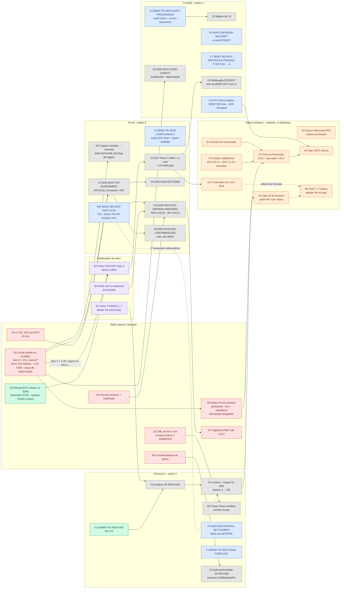

# Grafo de dependências — contábil · financeiro · fiscal (2026-09-07)

> **O que este doc é:** um nó por tarefa **já documentada** nos três módulos (cédula de módulos
> 2026-09-03 §E, cédula de integração §E, `PROXIMOS-PASSOS-2026-09-02` §1, `PLANO-MODULO-COMPLETO-
> REPLICAVEL`, BRIEF `FE-INCR-NFE`), com estado verificado contra `origin/main` `09ae49a2` +
> PR #270 e uma aresta por "depende de" citado na fonte. **O que não é:** fila nova, ratificação,
> nem estimativa de esforço. Serve para o dono ler *o que destrava o quê* antes de ratificar forks.
>
> **Regra de aresta:** só entra dependência **escrita** em cédula/BRIEF/runbook (coluna "Depende de",
> pré-condição ou "esperam X"). Dependência que eu inferi está marcada `(inferida)` no quadro e
> tracejada no grafo. Ordem de preferência (F-M6, "por sobrevivência") **não é aresta** — está na §4.

## 1. Legenda

| Classe | Cor | Significado |
|---|---|---|
| `done` | verde | mergeado em `main` ou obtido |
| `ready` | azul | agente pode executar **hoje** — todas as arestas de entrada fechadas (falta só autorização de sessão) |
| `blocked` | cinza | pelo menos uma aresta de entrada aberta |
| `human` | laranja | gate de execução humana (runbook; agente prepara, não preenche) |
| `ext` | vermelho | dado externo / pessoa (contador, banco, parceiro, RFB) |
| `decide` | roxo | ratificação do dono (fork/ADR) — sem ela a sessão não abre |

## 2. O grafo

## 3. Quadro nó a nó (fonte de cada aresta)

| Nó | Estado | Depende de | Fonte da aresta |
|---|---|---|---|
| **B-4** | human | — | fila 09-02 item 1 |
| **X2** | human | — (arquivo baixado 31/08) | fila 09-02 item 2 |
| **P4** | human | — (instaladores baixados 07/09) | RUNBOOK-H1 P4 detalhado |
| **H1** | human | B-4 · P4 · **D8** | RUNBOOK-H1 P2/P4/P6 |
| **H2** | human | — para OFX/CNAB; **F1c** para a parte NF-e (9/9) | cédula integração E8 |
| **H3** | human | C10 · H1 | cédula módulos C10 ("RUNBOOK-H3 para o sign-off"); plano Degrau 2 |
| **H1 2ª** | human | X4 | fila 09-02 item 6 |
| **M2** | human | "fim do app" (decisão do dono) — H1 2ª e H2 `(inferida)` | fila 09-02 item 7 |
| **D1** | ext | — | F-M5; cédula §F "sair hoje" |
| **D8** | ext | D1 (é item do mesmo pacote; P6 do H1) | RUNBOOK-H1 P6 "fornecidos pelo contador" |
| **D2** | ext | — | cédula integração E9; D2 anotada (iv) |
| **D3** | done | — | baixado 07/09; carimbo `[DONO confere]` aberto |
| **D4** | ext | — | cédula módulos D2 (ii) |
| **D5** | ext | — | F-M7 |
| **D6** | ext | — | F5 "dado externo do banco" |
| **D7** | ext | X10 (nasce com a emissão) | cédula módulos item 10 |
| **R1** | decide | F1a ✅ | BRIEF FE-INCR-NFE §Forks; cédula E6 |
| **R2** | decide | D3 ✅ · **D1** (item 4 + F-Z0: "a origem do bloco L é o próprio razão") | fila 09-02 item 5; F-Z0 (4) |
| **R4** | decide | — | cédula módulos D2 (iii) |
| **C4** | ready | — | F-M4; cédula E.1 |
| **C5** | blocked | C4 + forks do BRIEF | cédula E.1 |
| **C6** | ready | — | F-M4 |
| **C7** | ready | — | F-W2F-3/5 → (b) |
| **C8** | blocked | **D1** (tabela de taxas que o contador pratica) | cédula E.1 C8 |
| **C9** | blocked | X4 (é item do BRIEF da Fase 3) | F-Z0 (2); cédula E.1 C9 |
| **C10** | ready | — (ADR-P2 Accepted, BRIEF 8/8) | F-Q1 |
| **F1a** | done | — | PR #270 |
| **F1b** | blocked | R1 · F1a · E5 ✅ | cédula E6 |
| **F1c** | blocked | F1b | cédula E7 |
| **E9** | blocked | D2 | F-I2/F-I8 |
| **F3** | ready | — | F-M3 |
| **F4** | ready | — | F-M3 |
| **F5** | blocked | D6 | F-M3 |
| **X3** | ready | — | F-M2 (telas do já-existente) |
| **X4** | blocked | R2 | fila 09-02 item 5 |
| **X6** | blocked | D1 | F-M5 |
| **X6b** | ready | — | triagem [V-repo] T10. **Dívida:** cédula E2 o punha como pré-requisito do merge da NF-e; #267 mergeou sem ele. Aresta viva: X10 e o 1º fornecedor com CNPJ alfanumérico `(inferida)` |
| **X7** | blocked | D1 · D4 · F-M8 ✅ | cédula E.3 X7 |
| **X9** | blocked | X7 | cédula E.3 X9 |
| **X10** | blocked | X6b · D5 · R4 | cédula E.3 X10 ("T10 sim"; "pendência MIT não bloqueia") |
| **X8** | blocked | X7 | cédula E.3 X8 |

## 4. Leituras que o grafo dá

**Raiz da maior cadeia = o contador (D1).** Dele saem D8 → H1 → H3; R2 → X4 → H1 2ª → M2;
X7 → X9/X8; X6; C8. Sem a resposta, o fiscal inteiro e a 2ª passada do H1 ficam cinza. É a ação de
maior latência e a única sem substituto.

**Pronto hoje, sem aresta aberta (agente, cada um com autorização de sessão própria):**
C4, C6, C7, C10, F3, F4, X3, X6b. **Humano, sem aresta aberta:** B-4, X2, P4, H2 (parte OFX/CNAB),
D1 enviar, D2 obter, D4 conferir, R1 ratificar, R4 decidir.

**O que R1 (ratificar os forks do FE-NFE) destrava:** só F1b → F1c → parte NF-e do H2 (9/9). Não
destrava nada no fiscal nem no contábil. **O que R1 precisa:** nada — F1a está em PR e o BE (E5) em
`main`. Ratificar antes ou depois do contador não muda outra cadeia.

**Ordem global por sobrevivência (cédula módulos, T11 revisado) — preferência, não aresta:**
ingestão NF-e + custo D3 + CNPJ alfa (F1b/X6/X6b) → imobilizado (C8) → ECD/ECF (X4 + C9) →
emissão via parceiro (X10, onda 01/10) → DCTFWeb/MIT + IRPJ/CSLL (X7/X9) → PIS/COFINS + EFD (X8).
**Conflito visível no grafo:** X10 é o item com prazo legal (01/10/2026) e depende de D5, R4 e X6b —
nenhum dos três está no pedido ao contador; podem andar em paralelo a D1.

**Dívida achada ao montar:** X6b era pré-requisito de merge (cédula E2) e o merge (#267) aconteceu
sem ele. Não é regressão de código, é fila fora de ordem; a aresta continua valendo para X10.

## 5. O que eu não sei

1. Se D8 (dados P6) vai no mesmo envio que D1 ou é conversa separada — modelei como filho de D1.
2. Se o dono quer H2 antes ou depois de F1c: o runbook H2 é executável hoje para OFX/CNAB; a parte
   NF-e só existe com a tela. Duas passadas ou uma, decisão de agenda.
3. Peso das arestas: cada uma vale 1; o grafo não diz quanto tempo cada nó leva.
