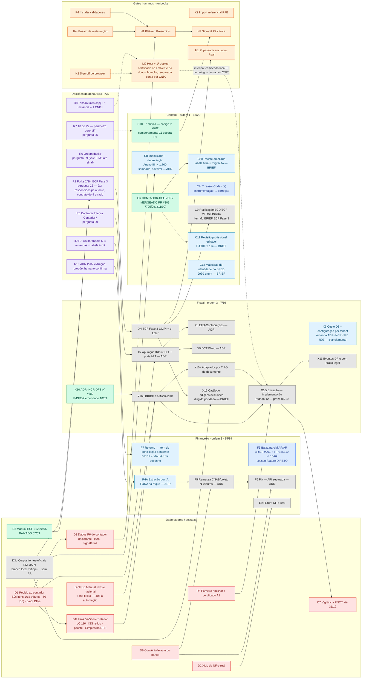

# Grafo de dependências — contábil · financeiro · fiscal (2026-09-11) — SUPERSEDE o de 07/09

> **O que este doc é:** o [grafo de 07/09](GRAFO-DEPENDENCIAS-2026-09-07.md) **reconciliado** com a
> [cédula 2026-09-10](CEDULA-DECISAO-2026-09-10-entrevista.md) (23 respostas do dono + 4 forks novos +
> respostas F3/F2/F13 + emenda F-DFE-2) e com o re-baseline da régua (master map §7.1: **38/57** —
> 16/22 · 15/19 · 7/16). O review de dependência de 10/09 provou que o grafo de 07/09 tinha **6 arestas
> mortas** e **8 nós a menos**; este doc é o fold, não planejamento. **O que não é:** ratificação nem
> fila nova — a ordem de execução continua sendo F-M6 + o algoritmo declarado na §4.
>
> **Estado verificado contra `origin/main` `7725f0ca` (2026-09-11, pós-merge do PR #305** — squash de `b3b46cdd`,
> CI 5/5 verde, review-delta PASS; `git merge-base --is-ancestor 7725f0ca origin/main` = 0). Claim de ✅ exige
> `git merge-base --is-ancestor <sha> origin/main` (regra do plano SDD §0 passo F).
>
> **Regra de aresta (mantida):** só entra dependência **escrita** em cédula/BRIEF/ADR/runbook. O que eu
> inferi está marcado `(inferida)` e tracejado.

## 0. O que mudou em relação ao grafo de 07/09 (cada linha com a fonte)

### 0.1 Arestas MORTAS (removidas)

| Aresta de 07/09 | Por que morreu | Fonte |
|---|---|---|
| **D1 → C8** (contador fornece a tabela de taxas de depreciação) | Taxas vêm do **Anexo III da IN RFB 1.700/2017**, semeadas e **editáveis por tenant**, com link da fonte na tela — não do contador | cédula 10/09 §2 **resposta 6** |
| **D1 → X6** (contador decide se ICMS é custo ou crédito) | Custo D3 vira **configuração por tenant** (contribuinte/não, ST, monofásico) — "cobrir todas as possibilidades"; emenda o `ADR-INCR-NFE §D3` sem depender do contador | cédula 10/09 §2 **resposta 5** |
| **D1 → R2** (item 4 + F-Z0: origem do bloco L) | O manual da ECF é público (Leiaute 12, 20/05/2026) e o **F-Z0 fechou pelo produto** ("100% automatizado, contabilidade é determinística") | cédula 10/09 §2 **resposta 1**; memória `accounting-ecf-fase3-lucro-real` (reconferência 10/09) |
| **F-Z0 como gate de existência de C6** ("condicionado ao item 0 do pedido") | Fechado pelo produto, não pelo contador; a rodada 9 está descondicionada | cédula 10/09 §2 **resposta 1** + §1 sinal 1 |
| **D4 → X7** (e-CAC: "o MIT tem API?") | O MIT **TEM** API — Serpro **Integra Contador**. D4 fecha; a pergunta virou **"contratar?"** (pergunta 30, aberta) → nó novo **R5** | cédula 10/09 §3 item 4 |
| **R4 → X10** (onde vive a credencial de emissão) | Respondido: **no ambiente do dono** (custódia local, 1 instância por cliente, coerente com BYOK). R4 = ✅ | cédula 10/09 §2 **resposta 10** |

**Sobrevivem:** **D1 → X7** (tributos — itens 1/1b do pedido) e **D1 → D8 → H1** (dados P6 do declarante e
signatários). O contador também segue gate dos **itens 5a–5f** do pedido (LC 116, ISS retido, pacote,
Simples na DPS) para o BRIEF `BE-INCR-DFE` (nó **D1f** abaixo).

### 0.2 Nós NOVOS (8 do re-baseline + 1 de plataforma fora da régua)

| Nó | Módulo | O que é | Depende de | Fonte |
|---|---|---|---|---|
| **C6b** | contábil | Pacote **ampliado** ao contador — balancete, razão, conciliação, amostra e demais demonstrativos, configurável. **Exige tabela filha + migração** (`AccountingDeliveryLog` tem 2 hashes fixos + 2 FKs de job + `@@unique([ecdJobId, ecfJobId, contactId])`) | C6 ✅ (merge do #305) | cédula 10/09 §2 **resposta 8** + correção do review |
| **C11** | contábil | Revisão profissional **editável**: o profissional edita o **DADO** ou lança **acerto** e o sistema **regera** — nunca o arquivo (F-EDIT-1 → a+c). Trilha de quem editou o quê | geração SPED ✅ (ECD #62, ECF #78, ECF Real #263) · `PostingService` ✅ (lançamento de acerto) · C6 ✅ (a entrega é o que se revisa) `(inferida)` | cédula 10/09 §2 **resposta 2** + §3 F-EDIT-1 |
| **C12** | contábil | Máscaras de identidade **na geração SPED**: `IDENT_QUALIF`/`COD_ASSIN` (J930) vira **enum do manual**; CPF/CNPJ/UF com máscara | geração SPED ✅ · contatos com máscara (#305) ✅ | cédula 10/09 §2 **resposta 3** + §5 "fica aberto" |
| **F6** | financeiro | **Pix como frente própria** — "API separada para Pix" | **D6** (convênio do banco) · conta bancária como entidade (parte do F5) `(inferida)` | cédula 10/09 §2 **resposta 21** |
| **F7** | financeiro | Retorno bancário → **item de conciliação pendente** que o humano confirma; encargo (multa/juros) entra **pelo retorno** (F-BAIXA-1 → a). **Decisão de DESENHO no BRIEF, não detalhe:** reusar `reconcile_pending_items` exige **4 emendas** (rescan re-executa o job de venda/CRM; não há semântica de confirmação humana; chave/enum são do produtor único; `canManageReconcilePending` passaria a autorizar efeito financeiro) **ou** tabela irmã → fork **R9** ao dono | C7 ✅ (#296) · parser CNAB 240 retorno ✅ (#61) · **R9** (decide) | cédula 10/09 §2 **respostas 20/22** + §3 F-BAIXA-1 + correção do review |
| **X10a** | fiscal | Adaptador **por TIPO de documento** — uma implementação de `EmissorPort` por modelo (NFS-e, NF-e 55…), não um adaptador polimórfico | BRIEF `BE-INCR-DFE` (**X10b**) | cédula 10/09 §2 **resposta 9** |
| **X11** | fiscal | **Eventos de DF-e com prazo legal** validado no comando — cancelamento, substituição, carta de correção | X10 implementação (rodada 12) | cédula 10/09 §2 **resposta 13** |
| **X12** | fiscal | **Catálogo de adições/exclusões dirigido por dado** — o universo dos Anexos I/II da IN 1.700 vira linha de catálogo, não `if` (F-COB-1 → b). O ajuste é linha de **código da RFB** em `M300A` (374/386 linhas `E`), `TIPO LANÇ` já diz adição/exclusão | X4 (bloco M) · **corpus de fontes em `main`** (ver §0.5) | cédula 10/09 §2 **resposta 4** + §3 F-COB-1; memória `accounting-ecf-fase3-lucro-real` (Fork 4) |
| **P-IA** | **plataforma — FORA da régua** | Extração genérica de documento por IA (F-BANK-1 → **b, contra a recomendação**). Acerto **estatístico** num módulo cuja premissa é determinismo (resposta 1): o ADR fixa **"extração propõe, humano confirma, razão só aceita o confirmado"**. Não recebe número de nó até ter ADR | ADR novo → parecer `luminaris-accounting-architect` → dono (**R10**) | cédula 10/09 §3 F-BANK-1 + §4 "fora da régua" |

**Nós que CRESCERAM (não viram nó novo — regra 2 do re-baseline):** **C9** retificação passa a
**preservar a versão anterior** (resposta 7); **C8** taxas editáveis por tenant (resposta 6); **F5**
remessa passa a suportar N leiautes **e a depender de P-IA** (F-BANK-1 b); **X6** custo D3 = configuração
por tenant (resposta 5); **X10** parser de retorno aceita XML/JSON/PDF (resposta 12), nasce com IBS/CBS
(resposta 15), homologação em ambiente separado (resposta 11), sem fila de retentativa (resposta 14).

### 0.3 Cadeia crítica NOVA

**A raiz deixou de ser o contador.** É a **emissão com prazo legal 01/10/2026** (NFS-e nacional; NF-e
não-ICMS 01/12 — Ato 4). E **M2 (host + deploy) entrou NO MEIO dela** — três respostas o puxam para
antes da emissão em produção: certificado A1 **no ambiente do dono** (resposta 10), **homologação em
ambiente separado** (resposta 11), **uma conta de emissão por CNPJ** provisionada junto com a instância
(resposta 16 + emenda F-DFE-2). Marcada `(inferida)` até existir doc que desenhe o provisionamento —
o `RUNBOOK-M2-DEPLOY-SMOKE.md` de hoje não sabe de certificado nem de conta por CNPJ.

**Tensão declarada, NÃO resolvida aqui (decisão do dono, R8):** o preset `units` do `ADR-INCR-DFE`
ainda tem `cnpj` **por unidade** (`modules/core/UnitsModule.ts`: `name, cnpj, address, managerId, type`);
"1 instância = 1 CNPJ" (resposta 16) dobra isso no M2. Apresentada, não resolvida.

**O contador (D1) continua gate só de:** D8 → H1 (dados P6) · X7 (tributos, itens 1/1b) · itens 5a–5f
→ BRIEF `BE-INCR-DFE`.

### 0.4 Resíduo sem rodada

**Rodada 3 (`BE-INCR-RECONCILE-PENDING`, #296):** os 2 `reasonCode` ratificados em **(a)** (cédula 10/09
resposta 23: "2 `reasonCode` novos → (a)") **não estão no código** — verificado em
`server/src/features/accounting/dtos/ReconcilePendingDto.ts:16-20` (enum = `FAILED |
ACCOUNTING_PERIOD_NOT_OPEN | MAX_CENTS_EXCEEDED`) e `server/src/jobs/accountingSyncReconcile.job.ts:1223`
(comentário "LACUNA DE SPEC … não tem reasonCode no enum"). Nó **C7r** abaixo: `sessao-instrumentacao`
→ `sessao-correcao`.

### 0.5 Dependência achada ao reconciliar (não estava em nenhum doc)

O **corpus de fontes oficiais** (`docs/accounting/fontes-oficiais/` — 23 normas: Manual ECD L9, Manual
ECF L12, IN 1.700 + 14 anexos, LC 116, Manual MIT, CNAB 240, pacote NFS-e…) e a **reconferência da ECF
Fase 3** (`RECONFERENCIA-ECF-FASE3-2026-09-10.md` + emendas do BRIEF) **NÃO estão em `main`**: vivem
na branch local `claude/mit-api-integration-queue-0e8847` (4 commits docs-only, `4a649e41..6dad56a7`,
sem push, sem PR — verificado com `git branch -a --contains 4a649e41`). Todo nó cuja regra cita esse
corpus (C8, X4, X12, X10b) depende de ele estar em `main` → nó **D3b** (`sessao-integracao`, exige
autorização citável do dono — não é transportado por este fold).

## 1. Legenda

| Classe | Cor | Significado |
|---|---|---|
| `done` | verde | mergeado em `main` (sha verificado por `merge-base`) ou obtido |
| `ready` | azul | agente pode executar **hoje** — arestas de entrada fechadas, forks ratificados (falta só a sessão) |
| `plan` | azul-claro | agente pode **planejar** hoje (BRIEF/ADR) — a feature espera fork |
| `blocked` | cinza | pelo menos uma aresta de entrada aberta |
| `human` | laranja | gate de execução humana (runbook; agente prepara, não preenche) |
| `ext` | vermelho | dado externo / pessoa (contador, banco, parceiro, RFB) |
| `decide` | roxo | ratificação do dono (fork/ADR/pergunta aberta) — sem ela a sessão não abre |

## 2. O grafo

## 3. Quadro nó a nó

| Nó | Estado (11/09) | Depende de | Fonte da aresta |
|---|---|---|---|
| **B-4** | human | — | fila 09-02 item 1; pré-condição P2 do RUNBOOK-H1 |
| **X2** | human | — (arquivo baixado 31/08) | fila 09-02 item 2 |
| **P4** | human | — (instaladores baixados 07/09) | RUNBOOK-H1 P4 |
| **H1** | human | B-4 · P4 · **D8** | RUNBOOK-H1 P2/P4/P6 |
| **H2** | human | — (OFX/CNAB, NF-e por clique, wizard) | cédula integração E8; RUNBOOK-H2-WIZARD |
| **H3** | human | C10 · H1 | cédula módulos C10; plano Degrau 2 |
| **H1 2ª** | human | X4 | fila 09-02 item 6 |
| **M2** | human — **no meio da cadeia crítica** `(inferida)` | R8 `(inferida)` · H2 `(inferida)` | respostas 10/11/16; ADR-M2 (alvo VPS, 1 instância por cliente) |
| **D1** | ext | — | F-M5; PEDIDO-CONTADOR-2026-09-03 (+ item 5 via #297) |
| **D8** | ext | D1 | RUNBOOK-H1 P6 |
| **D1f** | ext | D1 | cédula 10/09 §0 desta reconciliação; plano SDD rod. 6 ("resposta do contador (itens novos)") |
| **D2** | ext | — | cédula integração E9 |
| **D3** | done | — | baixado 07/09 |
| **D3b** | **blocked** (branch local sem PR) | autorização do dono para `sessao-integracao` | §0.5 |
| **D-NFSE** | ext (dono) | — | plano SDD rod. 6: "manual da NFS-e nacional (primária, dono baixa — 403 à automação)"; memória `nfse-nacional-fontes-oficiais` |
| **D5** | ext | — | F-M7; ADR-DFE F-DFE-4 (sem recomendação — dado externo) |
| **D6** | ext | — | resposta 18 ("segue como dado externo D6") |
| **D7** | ext | X10i | cédula módulos item 10 |
| **R2** | decide | D3 ✅ · D3b | pergunta 26; Forks 2/3 respondidos pela fonte, **contrato do Fork 4 errado** (memória `accounting-ecf-fase3-lucro-real`) |
| **R5** | decide | — | pergunta 30 (Integra Contador) |
| **R6** | decide | — | pergunta 29 (ordem) — vale F-M6 + exceção 01/10 até sinal |
| **R7** | decide | — | pergunta 25 (T0 do P2) |
| **R8** | decide | — | cédula 10/09 §3 "contradição aberta"; PR #305 lacunas declaradas |
| **R9** | decide | BRIEF F7 apresentando as duas opções | cédula 10/09 §3 F-BAIXA-1 correção |
| **R10** | decide | ADR P-IA + parecer | cédula 10/09 §3 F-BANK-1 |
| **C6** | **done** (PR #305, squash `7725f0ca`, 2026-09-11 — ancestral verificado) | — (F-Z0 fechado; Forks A/B ratificados; F3/F2/F13 absorvidos) | cédula 10/09 §1/§6 |
| **C6b** | plan (BRIEF) | C6 ✅ | resposta 8 |
| **C7r** | **ready** (instrumentação → correção) | — (ratificado (a), resposta 23) | plano SDD §5 "forks novos pendentes" rod. 3 |
| **C8** | plan (ADR → parecer → forks → BRIEF) | D3b (Anexo III da IN 1.700 no corpus) | resposta 6; plano SDD rod. 13 |
| **C9** | blocked | X4 | resposta 7 (versionada); F-Z0 (2) |
| **C10** | done (#282 `60cced8d`); comportamento 11 espera R7 | — | cédula 07/09 |
| **C11** | plan (BRIEF) | geração SPED ✅ · PostingService ✅ · C6 `(inferida)` | resposta 2 + F-EDIT-1 |
| **C12** | plan (BRIEF) | geração SPED ✅ · #305 (máscaras de contato) | resposta 3 + cédula §5 |
| **F3** | **ready → `sessao-feature`** | — (BRIEF #291 `f1307009`; F-PS8 a · F-PS9 a · F-PS10 b ratificados 10/09) | resposta 23 |
| **F5** | blocked (ADR) | D6 · **P-IA** | F-M3; F-BANK-1 (b) consequência (ii) |
| **F6** | blocked (ADR) | D6 · F5 `(inferida)` | resposta 21 |
| **F7** | plan (BRIEF com fork R9) | C7 ✅ · R9 | F-BAIXA-1 (a) + correção |
| **E9** | blocked | D2 | F-I2/F-I8 |
| **P-IA** | plan (ADR) — **fora da régua** | R10 | F-BANK-1 (b) |
| **X4** | blocked | R2 · D3b | fila 09-02 item 5; plano SDD rod. 11 |
| **X6** | plan (`sessao-planejamento`: emenda ADR-INCR-NFE §D3) | — | resposta 5; plano SDD rod. 10 (era "triagem do contador") |
| **X7** | blocked (ADR) | D1 (itens 1/1b) · R5 | cédula E.3 X7; pergunta 30 |
| **X8** | blocked | X7 | cédula E.3 X8 |
| **X9** | blocked | X7 | cédula E.3 X9 |
| **X10** | done (#289, ADR Accepted; F-DFE-2 emendado no #305) | — | plano SDD rod. 6 |
| **X10b** | blocked (BRIEF) | D-NFSE · D1f · X10 ✅ | plano SDD rod. 6 ("espera manual + resposta do contador") |
| **X10i** | blocked | X10b · X10a · **D5** · M2 `(inferida)` | plano SDD rod. 12; §0.3 |
| **X10a** | blocked | X10b | resposta 9 |
| **X11** | blocked | X10i | resposta 13 |
| **X12** | blocked (BRIEF) | X4 · D3b | resposta 4 + F-COB-1 (b) |

## 4. Leituras que o grafo dá

**Raiz da maior cadeia = a emissão (01/10/2026), não o contador.** D-NFSE → X10b → X10a → X10i ← D5,
com M2 no meio `(inferida)`. Dos três dados externos dessa cadeia, **nenhum é do contador** exceto D1f
(itens 5a–5f); os outros dois (manual da NFS-e, parceiro + certificado) são do dono. O contador ficou
com **três** arestas vivas: D8 (H1), X7 (tributos), D1f.

**Algoritmo de escolha do próximo nó (o que esta sessão roda a cada iteração):**
1. `git fetch origin main` + `merge-base --is-ancestor` para todo nó que for marcar ✅.
2. Nós abertos com **todas** as entradas ✅ que **não** esperam terceiro (D2/D5/D6/D-NFSE) nem gate humano
   (B-4/X2/H1/H2/H3/M2).
3. Ordem F-M6: contábil → financeiro → fiscal. **Exceção ratificada:** a emissão (X10i) sobe pelo prazo de
   01/10 **assim que D5 existir** — não antes.
4. No mesmo módulo: nó com spec pronta + forks ratificados → nó que precisa de BRIEF → nó que precisa de ADR.

**Frente de 2026-09-11, já ordenada:**

| # | Nó | Sessão | Por quê nesta posição |
|---|---|---|---|
| 1 | ~~**C6** merge do #305 + fold~~ ✅ **feito 11/09** (`7725f0ca`; §5.1 C6 ✅, 17/22, ADR descondicionado) | integração + fold | único nó com código pronto, CI verde e review PASS |
| 2 | **F3** baixa parcial AP/AR | `sessao-feature` direto | financeiro, mas o **único** com spec + 3 forks ratificados |
| 3 | **C7r** 2 reasonCodes | `sessao-instrumentacao` → `sessao-correcao` | contábil; resíduo ratificado (a), sem spec nova |
| 4 | **X6** custo D3 por tenant | `sessao-planejamento` (emenda ADR §D3) → feature | fiscal, mas destravou do contador; precisa de spec |
| 5 | **C8** imobilizado | ADR → parecer → forks → BRIEF | contábil; **espera D3b** (Anexo III no corpus) |
| 6 | **C6b · C11 · C12** | `sessao-planejamento` cada | contábil; BRIEFs — C6b só após o merge do #305 |
| 7 | **R2 / X4** ECF Fase 3 | **pára e apresenta** forks 2/3/4 com a fonte | contrato do Fork 4 errado; espera D3b |
| 8 | **F7 · X12** | BRIEF com decisão de desenho explícita (R9; catálogo) | fork ao dono |
| 9 | **P-IA** | ADR (plataforma) → parecer → R10 | só depois F5 e F6 (que esperam D6 de qualquer jeito) |
| 10 | **X10b** BRIEF BE-INCR-DFE | — | **não abre** sem D-NFSE + D1f + (D5 para X10i) |

**Conflito visível:** o prazo de 01/10 puxa X10i, mas X10i tem **3 entradas externas** (D-NFSE, D1f, D5)
e uma humana `(inferida)` (M2). Nenhuma delas é de agente. O que o agente pode fazer hoje pela emissão é
**zero código** — só preparar (gate-copilot/liaison) e apontar.

## 5. O que eu não sei

1. Se o dono autoriza transportar `claude/mit-api-integration-queue-0e8847` (D3b) — é `sessao-integracao`
   docs-only, mas exige sinal citável; sem ela C8, X4, X12 e X10b citam fonte que `main` não tem.
2. Se C11 depende de C6 de fato (a "revisão" é do arquivo entregue ou de qualquer arquivo gerado?) —
   modelei `(inferida)`; o BRIEF de C11 decide.
3. Se M2 é pré-requisito de X10i ou só de X10i **em produção** (homologação poderia rodar antes do deploy
   real) — marcado `(inferida)`; o doc de provisionamento por CNPJ (que não existe) decide.
4. Se F6 (Pix) precisa da entidade "conta bancária" que o F5 cria — `(inferida)`; o ADR do F6 decide.
5. Peso das arestas: cada uma vale 1; o grafo não estima duração.
