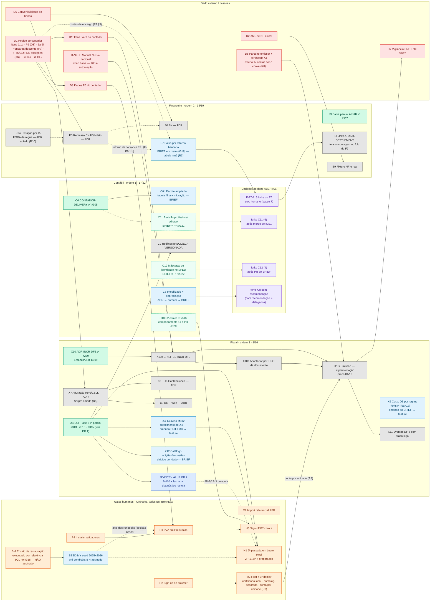

# Grafo de dependências — contábil · financeiro · fiscal (2026-09-14) — SUPERSEDE o de 11/09

> **O que este doc é:** o [grafo de 11/09](GRAFO-DEPENDENCIAS-2026-09-11.md) **reconciliado** com as duas
> cédulas de 14/09 ([forks-ratificações, #319](CEDULA-DECISAO-2026-09-14-forks-ratificacoes.md) — que
> prevalece onde diverge — e [gates-humanos, #318](CEDULA-DECISAO-2026-09-14-gates-humanos.md)), com os
> merges #313/#315/#316 e com o que está **em voo** nesta noite (PRs #320/#321, BRIEF C12 em worktree).
> É o **fold pendente** que a cédula #319 nomeia na última seção. **O que não é:** ratificação nem fila
> nova — a ordem de execução é a de `PROXIMOS-PASSOS-2026-09-14.md` (R6 aplicado), detalhada lá passo a passo.
>
> **[16/09] Estado vigente em §4.2 (`origin/main` `3f61c4b0`); §1 mermaid e §3 são a leitura de 14/09, congelados — o estado por nó é §4/§4.2.** Estado verificado contra `origin/main` `c1e4b7a5` (2026-09-14, pós-merge do PR #315**; `git merge-base
> --is-ancestor origin/main HEAD` = 0; #318 `93e52adb` e #319 `b002f78c` ancestrais). Claim de ✅ exige
> `git merge-base --is-ancestor <sha> origin/main` (regra do plano SDD §0 passo F).
>
> **Regra de aresta (mantida):** só entra dependência **escrita** em cédula/BRIEF/ADR/runbook. O que eu
> inferi está marcado `(inferida)` e tracejado. **Regra de contagem (master map §7.1):** nó novo só por
> re-baseline ratificado; o que cresce fica na coluna. Este fold **não altera o denominador (57)**.

## 0. O que mudou em relação ao grafo de 11/09 (cada linha com a fonte)

### 0.1 Nós `decide` FECHADOS (R5..R10) — e o que cada um destravou

| Nó | Decisão (cédula #319, que prevalece) | Efeito no grafo |
|---|---|---|
| **R5** | Adiar Serpro até X7 destravar (contrata quando D1 itens 1/1b chegarem) | R5 → ✅; **X7 segue `blocked (ADR)`** por D1; a linha "port do Serpro" do #318 está superada |
| **R6** | **Financeiro antes de fiscal**, já; exceção 01/10 (X10i quando D5 existir) mantida | Ordem da §4: contábil (BRIEFs) → **F7** → X6 feature. R6 → ✅ |
| **R7** | Emendar o perímetro zero-diff (1 símbolo: `installPresetAsSystem`) | `ADR-P2` EMENDA 14/09 **em `main`**; C10 comportamento 11 **em PR #320** (aberto) |
| **R8** | Instância = CNPJ raiz; unidade = filial com conta de emissão própria; `units.cnpj` **fica** | `ADR-INCR-DFE` EMENDA 14/09 **em `main`**; aresta R8 ⇢ M2 deixa de ser `(inferida)` na parte do CNPJ; `FiscalProfile` por `unitId` nasce com `partnerAccountRef` reservado |
| **R9** | **Tabela irmã** (`BankSettlementItem`) | F7 → `plan` com desenho fechado; BRIEF **em `main`** (`BE-INCR-BANK-SETTLEMENT-brief.md`, #319) com ~~5 forks PENDENTES~~ → F-F7-1..5 → (a) ratificados 15/09 pelo dono via `AskUserQuestion` — cabeçalho do BRIEF F7; feature ✅ #326 (16/09) |
| **R10** | Não abrir ADR P-IA agora | P-IA fica posição 9; nenhuma frente bloqueada por ele |
| **F-X6-1..6** | 5/6 → (a); **F-X6-3 → (b)** (subtrair PIS/COFINS já, exceções como dado configurável) | X6 = `ready` **depois** da emenda do BRIEF #309 (itens 10/11) — a emenda é `sessao-planejamento` docs-only |

### 0.2 Nós que MUDARAM de estado por merge (verificado por `merge-base`)

| Nó | 11/09 | 14/09 | Evidência |
|---|---|---|---|
| **X4** ECF Fase 3 | blocked (R2/D3b) | **✅ parcial** — L/M/N + e-Lalur (#313 `197cc9fc`), M410/M500/M510/M312/M315 + fechamento (#316 `c96e2227`), **tela de cadastro** (#315 `c1e4b7a5`, FE-INCR-LALUR PR 1) | fold 12/09 e 14/09 do master map; §0.4 abaixo |
| **D3b** corpus em `main` | blocked | **✅** (PR #311 `acb927ba`, 11/09) | `docs/accounting/fontes-oficiais/MANIFEST.md` em `main`; fold 11/09 (3ª passada) |
| **R2** forks 2/3/4 | decide | **✅** (2→d · 3→a · 4→b, cédula 11/09 / PR #311) | BRIEF 3B cabeçalho |
| **C10** P2 clínica | done, comportamento 11 espera R7 | done; comportamento 11 **em PR #320** (`670847fa`, MERGEABLE, CI parcial, 0 reviews) | `gh pr view 320` |

### 0.3 Nós com BRIEF em voo (planejamento aberto, sem código)

| Nó | Artefato | Onde está | Forks |
|---|---|---|---|
| **C11** revisão profissional editável | `BE-INCR-REVIEW-LAYER-brief.md` | **✅ `main` #321 `8e79b8cb`** (fold 16/09) → **✅ feature #334 `a2c974cb`** (sessão 4, 16/09) | ~~6 pendentes~~ → (a) ×6 ratificados 16/09 (#333) |
| **C12** máscaras de identidade no SPED | `BE-INCR-SPED-IDENTITY-MASKS-brief.md` | **✅ `main` #322 `1c469e2f`** (fold 16/09) | **4 pendentes** (ao dono) + 1 transcrição |
| **F7** baixa por retorno bancário | `BE-INCR-BANK-SETTLEMENT-brief.md` | `main` (#319) → **✅ feature #326 `22b97252`** (fold 16/09) | F-F7-1..5 → (a), ratificados 15/09 pelo dono via `AskUserQuestion` — cabeçalho do BRIEF F7 |
| **X6** custo D3 por regime | `BE-INCR-NFE-COST-REGIME-brief.md` (#309) | emenda #327 → **✅ feature #328 `fb7ae649`** (fold 16/09; ERRATA transcrição × corpus) | ratificados (5a+1b) |

### 0.4 Correções de fato (o grafo de 11/09 afirmava; o disco diz outra coisa)

| Afirmação de 11/09 | Correção | Fonte |
|---|---|---|
| F7 depende de "parser CNAB 240 **retorno** ✅ (#61)" | `server/src/lib/cnab.ts` parseia **extrato** (registro 3, Segmento **E**) → `BankStatementLine`. **Não existe** parser de retorno de cobrança (T/U ou J, ocorrência, juros/multa/desconto); esse retorno pressupõe **remessa** (F5, `blocked` por D6). "Retorno" no F7 = linha `UNMATCHED` de extrato já importado (CSV/OFX/CNAB-E) — é o fork **F-F7-1** | BRIEF F7 §0.1 |
| encargo "entra pelo retorno" é configuração | `registerPayment`/`registerReceipt` **rejeitam** valor acima do saldo; `ADR-INCR-PARTIAL-SETTLEMENT` não cobre juros/multa/desconto → encargo é **comportamento novo** (F-F7-2) | BRIEF F7 §0.1 |
| — (não dito) | **Nenhuma conta de juros/multa/desconto** existe no chart do salão (13 contas) → **pendência externa ao contador** (linha nova do pedido) | BRIEF F7 §5; passo 11 do plano |
| D3b `blocked` no mermaid de 11/09 | já estava ✅ desde o fold 11/09 (3ª passada) — o mermaid não foi atualizado | master map fold 11/09 |
| Financeiro §7.1: "consumo do retorno bancário … **reusa a tabela da rodada 3**" | superado por **R9 → tabela irmã** | cédula #319 R9 |

### 0.5 Itens autorizados SEM número de nó (não entram na régua)

| Item | Natureza | Depende de | Fonte |
|---|---|---|---|
| **SEED-MY** seed multi-exercício (2025+2026: períodos, lançamentos, AP/AR, chart com `1.1.6/3.3/4.2`) | **pré-condição de gate** (alvo dos runbooks H1/H2/H3 passa a ser o seed) — fixture, não nó de produto | **B-4 assinado** (backup = rollback; #318 §4) | cédula #319 autorizações; RUNBOOK-H1 A1 "DECISÃO DO DONO 12/09" |
| **X4-14** aviso no diagnóstico para ajuste parcial sem M312 | **crescimento do nó X4** (regra 2) — 4 agregados `K155`/`K355` por conta/trimestre sobre postings | X4 ✅ (#316) | fold 14/09; cédula #319 |
| **FE-INCR-LALUR PR 2** (M410 + fechar trimestre + diagnóstico na tela) | **crescimento do nó X4** (F-FE-4 → a: "2º PR após o 3C") | #315 ✅ · #316 ✅ | BRIEF FE-LALUR §3 F-FE-4 |
| **FE-INCR-BANK-SETTLEMENT** (tela do F7) | nó vizinho nomeado no BRIEF F7 §0 — **contagem decidida no fold do F7** (candidato a crescimento de F7 pela regra 2, não a nó novo) | F7 | BRIEF F7 §0 |
| **Emenda do BRIEF X6** (F-X6-3 b + exceções) | docs-only, `sessao-planejamento` | — | cédula #318 §1 |

## 1. Legenda

| Classe | Cor | Significado |
|---|---|---|
| `done` | verde | mergeado em `main` (sha verificado por `merge-base`) ou obtido |
| `inflight` | verde-claro | PR aberto **ou** BRIEF em worktree — nem `done` nem `ready`: a próxima ação é integrar/revisar, não começar |
| `ready` | azul | agente pode executar **hoje** — arestas de entrada fechadas, forks ratificados (falta só a sessão) |
| `plan` | azul-claro | agente pode **planejar** hoje (BRIEF/ADR) — a feature espera fork |
| `blocked` | cinza | pelo menos uma aresta de entrada aberta |
| `human` | laranja | gate de execução humana (runbook; agente prepara, não preenche) |
| `ext` | vermelho | dado externo / pessoa (contador, banco, parceiro, RFB) |
| `decide` | roxo | ratificação do dono (fork/ADR/pergunta aberta) — sem ela a sessão não abre |

## 2. O grafo

## 3. Quadro nó a nó (só o que mudou ou está aberto; o resto igual ao de 11/09)

| Nó | Estado (14/09) | Depende de | Fonte da aresta / evidência |
|---|---|---|---|
| **B-4** | human — executado **por referência SQL** no #318, **desfecho não marcado, não assinado** (`grep "^- \[x\]" RUNBOOK-B4` = 0) | — | #318; RUNBOOK-B4 §Desfecho |
| **SEED-MY** | plan (BRIEF curto → `job-generator`) — **pára** se B-4 não estiver assinado | B-4 assinado | cédula #318 §4; #319 autorizações |
| **X2 · P4 · H2 · H3 · M2** | human, em branco (0 checkbox marcado nos 7 runbooks) | — | `RUNBOOK-*.md` |
| **H1 2ª passada** | human — 2P-1..2P-4 preparados em branco | X4 ✅ · **X4-14** (antes da passada, cédula) · SEED-MY `(inferida — decisão 12/09 diz que o alvo é o seed)` | RUNBOOK-H1 §2ª passada; fold 14/09 |
| **R2 · R5 · R6 · R7 · R8 · R9 · R10** | **✅ decididos** | — | cédula #319 (prevalece) + #318 |
| **C10** | inflight — comportamento 11 em **PR #320** (`670847fa`; migração `20260914200000` + allowlist de 1 símbolo + teste-guarda) | review independente + CI | `gh pr view 320` |
| **C11** | inflight — BRIEF em **PR #321**, 6 forks pendentes | merge do #321 → forks ao dono | `gh pr view 321` |
| **C12** | inflight — BRIEF em **PR #322** (4 forks + transcrição obrigatória) | merge do #322 → forks ao dono | `gh pr view 322` |
| **C6b** | plan (BRIEF) | C6 ✅ | resposta 8 (cédula 10/09) |
| **C8** | plan (ADR `ADR-INCR-FIXED-ASSETS` → parecer → forks **delegados quando há recomendação** → BRIEF) | D3b ✅ (Anexo III no corpus) | cédula #319 "C8 delegação condicionada" |
| **C9** | blocked | X4 (retificação versionada) | resposta 7 |
| **F7** | plan — BRIEF em `main`, desenho fechado (tabela irmã), **5 forks pendentes** | R9 ✅ · **F-F7-1..5** (dono) · D1 (contas de encargo — só Fase C) | BRIEF F7 §3/§5 |
| **FE-INCR-BANK-SETTLEMENT** | blocked | F7 | BRIEF F7 §0 |
| **F5 · F6** | blocked (ADR) | D6 (· P-IA para F5) | F-M3; resposta 21 |
| **P-IA** | blocked — ADR **adiado** até D6 | R10 ✅ (adiar) | cédula #319 R10 |
| **X4** | **✅ parcial** (#313 + #316 + #315) | — | folds 12/09, 14/09; este fold |
| **X4-14** | plan (emenda BRIEF 3C item 14 → feature) — **antes da H1 2ª passada** | X4 ✅ | cédula #319 |
| **FE-INCR-LALUR PR 2** | **ready** (F-FE-4 → a; 3C mergeado; PR 1 mergeado) — sem item de fila próprio: entra como crescimento do X4 quando o dono chamar | #315 ✅ · #316 ✅ | BRIEF FE-LALUR §3 |
| **X6** | plan → ready **após emenda do BRIEF** (`sessao-planejamento`, itens 10/11 sob F-X6-3 b, F-X6-4 ativo, defaults conservadores, linha ao contador) | emenda docs-only | cédula #318 §1 |
| **X7** | blocked (ADR) | D1 itens 1/1b; Serpro adiado (R5) | cédula #319 R5 |
| **X10** | done — EMENDA R8 em `main` | — | `ADR-INCR-DFE-EMISSAO-PARCEIRO.md:95` |
| **X10b → X10a → X10i → X11** | blocked | D-NFSE · D1f · D5 · **M2 (agora aresta escrita: conta por unidade, R8)** | cédula #318 §2 R8 |
| **X12** | plan (BRIEF) | X4 ✅ · D3b ✅ | resposta 4 + F-COB-1 (b) |
| **D3b** | ✅ | — | PR #311 |

## 4. Leituras que o grafo dá

**A frente de agente encheu — pela primeira vez desde 28/08.** Em 11/09 o próximo nó "sem decisão do dono"
era só C11/C12/C6b (BRIEFs). Hoje há **9 unidades executáveis por agente** sem esperar terceiro: integrar
#320 e #321; commitar/abrir PR do BRIEF C12; BRIEF C6b; emenda do BRIEF X6; emenda do BRIEF 3C (X4-14) →
feature; ADR C8 → parecer; FE-INCR-LALUR PR 2; pedido ao contador (montar). E **2 stops humanos** nomeados
(forks F-F7-1..5; assinatura do B-4 para o SEED-MY).

**A cadeia crítica não mudou de raiz:** emissão (01/10) ← D-NFSE · D1f · D5 · M2. Nenhuma entrada é de
agente. R8 tirou o `(inferida)` da aresta M2 → X10i (conta por unidade é agora regra escrita), o que
**aumenta** o peso do M2, não diminui.

**Algoritmo de escolha do próximo nó (mantido, com R6):**
1. `git fetch origin main` + `merge-base --is-ancestor` para todo nó que for marcar ✅.
2. Nós abertos com **todas** as entradas ✅ que **não** esperam terceiro (D2/D5/D6/D-NFSE) nem gate humano
   (B-4/X2/H1/H2/H3/M2).
3. **R6:** contábil → **financeiro** → fiscal. Exceção ratificada: X10i sobe pelo prazo de 01/10 **assim que D5
   existir** — não antes.
4. No mesmo módulo: `inflight` (integrar/revisar) → spec pronta + forks ratificados → BRIEF → ADR.
5. Docs-only intercala enquanto um PR de código espera CI/review.

**Frente de 2026-09-14 (noite), ordenada por R6** — o detalhamento de cada passo (pré-condição verificável,
arquivos, gates, evidência de "feito", stop humano) está em
[`PROXIMOS-PASSOS-2026-09-14.md` §Detalhamento](PROXIMOS-PASSOS-2026-09-14.md):

| # | Nó | Estado | Próxima ação | Sessão |
|---|---|---|---|---|
| 0 | preflight | — | `merge-base` de #315/#318/#319; `gh pr list`; zero jest concorrente | — |
| 1 | ~~#315~~ | ✅ `c1e4b7a5` | — | — |
| 2 | ~~C10 c.11 (#320)~~ | ✅ `0790dd29` | — | — |
| 3 | ~~C11 (#321)~~ | ✅ `8e79b8cb` docs | **6 forks ao dono** (pendentes) | dono |
| 4 | ~~C12 (#322)~~ | ✅ `1c469e2f` docs | **4 forks ao dono** (pendentes) | dono |
| 5 | ~~C6b~~ | ✅ `ce0c97e8` BRIEF (#324) | **5 forks ao dono** | dono |
| 6 | ~~SEED-MY~~ | ✅ `dbd5ea83` BRIEF (#325) | **bloqueado até B-4 assinado**; 3 forks ao dono | dono / gate |
| 7 | ~~**F7**~~ | ✅ `22b97252` feature (#326) | contas de encargo = item 6 do pedido | — |
| 8 | ~~X6~~ | ✅ `112366c8` emenda (#327) + `fb7ae649` feature (#328) | defaults conservadores até item 7 do pedido | — |
| 9 | ~~X4-14~~ | ✅ `a6783795` (#329) | régua por natureza (S1 do review) | — |
| 9b | FE-INCR-LALUR PR 2 | ready | quando o dono chamar — sem item de fila próprio (crescimento do X4) | `sessao-feature` |
| 10 | ~~C8~~ | ✅ `9b4cb35a` ADR+parecer+BRIEF (#330) | **F-FA10/12/13 ao dono**; implementação NÃO autorizada | dono |
| 11 | ~~D1 pedido~~ | ✅ `3f61c4b0` montado (#331) | **dono envia** | dono |
| 12 | ~~fold~~ | ✅ 16/09 | régua 42/57 | — |

### 4.3 Estado em 2026-09-17 (fold pós-C6b) — verificado

- `origin/main` = **`0f1af265`** (#342, fold sessão 5). **C6b ✅** em 3 PRs seriais (#337 `daf76279` · #338 `15c8bf53` · #340
  `373d00d4`, "executa C6b" 16/09; review do PR-3 FAIL F1 → fix `63f02b04` → PASS, veredito gravado no fold #342, não no
  corpo do PR — precedente #338 grava no corpo). Régua **44/57** (contábil **19/22** · financeiro 17/19 · fiscal 8/16) — C6b é
  nó (§1), numerador +1.
- Orquestração vigente: `PROXIMOS-PASSOS-2026-09-17.md` (#339 `d7181f8f`), que aplica o algoritmo do §4 deste grafo.
  Próximo nó por R6: nenhum em voo — C12 (transcrição ✅, 11 comportamentos) · C8 · FE-LALUR PR 2 `ready` **sem "executa"**;
  `FE-INCR-BANK-SETTLEMENT` sem BRIEF (autorização citável pendente); SEED-MY `blocked` por B-4. Gates humanos e dado
  externo inalterados.

### 4.2 Estado ao fim da sessão 3 — 2026-09-16 (fold) — verificado

- `origin/main` = **`3f61c4b0`** (#331). Fila §4 **inteira ✅** (passos 1–12). Régua **42/57** (contábil 17/22 · financeiro
  **17/19** · fiscal 8/16): F7 é nó novo do financeiro (§7.1 "+2"); X6 (custo D3 por tenant) e X4-14 são **crescimento**
  de nó (§7.1 "nós que cresceram"), numerador inalterado. Leitura alternativa declarada: se X6 contasse como nó, 43/57.
- **Contagem decidida neste fold (7.6 do prompt-mãe, regra 2 do §7.1):** `FE-INCR-BANK-SETTLEMENT` (tela do F7) é
  **crescimento do F7**, não nó novo — denominador segue 57 (mesmo precedente da tela do e-Lalur, #315). Leitura
  alternativa declarada: se contasse, 58.
- **Nós novos nomeados nesta sessão (fora da régua até ADR/BRIEF próprios):** `FE-INCR-FIXED-ASSETS` (tela do C8),
  relatório de imobilizado como extra do C6b, amortização de intangível, CIAP — ver ADR C8 §2 "Fora de escopo".
- **Correções de fato desta sessão:** o DTO da ECD **já expõe** `indFinEsc`/`codHashSub` (só a ECF não expõe
  `retificadora`/`numRec`); `LalurProcess` é M315, não exercício; `postEntry` abre tx raiz própria (subrazão = 2 commits);
  o Anexo III da IN 1.700 tem 2 binários (o corpus tem o compilado `43557`) e linha `<STRIKE>`.
- ~~Abertos ao dono: forks C11 (6) · C12 (4) · C6b (5) · SEED-MY (3) · C8 (3).~~ **[16/09, sessão 4] 20/20 ratificados**
  (`CEDULA-DECISAO-2026-09-16-forks-c11-c12-c6b-c8-seed.md`): ~~C11~~ **✅ #334 `a2c974cb` ("executa C11", régua 43/57 — contábil 18/22)** · C12 (após transcrição J930/0930) · C6b (~~serial após C11~~ destravado) · C8 seguem **`ready`** —
  nenhum tem "executa". SEED-MY segue `blocked` por B-4. Gates humanos e dado externo inalterados (abaixo).

### 4.1 Estado ao fim da sessão de 2026-09-14 (noite) — verificado

- `origin/main` = `c1e4b7a5` (#315). Régua **41/57** (contábil 17/22 · financeiro 16/19 · fiscal 8/16) — #315 é
  crescimento do X4 (precedente C10 / item 13), numerador inalterado. Leitura alternativa declarada: se a tela
  contasse como nó, seria 42/57 — decisão do dono se discordar.
- Em voo: **#320** (código, CI parcial, sem review), **#321** (docs, BRIEF C11), **#322** (docs, BRIEF C12), **#323** (docs, este fold + índices).
- Gates humanos abertos e **em branco**: B-4 (executado por referência, não assinado), X2, P4, H1, H1 2ª passada,
  H2, H3, M2. Dado externo: D1/D1f/D8, D2, D5, D6, D-NFSE.
- **Residuais de código declarados (não são nós):** F10 do #307; `tx?` em `PostingService.reverseEntry` (L1);
  corrida `cancelPayable/cancelReceivable × registerPayment`; F7 (PAYING sem recibo após crash — reconcile não
  repara); 4 MENOR do #313 absorvidos no 3C; itens 16–19 do #316 corrigidos.

## 5. O que eu não sei

1. Se a H1 2ª passada deve esperar o **SEED-MY** (decisão de 12/09 diz que o `dev.db` é seed e o alvo passa a ser o
   seed multi-exercício) ou pode rodar como (ii) sobre o seed atual — modelei `(inferida)`; o BRIEF do SEED-MY decide.
2. Se `FE-INCR-BANK-SETTLEMENT` conta como nó novo (denominador 58) ou crescimento do F7 — regra 2 sugere
   crescimento; **decisão de contagem no fold do F7**, não aqui.
3. Se o C12 depende do C11 (a "trilha de quem editou" do C11 e as máscaras do C12 tocam o mesmo `J930`?) — nenhum
   dos dois BRIEFs escreve a aresta; deixei sem aresta.
4. Peso das arestas: cada uma vale 1; o grafo não estima duração.
5. Se o dono quer que o fold (passo 12) seja feito por quem integra cada PR ou em lote — este doc já absorve o fold
   das cédulas de 14/09; o fold de #320/#321/C12 fica para o sucessor.
