# PLANO EM GRAFO — Wizard de onboarding ("chatbot builder") e a cascata de integração

> Produzido em sessão de planejamento, 2026-09-07, sob a autorização do dono **"Crie um planejamento
> em grafo de dependencia"** (mesma data), sobre os 56 achados medidos no mesmo dia (superfície do
> wizard + camada de integração; cédula na memória do projeto `chatbot-builder-wizard-status`).
> **Divergência reportada na abertura:** a autorização cobre UM PLANO (grafo de incrementos, cada nó
> com seus forks), não o BRIEF de nenhum incremento individual — cada nó abaixo aponta o BRIEF que
> ainda precisa nascer, ou o que já existe. **Nenhum fork se auto-ratifica**; a ORDEM de execução é
> sinal do dono (o grafo só diz o que depende do quê — regra da casa: grafo p/ dependência, sinal p/
> ordem). Base: `HEAD` desta worktree = `9fbe200f` + 2 commits em `origin/main` (#254, #269) que não
> tocam o wizard.
>
> **RATIFICAÇÕES 2026-09-07 (dono, via `AskUserQuestion`, mesma sessão):** LAC-B **ATIVADA** (I3 entra
> na fila) · F-I3-1 → **(a)** flag `openCurrentPeriodIfMissing` · F-I1-3 → **(b)** backfill via CLI (destrava
> F-I6-2; nasce o nó **I1b**) · F-I8-1 → **(d) direção nova do dono**, ver nó I8. As demais 21 forks seguem PENDENTES.

## 0. Contexto fixo

- **Item:** fechamento dos achados do wizard de onboarding (aba "Entrevista com IA") e da cascata
  que o sistema gerado NÃO recebe (unidade, escopo contábil, período, binding, pipeline CRM,
  analytics, reset). Tese que o plano serve: `docs/ROADMAP-PLATAFORMA.md` §P2 — "entrevista → ERP
  operante → fechamento mensal → gera a própria ECD".
- **Autorização:** dono, 2026-09-07, "Crie um planejamento em grafo de dependencia". Cobre escrever
  este documento. **Não cobre** executar nó nenhum, nem ativar a LAC-B (gatilho registrado no BRIEF
  dela como decisão do dono).
- **Insumos existentes (fatos consumados que o plano respeita):**
  - `FE-INCR-BINDING-ACTIVATION-brief.md` (LAC-B): endpoint `POST /accounting-binding/activate-default`,
    forks F-B1→(a) só endpoint agora e (c) chamada automática no onboarding como segundo degrau,
    F-B2→(a) `installChartIfEmpty` sob flag, F-B3→por unidade — **RATIFICADOS 2026-09-02**, item
    **DIFERIDO** até gatilho do dono.
  - `ADR-INCR-BINDING-FEEDER.md` §8 (+correção 2026-08-23): ordem dura chart → **período OPEN do mês
    corrente** → binding Active → boot; `process.exit(1)` sem binding é desenho ratificado, fora de
    escopo de qualquer nó aqui.
  - `ADR-P2-second-vertical.md`: F-P2-4b (T0 = marco persistido na tx do `installPresetAsSystem`,
    nome/shape abertos), F-P2-5 (plugar `FieldCustomizationService` = incremento próprio com ADR
    próprio), F-P2-10→(c) (`PresetKnowledgeBase.ts` FORA do perímetro zero-diff; comportamento 3 exige
    entrada `aestheticClinic` + emenda da descrição do `beautySalon`).
  - `ADR-P1-binding-press.md` invariantes 4 e 6: customização passa pela entrevista/re-compilação, sem
    editor de binding; engine de geração vive em `features/interview/*`/presets, nunca no motor
    DynamicTable nem em `features/accounting`.
  - Correção já feita no diff desta worktree: Bearer no `useAiInterview.ts` (teste-guarda verde,
    GAP-MAP Nível 3 `[CORRIGIDO 2026-09-07]`) — é o nó raiz **N0**, pendente só de merge.
  - Memórias de classe que pesam nos forks: `stay-on-sqlite-no-postgres` (sem Redis/PG),
    `accounting-scope-foundation-no-multicompany` (tenancy = AccountingScope), `audit-log-no-fk-cascade`
    (trilha nunca cai em cascata), `new-modules-use-prisma-not-dynamictable`, `zod-strip-mata-
    discriminador-de-plugin`, `param-aceito-e-ignorado-e-bug`, `fw2f4-watermark-freeze` (F-W2F-5
    "blocked por período" ABERTO — mesmo mecanismo que o nó I5 precisa).
- **Nós vizinhos consumidos:** `dashboardController.handleQuickCreation` → `DynamicTableService.
  installPresetAsSystem`; `InterviewService`/`CustomizationService`/`StateManager`; `AccountingScope.
  resolveAccountingScope`; `SaleSalesAccountingBridge` + `accountingSyncReconcile.job`;
  `LeadsSeedOnUnitPlugin`/`UnitAutoStockPlugin` (efeitos do `afterCreate` de `units`);
  `CrmPipelineService.resolveTableId`; `AnalyticsService.getDynamicPresetGroups`.

## 1. O grafo

Legenda: **N** = já feito (raiz) · **W** = superfície do wizard · **I** = integração do tenant gerado ·
**P2** = incremento já planejado que consome nós daqui · aresta contínua = dependência técnica dura
(o nó de baixo não funciona/não é testável sem o de cima) · aresta pontilhada = dependência de valor
(dá para fazer antes, mas o resultado só aparece depois).

```mermaid
flowchart TB
  N0["N0 · Bearer no hook<br/>(feito, aguarda merge)"]
  I1["I1 · Primeira unidade nasce no onboarding"]
  I2["I2 · Marco T0 onboardingCompletedAt<br/>(F-P2-4b, mesma tx)"]
  I3["I3 · activate-default + período OPEN<br/>(LAC-B, ATIVADA 07/09)"]
  I4["I4 · Onboarding chama activate-default<br/>(F-B1 c)"]
  I5["I5 · Venda sem mapper = blocked visível,<br/>não loop de erro"]
  I6["I6 · unitId validado contra units do tenant"]
  I7["I7 · Reset consistente<br/>(DELETE /dashboard/system)"]
  I8["I8 · CRM como categoria composta por módulos<br/>(direção do dono 07/09)"]
  I9["I9 · Analytics fora do salão + ramo morto"]
  I10["I10 · Runbook M2: degrau do binding + HEALTHCHECK<br/>(gate humano)"]
  I11["I11 · Agente: escopo de tools, proposta em tabela system, custo"]
  W1["W1 · Customização chega ao /dashboard/create<br/>(mode custom)"]
  W2["W2 · isCore real: tabelas do setor removíveis"]
  W3["W3 · Gates determinísticos<br/>(confirmação + escolha criar/customizar)"]
  W4["W4 · InterviewSession persistida, com dono e TTL"]
  W5["W5 · KB multi-preset (crmModule) + fonte única de presets"]
  W6["W6 · Painel de campos: rota CustomizeFields<br/>(F-P2-5, ADR próprio) ou remoção"]
  W7["W7 · Higiene FE do wizard<br/>(StrictMode, Debug, i18n, retry, hidratação)"]
  P2["P2 · BE-INCR-P2-VERTICAL-CLINICA<br/>(BRIEF pronto, BLOQUEADO por gates humanos do v1)"]

  N0 --> W1
  N0 --> W3
  N0 --> W7
  N0 -.-> P2
  W4 --> W1
  W4 --> W6
  W2 -.-> W1
  W5 -.-> P2
  I1 --> I4
  I1 --> I8
  I1 -.-> I6
  I1b["I1b · Backfill CLI do unitId legado"] --> I6
  I1 --> P2
  I2 --> P2
  I3 --> I4
  I3 -.-> I10
  I5 -.-> I4
  I3 -.-> I7
  W1 -.-> P2
```



**Espinha dorsal (o menor caminho até "tenant self-service contabilmente operante"):**
`N0 → I1 → I3 → I4`, com **I5** como guarda de segurança em paralelo (sem ela, um I4 parcial deixa
vendas sem lançamento em silêncio, que é o achado 7 da integração). Tudo o mais é paralelizável ou
é valor incremental sobre essa espinha.

**Nós sem dependência de entrada (podem começar hoje, em paralelo, sem colisão de arquivo):**
I1, I2, I5, I6, I7, I9, I11, W2, W4, W5, W7 e I3 (assim que o dono ativar a LAC-B). Colisões conhecidas
se rodarem juntos: I1 × I2 tocam a MESMA transação de `installPresetAsSystem` → fatiar em serial
(Fase 0 do `_PARALLELIZATION-CONTRACT`); W1 × W4 tocam `CustomizationService` → W4 primeiro.

## 2. Os nós, um a um

Cada nó: tipo · sessão que executa · BRIEF · tamanho (S ≤ 3 arquivos, M ≤ 10, L > 10) · gates que o
diff aciona · forks (recomendação + **RATIFICAÇÃO PENDENTE**).

### N0 — Bearer no hook (feito)
Correção mínima já no diff desta worktree (`useAiInterview.ts`, 2 linhas) + teste-guarda + linha do
GAP-MAP. Resta: PR, CI, merge e **sign-off de browser humano** (o 401 foi visto no browser antes do fix;
o "depois" só o teste garante). Sem fork.

### I1 — A primeira unidade nasce no onboarding
- **Lacuna que fecha:** achados int. 1, 2, 11 e parte do 10 (`units` vazia → `unitId=''` → contabilidade
  inerte; pipeline CRM e estoque só nascem no `afterCreate` de `units`).
- **Tipo/sessão:** BE-INCR (Prisma/DynamicTable, `dashboardController` ou `installPresetAsSystem`) →
  `sessao-planejamento` (BRIEF `BE-INCR-ONBOARDING-FIRST-UNIT-brief.md`) → `sessao-feature`. **M.**
- **Contrato esboçado:** `POST /dashboard/create` ganha `unit?: { name: z.string().min(1).max(120) }`
  (DTO `.strict()`; ausente ⇒ fork F-I1-2); resposta passa a devolver `data.unitId`. O wizard preenche
  `unit.name` a partir do `SUMMARY:` da entrevista (ou do nome do preset) — sem chamada extra ao modelo.
- **Gates:** snapshot de shape do DTO (se o DTO de criação virar Zod compartilhado), openapi path-count
  (rota existente, só body), i18n se o modo Rápido ganhar campo.
- **Forks:**
  - **F-I1-1 · onde a linha nasce:** (a) dentro da tx de `installPresetAsSystem` (atômico, mas o serviço
    passa a criar dado além de schema — hoje ele é só schema); (b) no controller, após a instalação,
    via `createTableData` (dispara os plugins `LeadsSeedOnUnitPlugin`/`UnitAutoStockPlugin` pelo caminho
    normal). **Recomendação: (b)** — o motor de plugins só roda no caminho de escrita de linha; (a)
    exigiria disparar plugins de dentro da tx do schema, que é o anti-padrão do Contrato §2.1.
    **✅ RATIFICADO 2026-09-07 → (b) no controller, dois passos + compensação (F-I1-4 b) — na opção COMPLETA (preferência do dono registrada 2026-09-07: "cobrir todas as lacunas, não MVP"; a recomendação do agente estava calibrada para o menor diff); reafirmado após o conflito F-I1-1×F-I1-4 ser apontado.**
  - **F-I1-2 · unidade ausente no body:** (a) criar "Matriz" por padrão; (b) exigir `unit` (400).
    **Recomendação: (a)** — a regra `param-aceito-e-ignorado` não se aplica (é default, não ignorado) e
    (b) quebraria o modo Rápido atual. **✅ RATIFICADO 2026-09-07 → (b) `unit` obrigatório, 400 — na opção COMPLETA (preferência do dono registrada 2026-09-07: "cobrir todas as lacunas, não MVP"; a recomendação do agente estava calibrada para o menor diff); consequência: o campo de nome nos modos Rápido e Controle Total entra no MESMO incremento.**
  - **F-I1-3 · tenant já existente sem unidade** (o dev.db do dono tem 13 tabelas e usa `unit-incr6-val`
    como string solta): (a) ignorar — I1 é só onboarding novo; (b) job/CLI de backfill que cria a linha
    em `units` a partir dos `unitId` distintos já usados na contabilidade. **Recomendação: (a) agora**, e
    (b) só se I6 for ratificado, porque I6 é quem passa a rejeitar `unitId` sem linha. **✅ RATIFICADO 2026-09-07 → (b) backfill via CLI** — depois superado por F-I1b-1 (b) re-key; consequência: F-I6-2
    destravado. O CLI de backfill é nó novo (**I1b**, S: 1 job em `src/jobs/` + wrapper em `scripts/`, molde do
    `activate-salon-binding.mjs`, idempotente por `unitId`), dependência dura de I6.

### I2 — Marco T0 `onboardingCompletedAt`
- **Lacuna:** achado int. 28 (T0 da métrica não existe). Âncora já fechada pelo dono (ADR-P2 emenda
  2026-08-25): marco explícito na mesma tx do `installPresetAsSystem`. Nome/shape são "decisão da
  execução do P2" — este nó só antecipa a coluna para que I1 e P2 não a disputem.
- **Tipo/sessão:** BE-INCR, **dono = P2** (F-P2-4b). Se executado antes do P2: `sessao-feature` sob a
  emenda do ADR-P2 como spec. **S** (1 migração + 1 escrita na tx + 1 teste).
- **Contrato:** fork único.
- **Fork F-I2-1 · shape:** (a) coluna `User.onboardingCompletedAt DateTime?`; (b) tabela/evento
  `OnboardingEvent {userId, presetKey, unitId?, completedAt}`. **Recomendação: (a)** — um marco, um
  tenant, one-shot (o `dashboardController` já barra reinstalação com 403); (b) só se o reset (I7) puder
  reabrir o onboarding. **RATIFICAÇÃO PENDENTE.**
- **Colisão:** mesma tx que I1 → serializar (I2 antes ou junto de I1, nunca em paralelo).

### I3 — `activate-default` + período OPEN (LAC-B)
- **Lacuna:** achados int. 4, 5, 6 (chart lazy, período nunca nasce OPEN, binding só por CLI).
- **Estado:** BRIEF pronto e forks ratificados (`FE-INCR-BINDING-ACTIVATION-brief.md`); **ATIVADA pelo dono em 2026-09-07** ("Ativar agora", via questionário nesta sessão) — o gatilho
  "onboarding self-service" que o BRIEF pedia. Falta o fold no master map (LAC-B ⚫ DIFERIDO → ⏳ ATIVADA),
  a fazer sobre `origin/main`.
- **Emenda obrigatória ao BRIEF (insumo que ele não tinha):** o compile faz dry-run que exige
  `AccountingPeriod` OPEN no mês corrente (ADR feeder, correção 2026-08-23). O BRIEF só trata do chart
  (F-B2). Sem período, `activate-default` devolve `Draft` com bloqueante `ACCOUNTING_PERIOD_NOT_OPEN` e
  o onboarding self-service não fecha.
- **Fork F-I3-1 · período ausente:** (a) flag `openCurrentPeriodIfMissing: true` no mesmo body,
  simétrica à `installChartIfEmpty` (seed-year do ano corrente + open do mês); (b) bloqueante
  estruturado e o cliente chama `seed-year`/`open` antes. **Recomendação: (a)**, pela mesma razão do
  F-B2: torna o onboarding uma chamada só, e sem a flag o comportamento é (b). Regra de domínio: abrir
  período é ato contábil — o artefato que autoriza é o próprio `PeriodsPanel` da UI, que já expõe
  `open` ao usuário sem gate adicional (`PeriodsPanel.tsx:63`); logo não é "Pendente de validação
  externa". **✅ RATIFICADO 2026-09-07 → (a).**
- **Tipo/sessão:** BE-INCR → `sessao-feature` sobre o BRIEF existente + esta emenda. **M.** Gates:
  openapi path-count, DTO snapshot, policy 403, i18n da UI mínima (F-B1 a = só endpoint agora, então
  i18n só entra em I4/FE).

### I4 — Onboarding chama `activate-default` (F-B1 c)
- **Lacuna:** achado int. 1 ("dos 4 degraus o wizard executa zero"). Fecha a cascata instalar →
  contabilizar sem CLI.
- **Depende:** I1 (precisa do `unitId` recém-criado) e I3 (endpoint + chart + período).
- **Tipo/sessão:** BE-INCR (integração no controller de criação, **não** no motor de plugins — Contrato
  §2.1) → `sessao-planejamento` (BRIEF `BE-INCR-ONBOARDING-ACTIVATE-brief.md`) → `sessao-feature`. **S–M.**
- **Forks:**
  - **F-I4-1 · onde a chamada vive:** (a) `dashboardController` chama o serviço de ativação após
    `installPresetAsSystem` + criação da unidade (mesmo request, fora da tx do schema); (b) job
    assíncrono pós-onboarding. **Recomendação: (a)** — T11 single-process (roadmap) torna fila
    desnecessária; falha volta no mesmo response. **RATIFICAÇÃO PENDENTE.**
  - **F-I4-2 · falha na ativação:** (a) onboarding falha inteiro (rollback do sistema); (b) sistema fica
    criado e a resposta carrega `accounting: { status: 'Draft', blocking: [...] }`. **Recomendação:
    (b)** — o schema já foi commitado por outra tx; e o desenho ratificado é "binding incompleto nunca
    vira Active", não "tenant nunca nasce". Exige I5 para que o estado Draft não vire loop silencioso.
    **RATIFICAÇÃO PENDENTE.**
  - **F-I4-3 · preset sem binding padrão (crmModule):** (a) pular ativação e responder
    `accounting: { status: 'not-applicable' }`; (b) exigir binding para todo preset. **Recomendação: (a)**
    — só o setor salão tem fixture hoje. **RATIFICAÇÃO PENDENTE.**

### I5 — Venda sem mapper = `blocked` visível, não loop
- **Lacuna:** achados int. 7, 8, 9 (bridge engole `ValidationError` "Nenhum mapper", reconcile re-tenta a
  cada 5 min e segura o watermark para sempre; gate de boot é global).
- **Tipo/sessão:** é lacuna com comportamento definido ("erro de wiring deve ser visível e classificado")
  → `sessao-instrumentacao` (teste-guarda: venda Finalized de tenant sem binding → esperado código
  `NO_MAPPER_FOR_UNIT` classificado como blocked, watermark avança, contador incrementa) →
  `sessao-correcao`. **S–M** (bridge + `syncSkipErrorCode` + job). Sem BRIEF (é correção de classe).
- **Forks:**
  - **F-I5-1 · classificação:** (a) erro específico `NoMapperForUnitError` (errorCode próprio) na skip-list
    compartilhada, contado como `blocked` (mesmo mecanismo do F-W2F-5 "blocked por período", ABERTO);
    (b) checar existência de mapper ANTES de emitir e nem tentar. **Recomendação: (a)** — mantém o evento
    visível no reconcile como blocked com motivo, em vez de sumir; (b) esconde. **RATIFICAÇÃO PENDENTE.**
  - **F-I5-2 · sinal ao operador:** (a) só log estruturado + contador no summary do job; (b) linha em
    tabela de pendências visível na UI de contabilidade. **Recomendação: (a) agora**; (b) é frente nova
    (achado fora de escopo). **RATIFICAÇÃO PENDENTE.**
- **Nota de classe:** a memória `erro-especifico-para-skip-em-job` já fixa "skip só com erro de code
  próprio, nunca classe base" — F-I5-1(a) obedece.

### I6 — `unitId` validado contra a tabela `units` do tenant
- **Lacuna:** achado int. 3 (string livre cria escopo contábil paralelo).
- **Tipo/sessão:** BE, tocando o ponto único `resolveAccountingScope` (~40 controllers passam por ele) →
  `sessao-planejamento` (BRIEF curto `BE-INCR-SCOPE-UNIT-GUARD-brief.md`) → `sessao-feature`. **S** no
  código, **L** no blast radius (toda suíte de integração de contabilidade usa `unitId` sintético —
  fixtures precisam criar a linha em `units` ou o teste passa a falhar). Gate: `resetDb()` já limpa as
  31 tabelas contábeis; as fixtures contábeis de teste não criam `units`.
- **Forks:**
  - **F-I6-1 · onde validar:** (a) `resolveAccountingScope` vira assíncrono e consulta a linha (1 query por
    request); (b) middleware/policy por rota; (c) validar só nos caminhos de ESCRITA (postEntry,
    payables, receivables), leitura fica livre. **Recomendação: (c)** — reduz blast radius às fixtures
    de escrita e fecha o risco real (escopo paralelo só nasce escrevendo). **RATIFICAÇÃO PENDENTE.**
  - **F-I6-2 · dado legado** (`unit-incr6-val` e afins no dev.db): **resolvido por F-I1-3 → (b)** (2026-09-07):
    I6 depende do backfill **I1b**; sem fork restante aqui.

### I7 — Reset consistente (`DELETE /dashboard/system`)
- **Lacuna:** achados int. 17, 18, 19 (apaga tabelas e deixa contabilidade, chats, documentos, layouts,
  saved views pendurados; cache de KPI sobrevive; sem teste).
- **Tipo/sessão:** BE → `sessao-instrumentacao` (teste que reproduz o resíduo) → `sessao-correcao`, ou
  BRIEF se o fork escolher recusa com contagem. **S–M.**
- **Fork F-I7-1 · o que fazer com contabilidade existente:** (a) recusar o reset (409) enquanto houver
  `JournalEntry`/`Payable`/`Receivable`/`AccountingBinding` no escopo do usuário, devolvendo as
  contagens; (b) apagar tudo em cascata; (c) apagar só o que não é trilha (layouts, views, chats,
  cache) e manter a contabilidade. **Recomendação: (a)** — `audit-log-no-fk-cascade` e a trilha
  hash-encadeada (`AuditChainHead`) não podem cair em cascata; (c) deixa o `unitId` morto que é o
  achado. **RATIFICAÇÃO PENDENTE.**
- Independente de fork: invalidar `kpiCacheService` no reset e cobrir a rota com teste.

### I8 — CRM × preset (tabelas `crm*` ausentes no salão)
- **Lacuna:** achado int. 10 (`convertLead`/`advanceOpportunity` lançam `NotFoundError` no preset salão;
  wizard instala UMA suite).
- **Tipo/sessão:** decisão de produto antes de código → fork primeiro; depois BRIEF. **M–L.**
- **Fork F-I8-1 — ✅ RATIFICADO 2026-09-07 → (d), direção do dono, fora das três opções:** *"CRM é
  categoria que tem módulos completos que precisa de custom dentro dele; então nós selecionamos se vai
  existir CRM e, a partir daí, teremos módulos menores que compõem CRM."* Leitura registrada (não
  reinterpretada): o onboarding passa a ter **seleção por categoria** (CRM sim/não) e, dentro da
  categoria, **composição por módulos menores** (`presets/modules/crm/*` já existem como peças). Isso
  redefine I8 de "degradação" para **frente de composição de módulos no onboarding** — BRIEF próprio
  **✅ ESCRITO 2026-09-07: [`docs/crm/BE-INCR-CRM-MODULE-COMPOSITION-brief.md`](../crm/BE-INCR-CRM-MODULE-COMPOSITION-brief.md)
  (4 módulos CRM-0 fixo / CRM-1..3 opcionais, 13 comportamentos; **F-CRM-1/2/8/9 RATIFICADOS 2026-09-07** — leads saem
  do Core, salão = CRM-0+CRM-1, selects livres com allowlist, lista plana `modules[]`; **F-CRM-3..7 também RATIFICADOS na mesma data — 9/9, BRIEF pronto para feature**),** que toca `/dashboard/create` (N módulos por categoria), o
  403 one-shot, o `PresetKnowledgeBase`/W5 (a IA precisa saber o que é categoria e o que é módulo) e a
  `CustomizationService` (W1/W2: "remover tabela" vira "remover módulo"). As opções (a)/(b)/(c) originais
  caem. **Sub-fork novo F-I8-2 · comportamento até a composição existir:** (i) 409 explícito no
  `CrmPipelineService` como degradação temporária; (ii) nada, crash permanece. **Recomendação: (i)**, S,
  não conflita com (d). **RATIFICAÇÃO PENDENTE.**

### I9 — Analytics fora do salão + ramo morto
- **Lacuna:** achados int. 13, 14 (zero gráficos para outro preset, sem aviso; `preset.analytics` no
  controller nunca executa).
- **Tipo/sessão:** correção pequena (remover ramo morto + empty-state explícito em `/analytics/presets`)
  → `sessao-instrumentacao` → `sessao-correcao`. **S.** Declarar analytics para módulos CRM/core é frente
  nova (achado fora de escopo). Sem fork.

### I10 — Runbook M2: degrau do binding + HEALTHCHECK (gate humano)
- **Lacuna:** achados int. 25, 26, 27 (pipeline não ativa binding; container em crash-loop sem sinal;
  runbook M2 sem o degrau; inventário do Dockerfile desatualizado).
- **Tipo:** **não é sessão de agente** — é runbook humano (`RUNBOOK-FORMAT.md`): agente prepara o
  runbook em branco com o degrau "chart → período → `activate-default` (ou CLI) → boot" e a linha de
  `healthcheck` no compose; **não preenche, não assina.** Depende de I3 só se o runbook preferir o
  endpoint ao CLI. **S.** Sem fork de agente; o `process.exit(1)` permanece (desenho ratificado).

### I11 — Agente de chat sobre o sistema gerado
- **Lacuna:** achados int. 21–24 (`getTools` ignora `userId`; proposta de escrita em tabela `system`
  falha só na confirmação; amostra de 200 linhas; até 11 chamadas `gpt-4o` sem tracking).
- **Tipo/sessão:** três correções pequenas + uma decisão de custo. Correções (`sessao-instrumentacao` →
  `sessao-correcao`): checar `canManageData` no `request_record_creation/update` antes de gravar a
  proposta; remover o parâmetro morto. **S.**
- **Fork F-I11-1 · custo:** (a) registrar `usage.total_tokens` por request no `ChatMessage` (coluna
  nova) e expor no summary; (b) teto de iterações por tenant/dia; (c) nada agora. **Recomendação: (a)** —
  sem medida não há decisão sobre (b). **RATIFICAÇÃO PENDENTE.**

### W1 — Customização chega ao `/dashboard/create` (mode custom)
- **Lacuna:** achados sup. 1 (front só cria em `COMPLETED` e manda só `suiteKey`; `CUSTOMIZATION_COMPLETED`
  é beco; `/dashboard/create` já aceita `mode:'custom'` com `removedTables`/`addedFields`).
- **Depende:** N0 (fluxo só é exercitável com o 401 fechado); W4 (fonte de verdade da sessão) — ou fork.
- **Tipo/sessão:** FE-INCR (hook + `AiInterviewSetup`) com toque BE mínimo (o turno
  `CUSTOMIZATION_COMPLETED` devolve o estado consolidado) → `sessao-planejamento` (BRIEF
  `FE-INCR-WIZARD-CUSTOM-CREATE-brief.md`) → `sessao-feature`. **M.** Gates: i18n, vitest do hook.
- **Forks:**
  - **F-W1-1 · fonte de verdade ao finalizar:** (a) o servidor devolve `customizationState` consolidado no
    turno de conclusão e o front monta `{mode:'custom', presetKey, removedTables, addedFields}` a partir
    dele; (b) o front usa seu próprio `customizationState` local (que o painel manual já edita). **Recomen-
    dação: (a)** — o painel manual hoje edita estado local que o servidor nunca vê (achado sup. 4); (b)
    perpetua duas verdades. **RATIFICAÇÃO PENDENTE.**
  - **F-W1-2 · estágio final:** (a) `CUSTOMIZATION_COMPLETED` passa a devolver `nextStage:'COMPLETED'` +
    payload; (b) o front trata `CUSTOMIZATION_COMPLETED` como gatilho de criação. **Recomendação: (a)** —
    um só gatilho de criação no front. **RATIFICAÇÃO PENDENTE.**

### W2 — `isCore` real
- **Lacuna:** achado sup. 2 (todas as 17 tabelas nascem `isCore:true`; nada é removível).
- **Tipo/sessão:** correção pequena em `TableExtractor` (core = chaves de `CoreSystemPreset.tables`;
  setor = removível) → `sessao-instrumentacao` → `sessao-correcao`. **S.** Valor só aparece com W1.
- **Fork F-W2-1 · tabelas do setor com dependência interna** (ex.: `saleItems` sem `sales`): (a) marcar
  como não-removível quem é alvo de relação `required`; (b) deixar remover e o `handleCustomCreation` já
  devolve 400 por relação inválida. **Recomendação: (a)** — o 400 existe, mas chega depois da conversa
  inteira. **RATIFICAÇÃO PENDENTE.**

### W3 — Gates determinísticos
- **Lacuna:** achados sup. 6 e 7 (gate de confirmação compara com `=== 'true'` e falha ~1/3; em
  `AWAITING_CREATION` qualquer frase sem "custom" cria o sistema).
- **Tipo/sessão:** BE em `InterviewService`/`StageHandlers`/`PromptConfig` → `sessao-instrumentacao`
  (teste com `OpenAIService` falso devolvendo "True.", "Verdadeiro", frase) → `sessao-correcao`. **S.**
- **Forks:**
  - **F-W3-1 · confirmação:** (a) resposta estruturada (JSON `{confirmed: boolean}` via `response_format`)
    + parse tolerante (`/^\s*true\b/i`) como fallback; (b) só regex tolerante. **Recomendação: (a)** —
    elimina a classe; (b) é remendo. **RATIFICAÇÃO PENDENTE.**
  - **F-W3-2 · escolha criar/customizar:** (a) três saídas: `create` / `customize` / `unclear` → em
    `unclear` repete a pergunta com as duas opções em negrito; (b) manter binário. **Recomendação: (a).**
    **RATIFICAÇÃO PENDENTE.**

### W4 — `InterviewSession` persistida, com dono e TTL
- **Lacuna:** achados sup. 9, 10, 11 (estado em `Map`; sem TTL; sessão não ligada ao usuário).
- **Tipo/sessão:** BE-INCR Prisma first-class (entidade com tenancy) → `sessao-planejamento` (BRIEF
  `BE-INCR-INTERVIEW-SESSION-brief.md`) → `sessao-feature`. **M** (model + migração + repo + `StateManager`
  vira adaptador + `sessionId` checado contra `userId` no controller). Gates: DTO `.strict()` no
  `ChatInterviewSchema` (hoje é inline no controller — vira `dtos/`), soft-delete/TTL, migração com
  prólogo `IF EXISTS` (memória `migracao-sqlite-nao-e-transacional`).
- **Fork F-W4-1 · armazenamento:** (a) tabela Prisma `InterviewSession {id, userId, presetKey, state
  Json, expiresAt, deletedAt}`; (b) Redis. **Recomendação: (a)** — `stay-on-sqlite-no-postgres` descarta
  infra nova; o próprio header do `StateManager` já propõe (a). **RATIFICAÇÃO PENDENTE.**
- **Fork F-W4-2 · sessão perdida:** (a) manter o "vamos recomeçar" → `MATCHING_PRESET`; (b) 404
  estruturado para o front reabrir do preset. **Recomendação: (b)**, alinhado ao que `AIChatMode` já
  espera (trata 404). **RATIFICAÇÃO PENDENTE.**

### W5 — KB multi-preset + fonte única de presets
- **Lacuna:** achados sup. 5 e int. 12, 15 (KB tem só `beautySalon`; `crmModule` instalável e invisível
  à IA; `getPresetByKey` resolve por import dinâmico ignorando o registro).
- **Tipo/sessão:** BE em `presets/ai/` (FORA do perímetro zero-diff por F-P2-10 c) + `PresetManager` →
  `sessao-planejamento` (BRIEF curto) → `sessao-feature`. **S–M.** **Fronteira com P2:** a entrada
  `aestheticClinic` e a emenda da descrição do `beautySalon` são comportamento 3 do P2 — W5 **não** as
  faz; W5 só adiciona `crmModule` e unifica a resolução.
- **Fork F-W5-1 · origem do KB:** (a) manter array manual e adicionar `crmModule`; (b) derivar o KB do
  registro `tablePresetSuites` (cada suite declara `aiDescription`), eliminando a segunda lista.
  **Recomendação: (b)** — um preset novo passa a existir para a IA no mesmo commit em que vira
  instalável; o `skill-audit wiring` pode ganhar a checagem "suite sem aiDescription". **RATIFICAÇÃO
  PENDENTE.**

### W6 — Painel de campos: rota `CustomizeFields` ou remoção
- **Lacuna:** achado sup. 3 (front chama rota que não existe; `FieldCustomizationService` sem chamador).
- **Estado:** F-P2-5 (ratificado) já decidiu: plugar o serviço é **incremento próprio com ADR próprio**.
- **Fork F-W6-1 · até o ADR existir:** (a) esconder o modo "IA" do painel direito (deixa o manual, que W1
  passa a persistir); (b) implementar a rota agora, contra F-P2-5. **Recomendação: (a)** — respeita a
  ratificação e tira uma rota 404 da UI com diff de 1 arquivo. **RATIFICAÇÃO PENDENTE.** Depende de W4 se
  (b) for escolhido (a sessão de campos precisa de estado com dono).

### W7 — Higiene FE do wizard
- **Lacuna:** achados sup. 17–21 (saudação em dobro por StrictMode; botão Debug; strings PT fixas; retry
  recarrega a página; erro de hidratação Navbar/tema na carga direta de `/dashboard/setup`).
- **Tipo/sessão:** lote de correções pequenas → `sessao-instrumentacao` → `sessao-correcao` por item, ou
  um único `FE-INCR-WIZARD-HYGIENE` se o dono preferir um PR. **S.** Gates: paridade i18n pt/en; `neutral-*`
  (o wizard usa `gray-*`/`slate-*`, fora do padrão `my-app/CLAUDE.md`). Sem fork, exceto a hidratação, que é
  achado fora do wizard (Navbar) e vai para "fora de escopo".

### P2 — BE-INCR-P2-VERTICAL-CLINICA (nó consumidor)
Já planejado (BRIEF pronto, 8/8 forks ratificados, **BLOQUEADO** por pré-condição §5 item 2: PVA + sign-offs
do vertical 1). O que ele consome daqui: **I2** (T0 é F-P2-4b), **I1** (sem unidade não há "ERP operante"
sem CLI), **N0** (a prova percorre a entrevista), **W1** de valor (customização real na entrevista) e a
fronteira com **W5** (P2 é dono da entrada `aestheticClinic`). **Fork já registrado no ADR-P2 e não
reaberto aqui:** a prova pode usar CLI para o binding (F-P2-5 híbrido), então I3/I4 **não** são
dependência dura do P2 — mas sem I4 a métrica time-to-first-ECD "mede o motor, não o usuário"
(ADR-P2, levantamento B4).

## 3. Contratos que nascem ou mudam (esboço materializável)

```ts
// I1 — POST /dashboard/create (body existente + unit)
QuickCreationSchema.extend({ unit: z.object({ name: z.string().min(1).max(120) }).strict().optional() })
CustomCreationSchema.extend({ unit: /* idem */ })
// resposta: data.unitId: string (id da linha em `units`)

// I2 — prisma
model User { /* ... */ onboardingCompletedAt DateTime? }   // se F-I2-1 = (a)

// I3 — emenda ao ActivateDefaultBindingDto do BRIEF LAC-B
{ unitId, sectorKey?, installChartIfEmpty?, openCurrentPeriodIfMissing?: z.boolean().optional() }
// bloqueante estruturado adicional: { code: 'ACCOUNTING_PERIOD_NOT_OPEN', period: 'YYYY-MM' }

// I4 — resposta do POST /dashboard/create
data.accounting: { status: 'Active' | 'already-active' | 'Draft' | 'not-applicable',
                   bindingVersion?: number, blocking?: ValidationFinding[] }

// I5 — erro específico + skip-list
class NoMapperForUnitError extends AppError { errorCode = 'NO_MAPPER_FOR_UNIT' }
SYNC_SKIP_CODES = ['ACCOUNTING_PERIOD_NOT_OPEN', 'MAX_CENTS_EXCEEDED', 'NO_MAPPER_FOR_UNIT']
ReconcileSummary.blockedByCode: Record<string, number>

// W1 — turno de conclusão
IInterviewTurnResult & { nextStage: 'COMPLETED', presetKey, creation: {
  mode: 'custom', removedTables: string[], addedFields: Record<string, ISchemaField[]> } }

// W3 — check estruturado
response_format: { type: 'json_schema', json_schema: { name: 'confirm', schema: { confirmed: boolean } } }
CreationChoice = 'create' | 'customize' | 'unclear'

// W4 — prisma
model InterviewSession { id String @id; userId String; presetKey String; state Json;
  expiresAt DateTime; deletedAt DateTime?; @@index([userId, expiresAt]) }
// ChatInterviewSchema sai do controller para features/interview/dtos/ (.strict())

// W5 — registro único
PresetSuite & { aiDescription: string }   // KB derivado de tablePresetSuites
```

## 4. Forks pendentes de ratificação (índice)

F-I1-1, F-I1-2, F-I1-3 · F-I2-1 · F-I3-1 · F-I4-1, F-I4-2, F-I4-3 · F-I5-1, F-I5-2 · F-I6-1, F-I6-2 ·
F-I7-1 · F-I8-1 · F-I11-1 · F-W1-1, F-W1-2 · F-W2-1 · F-W3-1, F-W3-2 · F-W4-1, F-W4-2 · F-W5-1 · F-W6-1.
**24 forks listados; 5 ratificados pelo dono em 2026-09-07 (F-I3-1, F-I1-3, F-I8-1, F-I1-1, F-I1-2) + a ativação da LAC-B; 1 sub-fork novo (F-I8-2); 19 pendentes. Os forks próprios do BRIEF do I1 (F-I1-4, F-I1b-1) estão ratificados lá.** Os que mudam contrato público (F-I1-1/2, F-I3-1,
F-I4-2, F-I7-1, F-I8-1, F-W1-2) são D3+ e, pela regra da casa, vão ao dono por questionário com
contexto — não por prosa.

**LAC-B ATIVADA 2026-09-07** ("Ativar agora"). O fold no master map é etapa de integração, sobre `origin/main`.

## 5. Pendente de validação externa

- Nenhum nó cria regra contábil/fiscal nova: I3 usa a matriz papel→conta já ativa (fixture), I5 muda
  classificação de erro, I7 preserva trilha. **Vazia**, salvo se F-I3-1(a) for lido como "o sistema abre
  período contábil sem ato humano" — nesse caso o artefato de origem é o próprio `PeriodsPanel`, que já
  permite ao usuário abrir sem gate; se o dono considerar insuficiente, F-I3-1 cai para (b).

## 6. Insumos ausentes

1. ~~Gatilho do dono para a LAC-B~~ ✅ dado 2026-09-07.
2. ~~Decisão de produto do F-I8-1~~ ✅ dada 2026-09-07 → direção (d); falta o BRIEF de composição.
3. ~~Destino do dado legado~~ ✅ backfill via CLI (I1b).
4. **Sign-off de browser do N0** — humano.
5. **Fold no master map** (LAC-B ⏳ ATIVADA; linha do plano) — integração sobre `origin/main`.

## 7. Achados fora de escopo (registrados, não planejados)

- Erro de hidratação Navbar/tema na carga direta de qualquer página em `next dev` (não é do wizard).
- `npm run test:types` do `my-app` vermelho em `nextPublicEnvWiring.test.ts` (TS2802), arquivo intocado
  desde 04/08; CI é o oráculo.
- Declarar `analytics` para módulos CRM/core (I9 só remove o ramo morto e dá empty-state).
- Pendências visíveis na UI de contabilidade para eventos `blocked` (F-I5-2 b).
- Instalação de N suites no onboarding (F-I8-1 c) e o 403 one-shot do `/dashboard/create`.
- Sidebar com duas listas fixas (14 no servidor, 5 no front) e ramo de categoria virtual morto.
- Knowledge Graph não sincronizado na instalação (funciona por construção lazy).
- Runbook M2 descreve Dockerfile single-stage que não existe mais.
- README do servidor da feature diz "NOT WIRED"; rota da entrevista na lista de exceções do OpenAPI.
- Segurança de `getTools(userId)` ignorado — coberto em I11, mas a classe "parâmetro aceito e ignorado"
  merece varredura própria (memória `param-aceito-e-ignorado-e-bug`).

## 8. Como este documento entra na fila

Regra 1 da sessão de planejamento proíbe editar spec de outro item; por isso o master map e o
`PROXIMOS-PASSOS` **não** foram tocados. Este arquivo nasce órfão até um fold (pendência 2 do próprio
template). Linha sugerida para o fold, quando o dono decidir: `§5.1 · ONBOARDING-WIZARD · plano em
grafo (24 forks pendentes) · [BRIEF](ONBOARDING-WIZARD-plano-grafo-brief.md)`.
